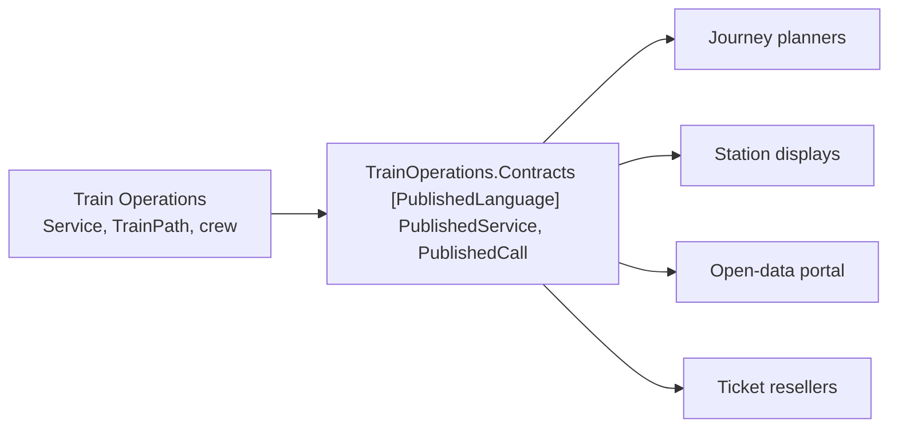

# Published Language

🌍 🇬🇧 English (this file) · 🇫🇷 [Français](PublishedLanguage-fr.md)

## Intent

Published Language is a well-documented shared language, used as the medium of translation between
contexts rather than as anyone's internal model.

## Problem

Regional rail. Journey planners, station displays, the national open-data portal and three ticket
resellers all consume the timetable. None of them is going to negotiate a format, and nobody is going to
write four integrations.

The obvious shortcut is to serialise the model that already exists:

```csharp
// Train Operations, internal
public sealed class Service {
    public IReadOnlyList<TrainPath>       Paths          { get; }
    public RollingStockDiagram            Diagram        { get; }
    public IReadOnlyList<CrewAssignment>  Crew           { get; }
}
```

Publish that, and four external parties now depend on it. Renaming `Diagram`, splitting `TrainPath`, or
changing how crew links are modelled becomes a breaking change for people the team has never met — and
the model can no longer be refactored on the railway's schedule.

## Solution

The pattern publishes a language rather than a model.

A well-documented shared language is used as the common medium of communication, able to express the
domain information the exchange requires, and both sides translate into and out of it as necessary.

The distinction that carries the pattern is what it is *not*: it is not the internal model with a
serialiser bolted on. What is rich inside a context is deliberately thin in the published language,
because a consumer needs what it can act on and no more.

The two also change on different schedules. The internal model changes when the business changes; the
published language changes when its consumers can absorb a change, which is usually much slower.

## Structure



The published assembly sits between the model and the world, and the arrow into it is one-way: consumers
never reach past it.

## The roles

| Role | Annotation | Applies to | What it carries |
|---|---|---|---|
| PublishedLanguage | `[assembly: PublishedLanguage]` | assembly | The published vocabulary two or more contexts translate through. It is a contract with the outside, not a model of the domain. |

One role, on an assembly. Putting it on an assembly rather than on types is what makes the claim
checkable: everything in here is contract, and nothing in here may reach into a model.

## The example

From [`PublishedLanguageUsage.cs`](../../../../DesignPatternCatalog.Usage.TrainOperations.Contracts/PublishedLanguageUsage.cs).

```csharp
[assembly: PublishedLanguage]
```

```csharp
/// <summary>
///     One train, on one day, as the outside world sees it.
/// </summary>
public sealed record PublishedService(string ServiceCode, DateOnly OperatingDay, IReadOnlyList<PublishedCall> Calls);

/// <summary>
///     A stop, with the times a passenger can act on.
/// </summary>
public sealed record PublishedCall(string StationCode, TimeOnly? Arrival, TimeOnly? Departure);
```

Two records, and the comparison with the internal model is the lesson. Inside train operations a service
is a rich thing with paths, rolling stock diagrams and crew links; here it is a departure, an arrival and
a list of calls, because that is what a journey planner needs and all it needs.

Note what is absent: **no behaviour, no invariants, no domain rules.** This is a contract with the
outside, so it is deliberately anaemic — the shape of anything richer would leak a model that consumers
must not depend on. That is the one place in this guide where an anaemic type is the right answer, and it
is worth saying plainly because everywhere else it is the symptom the [Service](Service-en.md) page warns
about.

The nullable times carry a real distinction: a terminus has an arrival and no departure, an origin the
reverse. A published language earns its keep by being able to say the things its consumers must
distinguish, and by saying nothing else.

`StationCode` is a `string` rather than a value object. In a model that would be a missed concept; in a
contract it is correct, since a consumer cannot construct the operator's types and should not have to.

## Applicability

**Use a well-documented shared language that can express the necessary domain information**, as a common
medium of communication.

**Translate as necessary into and out of that language** on each side, so that neither context has to
adopt the other's model.

**Use Published Language where the exchange has consumers you do not control**, and where negotiating a
format with each of them is not on offer.

## When not to use it

**Do not publish the internal model.** A published language that tracked the operations model would make
every refactoring a breaking change for four external parties, which is precisely the cost the pattern is
paid to avoid.

**Do not use it for one consumer you can talk to.** A negotiated format between two teams who can
coordinate is cheaper than a published contract, and it can change when both agree.

**Do not put behaviour or invariants in it.** A contract that carries rules invites consumers to depend on
them, and the rules then belong to the outside world rather than to the model.

**Do not change it on the model's schedule.** The two move at different speeds, and forgetting that is how
a published language stops being one: consumers who cannot keep up simply pin an old version, and the
publisher then maintains several.

## Advantages

* Four consumers are served by one documented vocabulary instead of four integrations.
* The internal model stays free to change, because nothing outside depends on it.
* A new consumer needs no negotiation: the language is published, and reading it is the whole of the
  onboarding.
* The contract can move at the consumers' pace, which is what makes it stable enough to be worth
  depending on.
* The boundary is visible in the build — an assembly whose whole content is contract.

## Drawbacks

* It is a second vocabulary to maintain, plus the translation on each side.
* Once published, it is hard to change: every consumer is a party to it.
* It is deliberately poorer than the model, so some questions cannot be asked through it at all.
* Keeping it in step with the model is manual work that nothing verifies.

## Relations with other patterns

**`OpenHostService`** is the natural companion, and the book pairs them: the service is the access, the
language is what it exchanges.

**`BoundedContext`** is what the language protects. Publishing a vocabulary is how a boundary stays a
boundary while still being useful to the outside.

**`AnticorruptionLayer`** is what a consumer needs when no language is published. Publishing one is the
upstream side sparing its consumers that work.

**`SharedKernel`** is the other way two contexts avoid translating — by sharing model rather than by
sharing vocabulary. The kernel is compiled against; the language is translated through.

**`ValueObject`** is deliberately *not* used here. A contract carries codes and primitives, because a
consumer cannot construct the publisher's types.

## Source

*Domain-Driven Design: Tackling Complexity in the Heart of Software*, Eric Evans, Addison-Wesley, 2003 —
chapter 14, maintaining model integrity.

* [Index entry](../../../generated/catalog-index.md#publishedlanguage-domain-driven-design)
* [Generated attribute](../../../../DesignPatternCatalog.DomainDrivenDesign/PublishedLanguage.cs)
* [Example](../../../../DesignPatternCatalog.Usage.TrainOperations.Contracts/PublishedLanguageUsage.cs)
