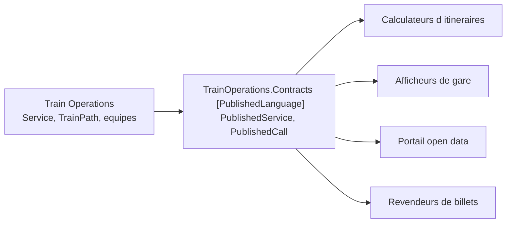

# Published Language

🌍 🇫🇷 Français (ce fichier) · 🇬🇧 [English](PublishedLanguage-en.md)

## Intention

Published Language est un langage partagé et bien documenté, employé comme medium de traduction entre
contextes plutôt que comme le modèle interne de quiconque.

## Problème

Réseau ferroviaire régional. Les calculateurs d'itinéraires, les afficheurs de gare, le portail national
de données ouvertes et trois revendeurs de billets consomment tous les horaires. Aucun d'eux ne va
négocier un format, et personne ne va écrire quatre intégrations.

Le raccourci évident est de sérialiser le modèle qui existe déjà :

```csharp
// Train Operations, interne
public sealed class Service {
    public IReadOnlyList<TrainPath>       Paths          { get; }
    public RollingStockDiagram            Diagram        { get; }
    public IReadOnlyList<CrewAssignment>  Crew           { get; }
}
```

Publiez cela, et quatre parties extérieures en dépendent. Renommer `Diagram`, scinder `TrainPath` ou
changer la façon dont les liens d'équipe sont modélisés devient une rupture pour des gens que l'équipe n'a
jamais rencontrés — et le modèle ne peut plus être remanié au rythme du chemin de fer.

## Solution

Le patron publie un langage plutôt qu'un modèle.

Un langage partagé et bien documenté sert de medium commun de communication, capable d'exprimer
l'information de domaine que l'échange exige, et chaque côté traduit vers lui et depuis lui autant que
nécessaire.

La distinction qui porte le patron est ce qu'il n'est *pas* : ce n'est pas le modèle interne avec un
sérialiseur boulonné dessus. Ce qui est riche dans un contexte est délibérément mince dans le langage
publié, parce qu'un consommateur a besoin de ce sur quoi il peut agir, et de rien de plus.

Les deux changent aussi selon des calendriers différents. Le modèle interne change quand le métier change ;
le langage publié change quand ses consommateurs peuvent absorber un changement, ce qui est d'ordinaire
bien plus lent.

## Structure



L'assembly publiée siège entre le modèle et le monde, et la flèche qui y entre est à sens unique : les
consommateurs ne passent jamais derrière.

## Les rôles

| Rôle | Annotation | S'applique à | Ce qu'il porte |
|---|---|---|---|
| PublishedLanguage | `[assembly: PublishedLanguage]` | assembly | Le vocabulaire publié à travers lequel deux contextes ou plus traduisent. C'est un contrat avec l'extérieur, non un modèle du domaine. |

Un seul rôle, sur une assembly. La mettre sur une assembly plutôt que sur des types est ce qui rend la
revendication contrôlable : tout ce qui est ici est contrat, et rien de ce qui est ici n'a le droit
d'atteindre un modèle.

## L'exemple

Extrait de [`PublishedLanguageUsage.cs`](../../../../DesignPatternCatalog.Usage.TrainOperations.Contracts/PublishedLanguageUsage.cs).

```csharp
[assembly: PublishedLanguage]
```

```csharp
/// <summary>
///     One train, on one day, as the outside world sees it.
/// </summary>
public sealed record PublishedService(string ServiceCode, DateOnly OperatingDay, IReadOnlyList<PublishedCall> Calls);

/// <summary>
///     A stop, with the times a passenger can act on.
/// </summary>
public sealed record PublishedCall(string StationCode, TimeOnly? Arrival, TimeOnly? Departure);
```

Deux enregistrements, et la comparaison avec le modèle interne est la leçon. Dans l'exploitation, une
desserte est une chose riche avec des sillons, des roulements de matériel et des liens d'équipe ; ici,
c'est un départ, une arrivée et une liste d'arrêts, parce que c'est ce dont un calculateur d'itinéraires a
besoin et tout ce dont il a besoin.

Remarquer ce qui est absent : **aucun comportement, aucun invariant, aucune règle du domaine.** C'est un
contrat avec l'extérieur, donc délibérément anémique — la forme de quoi que ce soit de plus riche
laisserait fuir un modèle dont les consommateurs ne doivent pas dépendre. C'est le seul endroit de ce
guide où un type anémique est la bonne réponse, et cela mérite d'être dit nettement, parce que partout
ailleurs c'est le symptôme contre lequel la page [Service](Service-fr.md) met en garde.

Les heures nullables portent une vraie distinction : un terminus a une arrivée et pas de départ, une
origine l'inverse. Un langage publié se rentabilise en sachant dire ce que ses consommateurs doivent
distinguer, et en ne disant rien d'autre.

`StationCode` est une `string` plutôt qu'un objet-valeur. Dans un modèle ce serait un concept manqué ;
dans un contrat c'est correct, puisqu'un consommateur ne peut pas construire les types de l'opérateur et
ne devrait pas avoir à le faire.

## Possibilités d'application

**Employez un langage partagé et bien documenté, capable d'exprimer l'information de domaine
nécessaire**, comme medium commun de communication.

**Traduisez autant que nécessaire vers ce langage et depuis lui** de chaque côté, de sorte qu'aucun
contexte n'ait à adopter le modèle de l'autre.

**Employez Published Language là où l'échange a des consommateurs que vous ne contrôlez pas**, et où
négocier un format avec chacun n'est pas envisageable.

## Quand ne pas l'utiliser

**Ne publiez pas le modèle interne.** Un langage publié qui suivrait le modèle d'exploitation ferait de
chaque remaniement une rupture pour quatre parties extérieures, ce qui est précisément le coût que le
patron est payé pour éviter.

**Ne l'employez pas pour un consommateur unique avec qui vous pouvez parler.** Un format négocié entre deux
équipes qui peuvent se coordonner coûte moins cher qu'un contrat publié, et il peut changer quand les deux
sont d'accord.

**N'y mettez ni comportement ni invariant.** Un contrat qui porte des règles invite les consommateurs à en
dépendre, et les règles appartiennent alors au monde extérieur plutôt qu'au modèle.

**Ne le changez pas au rythme du modèle.** Les deux avancent à des vitesses différentes, et l'oublier est
la façon dont un langage publié cesse d'en être un : les consommateurs qui ne suivent pas épinglent
simplement une ancienne version, et l'éditeur en maintient alors plusieurs.

## Avantages

* Quatre consommateurs sont servis par un vocabulaire documenté au lieu de quatre intégrations.
* Le modèle interne reste libre de changer, puisque rien de l'extérieur n'en dépend.
* Un nouveau consommateur n'a besoin d'aucune négociation : le langage est publié, et le lire est tout
  l'accueil.
* Le contrat peut avancer au rythme des consommateurs, ce qui est ce qui le rend assez stable pour qu'on
  puisse en dépendre.
* La frontière est visible dans la compilation — une assembly dont tout le contenu est du contrat.

## Inconvénients

* C'est un second vocabulaire à maintenir, plus la traduction de chaque côté.
* Une fois publié, il est difficile à changer : chaque consommateur y est partie.
* Il est délibérément plus pauvre que le modèle, si bien que certaines questions ne peuvent pas être
  posées à travers lui.
* Le tenir au pas du modèle est un travail manuel que rien ne vérifie.

## Liens avec les autres patrons

**`OpenHostService`** en est le compagnon naturel, et le livre les associe : le service est l'accès, le
langage est ce qu'il échange.

**`BoundedContext`** est ce que le langage protège. Publier un vocabulaire est la façon dont une frontière
reste une frontière tout en restant utile à l'extérieur.

**`AnticorruptionLayer`** est ce dont un consommateur a besoin quand aucun langage n'est publié. En publier
un, c'est le côté amont qui épargne ce travail à ses consommateurs.

**`SharedKernel`** est l'autre façon dont deux contextes évitent de traduire — en partageant du modèle
plutôt qu'un vocabulaire. On compile contre le noyau ; on traduit à travers le langage.

**`ValueObject`** est délibérément *absent* ici. Un contrat porte des codes et des primitifs, parce qu'un
consommateur ne peut pas construire les types de l'éditeur.

## Source

*Domain-Driven Design: Tackling Complexity in the Heart of Software*, Eric Evans, Addison-Wesley, 2003 —
chapitre 14, préserver l'intégrité du modèle.

* [Entrée d'index](../../../generated/catalog-index.md#publishedlanguage-domain-driven-design)
* [Attribut généré](../../../../DesignPatternCatalog.DomainDrivenDesign/PublishedLanguage.cs)
* [Exemple](../../../../DesignPatternCatalog.Usage.TrainOperations.Contracts/PublishedLanguageUsage.cs)
