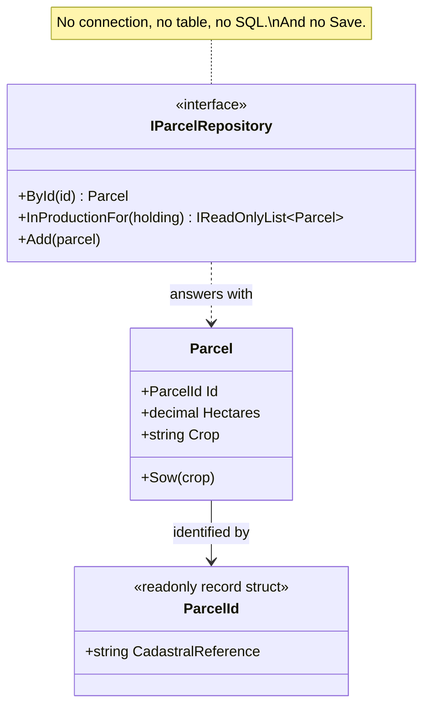

# Repository

🌍 🇬🇧 English (this file) · 🇫🇷 [Français](Repository-fr.md)

## Intent

Repository is a building block of a model-driven design that gives access to aggregates as though they
were an in-memory collection, and hides the storage mechanism from the domain.

## Problem

Farm management: the parcels a holding declares to the paying agency. The parcels live in a cadastral
database with a few hundred thousand rows, and the agronomist writing a crop rotation does not want to
think about that.

Left to reach for storage directly, the model starts speaking a second language:

```csharp
using SqlConnection connection = new(_connectionString);
SqlCommand command = new("SELECT ref, hectares, crop FROM parcel WHERE holding = @h", connection);
command.Parameters.AddWithValue("@h", holding);
```

Every rule that needs a parcel now carries a connection string, a table name and a column order. The
model cannot be read without reading SQL, cannot be tested without a database, and cannot survive the
table being renamed.

What the agronomist wants to write is *the parcels of this holding*, and to get back parcels.

## Solution

The pattern offers the illusion of a collection.

For each type that needs global access, an object provides what looks like an in-memory collection of
all of them: things can be added, removed, and selected by criteria stated in the language of the
domain. Behind it, the actual insertion, removal and query technology are encapsulated and never appear
in the signature.

The illusion is what makes the model readable, and it is also what constrains the interface: nothing
about SQL, rows, connections or transactions may surface, because any of them leaking would put the
storage back into the model the pattern exists to keep it out of.

## Structure



Everything the interface mentions is a domain type. That is the whole test, and the diagram has nothing
else to show because the storage is on the other side of it.

## The roles

| Role | Annotation | Applies to | What it carries |
|---|---|---|---|
| Repository | `[Repository]` | interface, class | Gives collection-like access to aggregates, and hides the storage mechanism. |

One role, so nothing to choose. The annotation is inherited.

## The example

From [`RepositoryUsage.cs`](../../../../DesignPatternCatalog.Usage/DomainDrivenDesign/RepositoryUsage.cs).

```csharp
[ValueObject]
public readonly record struct ParcelId(string CadastralReference);

[Entity]
public sealed class Parcel {

    public Parcel(ParcelId id, decimal hectares, string crop) {
        Id       = id;
        Hectares = hectares;
        Crop     = crop;
    }

    public ParcelId Id       { get; }
    public decimal  Hectares { get; }
    public string   Crop     { get; private set; }

    public void Sow(string crop) => Crop = crop;

}
```

The identity is a value object rather than a `string`, which is what lets `ById` have a signature that
cannot be called with a holding name by mistake.

The sample's comments name `Parcel` as the aggregate root of this model; the annotation it carries here
is `[Entity]`, the boundary itself being shown in the
[Aggregate](Aggregate-en.md) sample rather than repeated in this one.

```csharp
[Repository]
public interface IParcelRepository {

    Parcel?              ById(ParcelId id);
    IReadOnlyList<Parcel> InProductionFor(string holding);

    void Add(Parcel parcel);

}
```

Four lines carrying three decisions.

The queries are named in the language of the domain — `InProductionFor`, not `Select`. A repository that
exposes a generic query language has given up and become a database handle: the caller writes the query,
the storage shape is back in the model, and the interface no longer encapsulates anything.

There is one repository per aggregate root, not one per table. `Parcel` is the root; a soil sample is
reached through its parcel and gets no repository of its own, because nothing outside the aggregate is
allowed to hold one. This is the book's instruction and it is what keeps the number of repositories
small.

And there is no `Save`. Within the collection illusion, a parcel obtained from the repository is already
in it — a collection does not need to be told that something it holds has changed. Persisting what
changed is the unit of work's business, and transaction control is the client's; the book is explicit
that the repository does not take it over.

## Applicability

**Use Repository for each type of object that needs global access**, providing the illusion of an
in-memory collection of all objects of that type through a well-known global interface.

**Provide methods that select objects on some criteria and return fully instantiated objects**, thereby
encapsulating the storage and query technology.

**Provide repositories only for aggregate roots that actually need direct access.** The book states this
as a restriction, not a default: everything else is reached by traversal from a root.

**Keep the client focused on the model**, delegating all object storage and access to repositories.

## When not to use it

**Do not provide a repository for every class.** The book restricts them to aggregate roots that need
direct access. A repository per table reproduces the schema in the model's vocabulary and dissolves the
aggregate boundary, since every member becomes independently reachable.

**Do not use Repository for objects reached by traversal.** If a soil sample is only ever meaningful
through its parcel, giving it a repository creates a second way in that the aggregate exists to forbid.

**Do not let it become a query language.** A repository that exposes a generic query interface has
encapsulated nothing: the caller now writes queries, and the storage shape is back in the model. The
book's own remedy where queries genuinely multiply is to express the criteria as a specification rather
than to add a method per need.

**Do not take transaction control into it.** The book leaves transaction control to the client. A
repository that commits decides the boundary of a change for callers that can see more of the change
than it can.

**Do not use Repository where the domain has no need of an object collection.** Reporting and screens
that read across many aggregates are not what the pattern is for, and forcing them through it produces
repositories with a method per screen.

## Advantages

* Clients get a simple model for obtaining persistent objects and managing their life cycle.
* The application and domain design is decoupled from the persistence technology, from multiple database
  strategies, and even from multiple data sources.
* Design decisions about object access are communicated: what has a repository is what the outside may
  reach directly.
* A dummy implementation substitutes easily for testing, typically an in-memory collection — which is
  what makes the model testable with no database anywhere near it.

## Drawbacks

* The illusion is not free: someone has to implement it, and the gap between a collection and a database
  is where lazy loading, identity maps and n+1 queries live.
* A repository interface that grows a method per screen has become a data access object with a domain
  vocabulary.
* The abstraction can hide the cost of what it does, and a call that reads like a collection lookup may
  be a table scan.
* Nothing prevents a repository from being provided for a member of an aggregate, which is the usual way
  the boundary is lost.

## Relations with other patterns

**`Aggregate`** is what a repository is provided for. One per root, not one per table, is the direct
consequence of the boundary.

**`Entity`** is what a repository finds, and it finds it by identity — which is possible precisely
because an entity has one.

**`Factory`** is the other half of the life cycle: the factory makes new objects, the repository finds
existing ones. The book notes that a repository may delegate to a factory when reconstituting a stored
object.

**`Specification`** is the book's answer when queries multiply: the criteria become an object the
repository accepts, rather than a method added for each need.

**`LayeredArchitecture`** is where the pattern's inversion becomes checkable — the interface declared by
the domain, the implementation living in infrastructure.

## Source

*Domain-Driven Design: Tackling Complexity in the Heart of Software*, Eric Evans, Addison-Wesley, 2003 —
chapter 6, the life cycle of a domain object.

* [Index entry](../../../generated/catalog-index.md#repository-domain-driven-design)
* [Generated attribute](../../../../DesignPatternCatalog.DomainDrivenDesign/Repository.cs)
* [Example](../../../../DesignPatternCatalog.Usage/DomainDrivenDesign/RepositoryUsage.cs)
