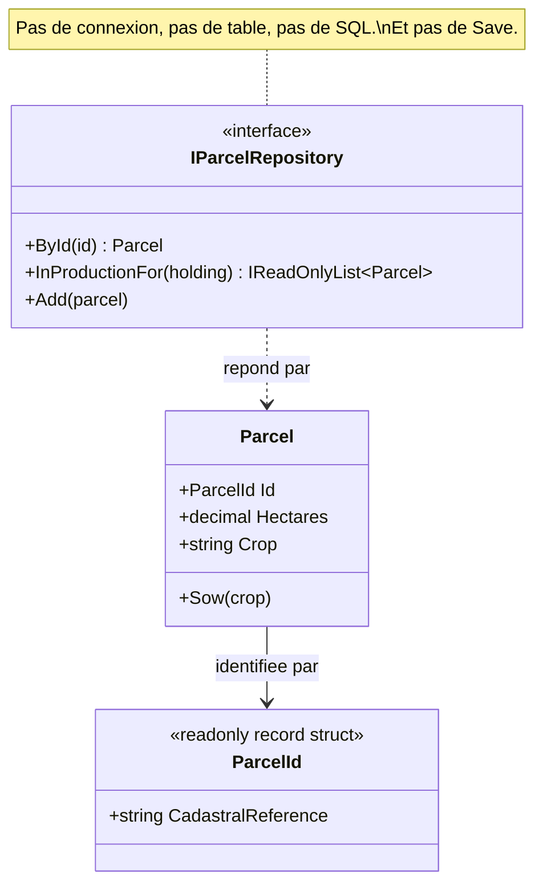

# Repository

🌍 🇫🇷 Français (ce fichier) · 🇬🇧 [English](Repository-en.md)

## Intention

Repository est une brique de la conception pilotée par le modèle qui donne accès aux agrégats comme s'ils
formaient une collection en mémoire, et cache au domaine le mécanisme de stockage.

## Problème

Gestion d'exploitation agricole : les parcelles qu'une exploitation déclare à l'organisme payeur. Les
parcelles vivent dans une base cadastrale de quelques centaines de milliers de lignes, et l'agronome qui
écrit une rotation culturale n'a pas envie d'y penser.

Laissé à atteindre le stockage directement, le modèle se met à parler une seconde langue :

```csharp
using SqlConnection connection = new(_connectionString);
SqlCommand command = new("SELECT ref, hectares, crop FROM parcel WHERE holding = @h", connection);
command.Parameters.AddWithValue("@h", holding);
```

Chaque règle qui a besoin d'une parcelle porte désormais une chaîne de connexion, un nom de table et un
ordre de colonnes. Le modèle ne se lit plus sans lire du SQL, ne se teste plus sans base de données, et ne
survit pas au renommage de la table.

Ce que l'agronome veut écrire, c'est *les parcelles de cette exploitation*, et récupérer des parcelles.

## Solution

Le patron offre l'illusion d'une collection.

Pour chaque type qui a besoin d'un accès global, un objet fournit ce qui ressemble à une collection en
mémoire de tous ses exemplaires : on y ajoute, on en retire, on en sélectionne selon des critères énoncés
dans le langage du domaine. Derrière, l'insertion, la suppression et la technologie de requêtage réelles
sont encapsulées et n'apparaissent jamais dans la signature.

L'illusion est ce qui rend le modèle lisible, et c'est aussi ce qui contraint l'interface : rien de SQL,
de lignes, de connexions ou de transactions ne doit y affleurer, parce que la fuite de l'un d'eux
remettrait le stockage dans le modèle dont le patron existe pour l'écarter.

## Structure



Tout ce que l'interface mentionne est un type du domaine. C'est tout le test, et le diagramme n'a rien
d'autre à montrer parce que le stockage est de l'autre côté.

## Les rôles

| Rôle | Annotation | S'applique à | Ce qu'il porte |
|---|---|---|---|
| Repository | `[Repository]` | interface, classe | Donne aux agrégats un accès de type collection, et cache le mécanisme de stockage. |

Un seul rôle, donc rien à choisir. L'annotation est héritée.

## L'exemple

Extrait de [`RepositoryUsage.cs`](../../../../DesignPatternCatalog.Usage/DomainDrivenDesign/RepositoryUsage.cs).

```csharp
[ValueObject]
public readonly record struct ParcelId(string CadastralReference);

[Entity]
public sealed class Parcel {

    public Parcel(ParcelId id, decimal hectares, string crop) {
        Id       = id;
        Hectares = hectares;
        Crop     = crop;
    }

    public ParcelId Id       { get; }
    public decimal  Hectares { get; }
    public string   Crop     { get; private set; }

    public void Sow(string crop) => Crop = crop;

}
```

L'identité est un objet-valeur plutôt qu'une `string`, ce qui donne à `ById` une signature qu'on ne peut
pas appeler par mégarde avec un nom d'exploitation.

Les commentaires de l'exemple désignent `Parcel` comme la racine d'agrégat de ce modèle ; l'annotation
qu'elle porte ici est `[Entity]`, la frontière elle-même étant montrée dans l'exemple
[Aggregate](Aggregate-fr.md) plutôt que répétée dans celui-ci.

```csharp
[Repository]
public interface IParcelRepository {

    Parcel?              ById(ParcelId id);
    IReadOnlyList<Parcel> InProductionFor(string holding);

    void Add(Parcel parcel);

}
```

Quatre lignes qui portent trois décisions.

Les requêtes sont nommées dans le langage du domaine — `InProductionFor`, non `Select`. Un dépôt qui
expose un langage de requêtes générique a renoncé et est devenu une poignée de base de données :
l'appelant écrit la requête, la forme du stockage est de retour dans le modèle, et l'interface n'encapsule
plus rien.

Il y a un dépôt par racine d'agrégat, non un par table. `Parcel` est la racine ; un prélèvement de sol
s'atteint par sa parcelle et n'obtient pas de dépôt propre, parce que rien hors de l'agrégat n'a le droit
d'en tenir un. C'est l'instruction du livre, et c'est ce qui maintient le nombre de dépôts petit.

Et il n'y a pas de `Save`. Dans l'illusion de la collection, une parcelle obtenue du dépôt y est déjà —
une collection n'a pas besoin qu'on lui apprenne que ce qu'elle contient a changé. Persister ce qui a
changé relève de l'unité de travail, et le contrôle transactionnel relève du client ; le livre est
explicite sur le fait que le dépôt ne s'en empare pas.

## Possibilités d'application

**Utilisez Repository pour chaque type d'objet qui a besoin d'un accès global**, en fournissant l'illusion
d'une collection en mémoire de tous les objets de ce type, à travers une interface globale bien connue.

**Fournissez des méthodes qui sélectionnent des objets selon des critères et rendent des objets
pleinement instanciés**, encapsulant par là le stockage et la technologie de requêtage.

**Ne fournissez de dépôts que pour les racines d'agrégats qui ont réellement besoin d'un accès direct.**
Le livre l'énonce comme une restriction et non comme un réglage par défaut : tout le reste s'atteint par
traversée depuis une racine.

**Gardez le client centré sur le modèle**, en déléguant aux dépôts tout le stockage et tout l'accès aux
objets.

## Quand ne pas l'utiliser

**Ne fournissez pas un dépôt pour chaque classe.** Le livre les restreint aux racines d'agrégats qui ont
besoin d'un accès direct. Un dépôt par table reproduit le schéma dans le vocabulaire du modèle et dissout
la frontière d'agrégat, puisque chaque membre devient atteignable indépendamment.

**N'utilisez pas Repository pour des objets atteints par traversée.** Si un prélèvement de sol n'a de sens
qu'à travers sa parcelle, lui donner un dépôt crée une seconde porte que l'agrégat existe pour interdire.

**Ne le laissez pas devenir un langage de requêtes.** Un dépôt qui expose une interface de requêtage
générique n'a rien encapsulé : c'est l'appelant qui écrit les requêtes, et la forme du stockage est de
retour dans le modèle. Le remède propre au livre, là où les requêtes se multiplient vraiment, est
d'exprimer les critères par une spécification plutôt que d'ajouter une méthode par besoin.

**N'y faites pas entrer le contrôle transactionnel.** Le livre laisse le contrôle transactionnel au
client. Un dépôt qui valide décide de la frontière d'un changement pour des appelants qui en voient plus
que lui.

**N'utilisez pas Repository là où le domaine n'a pas besoin d'une collection d'objets.** Les états et les
écrans qui lisent à travers de nombreux agrégats ne sont pas ce à quoi sert le patron, et les y forcer
produit des dépôts avec une méthode par écran.

## Avantages

* Les clients disposent d'un modèle simple pour obtenir des objets persistants et gérer leur cycle de vie.
* La conception applicative et celle du domaine sont découplées de la technologie de persistance, des
  stratégies multi-bases, et même des sources de données multiples.
* Les décisions de conception sur l'accès aux objets sont communiquées : ce qui a un dépôt est ce que
  l'extérieur peut atteindre directement.
* Une implémentation factice se substitue aisément pour les tests, typiquement une collection en mémoire —
  ce qui rend le modèle testable sans base de données à proximité.

## Inconvénients

* L'illusion n'est pas gratuite : quelqu'un doit l'implémenter, et l'écart entre une collection et une
  base de données est l'endroit où vivent le chargement paresseux, les tables d'identité et les requêtes
  n+1.
* Une interface de dépôt qui se dote d'une méthode par écran est devenue un objet d'accès aux données doté
  d'un vocabulaire de domaine.
* L'abstraction peut masquer le coût de ce qu'elle fait, et un appel qui se lit comme une recherche en
  collection peut être un balayage de table.
* Rien n'empêche de fournir un dépôt pour un membre d'agrégat, ce qui est la manière habituelle de perdre
  la frontière.

## Liens avec les autres patrons

**`Aggregate`** est ce pour quoi un dépôt est fourni. Un par racine, non un par table, est la conséquence
directe de la frontière.

**`Entity`** est ce qu'un dépôt retrouve, et il le retrouve par identité — ce qui est possible précisément
parce qu'une entité en a une.

**`Factory`** est l'autre moitié du cycle de vie : la fabrique fabrique du neuf, le dépôt retrouve
l'existant. Le livre note qu'un dépôt peut déléguer à une fabrique pour reconstituer un objet stocké.

**`Specification`** est la réponse du livre quand les requêtes se multiplient : les critères deviennent un
objet que le dépôt accepte, plutôt qu'une méthode ajoutée à chaque besoin.

**`LayeredArchitecture`** est l'endroit où l'inversion du patron devient contrôlable — l'interface
déclarée par le domaine, l'implémentation vivant dans l'infrastructure.

## Source

*Domain-Driven Design: Tackling Complexity in the Heart of Software*, Eric Evans, Addison-Wesley, 2003 —
chapitre 6, le cycle de vie d'un objet du domaine.

* [Entrée d'index](../../../generated/catalog-index.md#repository-domain-driven-design)
* [Attribut généré](../../../../DesignPatternCatalog.DomainDrivenDesign/Repository.cs)
* [Exemple](../../../../DesignPatternCatalog.Usage/DomainDrivenDesign/RepositoryUsage.cs)
