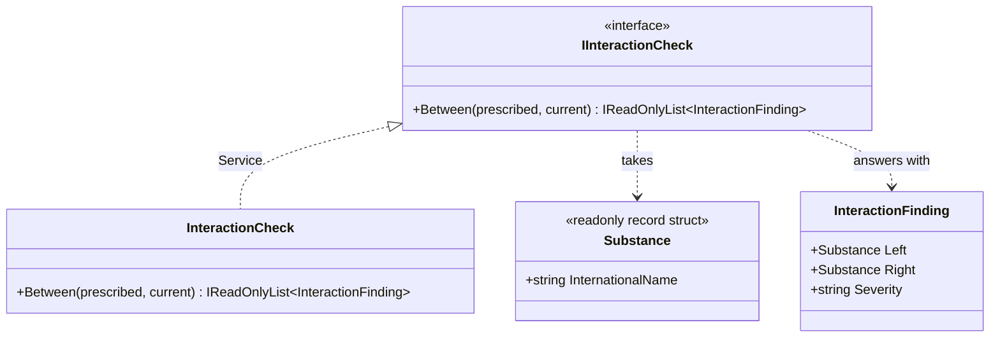

# Service

🌍 🇬🇧 English (this file) · 🇫🇷 [Français](Service-fr.md)

## Intent

Service is a building block of a model-driven design for an operation of the domain that belongs to no
entity and to no value object, offered as a standalone, stateless interface.

## Problem

A hospital pharmacy checks a prescription against what the patient is already taking. The question —
may these be dispensed together — belongs to no object in the model, and every attempt to give it one is
worse than leaving it alone.

```csharp
warfarin.InteractsWith(aspirin);
```

This makes one of the two the subject when the interaction is symmetric, and a drug now has to know the
whole formulary.

```csharp
prescription.CheckInteractions(patient);
```

The prescription grows a dependency on an interaction database in order to answer a question that is not
about it.

```csharp
patient.CheckInteractions(prescription);
```

Everything ends up on the patient eventually, which is how a class becomes the place where unrelated
operations are put because there was nowhere else.

## Solution

The pattern accepts that some operations are operations, not things.

The check becomes an interface that stands alone in the model. It is named in the ubiquitous language —
the pharmacists say *run the interaction check* — it takes domain objects and answers with domain
objects, and it holds no state between calls, because there is nothing it would be the state of.

The line to watch is the one with the application service on the other side. This one is domain: the
rule it applies is clinical, and a pharmacist would recognise it. Loading the patient's file, writing the
audit trail and sending the alert are not clinical, and they belong to the layer above.

## Structure



Both arrows leaving the interface point at domain types. That is the second of the book's three tests,
and it is the one that separates a domain service from a technical one.

## The roles

| Role | Annotation | Applies to | What it carries |
|---|---|---|---|
| Service | `[Service]` | interface, class | A stateless operation of the domain that belongs to no entity nor value object. |

One role, so nothing to choose. The annotation is inherited.

## The example

From [`ServiceUsage.cs`](../../../../DesignPatternCatalog.Usage/DomainDrivenDesign/ServiceUsage.cs).

```csharp
[ValueObject]
public readonly record struct Substance(string InternationalName);

public sealed record InteractionFinding(Substance Left, Substance Right, string Severity);
```

The vocabulary the service speaks. `InteractionFinding` carries no annotation of its own — it is what
the operation answers with, and the sample does not claim more for it than that.

```csharp
[Service]
public interface IInteractionCheck {

    IReadOnlyList<InteractionFinding> Between(IReadOnlyList<Substance> prescribed,
                                              IReadOnlyList<Substance> current);

}
```

`Between` names the operation the way the pharmacy names it, and neither substance is the subject. The
signature is the argument for the pattern in one line: the operation is about the pair, which is
precisely why it could not sit on either of them.

```csharp
[Service]
public sealed class InteractionCheck : IInteractionCheck {

    private static readonly (string Left, string Right, string Severity)[] Known = {
        ("warfarin", "acetylsalicylic acid", "major"),
        ("simvastatin", "clarithromycin", "major"),
        ("metformin", "iodinated contrast", "moderate")
    };
```

The implementation, annotated as well as the interface. `Known` is `static readonly`, which is what
statelessness looks like when there is reference data to hold: the table is the same for every call and
nothing accumulates between them.

```csharp
    public IReadOnlyList<InteractionFinding> Between(IReadOnlyList<Substance> prescribed,
                                                     IReadOnlyList<Substance> current) {
        List<InteractionFinding> findings = new();

        foreach (Substance candidate in prescribed) {
            foreach (Substance taken in current) {
                foreach ((string left, string right, string severity) in Known) {
                    bool matches = (candidate.InternationalName == left && taken.InternationalName == right)
                                || (candidate.InternationalName == right && taken.InternationalName == left);

                    if (matches) { findings.Add(new InteractionFinding(candidate, taken, severity)); }
                }
            }
        }

        return findings;
    }

}
```

The symmetry is written out in the `matches` test, and it is the reason the operation is here rather than
on a substance: neither order is privileged. Everything the method needs arrives as an argument and
everything it produces leaves as a result, so two calls can run at once and a third can run tomorrow
against the same instance.

## Applicability

**Use Service when a significant process or transformation in the domain is not a natural responsibility
of an entity or a value object**, and add it to the model as a standalone interface.

**Use Service when forcing the operation onto an object would distort that object's definition** or would
require inventing an artificial one to hold it — the two failures the book names.

**Define the interface in terms of the language of the model**, and make the operation's name part of the
ubiquitous language.

**Make the service stateless.** The book states this as part of the pattern rather than as advice: any
client may use any instance without regard to its history.

## When not to use it

**Do not use Service where the operation does belong to an object.** The book's own instruction is to
reach for a service when an entity or value object is *not* the natural home, which makes the service the
second question rather than the first. An operation about one wagon belongs on the wagon.

**Do not let services strip entities and value objects of their behaviour.** The book raises this
directly: services are easy to use, and the ease leads to overuse. A model whose objects hold only data
while all the behaviour sits in services has paid for the domain layer without getting one — the field
later named this an anaemic domain model, and the warning in the book predates the name.

**Do not use Service for what is coordination.** Opening a transaction, loading a file, writing an audit
trail and sending an alert are not clinical decisions. They belong to the application layer, and the book
separates application, domain and infrastructure services precisely so that this line can be drawn.

**Do not use Service as a place for procedures.** A stateless class taking and returning domain objects
is the shape of the pattern, but the shape alone is not the pattern: the operation has to be one the
domain has a name for. A service whose name a pharmacist would not recognise is a function that has been
given a class.

## Advantages

* An operation that belongs to no object gets a home without an artificial object being invented for it.
* The name enters the ubiquitous language, so the code and the conversation use the same word.
* Statelessness makes the service shareable, concurrent-safe and testable, since a call depends only on
  its arguments.
* Entities and value objects stay focused, because the operations that would have distorted them are
  elsewhere.

## Drawbacks

* The pattern is easy to reach for, and overuse hollows out the model — the book's own warning.
* Deciding whether an operation belongs to an object or to a service is a modelling judgement that
  nothing checks.
* The boundary between a domain service and an application service is easy to blur, and the blur is not
  visible in any signature.

## Relations with other patterns

**`Entity`** and **`ValueObject`** are what the service is defined against: it exists for the operations
that are not a natural responsibility of either.

**`LayeredArchitecture`** is where the distinction between a domain service and an application service
becomes an enforceable one, since the two live in different assemblies.

**`Specification`** is an alternative for the particular case of a rule that answers yes or no about one
object: it makes the rule an object rather than an operation.

**`Factory`** is a service in the broad sense and a pattern of its own here, because what it encapsulates
— creation — is specific enough to be worth naming separately.

## Source

*Domain-Driven Design: Tackling Complexity in the Heart of Software*, Eric Evans, Addison-Wesley, 2003 —
chapter 5, the building blocks of a model-driven design.

* [Index entry](../../../generated/catalog-index.md#service-domain-driven-design)
* [Generated attribute](../../../../DesignPatternCatalog.DomainDrivenDesign/Service.cs)
* [Example](../../../../DesignPatternCatalog.Usage/DomainDrivenDesign/ServiceUsage.cs)
