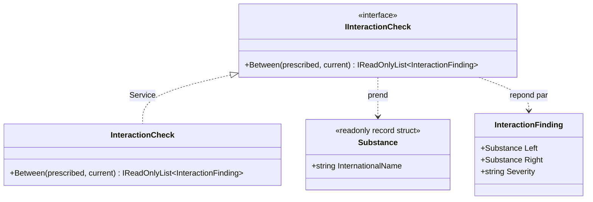

# Service

🌍 🇫🇷 Français (ce fichier) · 🇬🇧 [English](Service-en.md)

## Intention

Service est une brique de la conception pilotée par le modèle, pour une opération du domaine qui
n'appartient à aucune entité ni à aucun objet-valeur, offerte comme une interface autonome et sans état.

## Problème

Une pharmacie hospitalière contrôle une prescription contre ce que le patient prend déjà. La question —
peut-on délivrer ceci ensemble — n'appartient à aucun objet du modèle, et chaque tentative de lui en
donner un est pire que de la laisser dehors.

```csharp
warfarin.InteractsWith(aspirin);
```

L'un des deux devient sujet alors que l'interaction est symétrique, et un médicament doit désormais
connaître tout le formulaire.

```csharp
prescription.CheckInteractions(patient);
```

La prescription se dote d'une dépendance vers une base d'interactions pour répondre à une question qui ne
la concerne pas.

```csharp
patient.CheckInteractions(prescription);
```

Tout finit sur le patient tôt ou tard, et c'est ainsi qu'une classe devient l'endroit où l'on range les
opérations sans rapport, faute d'un autre.

## Solution

Le patron accepte que certaines opérations soient des opérations, non des choses.

Le contrôle devient une interface autonome dans le modèle. Il est nommé dans le langage omniprésent — les
pharmaciens disent « passer le contrôle d'interactions » —, il prend des objets du domaine et répond par
des objets du domaine, et il ne retient aucun état entre deux appels, puisqu'il n'y a rien dont il serait
l'état.

La frontière à surveiller est celle qui a le service applicatif de l'autre côté. Celui-ci est du domaine :
la règle qu'il applique est clinique, et un pharmacien la reconnaîtrait. Charger le dossier du patient,
écrire la piste d'audit et envoyer l'alerte ne sont pas cliniques, et relèvent de la couche au-dessus.

## Structure



Les deux flèches qui partent de l'interface pointent vers des types du domaine. C'est le deuxième des
trois tests du livre, et celui qui sépare un service du domaine d'un service technique.

## Les rôles

| Rôle | Annotation | S'applique à | Ce qu'il porte |
|---|---|---|---|
| Service | `[Service]` | interface, classe | Une opération sans état du domaine, qui n'appartient à aucune entité ni objet-valeur. |

Un seul rôle, donc rien à choisir. L'annotation est héritée.

## L'exemple

Extrait de [`ServiceUsage.cs`](../../../../DesignPatternCatalog.Usage/DomainDrivenDesign/ServiceUsage.cs).

```csharp
[ValueObject]
public readonly record struct Substance(string InternationalName);

public sealed record InteractionFinding(Substance Left, Substance Right, string Severity);
```

Le vocabulaire que parle le service. `InteractionFinding` ne porte pas d'annotation propre — c'est ce par
quoi l'opération répond, et l'exemple ne revendique rien de plus pour lui.

```csharp
[Service]
public interface IInteractionCheck {

    IReadOnlyList<InteractionFinding> Between(IReadOnlyList<Substance> prescribed,
                                              IReadOnlyList<Substance> current);

}
```

`Between` nomme l'opération comme la pharmacie la nomme, et aucune des deux substances n'est sujet. La
signature est l'argument du patron en une ligne : l'opération porte sur la paire, ce qui est exactement
pourquoi elle ne pouvait siéger sur ni l'une ni l'autre.

```csharp
[Service]
public sealed class InteractionCheck : IInteractionCheck {

    private static readonly (string Left, string Right, string Severity)[] Known = {
        ("warfarin", "acetylsalicylic acid", "major"),
        ("simvastatin", "clarithromycin", "major"),
        ("metformin", "iodinated contrast", "moderate")
    };
```

L'implémentation, annotée elle aussi. `Known` est `static readonly`, ce à quoi ressemble l'absence d'état
quand il y a des données de référence à porter : la table est la même à chaque appel et rien ne
s'accumule d'un appel à l'autre.

```csharp
    public IReadOnlyList<InteractionFinding> Between(IReadOnlyList<Substance> prescribed,
                                                     IReadOnlyList<Substance> current) {
        List<InteractionFinding> findings = new();

        foreach (Substance candidate in prescribed) {
            foreach (Substance taken in current) {
                foreach ((string left, string right, string severity) in Known) {
                    bool matches = (candidate.InternationalName == left && taken.InternationalName == right)
                                || (candidate.InternationalName == right && taken.InternationalName == left);

                    if (matches) { findings.Add(new InteractionFinding(candidate, taken, severity)); }
                }
            }
        }

        return findings;
    }

}
```

La symétrie est écrite noir sur blanc dans le test `matches`, et c'est la raison pour laquelle
l'opération est ici plutôt que sur une substance : aucun ordre n'est privilégié. Tout ce dont la méthode a
besoin arrive en argument et tout ce qu'elle produit repart en résultat, si bien que deux appels peuvent
tourner en même temps et un troisième demain sur la même instance.

## Possibilités d'application

**Utilisez Service lorsqu'un processus ou une transformation d'importance dans le domaine n'est pas une
responsabilité naturelle d'une entité ou d'un objet-valeur**, et ajoutez-le au modèle comme interface
autonome.

**Utilisez Service lorsque forcer l'opération sur un objet déformerait la définition de cet objet** ou
obligerait à inventer un objet artificiel pour la porter — les deux échecs que le livre nomme.

**Définissez l'interface dans le langage du modèle**, et faites du nom de l'opération une part du langage
omniprésent.

**Rendez le service sans état.** Le livre l'énonce comme une part du patron et non comme un conseil :
n'importe quel client peut employer n'importe quelle instance sans se soucier de son histoire.

## Quand ne pas l'utiliser

**N'utilisez pas Service là où l'opération appartient bien à un objet.** L'instruction du livre est de
recourir au service quand une entité ou un objet-valeur n'est *pas* le foyer naturel, ce qui fait du
service la deuxième question et non la première. Une opération qui porte sur un wagon appartient au
wagon.

**Ne laissez pas les services vider les entités et les objets-valeurs de leur comportement.** Le livre le
soulève directement : les services sont commodes, et la commodité mène à l'abus. Un modèle dont les
objets ne portent que des données pendant que tout le comportement siège dans des services a payé la
couche de domaine sans en obtenir une — la profession a plus tard nommé cela un modèle de domaine
anémique, et l'avertissement du livre précède le nom.

**N'utilisez pas Service pour ce qui est de la coordination.** Ouvrir une transaction, charger un dossier,
écrire une piste d'audit et envoyer une alerte ne sont pas des décisions cliniques. Cela relève de la
couche applicative, et le livre sépare services applicatifs, de domaine et d'infrastructure précisément
pour que cette frontière puisse être tracée.

**N'utilisez pas Service comme rangement à procédures.** Une classe sans état qui prend et rend des
objets du domaine est la forme du patron, mais la forme seule n'est pas le patron : l'opération doit être
une opération que le domaine sait nommer. Un service dont un pharmacien ne reconnaîtrait pas le nom est
une fonction à qui l'on a donné une classe.

## Avantages

* Une opération qui n'appartient à aucun objet trouve un foyer sans qu'un objet artificiel soit inventé
  pour elle.
* Le nom entre dans le langage omniprésent : le code et la conversation emploient le même mot.
* L'absence d'état rend le service partageable, sûr en concurrence et testable, puisqu'un appel ne dépend
  que de ses arguments.
* Les entités et les objets-valeurs restent centrés, puisque les opérations qui les auraient déformés sont
  ailleurs.

## Inconvénients

* Le patron est facile à saisir, et l'abus creuse le modèle — c'est l'avertissement du livre lui-même.
* Décider si une opération appartient à un objet ou à un service est un jugement de modélisation que rien
  ne contrôle.
* La frontière entre service du domaine et service applicatif se brouille aisément, et le brouillage
  n'apparaît dans aucune signature.

## Liens avec les autres patrons

**`Entity`** et **`ValueObject`** sont ce contre quoi le service se définit : il existe pour les
opérations qui ne sont une responsabilité naturelle ni de l'une ni de l'autre.

**`LayeredArchitecture`** est l'endroit où la distinction entre service du domaine et service applicatif
devient contrôlable, puisque les deux vivent dans des assemblies différentes.

**`Specification`** est une solution de rechange pour le cas particulier d'une règle qui répond oui ou non
sur un objet : elle fait de la règle un objet plutôt qu'une opération.

**`Factory`** est un service au sens large et un patron à part entière ici, parce que ce qu'elle
encapsule — la création — est assez spécifique pour mériter d'être nommé séparément.

## Source

*Domain-Driven Design: Tackling Complexity in the Heart of Software*, Eric Evans, Addison-Wesley, 2003 —
chapitre 5, les briques de la conception pilotée par le modèle.

* [Entrée d'index](../../../generated/catalog-index.md#service-domain-driven-design)
* [Attribut généré](../../../../DesignPatternCatalog.DomainDrivenDesign/Service.cs)
* [Exemple](../../../../DesignPatternCatalog.Usage/DomainDrivenDesign/ServiceUsage.cs)
