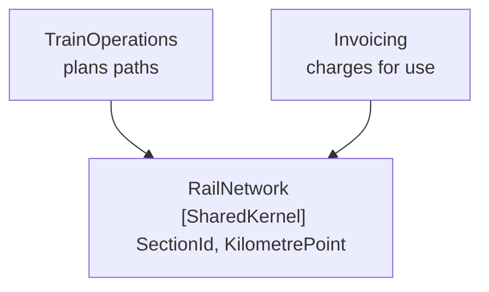

# Shared Kernel

🌍 🇬🇧 English (this file) · 🇫🇷 [Français](SharedKernel-fr.md)

## Intent

Shared Kernel is a subset of the model that two teams agree to share, and to change only by agreement — a
deliberate exception to the rule that models stop at a boundary.

## Problem

Regional rail. Train operations plans which train runs over which section at which minute; invoicing
charges an operator for the sections its trains actually used.

The two contexts could translate, as contexts normally do:

```csharp
// in Invoicing
public sealed record BilledSection(string SectionCode, decimal FromKm, decimal ToKm);
```

But if the two held different ideas of what a section is, or numbered the kilometre points differently,
an invoice would charge for a journey that never happened. And no translation layer could tell, because
both sides would look internally consistent: the translator would faithfully convert one wrong answer
into another.

This is the case where a boundary alone does not help. The two contexts do not need to *agree by
translation*; they need to agree.

## Solution

The pattern shares a deliberately small subset, and prices it.

Some subset of the model is designated as shared — along with the code and, where it applies, the
database design that goes with it. That shared part has special status: it is not changed without
consulting the other team. The two teams integrate frequently, though somewhat less often than they
integrate within themselves, and at each integration the tests of both teams are run.

The purpose is to reduce duplication while still keeping two separate contexts. Keeping the kernel small
is what makes that possible.

## Structure



Two contexts, one small assembly below both. The arrows are real project references — which is what makes
this the exception rather than another form of translation.

## The roles

| Role | Annotation | Applies to | What it carries |
|---|---|---|---|
| SharedKernel | `[assembly: SharedKernel]` | assembly | The shared subset itself. A change to anything here affects every context that depends on it, so it is kept small on purpose and altered only with the consent of the teams that share it. |

One role, on an assembly. The annotation's real work is as a warning label: it marks the code where a
change is not a local decision.

## The example

From [`SharedKernelUsage.cs`](../../../../DesignPatternCatalog.Usage.RailNetwork/SharedKernelUsage.cs).

```csharp
[assembly: SharedKernel]
```

```csharp
/// <summary>
///     A stretch of track between two junctions, as the infrastructure manager numbers it.
/// </summary>
public readonly record struct SectionId(string Code);

/// <summary>
///     A position along a line, in kilometres from its origin — the unit both contexts measure with.
/// </summary>
public readonly record struct KilometrePoint(decimal Value) {

    public static KilometrePoint operator +(KilometrePoint point, decimal kilometres) {
        return new KilometrePoint(point.Value + kilometres);
    }

}
```

Two types. That is the whole assembly, and the count is the lesson rather than an accident of a small
sample.

Anything only one context cares about — a service pattern, a tariff, a platform allocation — stayed on the
side that cares, however tempting it was to share it too while the file was open. A shared kernel that
grows stops being a kernel and becomes a third model that nobody owns.

Both types are value objects: no identity, nothing to track, and no behaviour beyond arithmetic that both
sides mean identically. That is not a coincidence either. Shared behaviour is where the two contexts would
start needing the same rules, and needing the same rules is the point at which they have stopped being two
contexts.

`SectionId` is what the other strategic samples are built on: the anticorruption layer translates *into*
it, and the open host service speaks it to its consumers. A kernel earns its cost by being the thing
everything else can rely on.

## Applicability

**Designate some subset of the domain model that the two teams agree to share**, including the subset of
code and of the database design associated with that part of the model.

**Give that shared material special status**, and do not change it without consulting the other team.

**Integrate a functional system frequently**, though somewhat less often than the pace of continuous
integration within each team, and **run the tests of both teams at those integrations**.

**Use Shared Kernel to reduce duplication while still keeping two separate contexts.** The book states
that as the purpose, which is what distinguishes it from merging the contexts.

## When not to use it

**Do not use Shared Kernel where the teams cannot coordinate.** The pattern is an agreement before it is
a package. Two teams that cannot consult each other on a change will change it anyway, and a kernel
changed unilaterally is worse than duplication because both sides believe they agree.

**Do not let it grow.** The book's instruction to keep it small is the pattern's whole viability: every
addition multiplies the coordination cost, and a large kernel is a third model with no owner and two sets
of expectations.

**Do not put behaviour in it that either side might want to vary.** Shared types with shared rules are
the point at which two contexts stop being two.

**Do not reach for it where translation would do.** The sample's justification is specific — a wrong
shared meaning would produce an invoice nobody could detect as wrong. Where a translator could catch the
discrepancy, the boundary is cheaper than the agreement.

**Do not use it as a home for utilities.** A kernel is a subset of the *model*, agreed for domain
reasons. A common assembly of helpers is a different thing that happens to have the same shape.

## Advantages

* Two contexts agree by construction on what they must not disagree about.
* Duplication of the shared concepts disappears, and with it the drift that no translator could detect.
* The two contexts stay separate everywhere else, so the agreement is bounded and priced.
* The cost is visible: the annotation marks the code where a change is not a local decision.

## Drawbacks

* Every change here is slower than the same change inside either context, because it needs consent.
* It couples the two teams' release schedules to the degree that the kernel changes.
* It is under permanent pressure to grow, and each individual addition looks reasonable.
* Nothing prevents one side from changing it unilaterally; the annotation is a warning, not a lock.

## Relations with other patterns

**`BoundedContext`** is the rule this pattern is the exception to. The kernel is shared precisely because
the two boundaries would otherwise have to translate.

**`AnticorruptionLayer`** is the alternative when the other model is upstream and cannot be negotiated
with. A kernel needs consent from both sides; a layer needs none.

**`PublishedLanguage`** solves a related problem in the other direction — a vocabulary for exchange rather
than a subset both sides compile against.

**`ValueObject`** is what a kernel is usually made of, since a shared concept with no identity and no
varying rules is the safest thing to agree on.

**`CoreDomain`** is what a kernel usually is not: what two contexts share is by definition not what
distinguishes either.

## Source

*Domain-Driven Design: Tackling Complexity in the Heart of Software*, Eric Evans, Addison-Wesley, 2003 —
chapter 14, maintaining model integrity.

* [Index entry](../../../generated/catalog-index.md#sharedkernel-domain-driven-design)
* [Generated attribute](../../../../DesignPatternCatalog.DomainDrivenDesign/SharedKernel.cs)
* [Example](../../../../DesignPatternCatalog.Usage.RailNetwork/SharedKernelUsage.cs)
