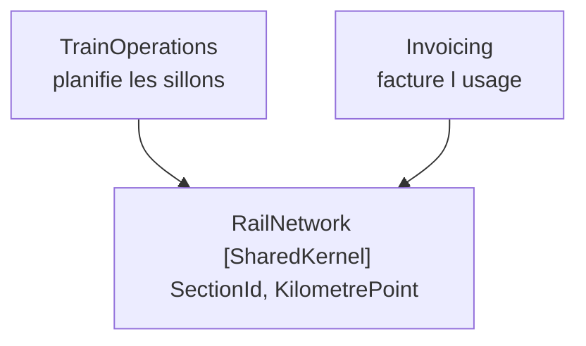

# Shared Kernel

🌍 🇫🇷 Français (ce fichier) · 🇬🇧 [English](SharedKernel-en.md)

## Intention

Shared Kernel est un sous-ensemble du modèle que deux équipes conviennent de partager, et de ne changer
que d'un commun accord — une exception délibérée à la règle selon laquelle un modèle s'arrête à sa
frontière.

## Problème

Réseau ferroviaire régional. L'exploitation planifie quel train circule sur quelle section à quelle
minute ; la facturation facture à un opérateur les sections que ses trains ont réellement empruntées.

Les deux contextes pourraient traduire, comme le font normalement les contextes :

```csharp
// dans Invoicing
public sealed record BilledSection(string SectionCode, decimal FromKm, decimal ToKm);
```

Mais si les deux avaient des idées différentes de ce qu'est une section, ou numérotaient les points
kilométriques différemment, une facture facturerait un trajet qui n'a jamais eu lieu. Et aucune couche de
traduction ne pourrait s'en apercevoir, parce que les deux côtés paraîtraient cohérents chacun de son
côté : le traducteur convertirait fidèlement une mauvaise réponse en une autre.

C'est le cas où une frontière seule ne suffit pas. Les deux contextes n'ont pas besoin de *s'accorder par
traduction* ; ils ont besoin de s'accorder.

## Solution

Le patron partage un sous-ensemble délibérément petit, et en affiche le prix.

Un sous-ensemble du modèle est désigné comme partagé — avec le code et, le cas échéant, la conception de
base de données qui l'accompagne. Cette part partagée a un statut particulier : elle n'est pas changée
sans consulter l'autre équipe. Les deux équipes intègrent fréquemment, quoique un peu moins souvent
qu'elles n'intègrent en interne, et à chaque intégration les tests des deux équipes sont exécutés.

Le but est de réduire la duplication tout en gardant deux contextes séparés. Garder le noyau petit est ce
qui rend cela possible.

## Structure



Deux contextes, une petite assembly sous les deux. Les flèches sont de vraies références de projet — ce
qui fait de ceci l'exception plutôt qu'une forme de traduction de plus.

## Les rôles

| Rôle | Annotation | S'applique à | Ce qu'il porte |
|---|---|---|---|
| SharedKernel | `[assembly: SharedKernel]` | assembly | Le sous-ensemble partagé lui-même. Un changement ici affecte tous les contextes qui en dépendent : il est donc gardé petit à dessein et modifié seulement avec le consentement des équipes qui le partagent. |

Un seul rôle, sur une assembly. Le travail réel de l'annotation est celui d'une étiquette d'avertissement :
elle marque le code où un changement n'est pas une décision locale.

## L'exemple

Extrait de [`SharedKernelUsage.cs`](../../../../DesignPatternCatalog.Usage.RailNetwork/SharedKernelUsage.cs).

```csharp
[assembly: SharedKernel]
```

```csharp
/// <summary>
///     A stretch of track between two junctions, as the infrastructure manager numbers it.
/// </summary>
public readonly record struct SectionId(string Code);

/// <summary>
///     A position along a line, in kilometres from its origin — the unit both contexts measure with.
/// </summary>
public readonly record struct KilometrePoint(decimal Value) {

    public static KilometrePoint operator +(KilometrePoint point, decimal kilometres) {
        return new KilometrePoint(point.Value + kilometres);
    }

}
```

Deux types. C'est toute l'assembly, et ce compte est la leçon plutôt qu'un accident de la petitesse de
l'exemple.

Tout ce qui n'intéresse qu'un seul contexte — un schéma de desserte, un tarif, une affectation de quai —
est resté du côté que cela intéresse, si tentant fût-il de le partager aussi tant que le fichier était
ouvert. Un noyau partagé qui grossit cesse d'être un noyau et devient un troisième modèle que personne ne
possède.

Les deux types sont des objets-valeurs : pas d'identité, rien à suivre, et aucun comportement au-delà
d'une arithmétique que les deux côtés entendent à l'identique. Ce n'est pas une coïncidence non plus. Le
comportement partagé est l'endroit où les deux contextes commenceraient à avoir besoin des mêmes règles,
et avoir besoin des mêmes règles est le point où ils ont cessé d'être deux contextes.

`SectionId` est ce sur quoi les autres exemples stratégiques sont bâtis : la couche anticorruption traduit
*vers* lui, et le service hôte ouvert le parle à ses consommateurs. Un noyau rentabilise son coût en étant
la chose sur laquelle tout le reste peut s'appuyer.

## Possibilités d'application

**Désignez un sous-ensemble du modèle du domaine que les deux équipes conviennent de partager**, y compris
le sous-ensemble de code et de conception de base de données associé à cette part du modèle.

**Donnez à cette matière partagée un statut particulier**, et ne la changez pas sans consulter l'autre
équipe.

**Intégrez fréquemment un système fonctionnel**, quoique un peu moins souvent que le rythme de
l'intégration continue au sein de chaque équipe, et **exécutez les tests des deux équipes lors de ces
intégrations**.

**Utilisez Shared Kernel pour réduire la duplication tout en gardant deux contextes séparés.** Le livre
l'énonce comme le but, et c'est ce qui le distingue d'une fusion des contextes.

## Quand ne pas l'utiliser

**N'utilisez pas Shared Kernel là où les équipes ne peuvent pas se coordonner.** Le patron est un accord
avant d'être un paquet. Deux équipes qui ne peuvent pas se consulter sur un changement le feront quand
même, et un noyau changé unilatéralement est pire que la duplication, parce que les deux côtés croient
s'accorder.

**Ne le laissez pas grossir.** L'instruction du livre de le garder petit est toute la viabilité du patron :
chaque ajout multiplie le coût de coordination, et un gros noyau est un troisième modèle sans propriétaire
et avec deux jeux d'attentes.

**N'y mettez pas de comportement que l'un ou l'autre côté pourrait vouloir faire varier.** Des types
partagés aux règles partagées sont le point où deux contextes cessent d'être deux.

**N'y recourez pas là où une traduction ferait l'affaire.** La justification de l'exemple est précise : un
sens partagé et faux produirait une facture que personne ne pourrait détecter comme fausse. Là où un
traducteur pourrait rattraper l'écart, la frontière coûte moins cher que l'accord.

**Ne l'employez pas comme foyer à utilitaires.** Un noyau est un sous-ensemble du *modèle*, convenu pour
des raisons de domaine. Une assembly commune d'aides est autre chose qui se trouve avoir la même forme.

## Avantages

* Deux contextes s'accordent par construction sur ce sur quoi ils ne doivent pas diverger.
* La duplication des concepts partagés disparaît, et avec elle la dérive qu'aucun traducteur ne pourrait
  détecter.
* Les deux contextes restent séparés partout ailleurs : l'accord est borné et son prix affiché.
* Le coût est visible : l'annotation marque le code où un changement n'est pas une décision locale.

## Inconvénients

* Chaque changement ici est plus lent que le même changement dans l'un ou l'autre contexte, parce qu'il
  demande un consentement.
* Il couple les calendriers de livraison des deux équipes, à proportion des changements du noyau.
* Il est sous une pression permanente de croissance, et chaque ajout pris isolément a l'air raisonnable.
* Rien n'empêche un côté de le changer unilatéralement ; l'annotation est un avertissement, non un verrou.

## Liens avec les autres patrons

**`BoundedContext`** est la règle dont ce patron est l'exception. Le noyau est partagé précisément parce
que les deux frontières devraient sinon traduire.

**`AnticorruptionLayer`** est la solution de rechange quand l'autre modèle est en amont et qu'on ne peut
pas négocier avec lui. Un noyau demande le consentement des deux côtés ; une couche n'en demande aucun.

**`PublishedLanguage`** résout un problème voisin dans l'autre sens — un vocabulaire pour l'échange plutôt
qu'un sous-ensemble contre lequel les deux côtés compilent.

**`ValueObject`** est ce dont un noyau est d'ordinaire fait, puisqu'un concept partagé sans identité et
sans règles variables est la chose la plus sûre sur laquelle s'accorder.

**`CoreDomain`** est ce qu'un noyau n'est d'ordinaire pas : ce que deux contextes partagent n'est par
définition pas ce qui distingue l'un ou l'autre.

## Source

*Domain-Driven Design: Tackling Complexity in the Heart of Software*, Eric Evans, Addison-Wesley, 2003 —
chapitre 14, préserver l'intégrité du modèle.

* [Entrée d'index](../../../generated/catalog-index.md#sharedkernel-domain-driven-design)
* [Attribut généré](../../../../DesignPatternCatalog.DomainDrivenDesign/SharedKernel.cs)
* [Exemple](../../../../DesignPatternCatalog.Usage.RailNetwork/SharedKernelUsage.cs)
