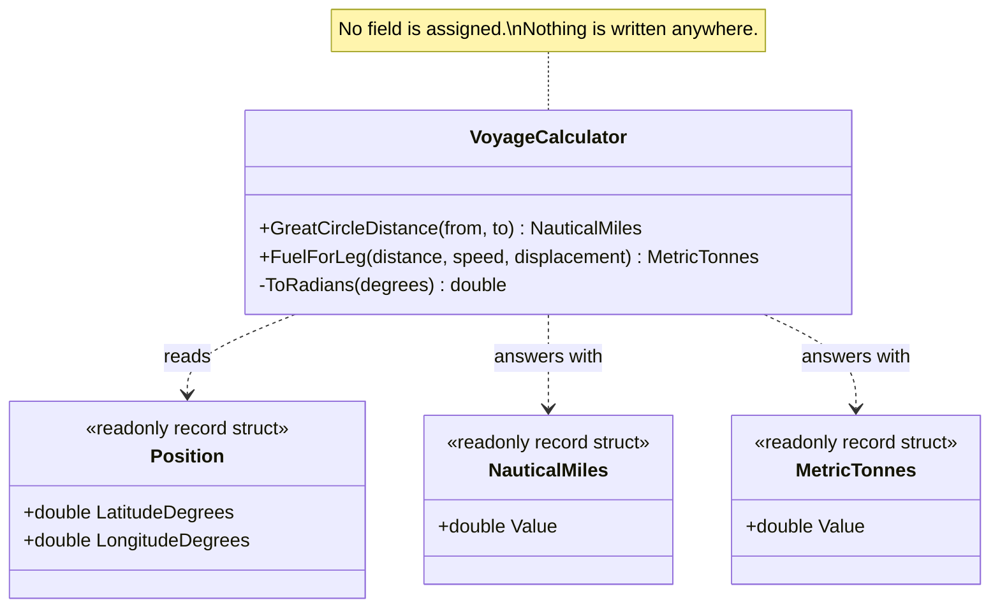

# Side-Effect-Free Function

🌍 🇬🇧 English (this file) · 🇫🇷 [Français](SideEffectFreeFunction-fr.md)

## Intent

Side-Effect-Free Function is an operation that computes and returns a result while leaving the state of
the system untouched, so that it can be called freely, repeated and combined without reasoning about
order.

## Problem

Maritime routing: how far apart two positions are, and how much fuel a leg will burn. A voyage planner
tries hundreds of candidate routes before committing to one — it reorders legs, drops a port, puts it
back, and compares totals.

Two calls in the planner's code look alike:

```csharp
NauticalMiles d = voyage.DistanceTo(port);
voyage.AddCall(port);
```

One can be tried and discarded; the other cannot. Nothing at the call site says which is which. A planner
that guesses wrong has either recomputed something for no reason or committed to a route it was only
considering, and the second mistake is not visible until much later.

## Solution

The pattern divides operations into two kinds and puts as much as possible into the first.

A function returns a result and produces no observable effect. A command changes state, and is kept very
simple and made to return no domain information. Once the two are separated, the first kind is safe to
use freely — cached, retried, run in parallel, evaluated speculatively — and the reasoning a caller has to
do about ordering applies only to the second kind, which is now small.

The book adds a way of getting there when the logic is complex: move it into a value object. A value
object is immutable, so apart from what happens at creation all of its operations are functions by
construction.

## Structure



Every arrow leaves the calculator and none comes back, which is the diagram's way of saying the same
thing the annotation says.

## The roles

| Role | Annotation | Applies to | What it carries |
|---|---|---|---|
| SideEffectFreeFunction | `[SideEffectFreeFunction]` | method | A method that returns a result and modifies no observable state, neither of its own object nor of anything it reaches. |

One role, applying to a method rather than to a type: the claim is about one operation, and a class may
hold both kinds. The annotation is inherited.

## The example

From [`SideEffectFreeFunctionUsage.cs`](../../../../DesignPatternCatalog.Usage/DomainDrivenDesign/SideEffectFreeFunctionUsage.cs).

```csharp
[ValueObject]
public readonly record struct Position(double LatitudeDegrees, double LongitudeDegrees);

[ValueObject]
public readonly record struct NauticalMiles(double Value);

[ValueObject]
public readonly record struct MetricTonnes(double Value);
```

Three value objects, and their presence is part of the pattern rather than decoration. A distance is a
distance, not a bare `double`: a function that answers with a value object stays composable, and
composability is what makes freedom from effects worth having in the first place.

```csharp
[Service]
public sealed class VoyageCalculator {

    private const double EarthRadiusNauticalMiles = 3440.065;

    [SideEffectFreeFunction]
    public NauticalMiles GreatCircleDistance(Position from, Position to) {
        double φ1 = ToRadians(from.LatitudeDegrees);
        double φ2 = ToRadians(to.LatitudeDegrees);
        double Δφ = ToRadians(to.LatitudeDegrees  - from.LatitudeDegrees);
        double Δλ = ToRadians(to.LongitudeDegrees - from.LongitudeDegrees);

        double a = Math.Sin(Δφ / 2) * Math.Sin(Δφ / 2)
                 + Math.Cos(φ1)     * Math.Cos(φ2) * Math.Sin(Δλ / 2) * Math.Sin(Δλ / 2);

        return new NauticalMiles(2 * EarthRadiusNauticalMiles * Math.Atan2(Math.Sqrt(a), Math.Sqrt(1 - a)));
    }
```

Everything the method needs arrives as an argument and everything it produces leaves as a result. The
only field it touches is a `const`.

The annotation earns its place because the property cannot be seen from the call site. `GreatCircleDistance`
and a method that recorded the leg would read the same way in the planner's loop, and only one of them can
be called a thousand times.

```csharp
    // Not trivial, and still free of effects: it reads its arguments, computes, and returns.
    [SideEffectFreeFunction]
    public MetricTonnes FuelForLeg(NauticalMiles distance, double serviceSpeedKnots, double displacementTonnes) {
        double hours       = distance.Value / serviceSpeedKnots;
        double cubicFactor = Math.Pow(serviceSpeedKnots, 3) / Math.Pow(14.0, 3);

        return new MetricTonnes(hours * cubicFactor * displacementTonnes * 0.00012);
    }

    private static double ToRadians(double degrees) => degrees * Math.PI / 180.0;

}
```

The edge worth being explicit about: side-effect-free does not mean small. `FuelForLeg` does real work.
What it does not do is leave a trace — no field is assigned, no argument is mutated, nothing is written
anywhere. Run it twice and the second run is indistinguishable from the first.

That last sentence is the practical test, and it is the one to apply rather than counting lines.

## Applicability

**Place as much of the logic of the program as possible into functions** — operations that return results
with no observable side effects.

**Strictly segregate commands into very simple operations that do not return domain information.** The
book asks for both halves: the point is not only that functions are safe, but that what remains after
they are extracted is small enough to reason about.

**Move complex logic into value objects when a concept fitting the responsibility presents itself.** The
book gives this as the way to get there: a value object is immutable, so all of its operations apart from
its initialisers are functions by construction.

## When not to use it

**Do not use it where the operation exists in order to change something.** Recording a flight, issuing a
unit, committing a booking — these are commands, and the book's instruction about them is to keep them
simple and silent rather than to make them functions.

**Do not claim it for an operation whose effects are merely hidden.** A method that writes to a log, a
cache, a clock or a static field produces observable effects even where the signature suggests otherwise,
and the annotation would then be a false statement that a reader would rely on.

**Do not force a function to answer with a primitive to keep it simple.** The book pairs this pattern with
value objects for a reason: a function returning a bare `double` composes worse and says less than one
returning a distance, and the freedom from effects buys less as a result.

**Do not expect the compiler to hold the line.** C# has no purity annotation it enforces. The claim is
recorded, and only a rule over the annotation — or a reviewer — checks that no field is assigned and no
argument mutated.

## Advantages

* The operation can be called freely: cached, retried, run in parallel, evaluated speculatively, without
  a decision being taken by accident.
* Order stops mattering for everything except the commands, which are now few and simple.
* Testing needs no arrangement beyond the arguments, and no assertion beyond the result.
* Reasoning is local: understanding the call needs nothing about what ran before it.
* The property is stated where it cannot otherwise be seen, since two calls that differ this much can
  look identical at the call site.

## Drawbacks

* Nothing in C# enforces it, so the annotation is a claim maintained by discipline.
* Separating the two kinds sometimes means two operations where a single one felt natural — compute, then
  apply.
* Answering with a fresh value rather than modifying one allocates, and on a hot path that is a real
  cost.
* An expensive function invites being called freely, which is what the pattern permits and not always
  what is wanted.

## Relations with other patterns

**`ValueObject`** is the book's recommended home for complex logic, precisely because immutability makes
its operations functions without anyone having to be careful.

**`ClosureOfOperation`** is the stronger form of the same idea: not only does the operation change
nothing, it answers with its own type, so results feed back in.

**`Assertion`** is the complement. Reducing the number of operations that change anything reduces the
number that need a post-condition, which is why the book presents the two together.

**`Specification`** relies on this pattern: `IsSatisfiedBy` answers and changes nothing, which is what
lets the same rule serve validation, selection and construction.

**`StandaloneClass`** is the same instinct applied to dependencies rather than to effects — both are about
what a reader must hold in mind to trust the code.

## Source

*Domain-Driven Design: Tackling Complexity in the Heart of Software*, Eric Evans, Addison-Wesley, 2003 —
chapter 10, supple design.

* [Index entry](../../../generated/catalog-index.md#sideeffectfreefunction-domain-driven-design)
* [Generated attribute](../../../../DesignPatternCatalog.DomainDrivenDesign/SideEffectFreeFunction.cs)
* [Example](../../../../DesignPatternCatalog.Usage/DomainDrivenDesign/SideEffectFreeFunctionUsage.cs)
