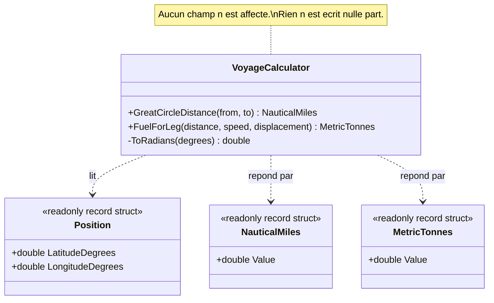

# Side-Effect-Free Function

🌍 🇫🇷 Français (ce fichier) · 🇬🇧 [English](SideEffectFreeFunction-en.md)

## Intention

Side-Effect-Free Function est une opération qui calcule et rend un résultat en laissant l'état du système
intact, de sorte qu'elle puisse être appelée librement, répétée et combinée sans avoir à raisonner sur
l'ordre.

## Problème

Routage maritime : la distance entre deux positions, et le combustible que brûlera une étape. Un
planificateur de voyage essaie des centaines de routes candidates avant d'en retenir une — il réordonne
des étapes, retire une escale, la remet, et compare des totaux.

Deux appels se ressemblent dans le code du planificateur :

```csharp
NauticalMiles d = voyage.DistanceTo(port);
voyage.AddCall(port);
```

L'un peut être essayé puis jeté ; l'autre non. Rien au site d'appel ne dit lequel est lequel. Un
planificateur qui se trompe a soit recalculé quelque chose pour rien, soit engagé une route qu'il ne
faisait qu'envisager, et la seconde erreur n'est visible que bien plus tard.

## Solution

Le patron partage les opérations en deux espèces et met le plus possible dans la première.

Une fonction rend un résultat et ne produit aucun effet observable. Une commande change l'état, et on la
garde très simple en lui faisant ne rendre aucune information du domaine. Une fois les deux séparées, la
première espèce s'emploie librement — mise en cache, réessayée, exécutée en parallèle, évaluée
spéculativement — et le raisonnement sur l'ordre ne porte plus que sur la seconde, désormais petite.

Le livre ajoute un moyen d'y parvenir quand la logique est complexe : la déplacer dans un objet-valeur. Un
objet-valeur est immuable, si bien qu'en dehors de ce qui se passe à la création, toutes ses opérations
sont des fonctions par construction.

## Structure



Toutes les flèches partent du calculateur et aucune n'y revient, ce qui est la façon du diagramme de dire
ce que dit l'annotation.

## Les rôles

| Rôle | Annotation | S'applique à | Ce qu'il porte |
|---|---|---|---|
| SideEffectFreeFunction | `[SideEffectFreeFunction]` | méthode | Une méthode qui rend un résultat et ne modifie aucun état observable, ni du sien ni de rien de ce qu'elle atteint. |

Un seul rôle, s'appliquant à une méthode et non à un type : la revendication porte sur une opération, et
une classe peut porter les deux espèces. L'annotation est héritée.

## L'exemple

Extrait de [`SideEffectFreeFunctionUsage.cs`](../../../../DesignPatternCatalog.Usage/DomainDrivenDesign/SideEffectFreeFunctionUsage.cs).

```csharp
[ValueObject]
public readonly record struct Position(double LatitudeDegrees, double LongitudeDegrees);

[ValueObject]
public readonly record struct NauticalMiles(double Value);

[ValueObject]
public readonly record struct MetricTonnes(double Value);
```

Trois objets-valeurs, et leur présence fait partie du patron plutôt qu'elle ne le décore. Une distance est
une distance, non un `double` nu : une fonction qui répond par un objet-valeur reste composable, et la
composabilité est ce qui rend l'absence d'effets digne d'être recherchée.

```csharp
[Service]
public sealed class VoyageCalculator {

    private const double EarthRadiusNauticalMiles = 3440.065;

    [SideEffectFreeFunction]
    public NauticalMiles GreatCircleDistance(Position from, Position to) {
        double φ1 = ToRadians(from.LatitudeDegrees);
        double φ2 = ToRadians(to.LatitudeDegrees);
        double Δφ = ToRadians(to.LatitudeDegrees  - from.LatitudeDegrees);
        double Δλ = ToRadians(to.LongitudeDegrees - from.LongitudeDegrees);

        double a = Math.Sin(Δφ / 2) * Math.Sin(Δφ / 2)
                 + Math.Cos(φ1)     * Math.Cos(φ2) * Math.Sin(Δλ / 2) * Math.Sin(Δλ / 2);

        return new NauticalMiles(2 * EarthRadiusNauticalMiles * Math.Atan2(Math.Sqrt(a), Math.Sqrt(1 - a)));
    }
```

Tout ce dont la méthode a besoin arrive en argument et tout ce qu'elle produit repart en résultat. Le seul
champ qu'elle touche est une constante.

L'annotation gagne sa place parce que la propriété n'est pas visible depuis le site d'appel.
`GreatCircleDistance` et une méthode qui enregistrerait l'étape se liraient pareil dans la boucle du
planificateur, et une seule des deux peut être appelée mille fois.

```csharp
    // Not trivial, and still free of effects: it reads its arguments, computes, and returns.
    [SideEffectFreeFunction]
    public MetricTonnes FuelForLeg(NauticalMiles distance, double serviceSpeedKnots, double displacementTonnes) {
        double hours       = distance.Value / serviceSpeedKnots;
        double cubicFactor = Math.Pow(serviceSpeedKnots, 3) / Math.Pow(14.0, 3);

        return new MetricTonnes(hours * cubicFactor * displacementTonnes * 0.00012);
    }

    private static double ToRadians(double degrees) => degrees * Math.PI / 180.0;

}
```

Le point à énoncer clairement : sans effet ne veut pas dire petit. `FuelForLeg` fait un vrai travail. Ce
qu'elle ne fait pas, c'est laisser une trace — aucun champ affecté, aucun argument muté, rien d'écrit nulle
part. Exécutez-la deux fois et la seconde exécution est indiscernable de la première.

Cette dernière phrase est le test pratique, et c'est celui à appliquer plutôt que de compter les lignes.

## Possibilités d'application

**Placez dans des fonctions le plus possible de la logique du programme** — des opérations qui rendent des
résultats sans effet de bord observable.

**Ségréguez strictement les commandes en opérations très simples qui ne rendent aucune information du
domaine.** Le livre demande les deux moitiés : le propos n'est pas seulement que les fonctions sont sûres,
mais que ce qui reste après les avoir extraites soit assez petit pour être raisonné.

**Déplacez la logique complexe dans des objets-valeurs quand un concept ayant cette responsabilité se
présente.** Le livre en fait le moyen d'y arriver : un objet-valeur est immuable, si bien que toutes ses
opérations hors initialiseurs sont des fonctions par construction.

## Quand ne pas l'utiliser

**Ne l'employez pas là où l'opération existe pour changer quelque chose.** Enregistrer un vol, délivrer une
unité, valider une réservation — ce sont des commandes, et l'instruction du livre à leur sujet est de les
garder simples et muettes, non d'en faire des fonctions.

**Ne le revendiquez pas pour une opération dont les effets sont seulement cachés.** Une méthode qui écrit
dans un journal, un cache, une horloge ou un champ statique produit des effets observables même si la
signature suggère le contraire, et l'annotation serait alors une affirmation fausse sur laquelle un
lecteur se reposerait.

**Ne forcez pas une fonction à répondre par un primitif pour rester simple.** Le livre associe ce patron
aux objets-valeurs pour une raison : une fonction qui rend un `double` nu compose moins bien et dit moins
qu'une fonction qui rend une distance, et l'absence d'effets rapporte d'autant moins.

**N'attendez pas du compilateur qu'il tienne la ligne.** C# n'a pas d'annotation de pureté qu'il impose. La
revendication est consignée, et seule une règle portant sur l'annotation — ou un relecteur — vérifie
qu'aucun champ n'est affecté et qu'aucun argument n'est muté.

## Avantages

* L'opération s'appelle librement : mise en cache, réessayée, parallélisée, évaluée spéculativement, sans
  qu'une décision soit prise par accident.
* L'ordre cesse d'importer pour tout sauf les commandes, désormais peu nombreuses et simples.
* Tester ne demande aucune mise en place au-delà des arguments, ni aucune assertion au-delà du résultat.
* Le raisonnement est local : comprendre l'appel ne demande rien de ce qui a tourné avant.
* La propriété est énoncée là où elle ne se voit pas autrement, puisque deux appels aussi différents
  peuvent avoir l'air identiques au site d'appel.

## Inconvénients

* Rien en C# ne l'impose, si bien que l'annotation est une revendication tenue par la discipline.
* Séparer les deux espèces demande parfois deux opérations là où une seule paraissait naturelle :
  calculer, puis appliquer.
* Répondre par une valeur neuve au lieu d'en modifier une alloue, et sur un chemin chaud c'est un coût
  réel.
* Une fonction coûteuse invite à être appelée librement, ce que le patron permet et qui n'est pas toujours
  ce qu'on veut.

## Liens avec les autres patrons

**`ValueObject`** est le foyer que le livre recommande pour la logique complexe, précisément parce que
l'immuabilité fait de ses opérations des fonctions sans que personne ait à y prendre garde.

**`ClosureOfOperation`** est la forme plus forte de la même idée : non seulement l'opération ne change
rien, mais elle répond par son propre type, si bien que les résultats se réinjectent.

**`Assertion`** en est le complément. Réduire le nombre d'opérations qui changent quelque chose réduit le
nombre de celles qui demandent une post-condition, et c'est pourquoi le livre présente les deux ensemble.

**`Specification`** repose sur ce patron : `IsSatisfiedBy` répond et ne change rien, ce qui permet à la
même règle de servir à valider, sélectionner et construire.

**`StandaloneClass`** est le même instinct appliqué aux dépendances plutôt qu'aux effets — les deux portent
sur ce qu'un lecteur doit tenir en tête pour se fier au code.

## Source

*Domain-Driven Design: Tackling Complexity in the Heart of Software*, Eric Evans, Addison-Wesley, 2003 —
chapitre 10, la conception souple.

* [Entrée d'index](../../../generated/catalog-index.md#sideeffectfreefunction-domain-driven-design)
* [Attribut généré](../../../../DesignPatternCatalog.DomainDrivenDesign/SideEffectFreeFunction.cs)
* [Exemple](../../../../DesignPatternCatalog.Usage/DomainDrivenDesign/SideEffectFreeFunctionUsage.cs)
