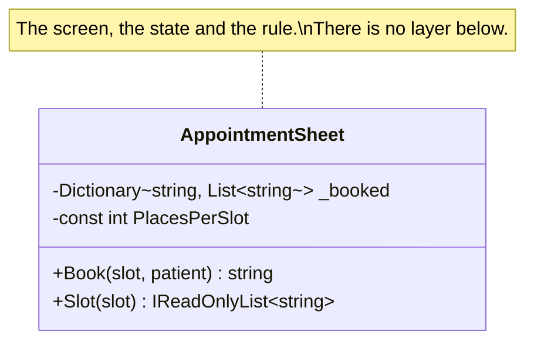

# Smart UI

🌍 🇬🇧 English (this file) · 🇫🇷 [Français](SmartUi-fr.md)

## Intent

Smart UI puts the business rules into the user interface itself, one screen at a time, and keeps no model
at all. The book names it the anti-pattern — and then gives the circumstances under which it is the right
answer.

## Problem

A pop-up vaccination clinic in a leisure centre, open for eleven days. One receptionist, one laptop, a
spreadsheet of appointment slots, and a rule so short it fits in a sentence: nobody is booked into a slot
that is already full.

The layered answer to that sentence is a domain layer, an application service, a repository and the
interfaces between them — four types and a wiring diagram for one comparison, in a system that closes
before any of them could pay for themselves.

The problem here is not the rule. It is that the machinery normally worth building around a rule costs
more than the clinic.

## Solution

The pattern puts the logic where the screen is, deliberately.

The application is chopped into small functions, each implemented as a separate user interface with the
business rules embedded in it. A relational database serves as the shared repository of the data, and the
most automated interface-building tools available are used, because building screens is the whole of the
work.

What the annotation adds is that this was decided. Without it, the next reader sees a screen with
business logic in it and starts extracting a service — which is the correct instinct applied to the one
case where it is wrong. Declaring the choice fixes a scope: every rule about layering stops at this
class, and it stops there because someone decided it, with a reason a reviewer can argue with.

It also names its own expiry. The moment a second channel appears, the reason evaporates.

## Structure



One class, and the absence of everything else is the diagram's content. A layered version of the same
clinic is drawn on the [Layered Architecture](LayeredArchitecture-en.md) page; the contrast between the
two pictures is the decision.

## The roles

| Role | Annotation | Applies to | What it carries |
|---|---|---|---|
| SmartUi | `[SmartUi]` | class, assembly | Code where the rules live with the screen on purpose, because the application is small, short-lived or too simple to repay a model. |

One role, so nothing to choose. It applies to a class or to a whole assembly, which is the difference
between one screen taken out of a larger system and an application built this way throughout.

## The example

From [`SmartUiUsage.cs`](../../../../DesignPatternCatalog.Usage/DomainDrivenDesign/SmartUiUsage.cs).

```csharp
/// <remarks>
///     Annotated rather than refactored. Extracting a model here would produce a domain layer, an
///     application service and a repository for one rule, in a system that closes before any of them could
///     pay for themselves.
/// </remarks>
[SmartUi]
public sealed class AppointmentSheet {

    private const int PlacesPerSlot = 12;

    private readonly Dictionary<string, List<string>> _booked = new(StringComparer.Ordinal);
```

The reason is written down next to the annotation, and that is the part worth copying. An annotation
saying *smart UI* records what was done; the remark records why, and why is what a reviewer needs in
order to disagree.

```csharp
    /// <summary>
    ///     What the button does, and where the only rule in the system lives.
    /// </summary>
    public string Book(string slot, string patient) {
        if (!_booked.TryGetValue(slot, out List<string>? names)) {
            names         = new List<string>();
            _booked[slot] = names;
        }

        if (names.Count >= PlacesPerSlot) { return $"{slot} is full — try the next one."; }
        if (names.Contains(patient, StringComparer.OrdinalIgnoreCase)) { return $"{patient} is already booked into {slot}."; }

        names.Add(patient);

        return $"{patient} booked into {slot} ({names.Count} of {PlacesPerSlot}).";
    }
```

The rule and the message it produces are the same three lines. In a layered design those would be two
places — a domain object that refuses, and a screen that phrases the refusal — and the separation is
worth its cost when the refusal has to reach three channels. Here it has one.

Notice that the method returns the sentence the user will read. That is the pattern being honest: this
class is a screen, and a screen's job is to say something.

```csharp
    public IReadOnlyList<string> Slot(string slot) {
        return _booked.TryGetValue(slot, out List<string>? names) ? names : Array.Empty<string>();
    }

}
```

The state is a dictionary in the object. There is no repository because there is nothing for one to
abstract: the clinic runs on one laptop for eleven days.

The annotation names its own expiry, and that is what makes it a decision rather than a habit. The moment
a second channel appears — a booking site, a phone line, an import from the regional register — the rule
below would hold for one caller out of three, and the reason evaporates. That is the day the annotation
has to come off first.

## Applicability

The book's context for this pattern is precise, and worth having in full because it is the only place it
is stated:

**Use Smart UI when the project needs to deliver simple functionality, dominated by data entry and
display, with few business rules.**

**Use Smart UI when the staff available are not skilled in object-oriented design**, and training them in
it is not part of the plan.

**Use Smart UI when the application will not be extended into something richer.** The growth path from
here is strictly toward more simple applications, and the book says so plainly.

**Use Smart UI when the tools favour it** — automated interface building, visual programming, a
relational database as the shared repository of data.

## When not to use it

**Do not use Smart UI where the rules will be reached by more than one channel.** A rule inside a screen
holds for callers who go through that screen. A second channel makes it a rule that holds for a third of
the traffic, which is worse than no rule, because it looks like one.

**Do not use Smart UI where the application is expected to grow richer.** The book names this as the
limit rather than as a risk: complexity buries the approach quickly, and there is no clean way to evolve
into richer behaviour. Getting out means rewriting, not refactoring.

**Do not use Smart UI where the business logic is the difficult part.** The pattern's context is
functionality dominated by entry and display. Where the difficulty is in the domain, this is the
arrangement that guarantees nobody can work on the domain.

**Do not use Smart UI without recording that it was a decision.** This is the guide's own reason for the
annotation existing, and it is the difference between the pattern and the accident it looks identical to.
An unmarked screen full of rules cannot be told from a lapse, and the correct instinct — extract a model
— will be applied to it.

**Do not extend the scope by default.** The annotation applies to a class or to an assembly. Marking a
class fixes a boundary that a reviewer can inspect; marking an assembly claims the whole thing, and the
claim should be as small as the decision actually was.

## Advantages

The book lists these, and they are real. This section is the book's, not the field's.

* Productivity is high and immediate for simple applications.
* Less capable developers can work this way with little training.
* Deficiencies in requirements analysis can be overcome by releasing a prototype and then changing the
  product quickly to fit what users ask for.
* Applications are decoupled from each other, so delivery schedules of small modules can be planned
  fairly accurately.
* Expanding an application with more behaviour is easy.
* Relational databases work well and provide integration at the data level.
* Fourth-generation-language tools work well.
* When an application is handed over, maintenance programmers can quickly redo portions they cannot
  follow, because the effects are localised to each particular screen.

## Drawbacks

The book lists these too.

* Integration of applications is difficult except through the database.
* There is no reuse of behaviour and no abstraction of the business problem.
* Business rules have to be duplicated in every operation to which they apply.
* Rapid prototyping and iteration reach a natural limit, because the lack of abstraction limits what can
  be refactored.
* Complexity buries the approach quickly, so the growth path is strictly toward more simple applications.
* There is no clean way to evolve into richer behaviour.

## Relations with other patterns

**`LayeredArchitecture`** is what this pattern is defined against, and the pair should be read together:
one names the partition, the other names the circumstances under which the partition is not worth its
cost.

**`Entity`**, **`ValueObject`**, **`Service`**, **`Aggregate`**, **`Factory`** and **`Repository`** are
what a smart UI does without. That is not an oversight in the design — it is the design, and every one of
them is a cost this pattern declines to pay.

**`BoundedContext`** is the pattern that makes a smart UI survivable inside a larger system: the screen
is its own context, and nothing outside it is asked to share its model.

## Source

*Domain-Driven Design: Tackling Complexity in the Heart of Software*, Eric Evans, Addison-Wesley, 2003 —
chapter 4, where it appears as *The Smart UI "Anti-Pattern"*.

* [Index entry](../../../generated/catalog-index.md#smartui-domain-driven-design)
* [Generated attribute](../../../../DesignPatternCatalog.DomainDrivenDesign/SmartUi.cs)
* [Example](../../../../DesignPatternCatalog.Usage/DomainDrivenDesign/SmartUiUsage.cs)
