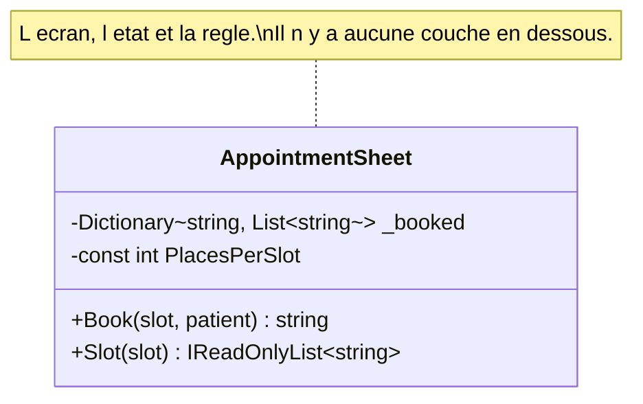

# Smart UI

🌍 🇫🇷 Français (ce fichier) · 🇬🇧 [English](SmartUi-en.md)

## Intention

Smart UI met les règles métier dans l'interface utilisateur elle-même, un écran à la fois, et ne garde
aucun modèle. Le livre le nomme l'anti-patron — puis donne les circonstances où il est la bonne réponse.

## Problème

Un centre de vaccination éphémère dans une salle des fêtes, ouvert onze jours. Une secrétaire, un
portable, un tableau de créneaux, et une règle si courte qu'elle tient en une phrase : personne n'est
inscrit dans un créneau déjà complet.

La réponse en couches à cette phrase, c'est une couche de domaine, un service applicatif, un dépôt et les
interfaces entre eux — quatre types et un schéma de câblage pour une comparaison, dans un système qui
ferme avant qu'aucun d'eux ait pu se rentabiliser.

Le problème n'est pas la règle. C'est que la machinerie qu'on bâtit d'ordinaire autour d'une règle coûte
plus cher que le centre.

## Solution

Le patron met la logique là où est l'écran, délibérément.

L'application est découpée en petites fonctions, chacune implémentée comme une interface utilisateur
distincte avec les règles métier incorporées. Une base relationnelle sert de dépôt partagé des données, et
l'on emploie les outils de construction d'interface et de programmation visuelle les plus automatisés
disponibles, puisque construire des écrans est tout le travail.

Ce que l'annotation ajoute, c'est que cela a été décidé. Sans elle, le lecteur suivant voit un écran
contenant de la logique métier et entreprend d'en extraire un service — ce qui est le bon réflexe appliqué
au seul cas où il a tort. Déclarer le choix fixe une portée : toute règle sur les couches s'arrête à cette
classe, et elle s'y arrête parce que quelqu'un l'a décidé, avec une raison qu'un relecteur peut contester.

Elle nomme aussi sa propre péremption. Dès qu'un second canal apparaît, la raison s'évapore.

## Structure



Une classe, et l'absence de tout le reste fait le contenu du diagramme. Une version en couches du même
centre est dessinée sur la page [Layered Architecture](LayeredArchitecture-fr.md) ; le contraste entre les
deux images est la décision.

## Les rôles

| Rôle | Annotation | S'applique à | Ce qu'il porte |
|---|---|---|---|
| SmartUi | `[SmartUi]` | classe, assembly | Du code où les règles vivent avec l'écran délibérément, parce que l'application est petite, éphémère ou trop simple pour rentabiliser un modèle. |

Un seul rôle, donc rien à choisir. Il s'applique à une classe ou à une assembly entière, ce qui est la
différence entre un écran soustrait à un système plus vaste et une application bâtie ainsi de bout en
bout.

## L'exemple

Extrait de [`SmartUiUsage.cs`](../../../../DesignPatternCatalog.Usage/DomainDrivenDesign/SmartUiUsage.cs).

```csharp
/// <remarks>
///     Annotated rather than refactored. Extracting a model here would produce a domain layer, an
///     application service and a repository for one rule, in a system that closes before any of them could
///     pay for themselves.
/// </remarks>
[SmartUi]
public sealed class AppointmentSheet {

    private const int PlacesPerSlot = 12;

    private readonly Dictionary<string, List<string>> _booked = new(StringComparer.Ordinal);
```

La raison est écrite à côté de l'annotation, et c'est la part qui mérite d'être copiée. Une annotation qui
dit *smart UI* consigne ce qui a été fait ; la remarque consigne pourquoi, et le pourquoi est ce dont un
relecteur a besoin pour n'être pas d'accord.

```csharp
    /// <summary>
    ///     What the button does, and where the only rule in the system lives.
    /// </summary>
    public string Book(string slot, string patient) {
        if (!_booked.TryGetValue(slot, out List<string>? names)) {
            names         = new List<string>();
            _booked[slot] = names;
        }

        if (names.Count >= PlacesPerSlot) { return $"{slot} is full — try the next one."; }
        if (names.Contains(patient, StringComparer.OrdinalIgnoreCase)) { return $"{patient} is already booked into {slot}."; }

        names.Add(patient);

        return $"{patient} booked into {slot} ({names.Count} of {PlacesPerSlot}).";
    }
```

La règle et le message qu'elle produit sont les mêmes trois lignes. Dans une conception en couches, cela
ferait deux endroits — un objet du domaine qui refuse, un écran qui formule le refus — et la séparation
vaut son coût quand le refus doit atteindre trois canaux. Ici il en atteint un.

Remarquer que la méthode rend la phrase que l'utilisateur lira. C'est le patron qui joue franc jeu : cette
classe est un écran, et le métier d'un écran est de dire quelque chose.

```csharp
    public IReadOnlyList<string> Slot(string slot) {
        return _booked.TryGetValue(slot, out List<string>? names) ? names : Array.Empty<string>();
    }

}
```

L'état est un dictionnaire dans l'objet. Il n'y a pas de dépôt parce qu'il n'y a rien à abstraire : le
centre tourne sur un portable pendant onze jours.

L'annotation nomme sa propre péremption, et c'est ce qui en fait une décision plutôt qu'une habitude. Dès
qu'un second canal apparaît — un site de réservation, une ligne téléphonique, un import du registre
régional — la règle ci-dessus tiendrait pour un appelant sur trois, et la raison s'évapore. C'est le jour
où l'annotation doit tomber en premier.

## Possibilités d'application

Le contexte que le livre donne à ce patron est précis, et mérite d'être cité en entier parce que c'est le
seul endroit où il est énoncé :

**Utilisez Smart UI lorsque le projet doit livrer des fonctionnalités simples, dominées par la saisie et
l'affichage, avec peu de règles métier.**

**Utilisez Smart UI lorsque le personnel disponible n'est pas formé à la conception objet**, et que l'y
former ne fait pas partie du plan.

**Utilisez Smart UI lorsque l'application ne sera pas étendue vers quelque chose de plus riche.** Le
chemin de croissance à partir d'ici mène strictement vers d'autres applications simples, et le livre le
dit sans détour.

**Utilisez Smart UI lorsque les outils y invitent** — construction d'interface automatisée, programmation
visuelle, base relationnelle comme dépôt partagé des données.

## Quand ne pas l'utiliser

**N'utilisez pas Smart UI là où les règles seront atteintes par plus d'un canal.** Une règle dans un écran
tient pour les appelants qui passent par cet écran. Un second canal en fait une règle qui tient pour un
tiers du trafic, ce qui est pire que pas de règle, parce que cela y ressemble.

**N'utilisez pas Smart UI là où l'on attend de l'application qu'elle s'enrichisse.** Le livre nomme cela
comme la limite et non comme un risque : la complexité ensevelit vite l'approche, et il n'existe pas de
chemin propre vers un comportement plus riche. En sortir, c'est réécrire, non refactorer.

**N'utilisez pas Smart UI là où la logique métier est la part difficile.** Le contexte du patron est une
fonctionnalité dominée par la saisie et l'affichage. Là où la difficulté est dans le domaine, c'est
l'agencement qui garantit que personne ne pourra travailler le domaine.

**N'utilisez pas Smart UI sans consigner que c'était une décision.** C'est la raison propre de ce guide
pour que l'annotation existe, et c'est la différence entre le patron et l'accident auquel il ressemble
trait pour trait. Un écran non marqué et plein de règles ne se distingue pas d'un relâchement, et le bon
réflexe — extraire un modèle — lui sera appliqué.

**N'élargissez pas la portée par défaut.** L'annotation s'applique à une classe ou à une assembly. Marquer
une classe fixe une frontière qu'un relecteur peut inspecter ; marquer une assembly revendique le tout, et
la revendication devrait être aussi petite que la décision l'a réellement été.

## Avantages

Le livre les énumère, et ils sont réels. Cette section est celle du livre, non celle de la profession.

* La productivité est élevée et immédiate pour les applications simples.
* Des développeurs moins aguerris peuvent travailler ainsi avec peu de formation.
* Les insuffisances de l'analyse des besoins se rattrapent en publiant un prototype puis en changeant vite
  le produit pour coller à ce que les utilisateurs demandent.
* Les applications sont découplées les unes des autres, si bien que les calendriers de livraison de
  petits modules se planifient assez précisément.
* Étendre une application avec plus de comportement est facile.
* Les bases relationnelles fonctionnent bien et fournissent l'intégration au niveau des données.
* Les outils de quatrième génération fonctionnent bien.
* Lors d'une reprise, les mainteneurs peuvent refaire rapidement les portions qu'ils ne comprennent pas,
  puisque les effets sont localisés à chaque écran.

## Inconvénients

Le livre les énumère aussi.

* L'intégration des applications est difficile autrement que par la base de données.
* Il n'y a aucune réutilisation du comportement ni aucune abstraction du problème métier.
* Les règles métier doivent être dupliquées dans chaque opération à laquelle elles s'appliquent.
* Le prototypage rapide et l'itération atteignent une limite naturelle, parce que l'absence d'abstraction
  borne ce qui peut être refactoré.
* La complexité ensevelit vite l'approche, si bien que le chemin de croissance mène strictement vers
  d'autres applications simples.
* Il n'existe pas de chemin propre pour évoluer vers un comportement plus riche.

## Liens avec les autres patrons

**`LayeredArchitecture`** est ce contre quoi ce patron se définit, et la paire se lit ensemble : l'un
nomme la partition, l'autre nomme les circonstances où la partition ne vaut pas son coût.

**`Entity`**, **`ValueObject`**, **`Service`**, **`Aggregate`**, **`Factory`** et **`Repository`** sont ce
dont un smart UI se passe. Ce n'est pas un oubli de conception — c'est la conception, et chacun d'eux est
un coût que ce patron refuse de payer.

**`BoundedContext`** est le patron qui rend un smart UI supportable à l'intérieur d'un système plus vaste :
l'écran est son propre contexte, et rien à l'extérieur ne se voit demander de partager son modèle.

## Source

*Domain-Driven Design: Tackling Complexity in the Heart of Software*, Eric Evans, Addison-Wesley, 2003 —
chapitre 4, où il apparaît sous le titre *The Smart UI "Anti-Pattern"*.

* [Entrée d'index](../../../generated/catalog-index.md#smartui-domain-driven-design)
* [Attribut généré](../../../../DesignPatternCatalog.DomainDrivenDesign/SmartUi.cs)
* [Exemple](../../../../DesignPatternCatalog.Usage/DomainDrivenDesign/SmartUiUsage.cs)
