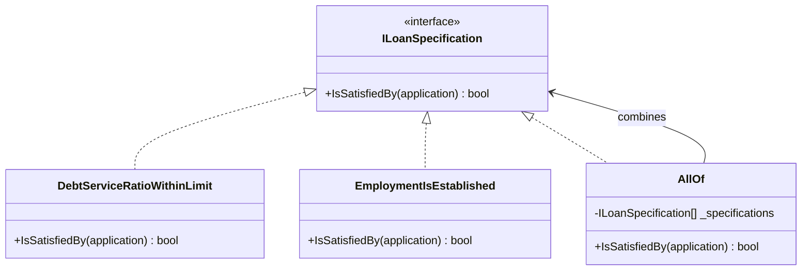

# Specification

🌍 🇬🇧 English (this file) · 🇫🇷 [Français](Specification-fr.md)

## Intent

Specification states a predicate of the domain as an explicit object, so that a business rule can be
named, combined and reused.

## Problem

Consumer lending: which applications may be approved without a human underwriter. The rule is stated by
the credit committee, it changes twice a year, and it is quoted in three places that must not disagree —
the application form greys out what will be refused, the decision engine approves, and the quarterly
audit re-runs it over what was approved.

Written as a condition inside the decision engine, the rule is available nowhere else:

```csharp
if (application.MonthlyCommitments <= application.MonthlyIncome * 0.35m
 && application.MonthsInEmployment >= 12) { Approve(application); }
```

The form reimplements it, the audit reimplements it again, and the second time the committee changes the
threshold only two of the three are updated. The `0.35m` is a figure a committee voted on, and it appears
here as a literal in a branch.

## Solution

The pattern makes the rule a thing rather than a step.

The predicate becomes an object: it is named, it can be passed around and stored, and it answers about a
candidate without deciding what to do with the answer. The decision engine asks it, the form asks it, and
the audit asks the same one.

What that buys beyond a bare predicate is composition. The committee thinks in terms of *solvent and
established*, and once each criterion is an object the code can say exactly that. A rule change next
quarter becomes a recombination rather than a rewrite.

## Structure



The arrow from `AllOf` back to the interface is what makes the set composable: a combination of
specifications is a specification, so combinations nest.

## The roles

| Role | Annotation | Applies to | What it carries |
|---|---|---|---|
| Specification | `[Specification]` | interface, class | States a business predicate as an explicit, combinable object. |

One role, so nothing to choose. The annotation is inherited, so a subclass of a specification is one too.

## The example

From [`SpecificationUsage.cs`](../../../../DesignPatternCatalog.Usage/DomainDrivenDesign/SpecificationUsage.cs).

```csharp
public sealed record LoanApplication(decimal MonthlyIncome, decimal MonthlyCommitments, int MonthsInEmployment, decimal Amount);

[Specification]
public interface ILoanSpecification {

    bool IsSatisfiedBy(LoanApplication application);

}
```

One method, returning a boolean and changing nothing. The book describes a specification as a
predicate-like value object, and this signature is what that means in practice: it answers, and the
caller decides.

`IsSatisfiedBy` is named from the candidate's side rather than the rule's. `Check` or `Validate` would
suggest the specification does something about the answer.

```csharp
[Specification]
public sealed class DebtServiceRatioWithinLimit : ILoanSpecification {

    // 35% of income, the figure the committee actually voted on — named once, here.
    public bool IsSatisfiedBy(LoanApplication application) {
        return application.MonthlyCommitments <= application.MonthlyIncome * 0.35m;
    }

}

[Specification]
public sealed class EmploymentIsEstablished : ILoanSpecification {

    public bool IsSatisfiedBy(LoanApplication application) => application.MonthsInEmployment >= 12;

}
```

Two criteria, one class each, each named the way the committee names it. The class name is doing most of
the work here: `DebtServiceRatioWithinLimit` is a term of the trade, and a reader who knows lending knows
what the class is for before reading its one line.

```csharp
[Specification]
public sealed class AllOf : ILoanSpecification {

    private readonly ILoanSpecification[] _specifications;

    public AllOf(params ILoanSpecification[] specifications) { _specifications = specifications; }

    public bool IsSatisfiedBy(LoanApplication application) {
        return Array.TrueForAll(_specifications, specification => specification.IsSatisfiedBy(application));
    }

}
```

Composition is the reason the rule is an object at all. The committee's *solvent and established* becomes
`new AllOf(new DebtServiceRatioWithinLimit(), new EmploymentIsEstablished())`, and dropping a criterion
next quarter changes that line rather than the decision engine.

The book describes the same combination as logical operators over specifications — and, or, not — and
`AllOf` is the conjunction of that set. The others are the same shape and are absent here rather than
implied: a sample that showed all three would show the same idea three times.

## Applicability

**Use Specification when a business rule does not fit the responsibility of any obvious entity or value
object**, and when its variety and combinations would otherwise overwhelm the basic meaning of the domain
object that ended up holding it.

**Use Specification to validate an object**, to see whether it fulfils some need or is ready for some
purpose.

**Use Specification to select an object from a collection**, the rule serving as the criterion of a
query.

**Use Specification to specify the creation of an object to fit some need**, so that what is built to
order is described by the same rule that would judge it afterwards.

The book gives those three uses — validation, selection, building to order — as the reason the pattern
earns an object rather than a method.

## When not to use it

**Do not move the rule out of the domain layer to get it out of the way.** The book raises this as the
worse of the two mistakes: a rule that has left the domain layer leaves domain code that no longer
expresses the model. The specification exists so the rule can be separated from the entity *without*
leaving the model.

**Do not use Specification where the rule belongs to an object.** A rule about one loan application that
the application itself can answer is a method on it, and giving it a class adds a type and a name for
something that already had both.

**Do not expect a specification to become a query for free.** The book treats specification-based
querying as its own problem, with real difficulty: a predicate evaluated in memory is not a `WHERE`
clause, and bridging the two means either loading candidates to filter them — which does not scale — or
teaching the specification to describe itself to the database, which is more machinery than the rule
was.

**Do not compose beyond what can be read.** Composition is the pattern's payoff and its trap: a rule
assembled from a dozen nested combinators is expressible, and it is no longer a sentence anyone from the
credit committee could check.

**Do not use Specification for a rule with one caller that will not change.** Three callers and two
changes a year is what makes the indirection pay; one caller and a stable rule is a condition.

## Advantages

* The rule is named, and the name is the one the business uses.
* It is stated once and asked by every caller, so the form, the engine and the audit cannot drift apart.
* Rules combine: *solvent and established* is expressible as such, and a change of policy is a change of
  combination.
* The rule can be passed around, stored and tested on its own, with no need to build the machinery that
  normally surrounds it.
* The same rule serves validation, selection and construction, which is what makes it worth an object.

## Drawbacks

* A class per criterion, which is a real count of types for a domain with many rules.
* Making specifications work against a database is genuinely hard, and the ways out — filtering in
  memory, or a second representation for querying — each cost something.
* Deep composition is expressible long past the point where it is readable.
* Nothing enforces that the criterion is stated once: a specification and a hand-written condition can
  coexist, and only a rule over the annotation would notice.

## Relations with other patterns

**`ValueObject`** is what the book calls a specification: a predicate-like value object, with no identity
and nothing to track.

**`SideEffectFreeFunction`** is what `IsSatisfiedBy` is. A specification that changed something when
asked would not be usable in the three ways the book gives.

**`Repository`** is the book's answer when queries multiply: the criteria become a specification the
repository accepts, rather than a method added for each need.

**`Factory`** is the third use — building to order — where a specification describes what is wanted and
the factory produces something that satisfies it.

**`Service`** is the alternative for a rule that is genuinely an operation rather than a predicate: a
service answers a question, a specification *is* the question.

## Source

*Domain-Driven Design: Tackling Complexity in the Heart of Software*, Eric Evans, Addison-Wesley, 2003 —
chapter 9, making implicit concepts explicit.

* [Index entry](../../../generated/catalog-index.md#specification-domain-driven-design)
* [Generated attribute](../../../../DesignPatternCatalog.DomainDrivenDesign/Specification.cs)
* [Example](../../../../DesignPatternCatalog.Usage/DomainDrivenDesign/SpecificationUsage.cs)
