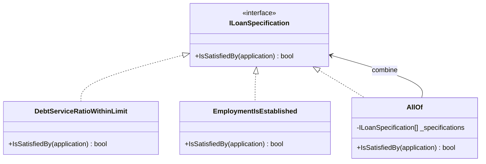

# Specification

🌍 🇫🇷 Français (ce fichier) · 🇬🇧 [English](Specification-en.md)

## Intention

Specification énonce un prédicat du domaine comme un objet explicite, de sorte qu'une règle métier puisse
être nommée, combinée et réutilisée.

## Problème

Crédit à la consommation : quelles demandes peuvent être accordées sans passer par un analyste. La règle
est énoncée par le comité de crédit, elle change deux fois par an, et elle est citée à trois endroits qui
ne doivent pas diverger — le formulaire de demande grise ce qui sera refusé, le moteur de décision
accorde, et l'audit trimestriel la rejoue sur ce qui a été accordé.

Écrite en condition dans le moteur de décision, la règle n'est disponible nulle part ailleurs :

```csharp
if (application.MonthlyCommitments <= application.MonthlyIncome * 0.35m
 && application.MonthsInEmployment >= 12) { Approve(application); }
```

Le formulaire la réimplémente, l'audit la réimplémente encore, et la deuxième fois que le comité change
le seuil, seuls deux des trois sont mis à jour. Le `0.35m` est un chiffre qu'un comité a voté, et il
apparaît ici en littéral dans un branchement.

## Solution

Le patron fait de la règle une chose plutôt qu'une étape.

Le prédicat devient un objet : il est nommé, il se passe et se stocke, et il répond au sujet d'un candidat
sans décider quoi faire de la réponse. Le moteur de décision l'interroge, le formulaire l'interroge, et
l'audit interroge le même.

Ce que cela achète au-delà d'un prédicat nu, c'est la composition. Le comité pense en termes de
*solvable et stable*, et dès que chaque critère est un objet, le code peut dire exactement cela. Un
changement de règle au trimestre suivant devient une recomposition plutôt qu'une réécriture.

## Structure



La flèche qui repart d'`AllOf` vers l'interface est ce qui rend l'ensemble composable : une combinaison de
spécifications est une spécification, donc les combinaisons s'imbriquent.

## Les rôles

| Rôle | Annotation | S'applique à | Ce qu'il porte |
|---|---|---|---|
| Specification | `[Specification]` | interface, classe | Énonce un prédicat métier comme un objet explicite et combinable. |

Un seul rôle, donc rien à choisir. L'annotation est héritée : une sous-classe de spécification en est une
aussi.

## L'exemple

Extrait de [`SpecificationUsage.cs`](../../../../DesignPatternCatalog.Usage/DomainDrivenDesign/SpecificationUsage.cs).

```csharp
public sealed record LoanApplication(decimal MonthlyIncome, decimal MonthlyCommitments, int MonthsInEmployment, decimal Amount);

[Specification]
public interface ILoanSpecification {

    bool IsSatisfiedBy(LoanApplication application);

}
```

Une méthode, qui rend un booléen et ne change rien. Le livre décrit une spécification comme un
objet-valeur de nature prédicative, et cette signature est ce que cela veut dire en pratique : elle
répond, et l'appelant décide.

`IsSatisfiedBy` est nommé du côté du candidat plutôt que du côté de la règle. `Check` ou `Validate`
laisserait entendre que la spécification fait quelque chose de la réponse.

```csharp
[Specification]
public sealed class DebtServiceRatioWithinLimit : ILoanSpecification {

    // 35% of income, the figure the committee actually voted on — named once, here.
    public bool IsSatisfiedBy(LoanApplication application) {
        return application.MonthlyCommitments <= application.MonthlyIncome * 0.35m;
    }

}

[Specification]
public sealed class EmploymentIsEstablished : ILoanSpecification {

    public bool IsSatisfiedBy(LoanApplication application) => application.MonthsInEmployment >= 12;

}
```

Deux critères, une classe chacun, chacune nommée comme le comité la nomme. C'est le nom de la classe qui
fait ici le plus gros du travail : `DebtServiceRatioWithinLimit` est un terme du métier, et un lecteur qui
connaît le crédit sait à quoi sert la classe avant d'en lire l'unique ligne.

```csharp
[Specification]
public sealed class AllOf : ILoanSpecification {

    private readonly ILoanSpecification[] _specifications;

    public AllOf(params ILoanSpecification[] specifications) { _specifications = specifications; }

    public bool IsSatisfiedBy(LoanApplication application) {
        return Array.TrueForAll(_specifications, specification => specification.IsSatisfiedBy(application));
    }

}
```

La composition est la raison même pour laquelle la règle est un objet. Le *solvable et stable* du comité
devient `new AllOf(new DebtServiceRatioWithinLimit(), new EmploymentIsEstablished())`, et retirer un
critère au trimestre suivant change cette ligne plutôt que le moteur de décision.

Le livre décrit la même combinaison sous forme d'opérateurs logiques sur les spécifications — et, ou,
non — et `AllOf` est la conjonction de cet ensemble. Les autres ont la même forme et sont absents plutôt
que sous-entendus : un exemple qui les montrerait tous les trois montrerait trois fois la même idée.

## Possibilités d'application

**Utilisez Specification lorsqu'une règle métier ne relève de la responsabilité d'aucune entité ni d'aucun
objet-valeur évident**, et que sa variété et ses combinaisons submergeraient sinon le sens même de l'objet
du domaine qui a fini par la porter.

**Utilisez Specification pour valider un objet**, pour voir s'il répond à un besoin ou s'il est prêt pour
un usage.

**Utilisez Specification pour sélectionner un objet dans une collection**, la règle servant de critère de
requête.

**Utilisez Specification pour spécifier la création d'un objet répondant à un besoin**, de sorte que ce
qui est construit sur mesure soit décrit par la règle même qui le jugerait ensuite.

Le livre donne ces trois usages — validation, sélection, construction sur mesure — comme la raison pour
laquelle le patron mérite un objet plutôt qu'une méthode.

## Quand ne pas l'utiliser

**Ne sortez pas la règle de la couche du domaine pour vous en débarrasser.** Le livre soulève cela comme
la pire des deux erreurs : une règle qui a quitté la couche du domaine laisse derrière elle un code de
domaine qui n'exprime plus le modèle. La spécification existe pour que la règle soit séparée de l'entité
*sans* quitter le modèle.

**N'utilisez pas Specification là où la règle appartient à un objet.** Une règle portant sur une demande
de crédit à laquelle la demande sait répondre est une méthode sur elle, et lui donner une classe ajoute un
type et un nom à quelque chose qui avait déjà les deux.

**N'attendez pas d'une spécification qu'elle devienne une requête gratuitement.** Le livre traite le
requêtage par spécification comme un problème à part, à la difficulté réelle : un prédicat évalué en
mémoire n'est pas une clause `WHERE`, et faire le pont suppose soit de charger les candidats pour les
filtrer — ce qui ne passe pas à l'échelle —, soit d'apprendre à la spécification à se décrire à la base,
ce qui est plus de machinerie que la règle n'en était.

**Ne composez pas au-delà de ce qui se lit.** La composition est le gain du patron et son piège : une
règle assemblée à partir d'une douzaine de combinateurs imbriqués est exprimable, et ce n'est plus une
phrase que quiconque du comité de crédit pourrait vérifier.

**N'utilisez pas Specification pour une règle à un seul appelant et qui ne changera pas.** Trois appelants
et deux changements par an, voilà ce qui rentabilise l'indirection ; un appelant et une règle stable, cela
s'appelle une condition.

## Avantages

* La règle est nommée, et le nom est celui qu'emploie le métier.
* Elle est énoncée une fois et interrogée par tous les appelants, si bien que le formulaire, le moteur et
  l'audit ne peuvent pas diverger.
* Les règles se combinent : *solvable et stable* s'exprime tel quel, et un changement de politique est un
  changement de combinaison.
* La règle se passe, se stocke et se teste seule, sans monter la machinerie qui l'entoure d'ordinaire.
* La même règle sert à valider, à sélectionner et à construire, ce qui est ce qui lui vaut un objet.

## Inconvénients

* Une classe par critère, ce qui fait un compte de types bien réel pour un domaine à nombreuses règles.
* Faire fonctionner des spécifications contre une base de données est vraiment difficile, et les issues —
  filtrer en mémoire, ou une seconde représentation pour le requêtage — coûtent chacune quelque chose.
* Une composition profonde reste exprimable bien après avoir cessé d'être lisible.
* Rien n'impose que le critère soit énoncé une seule fois : une spécification et une condition écrite à la
  main peuvent coexister, et seule une règle portant sur l'annotation s'en apercevrait.

## Liens avec les autres patrons

**`ValueObject`** est ce que le livre appelle une spécification : un objet-valeur de nature prédicative,
sans identité et sans rien à suivre.

**`SideEffectFreeFunction`** est ce qu'est `IsSatisfiedBy`. Une spécification qui changerait quelque chose
en étant interrogée ne serait utilisable dans aucun des trois usages du livre.

**`Repository`** est la réponse du livre quand les requêtes se multiplient : les critères deviennent une
spécification que le dépôt accepte, plutôt qu'une méthode ajoutée à chaque besoin.

**`Factory`** est le troisième usage — la construction sur mesure — où une spécification décrit ce qui est
voulu et la fabrique produit quelque chose qui la satisfait.

**`Service`** est la solution de rechange pour une règle qui est vraiment une opération plutôt qu'un
prédicat : un service répond à une question, une spécification *est* la question.

## Source

*Domain-Driven Design: Tackling Complexity in the Heart of Software*, Eric Evans, Addison-Wesley, 2003 —
chapitre 9, rendre explicites les concepts implicites.

* [Entrée d'index](../../../generated/catalog-index.md#specification-domain-driven-design)
* [Attribut généré](../../../../DesignPatternCatalog.DomainDrivenDesign/Specification.cs)
* [Exemple](../../../../DesignPatternCatalog.Usage/DomainDrivenDesign/SpecificationUsage.cs)
