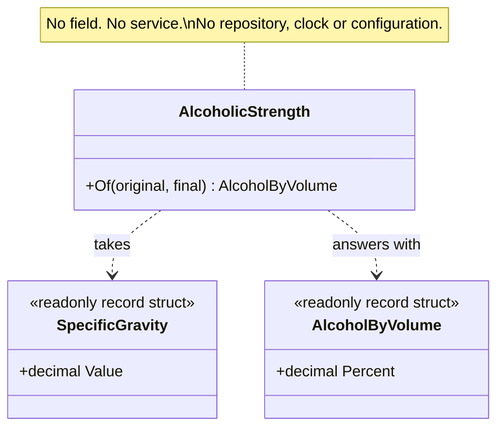

# Standalone Class

🌍 🇬🇧 English (this file) · 🇫🇷 [Français](StandaloneClass-fr.md)

## Intent

Standalone Class is a type that can be understood, tested and reasoned about entirely on its own, because
it depends on nothing beyond primitives and the values it is given.

## Problem

Brewing: the alcoholic strength of a batch, from the gravity readings taken before and after
fermentation. The arithmetic is fixed — it comes from the trade, not from this system — and it is quoted
in the duty return, on the label, and in the brewer's own quality log.

It is exactly the kind of thing that ends up as a private method on whichever class needed it first:

```csharp
public sealed class Batch {
    private readonly Recipe        _recipe;
    private readonly Vessel        _vessel;
    private readonly IDutySchedule _duty;

    private decimal AlcoholByVolume() => (_originalGravity - _finalGravity) * 131.25m;
}
```

The formula now lives inside a class that also knows about recipes, vessels and duty. Understanding it
means being sure none of those three is involved, which means reading them. The second caller cannot
reach it, so it is reimplemented — slightly differently.

The book states the cost as a general one: interdependencies make models and designs hard to understand,
hard to test and hard to maintain, and they pile up easily.

## Solution

The pattern removes the dependencies rather than organising them.

The concept becomes a type that declares nothing: no injected service, no repository, no clock, no
configuration. It takes what it needs as arguments and answers with a result.

What Evans asks for here is not *extract a helper*. It is a judgement about the cost of reading. Every
dependency a class declares is something a reader has to hold in mind before being sure they understand
it; a class depending on the batch, the recipe, the vessel and the duty schedule can only be understood by
someone who already knows all four. A class that depends on nothing can be read in one sitting, tested
with two numbers, and trusted afterwards.

The practical test is whether it could be moved to another codebase unchanged.

## Structure



The two types it touches are values it is handed and a value it returns. There is no third arrow, and the
absence is the pattern.

## The roles

| Role | Annotation | Applies to | What it carries |
|---|---|---|---|
| StandaloneClass | `[StandaloneClass]` | class, struct | A type declaring no dependency on another module, so that reading it requires holding nothing else in mind. |

One role. Unlike most of this catalogue the annotation is **not inherited**: a subclass is free to declare
dependencies its base did not, so the claim cannot be passed down.

## The example

From [`StandaloneClassUsage.cs`](../../../../DesignPatternCatalog.Usage/DomainDrivenDesign/StandaloneClassUsage.cs).

```csharp
[ValueObject]
public readonly record struct SpecificGravity {

    public SpecificGravity(decimal value) {
        if (value is < 0.980m or > 1.200m) { throw new ArgumentOutOfRangeException(nameof(value)); }

        Value = value;
    }

    public decimal Value { get; }

}

[ValueObject]
public readonly record struct AlcoholByVolume(decimal Percent);
```

The vocabulary, and the reason the standalone class can stay standalone. A gravity reading validated in
its own constructor means the class below does not need to know the plausible range of a hydrometer.

```csharp
[StandaloneClass]
public sealed class AlcoholicStrength {

    // The trade formula, in one place. Nothing above this line refers to anything outside the
    // file, which is what the annotation claims.
    [SideEffectFreeFunction]
    public AlcoholByVolume Of(SpecificGravity original, SpecificGravity final) {
        if (final.Value > original.Value) { throw new ArgumentException("Fermentation lowers gravity.", nameof(final)); }

        decimal percent = (original.Value - final.Value) * 131.25m;

        return new AlcoholByVolume(Math.Round(percent, 2));
    }

}
```

Gravities in, a strength out, and nothing else. Note what is absent: no injected service, no repository,
no clock, no configuration — and no field at all, which is the strongest form of the claim.

The class knows nothing about batches, recipes, vessels or duty. That is what lets the duty return, the
label and the quality log all use the same one, and it is why the formula stops being reimplemented.

The `131.25m` is a constant of the trade rather than a policy of this system, which is what makes it
legitimate here. A figure that a committee could change would be a dependency in disguise: the class would
be standalone in its signature and coupled in fact, and would need re-reading every time the figure moved.

The annotation is checkable in the same practical sense the pattern is: a rule can examine what the type's
fields and signatures refer to, and refuse anything outside the module.

## Applicability

**Use Standalone Class where low coupling can be taken all the way.** The book's instruction is to
eliminate all other concepts from the picture when it is possible to do so, leaving a class that can be
studied and understood alone.

**Use Standalone Class to ease the burden of understanding a module.** The book gives that as the payoff:
every self-contained class significantly reduces what a reader must hold in mind to understand the module
around it.

**Treat every dependency as suspect until it is proven basic to the concept.** The book puts it that
strongly, and it is the working form of the pattern — the question is asked of each dependency rather
than of the class as a whole.

## When not to use it

**Do not use it where the dependency is basic to the concept.** The book's own qualification: a class
whose subject genuinely involves another concept should say so. Removing a dependency that belongs
produces a type that takes twelve arguments, which is the same coupling with worse ergonomics.

**Do not expect it to be always possible.** The book says as much. Most types in a model legitimately
refer to others, and the pattern is offered for the ones that need not — not as a standard every class
fails to meet.

**Do not claim it for a class whose dependency is hidden in a constant.** A figure that policy can change
couples the class to whoever changes it. The trade constant above is safe for exactly the reason a
configurable rate would not be.

**Do not confuse it with extracting a helper.** A static utility class holding unrelated functions is not
this pattern: the point is a concept that stands alone, not a place to put loose methods.

## Advantages

* The class can be read in one sitting, with nothing else open.
* It can be tested with values alone — no fixture, no double, no container.
* It is reusable in fact rather than in principle: the duty return, the label and the quality log all use
  the one implementation.
* The module around it gets easier to understand, which is the book's stated reason for the pattern.
* The claim is checkable, since what a type's fields and signatures refer to can be examined
  mechanically.

## Drawbacks

* Not every concept can carry it, and forcing it produces long argument lists that move the coupling
  rather than removing it.
* A dependency can hide in a constant or a static call, so the claim needs more than a glance at the
  signature.
* The annotation is not inherited, so a hierarchy has to restate it — which is correct, and is one more
  thing to remember.

## Relations with other patterns

**`SideEffectFreeFunction`** is the same instinct applied to effects rather than to dependencies: both
reduce what a reader must know before trusting a call.

**`ClosureOfOperation`** removes a dependency from a signature; this pattern removes them from a whole
type.

**`ValueObject`** is frequently standalone by nature, and — as here — is what allows a standalone class to
take rich arguments without acquiring a dependency worth worrying about.

**`Aggregate`** limits the web of interdependencies at a larger scale, which the book names alongside this
pattern as the other way of doing the same thing.

**`Assertion`** is easier to state over a standalone class, since an invariant on a type that depends on
nothing is a sentence about that type alone.

## Source

*Domain-Driven Design: Tackling Complexity in the Heart of Software*, Eric Evans, Addison-Wesley, 2003 —
chapter 10, supple design.

* [Index entry](../../../generated/catalog-index.md#standaloneclass-domain-driven-design)
* [Generated attribute](../../../../DesignPatternCatalog.DomainDrivenDesign/StandaloneClass.cs)
* [Example](../../../../DesignPatternCatalog.Usage/DomainDrivenDesign/StandaloneClassUsage.cs)
