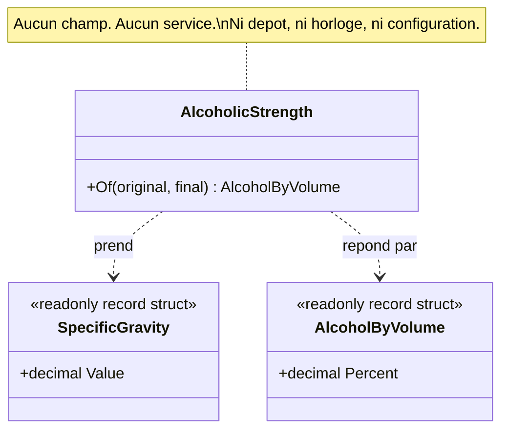

# Standalone Class

🌍 🇫🇷 Français (ce fichier) · 🇬🇧 [English](StandaloneClass-en.md)

## Intention

Standalone Class est un type qui se comprend, se teste et se raisonne entièrement seul, parce qu'il ne
dépend de rien au-delà des primitifs et des valeurs qu'on lui donne.

## Problème

Brasserie : le titre alcoométrique d'une cuvée, à partir des densités relevées avant et après
fermentation. L'arithmétique est fixée — elle vient du métier, non de ce système — et elle est citée dans
la déclaration de droits, sur l'étiquette, et dans le journal qualité du brasseur.

C'est exactement le genre de chose qui finit en méthode privée sur la classe qui en a eu besoin la
première :

```csharp
public sealed class Batch {
    private readonly Recipe        _recipe;
    private readonly Vessel        _vessel;
    private readonly IDutySchedule _duty;

    private decimal AlcoholByVolume() => (_originalGravity - _finalGravity) * 131.25m;
}
```

La formule vit désormais dans une classe qui connaît aussi les recettes, les cuves et les droits. La
comprendre suppose d'être sûr qu'aucun des trois n'intervient, ce qui suppose de les lire. Le second
appelant ne peut pas l'atteindre : elle est donc réimplémentée — un peu différemment.

Le livre énonce le coût en termes généraux : les interdépendances rendent les modèles et les conceptions
difficiles à comprendre, difficiles à tester et difficiles à maintenir, et elles s'accumulent facilement.

## Solution

Le patron retire les dépendances au lieu de les organiser.

Le concept devient un type qui ne déclare rien : pas de service injecté, pas de dépôt, pas d'horloge, pas
de configuration. Il prend en arguments ce dont il a besoin et répond par un résultat.

Ce qu'Evans demande ici n'est pas « extrais un utilitaire ». C'est un jugement sur le coût de la lecture.
Chaque dépendance qu'une classe déclare est quelque chose que le lecteur doit tenir en tête avant de
pouvoir être sûr de l'avoir comprise ; une classe qui dépend de la cuvée, de la recette, de la cuve et du
barème des droits ne peut être comprise que par quelqu'un qui connaît déjà les quatre. Une classe qui ne
dépend de rien se lit d'une traite, se teste avec deux nombres, et se croit ensuite.

Le test pratique est de savoir si elle pourrait être déplacée telle quelle dans une autre base de code.

## Structure



Les deux types qu'elle touche sont des valeurs qu'on lui remet et une valeur qu'elle rend. Il n'y a pas de
troisième flèche, et c'est cette absence qui est le patron.

## Les rôles

| Rôle | Annotation | S'applique à | Ce qu'il porte |
|---|---|---|---|
| StandaloneClass | `[StandaloneClass]` | classe, struct | Un type ne déclarant aucune dépendance vers un autre module, de sorte que le lire ne demande de tenir rien d'autre en tête. |

Un seul rôle. Contrairement à la plupart de ce catalogue, l'annotation **n'est pas héritée** : une
sous-classe est libre de déclarer des dépendances que sa base n'avait pas, donc la revendication ne peut
pas se transmettre.

## L'exemple

Extrait de [`StandaloneClassUsage.cs`](../../../../DesignPatternCatalog.Usage/DomainDrivenDesign/StandaloneClassUsage.cs).

```csharp
[ValueObject]
public readonly record struct SpecificGravity {

    public SpecificGravity(decimal value) {
        if (value is < 0.980m or > 1.200m) { throw new ArgumentOutOfRangeException(nameof(value)); }

        Value = value;
    }

    public decimal Value { get; }

}

[ValueObject]
public readonly record struct AlcoholByVolume(decimal Percent);
```

Le vocabulaire, et la raison pour laquelle la classe autonome peut le rester. Une densité validée dans son
propre constructeur fait que la classe ci-dessous n'a pas besoin de connaître la plage plausible d'un
densimètre.

```csharp
[StandaloneClass]
public sealed class AlcoholicStrength {

    // The trade formula, in one place. Nothing above this line refers to anything outside the
    // file, which is what the annotation claims.
    [SideEffectFreeFunction]
    public AlcoholByVolume Of(SpecificGravity original, SpecificGravity final) {
        if (final.Value > original.Value) { throw new ArgumentException("Fermentation lowers gravity.", nameof(final)); }

        decimal percent = (original.Value - final.Value) * 131.25m;

        return new AlcoholByVolume(Math.Round(percent, 2));
    }

}
```

Des densités en entrée, un titre en sortie, et rien d'autre. Remarquer ce qui est absent : pas de service
injecté, pas de dépôt, pas d'horloge, pas de configuration — et aucun champ du tout, qui est la forme la
plus forte de la revendication.

La classe ne sait rien des cuvées, des recettes, des cuves ni des droits. C'est ce qui permet à la
déclaration de droits, à l'étiquette et au journal qualité d'employer la même, et c'est pourquoi la
formule cesse d'être réimplémentée.

Le `131.25m` est une constante du métier et non une politique de ce système, et c'est ce qui le rend
légitime ici. Un chiffre qu'un comité pourrait changer serait une dépendance déguisée : la classe serait
autonome dans sa signature et couplée en fait, et demanderait d'être relue à chaque déplacement du
chiffre.

L'annotation est contrôlable au même sens pratique que le patron : une règle peut examiner ce à quoi les
champs et les signatures du type se réfèrent, et refuser tout ce qui est hors du module.

## Possibilités d'application

**Utilisez Standalone Class là où le faible couplage peut être poussé jusqu'au bout.** L'instruction du
livre est d'éliminer tous les autres concepts du tableau lorsque c'est possible, ce qui laisse une classe
qui peut être étudiée et comprise seule.

**Utilisez Standalone Class pour alléger la charge de compréhension d'un module.** Le livre en fait le
gain : chaque classe autosuffisante réduit significativement ce qu'un lecteur doit tenir en tête pour
comprendre le module qui l'entoure.

**Tenez chaque dépendance pour suspecte jusqu'à preuve qu'elle est essentielle au concept.** Le livre le
formule aussi fermement, et c'est la forme opératoire du patron — la question est posée à chaque
dépendance plutôt qu'à la classe dans son ensemble.

## Quand ne pas l'utiliser

**Ne l'employez pas là où la dépendance est essentielle au concept.** C'est la réserve du livre lui-même :
une classe dont le sujet met vraiment en jeu un autre concept doit le dire. Retirer une dépendance qui a
sa place produit un type à douze arguments, soit le même couplage avec une ergonomie pire.

**N'attendez pas que ce soit toujours possible.** Le livre le dit. La plupart des types d'un modèle se
réfèrent légitimement à d'autres, et le patron est proposé pour ceux qui n'en ont pas besoin — non comme
une norme à laquelle toutes les classes échoueraient.

**Ne le revendiquez pas pour une classe dont la dépendance est cachée dans une constante.** Un chiffre que
la politique peut changer couple la classe à qui le change. La constante du métier ci-dessus est sûre pour
exactement la raison qu'un taux configurable ne le serait pas.

**Ne le confondez pas avec l'extraction d'un utilitaire.** Une classe statique fourre-tout n'est pas ce
patron : il s'agit d'un concept qui tient debout seul, non d'un endroit où ranger des méthodes en vrac.

## Avantages

* La classe se lit d'une traite, sans rien d'autre d'ouvert.
* Elle se teste avec des valeurs seules — aucun montage, aucun double, aucun conteneur.
* Elle est réutilisable en fait et non en principe : la déclaration de droits, l'étiquette et le journal
  qualité emploient tous l'unique implémentation.
* Le module qui l'entoure devient plus facile à comprendre, ce qui est la raison que le livre donne au
  patron.
* La revendication est contrôlable, puisque ce à quoi les champs et les signatures d'un type se réfèrent
  peut être examiné mécaniquement.

## Inconvénients

* Tous les concepts ne peuvent pas la porter, et forcer produit de longues listes d'arguments qui
  déplacent le couplage au lieu de le retirer.
* Une dépendance peut se cacher dans une constante ou un appel statique, si bien que la revendication
  demande plus qu'un coup d'œil à la signature.
* L'annotation n'est pas héritée, donc une hiérarchie doit la répéter — ce qui est correct, et fait une
  chose de plus à ne pas oublier.

## Liens avec les autres patrons

**`SideEffectFreeFunction`** est le même instinct appliqué aux effets plutôt qu'aux dépendances : les deux
réduisent ce qu'un lecteur doit savoir avant de se fier à un appel.

**`ClosureOfOperation`** retire une dépendance d'une signature ; ce patron les retire d'un type entier.

**`ValueObject`** est fréquemment autonome par nature et — comme ici — c'est ce qui permet à une classe
autonome de prendre des arguments riches sans acquérir une dépendance dont il faille se soucier.

**`Aggregate`** limite la toile des interdépendances à plus grande échelle, ce que le livre nomme à côté de
ce patron comme l'autre façon de faire la même chose.

**`Assertion`** s'énonce plus facilement sur une classe autonome, puisqu'un invariant sur un type qui ne
dépend de rien est une phrase sur ce type seul.

## Source

*Domain-Driven Design: Tackling Complexity in the Heart of Software*, Eric Evans, Addison-Wesley, 2003 —
chapitre 10, la conception souple.

* [Entrée d'index](../../../generated/catalog-index.md#standaloneclass-domain-driven-design)
* [Attribut généré](../../../../DesignPatternCatalog.DomainDrivenDesign/StandaloneClass.cs)
* [Exemple](../../../../DesignPatternCatalog.Usage/DomainDrivenDesign/StandaloneClassUsage.cs)
