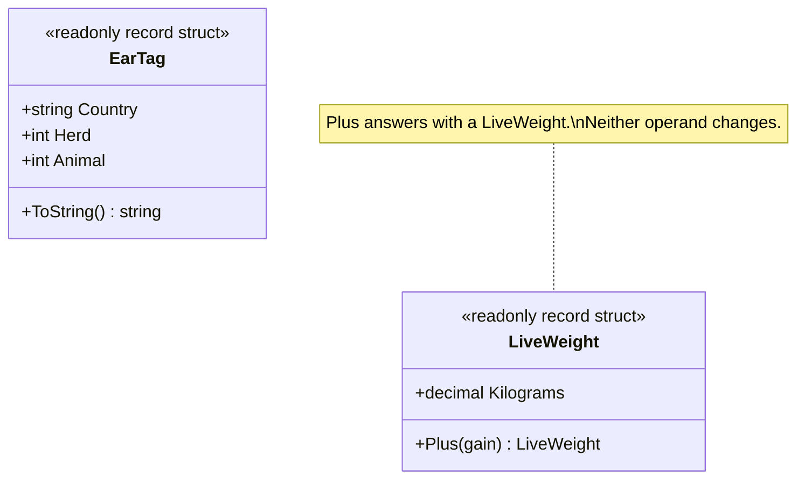

# Value Object

🌍 🇬🇧 English (this file) · 🇫🇷 [Français](ValueObject-fr.md)

## Intent

Value Object is a building block of a model-driven design for an object described only by its values. It
carries no identity, it is treated as immutable, and it exists because it says something about the
domain.

## Problem

Cattle traceability: an ear tag identifies an animal, and a weighing records what it weighed.

Written as plain fields on the animal, both concepts vanish into their parts:

```csharp
public sealed class Animal {
    public string  TagCountry { get; set; }
    public int     TagHerd    { get; set; }
    public int     TagAnimal  { get; set; }
    public decimal LastWeight { get; set; }
}
```

Nothing here knows that a country code is two letters, that a herd number is positive, or that those
three fields are one thing that must travel together. The validation has to be repeated wherever an
animal is built, and `LastWeight` can be assigned a negative number by any caller in the system.

Giving each of them an identity instead is worse, not better: two ear tags carrying the same country,
herd and animal number are not two tags, they are the same tag written twice.

## Solution

The pattern names the value and makes the type carry what is true of it.

The concept becomes a type of its own, validated once in its constructor, because a value object is
never half valid — there is no later moment at which it could be repaired. It has no identity, since
nothing about one instance is more real than another. And it is immutable, so an operation on it answers
with another value rather than changing this one.

Immutability here is not a coding preference. It is the model refusing a sentence that makes no sense:
correcting the number on an ear tag does not correct anything, it silently makes an animal into a
different animal. What one does instead is record a new tag.

## Structure



Two unrelated classes, drawn together because they make the same point. A value object has no
collaborator by construction — that is what distinguishes it.

## The roles

| Role | Annotation | Applies to | What it carries |
|---|---|---|---|
| ValueObject | `[ValueObject]` | class, struct | An immutable object of the domain, without identity, defined only by its values. |

One role, so nothing to choose. The annotation is inherited.

## The example

From [`ValueObjectUsage.cs`](../../../../DesignPatternCatalog.Usage/DomainDrivenDesign/ValueObjectUsage.cs).

```csharp
[ValueObject]
public readonly record struct EarTag {

    public EarTag(string country, int herd, int animal) {
        if (country.Length != 2) { throw new ArgumentException("An ISO country code is two letters.", nameof(country)); }
        if (herd    <= 0) { throw new ArgumentOutOfRangeException(nameof(herd)); }
        if (animal  <= 0) { throw new ArgumentOutOfRangeException(nameof(animal)); }

        Country = country;
        Herd    = herd;
        Animal  = animal;
    }
```

`readonly record struct` gives the three properties of the pattern in one declaration: `readonly` makes
it immutable, `record` gives equality by value, and `struct` says the thing is small and copied. Any of
the three can be argued with — a class works equally well — but the declaration is where the decision
shows.

The validation sits in the constructor and nowhere else. That is a consequence of immutability rather
than a separate rule: since no state can change afterwards, the constructor is the only moment at which
the object could be wrong.

```csharp
    public string Country { get; }
    public int    Herd    { get; }
    public int    Animal  { get; }

    public override string ToString() => $"{Country} {Herd:D8} {Animal:D5}";

}
```

The formatting belongs here, on the value that knows what its parts mean. Left outside, the same
`{0} {1:D8} {2:D5}` would be copied into every screen and every export that prints a tag.

```csharp
[ValueObject]
public readonly record struct LiveWeight {

    public LiveWeight(decimal kilograms) {
        if (kilograms <= 0) { throw new ArgumentOutOfRangeException(nameof(kilograms)); }

        Kilograms = kilograms;
    }

    public decimal Kilograms { get; }

    public LiveWeight Plus(LiveWeight gain) => new(Kilograms + gain.Kilograms);

}
```

`Plus` returns a new `LiveWeight` and changes neither operand. The gain between two weighings is itself a
value, not a modification of either — which is the shape every operation on a value object takes.

The sample also marks where Evans parts company with Fowler, and the difference is worth knowing when
both packages are installed. The *Patterns of Enterprise Application Architecture* value object asks only
that equality not be based on identity, and tolerates a mutable one; the Domain-Driven Design value
object adds the immutability that makes it a modelling decision. `EnterpriseApplicationArchitecture`'s
own sample is deliberately mutable, and would fail this reading.

## Applicability

**Use Value Object when only the attributes of an element of the model matter**, and the domain never
needs to distinguish two instances that carry the same ones.

**Use Value Object to express the meaning of the attributes it conveys**, giving it the functionality
related to them rather than leaving that functionality spread across its callers.

**Use Value Object to avoid the design complexity that entities require.** The book states this as a
positive reason rather than a fallback: identity has to be tracked, and a value object is the way to not
pay for it.

## When not to use it

**Do not use Value Object where the domain needs to point at a particular one.** If two instances with
equal attributes are nonetheless two things — two wagons, two invoices, two people — the model needs an
entity, and value semantics would silently merge them.

**Do not treat a shared value object as mutable.** The book is unconditional here: if a value object is
shared, it must be immutable. A shared mutable value changes for holders that never asked for it.

**Do not read immutability as absolute.** The book names narrow cases in which a mutable value object is
allowed: the value changes frequently, creating and deleting it is expensive, replacing it rather than
modifying it would disturb clustering, and there is little sharing. This guide's attribute takes the
immutable reading, and a design that needs one of those exceptions is choosing something the book
permits but the annotation does not describe.

**Do not use Value Object as a synonym for "small class with no logic".** A value object exists because
it says something about the domain, not merely because comparing it by value is convenient. A bag of
three fields that the domain has no word for is a data holder, and calling it a value object hides that
nobody has yet found the concept.

## Advantages

* The concept becomes speakable: an ear tag is a thing the model has a word for, rather than three
  fields that must be kept next to each other.
* Validity is settled once, in the constructor, and cannot be undone afterwards.
* Instances can be shared, passed and copied freely, because nothing can be broken by a holder.
* Reasoning is local: no caller can be surprised by a value changing underneath it.
* The design complexity that identity requires is simply not paid.

## Drawbacks

* Replacing rather than modifying allocates, and in a hot loop over many small values that cost is real —
  the case for which the book allows mutability.
* An operation that would naturally modify has to be rewritten as one that answers, which reads
  differently from the surrounding code.
* The line with an entity is a modelling judgement, not a rule, and it is answered by the domain rather
  than by the type.

## Relations with other patterns

**`Entity`** is the other half of the same decision: whether the domain distinguishes two instances that
carry equal attributes.

**`Aggregate`** commonly has value objects as its members, since a participant with no identity of its
own cannot be referenced from outside the boundary in the first place.

**`SideEffectFreeFunction`** is what the operations of a value object naturally are, and the book treats
the two as reinforcing each other.

**`ClosureOfOperation`** describes the shape `Plus` has here: an operation on a type answering with the
same type, which value objects support especially well.

## Source

*Domain-Driven Design: Tackling Complexity in the Heart of Software*, Eric Evans, Addison-Wesley, 2003 —
chapter 5, the building blocks of a model-driven design.

* [Index entry](../../../generated/catalog-index.md#valueobject-domain-driven-design)
* [Generated attribute](../../../../DesignPatternCatalog.DomainDrivenDesign/ValueObject.cs)
* [Example](../../../../DesignPatternCatalog.Usage/DomainDrivenDesign/ValueObjectUsage.cs)
