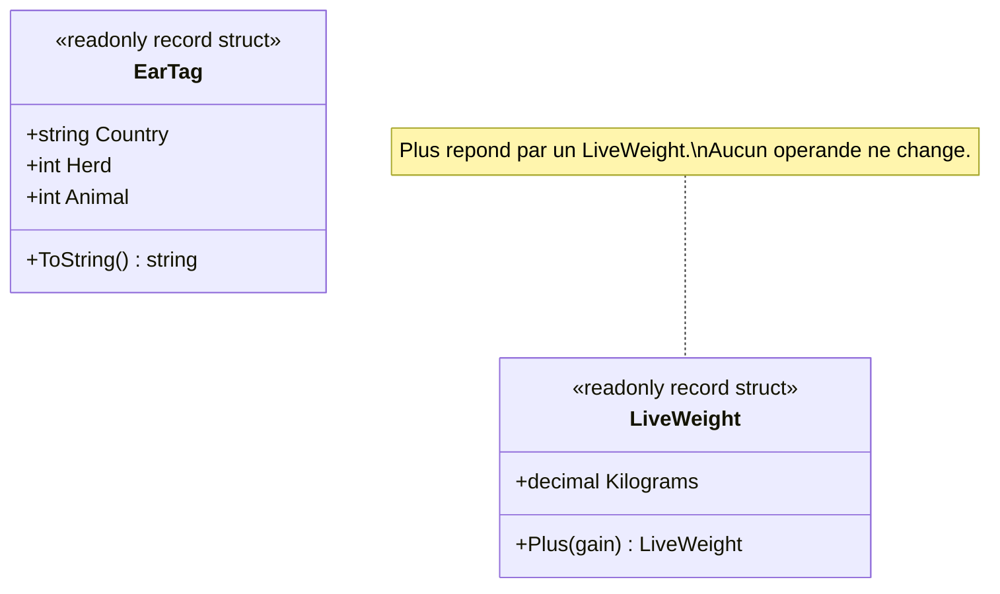

# Value Object

🌍 🇫🇷 Français (ce fichier) · 🇬🇧 [English](ValueObject-en.md)

## Intention

Value Object est une brique de la conception pilotée par le modèle, pour un objet décrit uniquement par
ses valeurs. Il ne porte pas d'identité, il est traité comme immuable, et il existe parce qu'il dit
quelque chose du domaine.

## Problème

Traçabilité bovine : une boucle d'identification désigne un animal, et une pesée enregistre son poids.

Écrits en champs ordinaires sur l'animal, les deux concepts se dissolvent dans leurs parties :

```csharp
public sealed class Animal {
    public string  TagCountry { get; set; }
    public int     TagHerd    { get; set; }
    public int     TagAnimal  { get; set; }
    public decimal LastWeight { get; set; }
}
```

Rien ici ne sait qu'un code pays fait deux lettres, qu'un numéro de cheptel est positif, ni que ces trois
champs forment une seule chose qui doit voyager ensemble. La validation doit être répétée partout où un
animal est construit, et `LastWeight` peut recevoir un nombre négatif de n'importe quel appelant.

Leur donner une identité à la place est pire, non meilleur : deux boucles portant les mêmes pays,
cheptel et numéro d'animal ne sont pas deux boucles, c'est la même boucle écrite deux fois.

## Solution

Le patron nomme la valeur et fait porter au type ce qui est vrai d'elle.

Le concept devient un type à part entière, validé une fois dans son constructeur, parce qu'un
objet-valeur n'est jamais à moitié valide — il n'existe pas de moment ultérieur où il pourrait être
réparé. Il n'a pas d'identité, puisque rien d'un exemplaire n'est plus réel que d'un autre. Et il est
immuable : une opération sur lui répond par une autre valeur au lieu de le modifier.

L'immuabilité n'est pas ici une préférence de codage. C'est le modèle qui refuse une phrase dépourvue de
sens : « corriger » le numéro d'une boucle ne corrige rien, cela transforme silencieusement un animal en
un autre animal. Ce qu'on fait à la place, c'est enregistrer une nouvelle boucle.

## Structure



Deux classes sans rapport, dessinées ensemble parce qu'elles font la même démonstration. Un objet-valeur
n'a par construction aucun collaborateur — c'est ce qui le distingue.

## Les rôles

| Rôle | Annotation | S'applique à | Ce qu'il porte |
|---|---|---|---|
| ValueObject | `[ValueObject]` | classe, struct | Un objet immuable du domaine, sans identité, défini uniquement par ses valeurs. |

Un seul rôle, donc rien à choisir. L'annotation est héritée.

## L'exemple

Extrait de [`ValueObjectUsage.cs`](../../../../DesignPatternCatalog.Usage/DomainDrivenDesign/ValueObjectUsage.cs).

```csharp
[ValueObject]
public readonly record struct EarTag {

    public EarTag(string country, int herd, int animal) {
        if (country.Length != 2) { throw new ArgumentException("An ISO country code is two letters.", nameof(country)); }
        if (herd    <= 0) { throw new ArgumentOutOfRangeException(nameof(herd)); }
        if (animal  <= 0) { throw new ArgumentOutOfRangeException(nameof(animal)); }

        Country = country;
        Herd    = herd;
        Animal  = animal;
    }
```

`readonly record struct` donne les trois propriétés du patron en une déclaration : `readonly` le rend
immuable, `record` donne l'égalité par valeur, `struct` dit que la chose est petite et copiée. Chacun des
trois peut se discuter — une classe conviendrait aussi bien — mais c'est dans la déclaration que la
décision se voit.

La validation est dans le constructeur et nulle part ailleurs. C'est une conséquence de l'immuabilité
plutôt qu'une règle distincte : puisque aucun état ne peut changer ensuite, le constructeur est le seul
instant où l'objet pourrait être faux.

```csharp
    public string Country { get; }
    public int    Herd    { get; }
    public int    Animal  { get; }

    public override string ToString() => $"{Country} {Herd:D8} {Animal:D5}";

}
```

Le formatage a sa place ici, sur la valeur qui sait ce que ses parties veulent dire. Laissé dehors, le
même `{0} {1:D8} {2:D5}` serait recopié dans chaque écran et chaque export qui imprime une boucle.

```csharp
[ValueObject]
public readonly record struct LiveWeight {

    public LiveWeight(decimal kilograms) {
        if (kilograms <= 0) { throw new ArgumentOutOfRangeException(nameof(kilograms)); }

        Kilograms = kilograms;
    }

    public decimal Kilograms { get; }

    public LiveWeight Plus(LiveWeight gain) => new(Kilograms + gain.Kilograms);

}
```

`Plus` rend un nouveau `LiveWeight` et ne modifie aucun des deux opérandes. Le gain entre deux pesées est
lui-même une valeur, non une modification de l'une ou de l'autre — c'est la forme que prend toute
opération sur un objet-valeur.

L'exemple marque aussi l'endroit où Evans se sépare de Fowler, et la différence vaut d'être connue quand
les deux paquets sont installés. L'objet-valeur de *Patterns of Enterprise Application Architecture*
demande seulement que l'égalité ne repose pas sur l'identité, et en tolère un mutable ; celui de
Domain-Driven Design y ajoute l'immuabilité, qui en fait une décision de modélisation. L'exemple propre
à `EnterpriseApplicationArchitecture` est délibérément mutable, et échouerait à cette lecture.

## Possibilités d'application

**Utilisez Value Object lorsque seuls les attributs d'un élément du modèle importent**, et que le domaine
n'a jamais besoin de distinguer deux exemplaires qui portent les mêmes.

**Utilisez Value Object pour exprimer le sens des attributs qu'il transporte**, en lui donnant les
fonctionnalités qui s'y rapportent plutôt que de les laisser dispersées chez ses appelants.

**Utilisez Value Object pour éviter la complexité de conception qu'exigent les entités.** Le livre pose
cela comme une raison positive et non comme un repli : l'identité doit être suivie, et l'objet-valeur est
le moyen de ne pas la payer.

## Quand ne pas l'utiliser

**N'utilisez pas Value Object là où le domaine a besoin de désigner un exemplaire.** Si deux exemplaires
aux attributs égaux sont malgré tout deux choses — deux wagons, deux factures, deux personnes — le modèle
demande une entité, et la sémantique de valeur les fondrait silencieusement en une.

**Ne rendez pas mutable un objet-valeur partagé.** Le livre est ici sans condition : un objet-valeur
partagé doit être immuable. Une valeur mutable partagée change pour des détenteurs qui n'ont rien
demandé.

**Ne lisez pas l'immuabilité comme absolue.** Le livre nomme des cas étroits où un objet-valeur mutable
est admis : la valeur change fréquemment, la créer et la détruire coûte cher, la remplacer plutôt que la
modifier perturberait le regroupement en mémoire, et le partage est faible. L'attribut de ce guide retient
la lecture immuable, et une conception qui a besoin d'une de ces exceptions choisit quelque chose que le
livre permet mais que l'annotation ne décrit pas.

**N'utilisez pas Value Object comme synonyme de « petite classe sans logique ».** Un objet-valeur existe
parce qu'il dit quelque chose du domaine, non simplement parce que le comparer par valeur est commode. Un
sac de trois champs pour lequel le domaine n'a pas de mot est un porteur de données, et l'appeler
objet-valeur masque que personne n'a encore trouvé le concept.

## Avantages

* Le concept devient énonçable : une boucle d'identification est une chose que le modèle sait nommer,
  plutôt que trois champs qu'il faut garder côte à côte.
* La validité est réglée une fois, dans le constructeur, et ne peut plus être défaite ensuite.
* Les exemplaires se partagent, se passent et se copient librement, puisque aucun détenteur ne peut rien
  casser.
* Le raisonnement est local : aucun appelant ne peut être surpris par une valeur qui change sous lui.
* La complexité de conception qu'exige l'identité n'est tout simplement pas payée.

## Inconvénients

* Remplacer au lieu de modifier alloue, et dans une boucle chaude sur beaucoup de petites valeurs ce coût
  est réel — c'est le cas pour lequel le livre admet la mutabilité.
* Une opération qui modifierait naturellement doit être réécrite en une opération qui répond, ce qui se lit
  autrement que le code alentour.
* La frontière avec l'entité est un jugement de modélisation et non une règle ; c'est le domaine qui y
  répond, pas le type.

## Liens avec les autres patrons

**`Entity`** est l'autre moitié de la même décision : le domaine distingue-t-il deux exemplaires portant
des attributs égaux.

**`Aggregate`** a couramment des objets-valeurs pour membres, puisqu'un participant sans identité propre
ne peut de toute façon pas être référencé depuis l'extérieur de la frontière.

**`SideEffectFreeFunction`** est ce que sont naturellement les opérations d'un objet-valeur, et le livre
traite les deux comme se renforçant l'un l'autre.

**`ClosureOfOperation`** décrit la forme qu'a ici `Plus` : une opération sur un type qui répond par le
même type, ce que les objets-valeurs soutiennent particulièrement bien.

## Source

*Domain-Driven Design: Tackling Complexity in the Heart of Software*, Eric Evans, Addison-Wesley, 2003 —
chapitre 5, les briques de la conception pilotée par le modèle.

* [Entrée d'index](../../../generated/catalog-index.md#valueobject-domain-driven-design)
* [Attribut généré](../../../../DesignPatternCatalog.DomainDrivenDesign/ValueObject.cs)
* [Exemple](../../../../DesignPatternCatalog.Usage/DomainDrivenDesign/ValueObjectUsage.cs)
