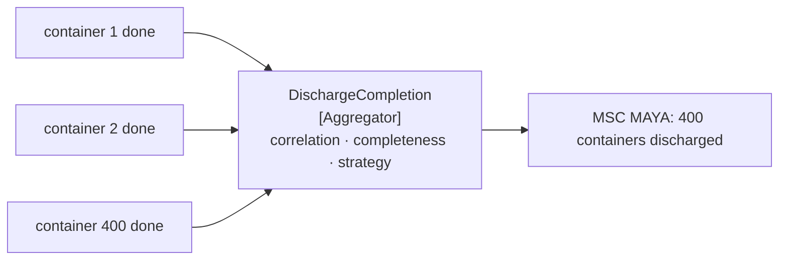

# Aggregator

🌍 🇬🇧 English (this file) · 🇫🇷 [Français](Aggregator-fr.md)

## Intent

Aggregator collects related messages and emits one message when the set is complete, so that a result assembled
from many parts can be treated as a whole.

## Problem

Four hundred containers were [split apart](Splitter-en.md), moved, and each announced its own completion.

The shipping line wants one message: the discharge is finished. It does not want four hundred, and it cannot
compute the answer itself — it would have to know how many containers were on the list, watch for all of them,
and decide when to stop waiting, which is the terminal's knowledge rather than the line's.

Nothing in the pipeline can do it either. Every step so far has been stateless by design: a router decides per
message, a filter tests per message, a translator converts per message. Assembling four hundred into one requires
remembering the first three hundred and ninety-nine, and none of them remembers anything.

## Solution

The pattern is the participant that holds state.

An aggregator collects messages until they belong together, then emits one. **Being stateful is what distinguishes
it from every other router** — and what it costs: it must survive a restart or lose a half-finished set.

Three questions have to be answered, and the pattern names them separately on purpose:

* **What belongs together** — the correlation.
* **When it is finished** — the completeness condition.
* **What to emit** — the aggregation strategy.

Conflating them is how an aggregator becomes unreadable, which is why they are three roles rather than one method
that does all three.

## Structure



Many in, one out, and the box in the middle is the only one in this chapter that remembers anything.

## The roles

| Role | Annotation | Applies to | What it carries |
|---|---|---|---|
| Aggregator | `[Aggregator.Aggregator]` | interface, class | The stateful participant that holds messages until they belong together. |
| Correlation | `[Aggregator.Correlation]` | property, method | What decides that two messages belong to the same set. |
| CompletenessCondition | `[Aggregator.CompletenessCondition]` | property, method | What decides that a set is finished. |
| AggregationStrategy | `[Aggregator.AggregationStrategy]` | property, method | How the collected messages become one. |

Four roles, and the three besides the aggregator itself exist to keep three different decisions apart. That
separation is the pattern's main advice, and annotating them is what makes it visible in a class that would
otherwise be one blob of state and conditions.

## The example

From [`AggregatorUsage.cs`](../../../../DesignPatternCatalog.Usage/EnterpriseIntegration/AggregatorUsage.cs).

The correlation:

```csharp
[Aggregator.Correlation]
public string CorrelationOf(string vesselCall, string containerNumber) => vesselCall;
```

It returns the vessel call and ignores the container. That is the point: the correlation says which set, not which
element. The sample's remark names what goes wrong when it is wrong: *getting it wrong merges two unrelated
discharges, and nothing else in the pattern would notice* — which is the worst kind of defect, because the
aggregator will happily emit a complete-looking answer for a set that was never one set.

The completeness condition:

```csharp
[Aggregator.CompletenessCondition]
public bool IsComplete(string vesselCall) =>
    _expected.TryGetValue(vesselCall, out int expected)
 && _pending.TryGetValue(vesselCall, out List<string>? seen)
 && seen.Count >= expected;
```

A count, and the sample is candid that a count alone is not enough in production: *a condition that never holds is
a set that never emits and a leak nobody sees. A count here, and in a real terminal a timeout beside it.* Naming
the missing timeout rather than implementing it is the sample declining to pretend the hard part is easy.

The aggregation strategy, held apart:

```csharp
[Aggregator.AggregationStrategy]
public string Aggregate(string vesselCall) =>
    $"{vesselCall}: {_pending[vesselCall].Count} containers discharged";
```

*When to emit* and *what to emit* are different questions, and separating them means the strategy can change — a
count today, a manifest tomorrow — without touching the condition that decides the set is done.

## Applicability

**Use an aggregator to reassemble what a splitter took apart.** The pair is the commonest use, and the two are
usually designed together.

**Use it where a receiver wants one answer rather than many.** The shipping line's *the discharge is finished* is
one message, however many moves produced it.

**Use it to collect replies from several parties.** A [scatter-gather](ScatterGather-en.md) is a broadcast plus
this.

**Answer the three questions separately.** The pattern's own advice, and the reason it has three roles besides
itself.

**Give the completeness condition a timeout as well as a count.** A set that never completes is a leak that nobody
is alerted to.

## When not to use it

**Do not use it where each message is independently useful.** If the line wants to know about each container as it
lands, aggregating delays every one of them to produce a summary nobody asked for.

**Do not use it without deciding what happens to an incomplete set.** This is the pattern's hard edge: a
discharge that loses one completion message occupies the aggregator for ever, and nothing downstream notices
because the missing output looks like work still in progress.

**Do not correlate on something that is not unique.** Two vessels sharing a correlation value are merged, and the
result is a plausible answer about a set that never existed.

**Do not put the strategy inside the condition.** A method that decides both when and what is a method nobody can
change safely, which is exactly what the three roles exist to prevent.

**Do not forget it is stateful.** An aggregator that restarts with an empty store has silently abandoned every set
in flight — the one failure mode no other router in this chapter has.

**Do not use it where ordering is what is wanted.** Putting messages back in order is
[Resequencer](Resequencer-en.md), which releases them one by one rather than combining them.

## Advantages

* Many messages become the one answer a receiver actually wants.
* It restores the whole a [splitter](Splitter-en.md) took apart, so the pair is composable.
* The three decisions are separate, so each can change without disturbing the others.
* Correlation, completeness and strategy are each testable alone.
* It works for replies from several parties as well as for parts of one message.

## Drawbacks

* It is stateful, so it must survive restarts or lose everything in flight.
* A completeness condition that never holds is a leak with no symptom.
* A wrong correlation merges unrelated sets and produces a confident wrong answer.
* It buffers, so it adds latency proportional to the slowest element.
* Its memory grows with the number of open sets, which nothing in the pattern bounds.

## Relations with other patterns

**`Splitter`** is the counterpart, and the two are usually designed as a pair.

**`ComposedMessageProcessor`** is a splitter, a router and one of these assembled into one addressable step.

**`ScatterGather`** is a broadcast plus an aggregator, and it inherits the completeness problem in its hardest
form — parties that may never answer at all.

**`MessageSequence`**'s size property is what a completeness condition usually reads, and its sequence identifier
is what the correlation usually is.

**`CorrelationIdentifier`** is the same idea for a conversation of two rather than a set of many.

**`Resequencer`** is the other stateful router: this one combines, that one delays and releases unchanged.

## Source

*Enterprise Integration Patterns*, Gregor Hohpe and Bobby Woolf, Addison-Wesley, 2003 — the message-routing
chapter.

* [Index entry](../../../generated/catalog-index.md#aggregator-enterprise-integration-patterns)
* [Generated attribute](../../../../DesignPatternCatalog.EnterpriseIntegration/Aggregator.cs)
* [Example](../../../../DesignPatternCatalog.Usage/EnterpriseIntegration/AggregatorUsage.cs)
