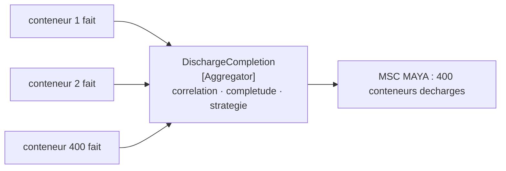

# Aggregator

🌍 🇫🇷 Français (ce fichier) · 🇬🇧 [English](Aggregator-en.md)

## Intention

Aggregator rassemble des messages apparentés et en émet un seul quand l'ensemble est complet, de sorte qu'un
résultat assemblé à partir de nombreuses parties puisse être traité comme un tout.

## Problème

Quatre cents conteneurs ont été [divisés](Splitter-fr.md), déplacés, et chacun a annoncé son propre achèvement.

L'armateur veut un message : le déchargement est fini. Il n'en veut pas quatre cents, et il ne peut pas calculer la
réponse lui-même — il lui faudrait savoir combien de conteneurs figuraient sur la liste, les guetter tous, et
décider quand cesser d'attendre, ce qui est la connaissance du terminal plutôt que la sienne.

Rien dans le pipeline ne le peut non plus. Chaque étape jusqu'ici est sans état par conception : un routeur décide
par message, un filtre teste par message, un traducteur convertit par message. Assembler quatre cents en un exige
de se souvenir des trois cent quatre-vingt-dix-neuf premiers, et aucun d'eux ne se souvient de rien.

## Solution

Le patron est le participant qui détient un état.

Un agrégateur rassemble des messages jusqu'à ce qu'ils aillent ensemble, puis en émet un. **Être doté d'un état est
ce qui le distingue de tout autre routeur** — et ce qu'il en coûte : il doit survivre à un redémarrage ou perdre un
ensemble à demi terminé.

Trois questions doivent être répondues, et le patron les nomme séparément exprès :

* **Ce qui va ensemble** — la corrélation.
* **Quand c'est fini** — la condition de complétude.
* **Ce qu'il faut émettre** — la stratégie d'agrégation.

Les confondre est la façon dont un agrégateur devient illisible, ce qui est pourquoi ce sont trois rôles plutôt
qu'une méthode qui fait les trois.

## Structure



Plusieurs en entrée, un en sortie, et la boîte du milieu est la seule de ce chapitre qui se souvienne de quoi que
ce soit.

## Les rôles

| Rôle | Annotation | S'applique à | Ce qu'il porte |
|---|---|---|---|
| Aggregator | `[Aggregator.Aggregator]` | interface, classe | Le participant doté d'un état qui retient les messages jusqu'à ce qu'ils aillent ensemble. |
| Correlation | `[Aggregator.Correlation]` | propriété, méthode | Ce qui décide que deux messages appartiennent au même ensemble. |
| CompletenessCondition | `[Aggregator.CompletenessCondition]` | propriété, méthode | Ce qui décide qu'un ensemble est terminé. |
| AggregationStrategy | `[Aggregator.AggregationStrategy]` | propriété, méthode | Comment les messages rassemblés en deviennent un. |

Quatre rôles, et les trois autres que l'agrégateur lui-même existent pour tenir à part trois décisions différentes.
Cette séparation est le conseil principal du patron, et les annoter est ce qui la rend visible dans une classe qui
serait autrement un seul bloc d'état et de conditions.

## L'exemple

Extrait de [`AggregatorUsage.cs`](../../../../DesignPatternCatalog.Usage/EnterpriseIntegration/AggregatorUsage.cs).

La corrélation :

```csharp
[Aggregator.Correlation]
public string CorrelationOf(string vesselCall, string containerNumber) => vesselCall;
```

Elle rend l'escale et ignore le conteneur. C'est le propos : la corrélation dit quel ensemble, non quel élément. La
remarque de l'exemple nomme ce qui tourne mal quand elle est fausse : *se tromper fusionne deux déchargements sans
rapport, et rien d'autre dans le patron ne le remarquerait* — ce qui est le pire genre de défaut, parce que
l'agrégateur émettra volontiers une réponse d'apparence complète pour un ensemble qui n'en fut jamais un.

La condition de complétude :

```csharp
[Aggregator.CompletenessCondition]
public bool IsComplete(string vesselCall) =>
    _expected.TryGetValue(vesselCall, out int expected)
 && _pending.TryGetValue(vesselCall, out List<string>? seen)
 && seen.Count >= expected;
```

Un compte, et l'exemple est franc sur le fait qu'un compte seul ne suffit pas en production : *une condition qui ne
tient jamais est un ensemble qui n'émet jamais et une fuite que personne ne voit. Un compte ici, et dans un vrai
terminal un délai d'attente à côté.* Nommer le délai manquant plutôt que de l'implémenter, c'est l'exemple qui
refuse de faire croire que la part difficile est facile.

La stratégie d'agrégation, tenue à part :

```csharp
[Aggregator.AggregationStrategy]
public string Aggregate(string vesselCall) =>
    $"{vesselCall}: {_pending[vesselCall].Count} containers discharged";
```

*Quand émettre* et *quoi émettre* sont deux questions différentes, et les séparer permet à la stratégie de changer —
un compte aujourd'hui, un manifeste demain — sans toucher à la condition qui décide que l'ensemble est terminé.

## Possibilités d'application

**Employez un agrégateur pour réassembler ce qu'un diviseur a défait.** La paire est l'usage le plus courant, et les
deux se conçoivent d'ordinaire ensemble.

**Employez-le là où un receveur veut une réponse plutôt que plusieurs.** Le *le déchargement est fini* de l'armateur
est un message, quel que soit le nombre de mouvements qui l'ont produit.

**Employez-le pour rassembler les réponses de plusieurs parties.** Un [scatter-gather](ScatterGather-fr.md) est une
diffusion plus ceci.

**Répondez aux trois questions séparément.** Le conseil propre du patron, et la raison de ses trois rôles outre
lui-même.

**Donnez à la condition de complétude un délai d'attente autant qu'un compte.** Un ensemble qui ne s'achève jamais
est une fuite dont personne n'est alerté.

## Quand ne pas l'utiliser

**Ne l'employez pas là où chaque message est utile indépendamment.** Si l'armateur veut être informé de chaque
conteneur à mesure qu'il atterrit, agréger les retarde tous pour produire un résumé que personne n'a demandé.

**Ne l'employez pas sans décider ce qu'il advient d'un ensemble incomplet.** C'est l'arête dure du patron : un
déchargement qui perd un message d'achèvement occupe l'agrégateur indéfiniment, et rien en aval ne le remarque parce
que la sortie manquante ressemble à un travail encore en cours.

**Ne corrélez pas sur quelque chose qui n'est pas unique.** Deux navires qui partagent une valeur de corrélation sont
fusionnés, et le résultat est une réponse plausible au sujet d'un ensemble qui n'a jamais existé.

**Ne mettez pas la stratégie dans la condition.** Une méthode qui décide à la fois quand et quoi est une méthode que
personne ne peut changer sereinement, ce qui est exactement ce que les trois rôles existent pour empêcher.

**N'oubliez pas qu'il est doté d'un état.** Un agrégateur qui redémarre avec un stockage vide a abandonné en silence
chaque ensemble en vol — le seul mode de défaillance qu'aucun autre routeur de ce chapitre n'a.

**Ne l'employez pas là où c'est l'ordre qui est voulu.** Remettre des messages dans l'ordre est
[Resequencer](Resequencer-fr.md), qui les relâche un à un plutôt que de les combiner.

## Avantages

* Plusieurs messages deviennent l'unique réponse qu'un receveur veut réellement.
* Il rétablit le tout qu'un [diviseur](Splitter-fr.md) a défait : la paire est composable.
* Les trois décisions sont séparées : chacune peut changer sans déranger les autres.
* Corrélation, complétude et stratégie sont testables chacune seule.
* Il vaut pour les réponses de plusieurs parties autant que pour les parties d'un message.

## Inconvénients

* Il est doté d'un état : il doit survivre aux redémarrages ou perdre tout ce qui est en vol.
* Une condition de complétude qui ne tient jamais est une fuite sans symptôme.
* Une corrélation fausse fusionne des ensembles sans rapport et produit une réponse fausse et assurée.
* Il tamponne : il ajoute une latence proportionnelle à l'élément le plus lent.
* Sa mémoire croît avec le nombre d'ensembles ouverts, que rien dans le patron ne borne.

## Liens avec les autres patrons

**`Splitter`** est le pendant, et les deux se conçoivent d'ordinaire en paire.

**`ComposedMessageProcessor`** est un diviseur, un routeur et l'un de ceux-ci assemblés en une étape adressable.

**`ScatterGather`** est une diffusion plus un agrégateur, et il hérite du problème de complétude sous sa forme la
plus dure — des parties qui peuvent ne jamais répondre du tout.

**La propriété d'étendue de `MessageSequence`** est ce qu'une condition de complétude lit d'ordinaire, et son
identifiant de séquence est d'ordinaire ce qu'est la corrélation.

**`CorrelationIdentifier`** est la même idée pour une conversation à deux plutôt que pour un ensemble de plusieurs.

**`Resequencer`** est l'autre routeur doté d'un état : celui-ci combine, celui-là retarde et relâche inchangé.

## Source

*Enterprise Integration Patterns*, Gregor Hohpe et Bobby Woolf, Addison-Wesley, 2003 — le chapitre sur le routage
des messages.

* [Entrée d'index](../../../generated/catalog-index.md#aggregator-enterprise-integration-patterns)
* [Attribut généré](../../../../DesignPatternCatalog.EnterpriseIntegration/Aggregator.cs)
* [Exemple](../../../../DesignPatternCatalog.Usage/EnterpriseIntegration/AggregatorUsage.cs)
