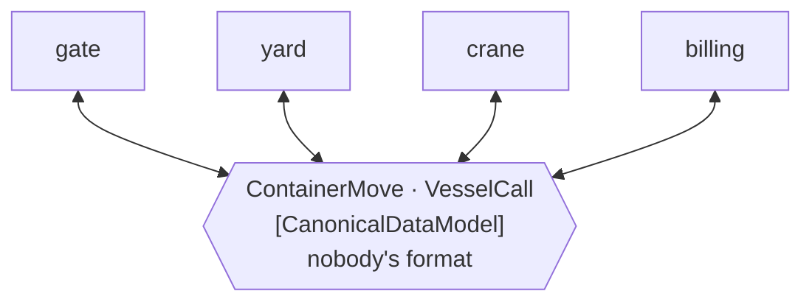

# Canonical Data Model

🌍 🇬🇧 English (this file) · 🇫🇷 [Français](CanonicalDataModel-fr.md)

## Intent

Canonical Data Model is a message format belonging to no application, which every application translates to and
from, so that adding one application costs one translation rather than one per correspondent.

## Problem

Six systems around the terminal: gate, yard, crane, billing, customs and the vessel interface.

Letting each translate to each of the others is thirty directed translations. A seventh system makes it
forty-two, and the seventh's team has to write six translators and persuade six other teams to write six more.

The arithmetic is quadratic, and it is worse than a broker's version of the same problem, because a translator is
not plumbing — each one encodes a judgement about what the gate means by *position* and what the crane means by
it, and thirty such judgements cannot be kept consistent by anybody.

## Solution

The pattern is a format that belongs to none of them.

Each system translates to it and from it. The seventh costs two translators instead of twelve, and the count
grows with the systems rather than with their pairs.

**Annotating it is what makes the indirection countable** — and the annotation earns its place mainly by what it
lets a reviewer notice: *a type that has quietly acquired one application's vocabulary is how the saving is lost,
one field at a time.*

## Structure



Every system has two arrows and none has an arrow to another system. Twelve translations where thirty would have
been.

## The roles

| Role | Annotation | Applies to | What it carries |
|---|---|---|---|
| CanonicalDataModel | `[CanonicalDataModel]` | interface, class, struct, assembly | The format that is nobody's. |

One role, and it is one of only two in this catalogue that may be applied to an **assembly** — the other is
[Message Bus](MessageBus-en.md). The sample explains why: *the canonical model is its own assembly, and
`[assembly: CanonicalDataModel]` says so once rather than on every record in it*, which is the usual shape once
the model is more than a handful of types.

## The example

From [`CanonicalDataModelUsage.cs`](../../../../DesignPatternCatalog.Usage/EnterpriseIntegration/CanonicalDataModelUsage.cs).

```csharp
[CanonicalDataModel]
public sealed record ContainerMove(string ContainerNumber,
                                   string FromPosition,
                                   string ToPosition,
                                   DateTimeOffset At);
```

`FromPosition` and `ToPosition` are the whole design in two field names. The yard calls it a slot, the crane calls
it a bay-row-tier, the gate calls it a lane — and the canonical model calls it a position, which is **nobody's
word**. A field named `Slot` would have made the yard the standard and the other five its clients, which is
exactly the failure the annotation is there to make visible.

The type is a `record`: immutable, with value equality, and no behaviour. A canonical model that grows methods has
started to be an application in its own right, and the one thing it must not become is a seventh system everybody
depends on.

A second type, to show the model is a set rather than a class:

```csharp
[CanonicalDataModel]
public sealed record VesselCall(string CallSign, DateTimeOffset Arrival, DateTimeOffset Departure);
```

And the sample's closing comment names the assembly form, which is what a real model of forty types would use
instead of forty attributes.

The remark states the benefit and the failure mode together: *annotating it is what makes the indirection
countable — and a type that has quietly acquired the gate's vocabulary is how the saving is lost, one field at a
time.*

## Applicability

**Use a canonical data model where the number of applications makes pairwise translation untenable.** The book's
arithmetic is the argument: six systems, thirty translations, twelve through a middle.

**Use it where the applications genuinely share concepts.** They must all mean roughly the same thing by a
container move for one format to serve them.

**Give it nobody's vocabulary.** A field named after one application's word has already begun the drift.

**Annotate the assembly once the model is large.** Forty attributes on forty records say the same thing forty
times.

**Keep it data.** No behaviour, no dependencies, no validation beyond shape — a canonical model with logic is a
system.

## When not to use it

**Do not use it for three applications.** Three systems are six translations, and a middle format costs six as
well while adding a shared artefact everybody must agree on.

**Do not let it become one application's model.** This is the characteristic failure, and it happens gradually:
one convenient field name, then another, and the model is the gate's with extra steps.

**Do not use it where the applications mean different things.** A shared format constrains words, not meanings —
two systems can fill the same record correctly and still disagree about what a move is. That is
[Bounded Context](../domain-driven-design/BoundedContext-en.md)'s subject, and the honest answer there is a
[translation layer per boundary](../domain-driven-design/AnticorruptionLayer-en.md) rather than one model for all.

**Do not let it grow to cover everything.** A canonical model that models the whole business is a schema with six
owners and no maintainer, and changing it needs everybody's agreement at once.

**Do not put behaviour in it.** It is a format, and a format with methods is an application that has crept into
the middle.

**Do not assume it removes translation.** Every system still writes two translators; what changes is that it
writes two rather than twelve.

## Advantages

* The translation count grows with the applications rather than with their pairs.
* A new system's team writes two translators and asks nobody else for anything.
* The shared vocabulary is written down in types rather than agreed informally.
* Each application's own model stays its own — nobody has to adopt anybody else's.
* Annotating it makes the indirection countable, and its drift reviewable.

## Drawbacks

* It is a shared artefact, and changing it needs the agreement of everybody using it.
* A format that suits every application suits none precisely, which is the standing cost of the middle.
* It drifts toward one application's vocabulary unless somebody watches, and the drift is gradual.
* Two translations per message instead of one, which is latency and two places to be wrong.
* It constrains words rather than meanings, so agreement can be apparent rather than real.

## Relations with other patterns

**`MessageTranslator`** is what every application writes two of, and its page states the arithmetic this answers:
*n* formats are *n*(*n*−1) pairwise translations.

**`Normalizer`** is what a canonical model is usually reached through — recognise the sender's format, translate
into the middle — and the two are normally adopted together.

**`MessageBus`**'s agreed command set is the same idea for commands rather than for data, and it is the other role
in this catalogue that may annotate an assembly.

**`BoundedContext`**, in the Domain-Driven Design catalogue, is the argument for not pushing one shared model too
far, and **`AnticorruptionLayer`** is what to do at a boundary where the models genuinely disagree.

**`ContentEnricher`** is often where a message becomes canonical, since enrichment is where a sender's sparse
vocabulary meets everybody else's.

## Source

*Enterprise Integration Patterns*, Gregor Hohpe and Bobby Woolf, Addison-Wesley, 2003 — the message-transformation
chapter.

* [Index entry](../../../generated/catalog-index.md#canonicaldatamodel-enterprise-integration-patterns)
* [Generated attribute](../../../../DesignPatternCatalog.EnterpriseIntegration/CanonicalDataModel.cs)
* [Example](../../../../DesignPatternCatalog.Usage/EnterpriseIntegration/CanonicalDataModelUsage.cs)
