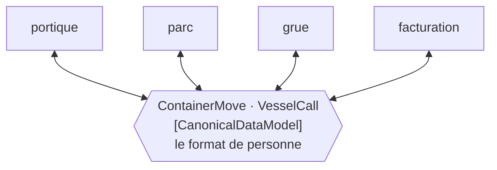

# Canonical Data Model

🌍 🇫🇷 Français (ce fichier) · 🇬🇧 [English](CanonicalDataModel-en.md)

## Intention

Canonical Data Model est un format de message n'appartenant à aucune application, vers lequel et depuis lequel
chaque application traduit, de sorte qu'ajouter une application coûte une traduction plutôt qu'une par
correspondant.

## Problème

Six systèmes autour du terminal : portique, parc, grue, facturation, douane et interface navire.

Laisser chacun traduire vers chacun des autres fait trente traductions orientées. Un septième système les porte à
quarante-deux, et l'équipe du septième doit écrire six traducteurs et convaincre six autres équipes d'en écrire six
de plus.

L'arithmétique est quadratique, et elle est pire que la version du même problème chez un pivot, parce qu'un
traducteur n'est pas de la plomberie — chacun encode un jugement sur ce que le portique entend par *position* et ce
que la grue entend par là, et trente jugements de ce genre ne peuvent être tenus cohérents par personne.

## Solution

Le patron est un format qui n'appartient à aucun d'eux.

Chaque système traduit vers lui et depuis lui. Le septième coûte deux traducteurs au lieu de douze, et le compte
croît avec les systèmes plutôt qu'avec leurs paires.

**L'annoter est ce qui rend l'indirection dénombrable** — et l'annotation gagne surtout sa place par ce qu'elle
permet à un relecteur de remarquer : *un type qui a discrètement acquis le vocabulaire d'une application est la
façon dont l'économie se perd, un champ à la fois.*

## Structure



Chaque système a deux flèches et aucun n'a de flèche vers un autre système. Douze traductions là où il y en aurait
eu trente.

## Les rôles

| Rôle | Annotation | S'applique à | Ce qu'il porte |
|---|---|---|---|
| CanonicalDataModel | `[CanonicalDataModel]` | interface, classe, structure, assemblage | Le format qui n'est celui de personne. |

Un seul rôle, et c'est l'un des deux seuls de ce catalogue qui puisse s'appliquer à un **assemblage** — l'autre est
[Message Bus](MessageBus-fr.md). L'exemple explique pourquoi : *le modèle canonique est son propre assemblage, et
`[assembly: CanonicalDataModel]` le dit une fois plutôt que sur chaque enregistrement qu'il contient*, ce qui est la
forme habituelle dès que le modèle dépasse une poignée de types.

## L'exemple

Extrait de [`CanonicalDataModelUsage.cs`](../../../../DesignPatternCatalog.Usage/EnterpriseIntegration/CanonicalDataModelUsage.cs).

```csharp
[CanonicalDataModel]
public sealed record ContainerMove(string ContainerNumber,
                                   string FromPosition,
                                   string ToPosition,
                                   DateTimeOffset At);
```

`FromPosition` et `ToPosition` sont toute la conception en deux noms de champs. Le parc appelle cela un
emplacement, la grue une travée-rangée-étage, le portique une voie — et le modèle canonique l'appelle une position,
qui est **le mot de personne**. Un champ nommé `Slot` aurait fait du parc la norme et des cinq autres ses clients,
ce qui est exactement la panne que l'annotation est là pour rendre visible.

Le type est un `record` : immuable, à égalité par valeur, et sans comportement. Un modèle canonique qui gagne des
méthodes a commencé à être une application à part entière, et la seule chose qu'il ne doit pas devenir est un
septième système dont tout le monde dépend.

Un second type, pour montrer que le modèle est un ensemble plutôt qu'une classe :

```csharp
[CanonicalDataModel]
public sealed record VesselCall(string CallSign, DateTimeOffset Arrival, DateTimeOffset Departure);
```

Et le commentaire de clôture de l'exemple nomme la forme par assemblage, qui est ce qu'emploierait un vrai modèle de
quarante types au lieu de quarante attributs.

La remarque énonce ensemble le bénéfice et le mode de défaillance : *l'annoter est ce qui rend l'indirection
dénombrable — et un type qui a discrètement acquis le vocabulaire du portique est la façon dont l'économie se perd,
un champ à la fois.*

## Possibilités d'application

**Employez un modèle canonique là où le nombre d'applications rend la traduction deux à deux intenable.**
L'arithmétique du livre est l'argument : six systèmes, trente traductions, douze par un milieu.

**Employez-le là où les applications partagent réellement des concepts.** Elles doivent toutes entendre à peu près la
même chose par un mouvement de conteneur pour qu'un format les serve.

**Donnez-lui le vocabulaire de personne.** Un champ nommé d'après le mot d'une application a déjà commencé la dérive.

**Annotez l'assemblage dès que le modèle est grand.** Quarante attributs sur quarante enregistrements disent quarante
fois la même chose.

**Gardez-le donnée.** Aucun comportement, aucune dépendance, aucune validation au-delà de la forme — un modèle
canonique doté de logique est un système.

## Quand ne pas l'utiliser

**Ne l'employez pas pour trois applications.** Trois systèmes font six traductions, et un format intermédiaire en
coûte six aussi tout en ajoutant un artefact partagé sur lequel tout le monde doit s'accorder.

**Ne le laissez pas devenir le modèle d'une application.** C'est la panne caractéristique, et elle arrive
progressivement : un nom de champ commode, puis un autre, et le modèle est celui du portique avec des étapes en plus.

**Ne l'employez pas là où les applications entendent des choses différentes.** Un format partagé contraint les mots,
non les sens — deux systèmes peuvent remplir correctement le même enregistrement et continuer de ne pas s'accorder
sur ce qu'est un mouvement. C'est le sujet de [Bounded Context](../domain-driven-design/BoundedContext-fr.md), et la
réponse honnête là-bas est une
[couche de traduction par frontière](../domain-driven-design/AnticorruptionLayer-fr.md) plutôt qu'un modèle pour
tous.

**Ne le laissez pas grandir jusqu'à tout couvrir.** Un modèle canonique qui modélise tout le métier est un schéma à
six propriétaires et sans mainteneur, et le changer demande l'accord de tous à la fois.

**N'y mettez pas de comportement.** C'est un format, et un format doté de méthodes est une application qui s'est
glissée au milieu.

**Ne supposez pas qu'il supprime la traduction.** Chaque système écrit toujours deux traducteurs ; ce qui change,
c'est qu'il en écrit deux plutôt que douze.

## Avantages

* Le compte des traductions croît avec les applications plutôt qu'avec leurs paires.
* L'équipe d'un nouveau système écrit deux traducteurs et ne demande rien à personne.
* Le vocabulaire partagé est écrit en types plutôt que convenu informellement.
* Le modèle propre de chaque application reste le sien — personne n'a à adopter celui d'un autre.
* L'annoter rend l'indirection dénombrable, et sa dérive relisible.

## Inconvénients

* C'est un artefact partagé, et le changer demande l'accord de tous ceux qui l'emploient.
* Un format qui convient à chaque application ne convient précisément à aucune, ce qui est le coût permanent du
  milieu.
* Il dérive vers le vocabulaire d'une application à moins que quelqu'un ne veille, et la dérive est graduelle.
* Deux traductions par message au lieu d'une, ce qui fait de la latence et deux endroits où se tromper.
* Il contraint les mots plutôt que les sens : l'accord peut être apparent plutôt que réel.

## Liens avec les autres patrons

**`MessageTranslator`** est ce dont chaque application écrit deux exemplaires, et sa page énonce l'arithmétique à
laquelle celui-ci répond : *n* formats font *n*(*n*−1) traductions deux à deux.

**`Normalizer`** est d'ordinaire ce par quoi on atteint un modèle canonique — reconnaître le format de l'émetteur,
traduire vers le milieu — et les deux s'adoptent normalement ensemble.

**Le jeu de commandes convenu de `MessageBus`** est la même idée pour les commandes plutôt que pour les données, et
c'est l'autre rôle de ce catalogue qui puisse annoter un assemblage.

**`BoundedContext`**, dans le catalogue Domain-Driven Design, est l'argument pour ne pas pousser trop loin un modèle
partagé, et **`AnticorruptionLayer`** est ce qu'il faut faire à une frontière où les modèles ne s'accordent
réellement pas.

**`ContentEnricher`** est souvent l'endroit où un message devient canonique, puisque l'enrichissement est là où le
vocabulaire maigre d'un émetteur rencontre celui de tous les autres.

## Source

*Enterprise Integration Patterns*, Gregor Hohpe et Bobby Woolf, Addison-Wesley, 2003 — le chapitre sur la
transformation des messages.

* [Entrée d'index](../../../generated/catalog-index.md#canonicaldatamodel-enterprise-integration-patterns)
* [Attribut généré](../../../../DesignPatternCatalog.EnterpriseIntegration/CanonicalDataModel.cs)
* [Exemple](../../../../DesignPatternCatalog.Usage/EnterpriseIntegration/CanonicalDataModelUsage.cs)
