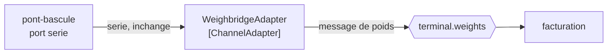

# Channel Adapter

🌍 🇫🇷 Français (ce fichier) · 🇬🇧 [English](ChannelAdapter-en.md)

## Intention

Channel Adapter relie une application au système de messagerie depuis l'extérieur d'elle-même, de sorte qu'une
application qui ne connaît rien à la messagerie puisse tout de même y prendre part.

## Problème

Le pont-bascule est un système de vingt ans doté d'un port série et d'aucune notion de message.

Chaque camion le franchit et chaque poids compte, donc l'intégration du terminal a besoin de ces relevés. La
réponse évidente — ajouter un émetteur au pont-bascule — n'est pas disponible : le fournisseur a disparu, il n'est
pas certain que les sources existent, et la certification que porte la bascule ne vaut pas d'être réouverte pour
ajouter un message.

L'application ne peut pas être changée. L'intégration doit tout de même avoir lieu.

## Solution

Le patron tend le bras depuis l'extérieur.

Un adaptateur de canal parle l'interface propre de l'application d'un côté — un port série, une table de base de
données, un dépôt de fichiers, une API propriétaire — et un canal de l'autre. Il convertit entre les deux, et il vit
hors de l'application, si bien que l'application n'est pas modifiée et ne sait pas qu'elle est intégrée.

Le livre présente cela comme souvent la seule option qui existe, et c'est le cadrage honnête : un adaptateur de
canal n'est pas l'agencement que quiconque concevrait à partir de rien, c'est l'agencement disponible quand un
côté ne peut pas changer.

## Structure



La flèche entrante de l'adaptateur est l'interface propre de l'application, et la flèche sortante est un canal. La
boîte du pont-bascule ne contient aucune messagerie, ce qui est tout l'agencement.

## Les rôles

| Rôle | Annotation | S'applique à | Ce qu'il porte |
|---|---|---|---|
| ChannelAdapter | `[ChannelAdapter]` | interface, classe | Le participant qui lit ou écrit l'interface propre d'une application d'un côté et un canal de l'autre. |

Un seul rôle, et il marque le participant du côté *messagerie* de la frontière. L'application qu'il adapte ne porte
aucune annotation, parce qu'elle ne porte aucun code de nous — cette asymétrie est le patron.

## L'exemple

Extrait de [`ChannelAdapterUsage.cs`](../../../../DesignPatternCatalog.Usage/EnterpriseIntegration/ChannelAdapterUsage.cs).

```csharp
[ChannelAdapter]
public sealed class WeighbridgeAdapter {

    public void Poll() {
        // ... reads the serial port, publishes a weight message
    }

}
```

La méthode est `Poll`, et ce mot est le coût du patron énoncé en signature. Un pont-bascule sans notion de message
ne peut rien annoncer, donc l'adaptateur doit aller demander — ce qui veut dire un ordonnancement, un intervalle, et
une fenêtre pendant laquelle un relevé existe et n'a pas encore été publié.

Le commentaire nomme les deux côtés en une ligne : *lit le port série, publie un message de poids.* Ce sont les deux
faces de l'adaptateur, et il n'y a rien d'autre dans la classe.

C'est une classe plutôt qu'une interface, et c'est le bon sens ici. Il n'y a pas de couture à échanger : cet
adaptateur est lié à l'interface réelle d'un système réel, et prétendre le contraire suggérerait que le protocole
série est remplaçable.

L'exemple énonce la raison d'être du patron plutôt que seulement ce qu'il fait : *c'est ce qui permet à un système
de prendre part à une intégration sans être modifié, ce qui est souvent la seule option qui existe.*

## Possibilités d'application

**Employez un adaptateur de canal là où l'application ne peut pas être changée.** Un système de fournisseur, un
appareil certifié, un ordinateur central, tout ce dont les sources sont indisponibles ou dont la modification ne
vaut pas son coût.

**Employez-le là où l'application est antérieure à la messagerie.** Le cas du livre : un système bâti sans notion de
canal peut tout de même être intégré, depuis l'extérieur.

**Employez-le dans les deux sens.** Lire les données de l'application vers un canal, et prendre des messages sur un
canal vers l'interface propre de l'application, sont l'un et l'autre ce patron.

**Gardez-le hors de l'application.** Que l'adaptateur soit séparé est ce qui laisse l'application non modifiée, ce
qui est tout le propos plutôt qu'un détail d'implémentation.

## Quand ne pas l'utiliser

**Ne l'employez pas là où l'application peut simplement recevoir un point de terminaison.** Si les sources sont
disponibles et modifiables, [Message Endpoint](MessageEndpoint-fr.md) est l'agencement honnête : l'application dit
ce qu'elle envoie, plutôt que de se faire lire ses données par-dessous.

**Ne le laissez pas lire l'état privé de l'application comme si c'était une interface.** Un adaptateur qui
sélectionne directement dans les tables d'une autre application est couplé à ce schéma, et un schéma que personne
n'a promis est un schéma qui change sans préavis. Ce couplage est celui de
[Shared Database](SharedDatabase-fr.md), acquis sans l'avoir choisi.

**N'y mettez pas de règles métier.** Un adaptateur qui décide quels poids sont facturables a mis une décision de
domaine hors du domaine, dans une classe dont le sujet est un port série.

**Ne prenez pas l'interrogation périodique pour gratuite.** Un adaptateur qui interroge introduit de la latence, de
la charge et un problème de suppression des doublons — savoir quels relevés il a déjà publiés — et rien de tout cela
n'existe dans l'application qu'il adapte.

**Ne l'employez pas pour relier deux systèmes de messagerie.** C'est [Messaging Bridge](MessagingBridge-fr.md) :
les deux côtés y sont des canaux, et aucun n'est l'interface propre d'une application.

## Avantages

* Une application qui ne peut pas être changée peut tout de même prendre part à l'intégration.
* Le changement est entièrement du côté messagerie : l'application adaptée n'en porte aucun risque.
* Il fonctionne dans les deux sens avec la même forme.
* Le couplage à une interface d'un autre âge est concentré dans une classe nommée, ce qui est là où il peut être
  relu.

## Inconvénients

* C'est d'ordinaire une interrogation périodique, avec la latence, la charge et le problème de détection des
  doublons qui vont avec.
* Il est couplé à une interface que personne n'a promis de maintenir, et une trame série ou une table peut changer
  sans avertissement.
* Il connaît les bizarreries du système d'un autre âge : sa correction est difficile à argumenter et difficile à
  tester.
* Aller chercher les données d'une autre application peut revenir à une base partagée sans l'accord qu'elle
  implique.
* L'application adaptée ne peut pas signaler un problème, parce qu'elle ne sait pas qu'elle fait partie d'une
  intégration.

## Liens avec les autres patrons

**`MessageEndpoint`** est l'agencement que celui-ci remplace quand l'application ne peut pas être modifiée — un
point de terminaison est dans l'application, un adaptateur est dehors.

**`MessagingBridge`** est la même forme entre deux systèmes de messagerie plutôt qu'entre une application et un
système.

**`MessagingGateway`** est la forme de point de terminaison qui cache la messagerie au code applicatif, ce qui est
le sens inverse du masquage : là, l'application est épargnée de la messagerie ; ici, elle est épargnée de tout.

**`SharedDatabase`** est ce que devient un adaptateur de canal quand il lit directement les tables d'une autre
application, et cela vaut d'être nommé parce que cela arrive par accident.

**`Messaging`** est le style que celui-ci permet à un système sans messagerie de rejoindre, ce qui est pourquoi le
livre le range parmi les canaux plutôt que parmi les points de terminaison.

## Source

*Enterprise Integration Patterns*, Gregor Hohpe et Bobby Woolf, Addison-Wesley, 2003 — le chapitre sur les canaux
de messagerie.

* [Entrée d'index](../../../generated/catalog-index.md#channeladapter-enterprise-integration-patterns)
* [Attribut généré](../../../../DesignPatternCatalog.EnterpriseIntegration/ChannelAdapter.cs)
* [Exemple](../../../../DesignPatternCatalog.Usage/EnterpriseIntegration/ChannelAdapterUsage.cs)
