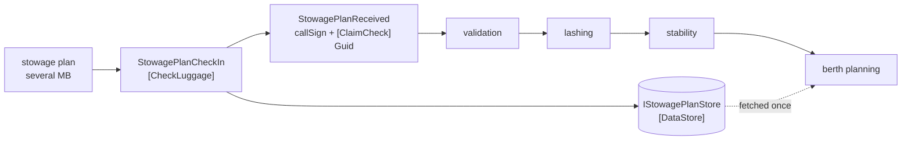

# Claim Check

🌍 🇬🇧 English (this file) · 🇫🇷 [Français](ClaimCheck-fr.md)

## Intent

Claim Check stores a message's bulk in a persistent store and puts a key on the message in its place, so that the
data travels once and the steps in between carry only a reference.

## Problem

A stowage plan for a 14,000-TEU vessel is several megabytes of bay, row and tier.

It passes through validation, lashing checks, stability and berth planning, and **only the last of those opens
it**. The other three read the vessel's call sign and pass the plan along untouched.

So several megabytes are serialised, queued, transported, stored in a broker and deserialised four times to be
read once. Every queue in the chain is sized for it, every log that captures a message captures it, and a broker
outage is measured in gigabytes rather than in messages.

## Solution

The pattern stores the plan once and puts a reference on the message.

The four steps carry a `Guid` instead of a plan, and the plan is fetched by the one step that needs it. What
travels is a key; what waits in the store is the data.

The cost is named rather than glossed: **what was one message is now a message and a stored record whose lifetime
nothing on the message states.** Somebody has to decide when it is safe to delete, and nothing in the pattern
decides it for them.

## Structure



The plan takes the short path into the store; the message takes the long path carrying a key. Only the last box
touches both.

## The roles

| Role | Annotation | Applies to | What it carries |
|---|---|---|---|
| CheckLuggage | `[ClaimCheck.CheckLuggage]` | interface, class | The participant that generates the key, stores the data under it, and replaces the data on the message with the key. |
| ClaimCheck | `[ClaimCheck.ClaimCheck]` | property, field | The key left on the message in place of what was removed. |
| DataStore | `[ClaimCheck.DataStore]` | interface, class | Where the data waits. |

Three roles, and the first is deliberately **three things in one step**: issue the key, store the data under it,
take the data off the message. They belong together — a key issued without a store entry, or an entry made
without the data being removed, is the pattern half applied and worse than not applying it.

The `DataStore` is named because it is the pattern's cost. A role for the store is a role for the thing somebody
must operate, size and eventually clean out.

## The example

From [`ClaimCheckUsage.cs`](../../../../DesignPatternCatalog.Usage/EnterpriseIntegration/ClaimCheckUsage.cs).

The store, with the smallest interface that will do:

```csharp
[ClaimCheck.DataStore]
public interface IStowagePlanStore {

    void Put(Guid reference, string planXml);

    string Get(Guid reference);

}
```

`Put` and `Get`, and no `Delete`. That absence is the sample being honest rather than incomplete: deletion is a
policy decision the pattern does not make, and an interface with a `Delete` on it would suggest somebody has
decided when to call it. Nobody has.

The message, carrying the key:

```csharp
[ClaimCheck.ClaimCheck]
public Guid PlanReference { get; }
```

The remark states the constraint, and it is the same one a
[correlation identifier](CorrelationIdentifier-en.md) carries: *it must stay valid for as long as any step might
still ask, which is longer than the step that issued it takes.* A store swept after an hour and a pipeline that
occasionally takes ninety minutes is a berth planner reading a key that no longer resolves.

`VesselCallSign` stays on the message beside the key. That is deliberate: a message reduced to nothing but a
reference is unreadable in a log and unroutable without a fetch, so the fields the intermediate steps actually use
stay where they are.

The check-in, doing all three things:

```csharp
public StowagePlanReceived CheckIn(string vesselCallSign, string planXml) {
    Guid reference = Guid.NewGuid();
    _store.Put(reference, planXml);

    return new StowagePlanReceived(vesselCallSign, reference);
}
```

Three lines, three responsibilities, in the order they must happen: mint, store, then hand back a message that no
longer carries the plan. The plan is not on the returned object at all — removal is by construction rather than
by discipline.

## Applicability

**Use a claim check where a large message passes through steps that do not open it.** The book's case, and the
saving is proportional to the hops that no longer carry the bulk.

**Use it where the data is needed later, not never.** If nobody needs it, a [content filter](ContentFilter-en.md)
is simpler and leaves nothing to clean up.

**Keep the key valid longer than the pipeline's worst case.** The constraint is the same as a correlation
identifier's and is underestimated the same way.

**Leave the fields the intermediate steps use on the message.** A message that is only a key is a message nobody
can read.

## When not to use it

**Do not use it for a small message.** A store, a key and a lifetime problem to save a few kilobytes is machinery
that costs more than it saves.

**Do not use it where every step opens the data.** If all four read the plan, the store adds four fetches to four
hops.

**Do not apply half of it.** A key with no store entry, or an entry with the data still on the message, is worse
than not applying the pattern — the first fails at the far end, the second pays both costs.

**Do not leave the lifetime undecided.** This is the pattern's characteristic failure: the store grows for ever,
or it is swept and a slow message finds its key resolving to nothing. Neither is visible until it happens.

**Do not use it to move data past a boundary that should have stopped it.** A key is not a permission, and a
receiver that can call `Get` can read what a [content filter](ContentFilter-en.md) would have removed.

**Do not forget the store is a second thing that can be down.** The message arriving means nothing if the plan
cannot be fetched, and the failure surfaces at the last step rather than the first.

## Advantages

* The bulk is transported and stored once instead of at every hop.
* Queues, logs and brokers are sized for keys rather than for megabytes.
* Steps that do not need the data are unaffected by how large it is.
* The data is still available, unlike anything a content filter removed.
* Removal is by construction: the check-in returns a message that cannot carry the plan.

## Drawbacks

* A stored record whose lifetime nothing on the message states, and somebody must decide when to delete.
* The store is a second dependency, and its unavailability surfaces at the last step.
* A key outliving its data fails far from where it was issued.
* Two things must succeed together at check-in, and the pattern half applied is worse than not applied.
* A key grants access to whoever holds it, which is not the access control anybody designed.

## Relations with other patterns

**`ContentEnricher`** is what fetches the data back: the last step presenting the key to the store is an
enrichment whose resource is that store.

**`ContentFilter`** is the alternative when the data is not needed later — it removes rather than stores, and
leaves nothing to clean up.

**`CorrelationIdentifier`** shares the key's lifetime constraint exactly, and both pages state it the same way.

**`EnvelopeWrapper`** is the opposite operation on a message's size: that adds around the payload, this removes the
payload.

**`MessageSequence`** is the other answer to a message too large to send — split it rather than store it — and the
choice between them is whether the parts are independently useful.

## Source

*Enterprise Integration Patterns*, Gregor Hohpe and Bobby Woolf, Addison-Wesley, 2003 — the message-transformation
chapter.

* [Index entry](../../../generated/catalog-index.md#claimcheck-enterprise-integration-patterns)
* [Generated attribute](../../../../DesignPatternCatalog.EnterpriseIntegration/ClaimCheck.cs)
* [Example](../../../../DesignPatternCatalog.Usage/EnterpriseIntegration/ClaimCheckUsage.cs)
