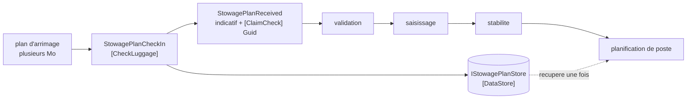

# Claim Check

🌍 🇫🇷 Français (ce fichier) · 🇬🇧 [English](ClaimCheck-en.md)

## Intention

Claim Check stocke le volume d'un message dans un stockage persistant et met une clé sur le message à sa place, de
sorte que la donnée voyage une fois et que les étapes intermédiaires ne portent qu'une référence.

## Problème

Un plan d'arrimage pour un navire de 14 000 EVP fait plusieurs mégaoctets de travées, rangées et étages.

Il passe par la validation, les contrôles de saisissage, la stabilité et la planification de poste, et **seule la
dernière l'ouvre**. Les trois autres lisent l'indicatif du navire et transmettent le plan intact.

Plusieurs mégaoctets sont donc sérialisés, mis en file, transportés, stockés dans un courtier et désérialisés quatre
fois pour être lus une fois. Chaque file de la chaîne est dimensionnée pour eux, chaque journal qui capture un
message les capture, et une panne de courtier se mesure en gigaoctets plutôt qu'en messages.

## Solution

Le patron stocke le plan une fois et met une référence sur le message.

Les quatre étapes portent un `Guid` au lieu d'un plan, et le plan est récupéré par la seule étape qui en a besoin.
Ce qui voyage est une clé ; ce qui attend dans le stockage est la donnée.

Le coût est nommé plutôt que passé sous silence : **ce qui était un message est désormais un message et un
enregistrement stocké dont rien sur le message n'énonce la durée de vie.** Quelqu'un doit décider quand il est sûr
de supprimer, et rien dans le patron ne le décide à sa place.

## Structure



Le plan prend le chemin court vers le stockage ; le message prend le long chemin en portant une clé. Seule la
dernière boîte touche aux deux.

## Les rôles

| Rôle | Annotation | S'applique à | Ce qu'il porte |
|---|---|---|---|
| CheckLuggage | `[ClaimCheck.CheckLuggage]` | interface, classe | Le participant qui engendre la clé, stocke la donnée sous elle, et remplace la donnée sur le message par la clé. |
| ClaimCheck | `[ClaimCheck.ClaimCheck]` | propriété, champ | La clé laissée sur le message à la place de ce qui a été retiré. |
| DataStore | `[ClaimCheck.DataStore]` | interface, classe | Là où la donnée attend. |

Trois rôles, et le premier est délibérément **trois choses en une étape** : émettre la clé, stocker la donnée sous
elle, retirer la donnée du message. Elles vont ensemble — une clé émise sans entrée dans le stockage, ou une entrée
faite sans que la donnée soit retirée, est le patron à moitié appliqué et pire que pas appliqué.

Le `DataStore` est nommé parce qu'il est le coût du patron. Un rôle pour le stockage est un rôle pour la chose que
quelqu'un doit exploiter, dimensionner et finir par vider.

## L'exemple

Extrait de [`ClaimCheckUsage.cs`](../../../../DesignPatternCatalog.Usage/EnterpriseIntegration/ClaimCheckUsage.cs).

Le stockage, avec la plus petite interface qui fasse l'affaire :

```csharp
[ClaimCheck.DataStore]
public interface IStowagePlanStore {

    void Put(Guid reference, string planXml);

    string Get(Guid reference);

}
```

`Put` et `Get`, et aucun `Delete`. Cette absence est l'exemple honnête plutôt qu'incomplet : la suppression est une
décision de politique que le patron ne prend pas, et une interface dotée d'un `Delete` suggérerait que quelqu'un a
décidé quand l'appeler. Personne ne l'a fait.

Le message, portant la clé :

```csharp
[ClaimCheck.ClaimCheck]
public Guid PlanReference { get; }
```

La remarque énonce la contrainte, et c'est la même que porte un
[identifiant de corrélation](CorrelationIdentifier-fr.md) : *elle doit rester valide aussi longtemps qu'une étape
pourrait encore demander, ce qui est plus long que ne dure l'étape qui l'a émise.* Un stockage purgé au bout d'une
heure et un pipeline qui prend parfois quatre-vingt-dix minutes, c'est un planificateur de poste qui lit une clé
qui ne résout plus.

`VesselCallSign` reste sur le message à côté de la clé. C'est délibéré : un message réduit à une seule référence est
illisible dans un journal et inroutable sans une récupération, donc les champs que les étapes intermédiaires
emploient réellement restent où ils sont.

L'enregistrement, qui fait les trois choses :

```csharp
public StowagePlanReceived CheckIn(string vesselCallSign, string planXml) {
    Guid reference = Guid.NewGuid();
    _store.Put(reference, planXml);

    return new StowagePlanReceived(vesselCallSign, reference);
}
```

Trois lignes, trois responsabilités, dans l'ordre où elles doivent avoir lieu : frapper, stocker, puis rendre un
message qui ne porte plus le plan. Le plan n'est pas du tout sur l'objet rendu — le retrait est par construction
plutôt que par discipline.

## Possibilités d'application

**Employez une consigne là où un grand message passe par des étapes qui ne l'ouvrent pas.** Le cas du livre, et
l'économie est proportionnelle aux sauts qui ne portent plus le volume.

**Employez-la là où la donnée est nécessaire plus tard, non jamais.** Si personne n'en a besoin, un
[filtre de contenu](ContentFilter-fr.md) est plus simple et ne laisse rien à nettoyer.

**Gardez la clé valide plus longtemps que le pire cas du pipeline.** La contrainte est la même que celle d'un
identifiant de corrélation et se sous-estime de la même façon.

**Laissez sur le message les champs qu'emploient les étapes intermédiaires.** Un message qui n'est qu'une clé est un
message que personne ne peut lire.

## Quand ne pas l'utiliser

**Ne l'employez pas pour un petit message.** Un stockage, une clé et un problème de durée de vie pour économiser
quelques kilooctets, c'est une machinerie qui coûte plus qu'elle n'économise.

**Ne l'employez pas là où chaque étape ouvre la donnée.** Si les quatre lisent le plan, le stockage ajoute quatre
récupérations à quatre sauts.

**N'en appliquez pas la moitié.** Une clé sans entrée dans le stockage, ou une entrée avec la donnée encore sur le
message, est pire que de ne pas appliquer le patron — la première échoue à l'autre bout, la seconde paie les deux
coûts.

**Ne laissez pas la durée de vie indécise.** C'est la panne caractéristique du patron : soit le stockage croît
indéfiniment, soit il est purgé et un message lent trouve sa clé qui ne résout plus rien. Ni l'un ni l'autre n'est
visible avant d'arriver.

**Ne l'employez pas pour faire passer une donnée au-delà d'une frontière qui aurait dû l'arrêter.** Une clé n'est
pas une permission, et un receveur qui peut appeler `Get` peut lire ce qu'un
[filtre de contenu](ContentFilter-fr.md) aurait retiré.

**N'oubliez pas que le stockage est une seconde chose qui peut être arrêtée.** L'arrivée du message ne veut rien
dire si le plan ne peut pas être récupéré, et la panne se manifeste à la dernière étape plutôt qu'à la première.

## Avantages

* Le volume est transporté et stocké une fois au lieu de l'être à chaque saut.
* Files, journaux et courtiers sont dimensionnés pour des clés plutôt que pour des mégaoctets.
* Les étapes qui n'ont pas besoin de la donnée sont insensibles à sa taille.
* La donnée reste disponible, contrairement à ce qu'un filtre de contenu a retiré.
* Le retrait est par construction : l'enregistrement rend un message qui ne peut pas porter le plan.

## Inconvénients

* Un enregistrement stocké dont rien sur le message n'énonce la durée de vie, et quelqu'un doit décider quand
  supprimer.
* Le stockage est une seconde dépendance, et son indisponibilité se manifeste à la dernière étape.
* Une clé qui survit à sa donnée échoue loin de là où elle a été émise.
* Deux choses doivent réussir ensemble à l'enregistrement, et le patron à moitié appliqué est pire que pas appliqué.
* Une clé donne l'accès à qui la détient, ce qui n'est pas le contrôle d'accès que quiconque a conçu.

## Liens avec les autres patrons

**`ContentEnricher`** est ce qui va rechercher la donnée : la dernière étape qui présente la clé au stockage est un
enrichissement dont la ressource est ce stockage.

**`ContentFilter`** est l'alternative quand la donnée n'est pas nécessaire plus tard — il retire au lieu de stocker,
et ne laisse rien à nettoyer.

**`CorrelationIdentifier`** partage exactement la contrainte de durée de vie de la clé, et les deux pages l'énoncent
de la même façon.

**`EnvelopeWrapper`** est l'opération inverse sur la taille d'un message : celui-là ajoute autour de la charge utile,
celui-ci retire la charge utile.

**`MessageSequence`** est l'autre réponse à un message trop grand pour être envoyé — le scinder plutôt que le
stocker — et le choix entre les deux tient à l'utilité indépendante des parties.

## Source

*Enterprise Integration Patterns*, Gregor Hohpe et Bobby Woolf, Addison-Wesley, 2003 — le chapitre sur la
transformation des messages.

* [Entrée d'index](../../../generated/catalog-index.md#claimcheck-enterprise-integration-patterns)
* [Attribut généré](../../../../DesignPatternCatalog.EnterpriseIntegration/ClaimCheck.cs)
* [Exemple](../../../../DesignPatternCatalog.Usage/EnterpriseIntegration/ClaimCheckUsage.cs)
