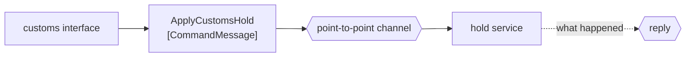

# Command Message

🌍 🇬🇧 English (this file) · 🇫🇷 [Français](CommandMessage-fr.md)

## Intent

Command Message carries an instruction to do something, so that invoking a procedure in another application is a
message rather than a call.

## Problem

Customs places a hold on a container. Somebody has to act on that, exactly once, and not acting is not an option.

Sent as a bare payload on a channel, the message says none of this:

```csharp
_channel.Send(new { ContainerNumber = "MSCU1234567", Reason = "documentation" });
```

A reader of that line cannot tell whether it is an instruction or a notice. Nor can a receiver: a consumer that
decides the hold is not its business, and drops it, has done something indistinguishable from correct behaviour
until the container is loaded onto a vessel it should not have been on.

## Solution

The pattern is to say in the type that the content is an imperative.

A command message expects **one** handler, and usually a reply saying what happened. Naming it a command is what
tells a reader that ignoring it is a defect rather than a choice — and that is the whole of the pattern, because
nothing else in a message's shape distinguishes an instruction from a fact.

It is one of the three kinds the book distinguishes, and the trio is best read together: a command instructs, a
[document](DocumentMessage-en.md) hands over, an [event](EventMessage-en.md) reports.

## Structure



One handler at the end, and a reply arrow that is dotted because the book says *usually* rather than *always*.

## The roles

| Role | Annotation | Applies to | What it carries |
|---|---|---|---|
| CommandMessage | `[CommandMessage]` | class, struct | The message whose content is an imperative. |

One role, and it applies to the **message type** rather than to the sender or the channel. That placement is the
pattern: the kind of a message is a property of the message, and it travels with it into every codebase that
reads it.

This is also one of the few entries in this catalogue that carries a recorded relation: `CommandMessage`
**narrows** `Message`, and so do the other two kinds. The catalogue records only the narrowings the book states
outright
([ADR-0030](../../for-maintainers/adr/0030-relate-only-the-narrowings-a-work-states-outright.md)), and the three
kinds of message are among them.

## The example

From [`CommandMessageUsage.cs`](../../../../DesignPatternCatalog.Usage/EnterpriseIntegration/CommandMessageUsage.cs).

```csharp
[CommandMessage]
public sealed record ApplyCustomsHold(string ContainerNumber, string Reason, string LodgedBy);
```

One line, and three things in it are the pattern.

The name is a **verb phrase in the imperative** — `ApplyCustomsHold`, not `CustomsHold` and not `HoldApplied`.
The three kinds are told apart largely by their names, and a command that is named like a noun will be handled
like a document.

`LodgedBy` is there because a command has an author. An instruction that arrives with no one behind it cannot be
questioned, and a hold that turns out to be wrong is a conversation with a person rather than with a channel.

It is a `record`, which makes it immutable and gives it value equality — useful for a message that may be
redelivered, since two copies of the same command compare equal.

The sample states what the naming buys: *a reader who sees this name knows that nothing may quietly decide not
to act.*

## Applicability

**Use a command message where one application must make another do something.** The book's framing is that this
is how a procedure call in another application is expressed as a message.

**Use it where exactly one handler is right.** A command has one rightful recipient, which is why it belongs on a
[point-to-point channel](PointToPointChannel-en.md).

**Name it as an instruction.** The imperative verb is what a reader and a reviewer go on, since nothing in the
type system distinguishes the three kinds.

**Expect a reply saying what happened.** Usually, per the book — an instruction whose outcome nobody learns is an
instruction nobody can rely on.

## When not to use it

**Do not put a command on a publish-subscribe channel.** Every subscriber getting *apply this hold* is the hold
applied four times. That is the choice
[Publish-Subscribe Channel](PublishSubscribeChannel-en.md) makes, and pairing it with a command is the expensive
mistake in this catalogue.

**Do not use it where the sender does not care what happens.** Handing over a stowage plan and letting the
receiver decide is a [document message](DocumentMessage-en.md), and dressing it as a command invents an authority
the sender does not have.

**Do not use it to report something that has already happened.** A fact in the past tense is an
[event](EventMessage-en.md); making it a command tells four subscribers to act on news.

**Do not let it hide a synchronous call.** A command whose sender blocks until the reply arrives has re-created
[Remote Procedure Invocation](RemoteProcedureInvocation-en.md) with more machinery. If the caller genuinely cannot
proceed without the answer, the honest arrangement is the call.

**Do not send a command to an application that should not be told what to do.** A command couples the sender to
the receiver's capabilities, and a stream of commands from one system to another is that system's API with a
queue in front of it.

## Advantages

* The kind is stated in the type, so a reader knows dropping the message is a fault.
* The sender does not wait, and the receiver does not have to be up when the command is sent.
* One handler is the contract, which makes the channel choice follow from the message kind.
* Redelivery is comparable: an immutable record of a command equals its own copy.
* The instruction has an author, so a wrong one leads somewhere.

## Drawbacks

* It couples the sender to what the receiver can do, which is the coupling the other two kinds avoid.
* Nothing enforces the naming, so the distinction from the other two kinds rests on a convention.
* *One handler* is a claim about the channel, and a command on the wrong channel is executed as many times as
  there are subscribers.
* The usual reply is a second conversation to build —
  [Correlation Identifier](CorrelationIdentifier-en.md) and the rest — which a fire-and-forget event never needs.
* A command delayed by an outage may arrive after it has become wrong, and only
  [Message Expiration](MessageExpiration-en.md) says so.

## Relations with other patterns

**`Message`** is what this narrows, and the relation is recorded in the catalogue rather than inferred.

**`DocumentMessage`** and **`EventMessage`** are the other two kinds, and the trio is one distinction rather than
three patterns: who decides what happens next.

**`PointToPointChannel`** is where a command belongs, because exactly one execution is what the message requires.

**`RequestReply`** is the shape a command usually takes when its outcome matters, and
**`ReturnAddress`** and **`CorrelationIdentifier`** are what make that reply findable.

**`MessageExpiration`** is what a command needs when acting late is worse than not acting.

**`RemoteProcedureInvocation`** is the integration style this replaces, and the one it becomes again if the sender
waits.

## Source

*Enterprise Integration Patterns*, Gregor Hohpe and Bobby Woolf, Addison-Wesley, 2003 — the message-construction
chapter.

* [Index entry](../../../generated/catalog-index.md#commandmessage-enterprise-integration-patterns)
* [Generated attribute](../../../../DesignPatternCatalog.EnterpriseIntegration/CommandMessage.cs)
* [Example](../../../../DesignPatternCatalog.Usage/EnterpriseIntegration/CommandMessageUsage.cs)
