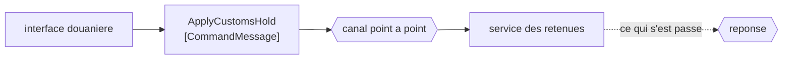

# Command Message

🌍 🇫🇷 Français (ce fichier) · 🇬🇧 [English](CommandMessage-en.md)

## Intention

Command Message porte une instruction à exécuter, de sorte qu'invoquer une procédure dans une autre application
soit un message plutôt qu'un appel.

## Problème

La douane pose une retenue sur un conteneur. Quelqu'un doit agir là-dessus, exactement une fois, et ne pas agir
n'est pas une option.

Envoyé comme charge utile nue sur un canal, le message ne dit rien de tout cela :

```csharp
_channel.Send(new { ContainerNumber = "MSCU1234567", Reason = "documentation" });
```

Un lecteur de cette ligne ne peut pas dire s'il s'agit d'une instruction ou d'un avis. Un receveur non plus : un
consommateur qui décide que la retenue ne le regarde pas, et la jette, a fait quelque chose d'indiscernable d'un
comportement correct — jusqu'à ce que le conteneur soit chargé sur un navire où il n'aurait pas dû aller.

## Solution

Le patron consiste à dire dans le type que le contenu est un impératif.

Un message de commande attend **un** traitant, et d'ordinaire une réponse disant ce qui s'est passé. Le nommer
commande est ce qui dit à un lecteur que l'ignorer est un défaut plutôt qu'un choix — et c'est tout le patron,
parce que rien d'autre dans la forme d'un message ne distingue une instruction d'un fait.

C'est l'une des trois sortes que le livre distingue, et le trio se lit mieux ensemble : une commande ordonne, un
[document](DocumentMessage-fr.md) remet, un [événement](EventMessage-fr.md) rapporte.

## Structure



Un seul traitant au bout, et une flèche de réponse en pointillés parce que le livre dit *d'ordinaire* plutôt que
*toujours*.

## Les rôles

| Rôle | Annotation | S'applique à | Ce qu'il porte |
|---|---|---|---|
| CommandMessage | `[CommandMessage]` | classe, structure | Le message dont le contenu est un impératif. |

Un seul rôle, et il s'applique au **type du message** plutôt qu'à l'émetteur ou au canal. Ce placement est le
patron : la sorte d'un message est une propriété du message, et elle voyage avec lui dans chaque base de code qui
le lit.

C'est aussi l'une des rares entrées de ce catalogue qui porte une relation enregistrée : `CommandMessage`
**restreint** `Message`, et les deux autres sortes aussi. Le catalogue n'enregistre que les restrictions que le
livre énonce sans détour
([ADR-0030](../../for-maintainers/adr/0030-relate-only-the-narrowings-a-work-states-outright.md)), et les trois
sortes de message en font partie.

## L'exemple

Extrait de [`CommandMessageUsage.cs`](../../../../DesignPatternCatalog.Usage/EnterpriseIntegration/CommandMessageUsage.cs).

```csharp
[CommandMessage]
public sealed record ApplyCustomsHold(string ContainerNumber, string Reason, string LodgedBy);
```

Une seule ligne, et trois choses en elle sont le patron.

Le nom est un **groupe verbal à l'impératif** — `ApplyCustomsHold`, non `CustomsHold` et non `HoldApplied`. Les
trois sortes se distinguent en grande partie par leurs noms, et une commande nommée comme un nom commun sera
traitée comme un document.

`LodgedBy` est là parce qu'une commande a un auteur. Une instruction qui arrive sans personne derrière elle ne peut
pas être questionnée, et une retenue qui s'avère fausse est une conversation avec une personne plutôt qu'avec un
canal.

C'est un `record`, ce qui le rend immuable et lui donne l'égalité par valeur — utile pour un message susceptible
d'être redélivré, puisque deux copies de la même commande se comparent égales.

L'exemple énonce ce que la dénomination achète : *un lecteur qui voit ce nom sait que rien ne peut décider
discrètement de ne pas agir.*

## Possibilités d'application

**Employez un message de commande là où une application doit en faire agir une autre.** Le cadrage du livre est que
c'est ainsi qu'un appel de procédure dans une autre application s'exprime en message.

**Employez-le là où exactement un traitant est le bon compte.** Une commande a un destinataire légitime, ce qui est
pourquoi elle appartient à un [canal point à point](PointToPointChannel-fr.md).

**Nommez-le comme une instruction.** Le verbe à l'impératif est ce sur quoi un lecteur et un relecteur s'appuient,
puisque rien dans le système de types ne distingue les trois sortes.

**Attendez une réponse disant ce qui s'est passé.** D'ordinaire, selon le livre — une instruction dont personne
n'apprend l'issue est une instruction sur laquelle personne ne peut compter.

## Quand ne pas l'utiliser

**Ne mettez pas une commande sur un canal de publication-abonnement.** Chaque abonné recevant *pose cette retenue*,
c'est la retenue posée quatre fois. C'est le choix que fait
[Publish-Subscribe Channel](PublishSubscribeChannel-fr.md), et l'apparier à une commande est l'erreur coûteuse de ce
catalogue.

**Ne l'employez pas là où l'émetteur se moque de ce qui arrive ensuite.** Remettre un plan d'arrimage et laisser le
receveur décider est un [message de document](DocumentMessage-fr.md), et le déguiser en commande invente une
autorité que l'émetteur n'a pas.

**Ne l'employez pas pour rapporter quelque chose qui a déjà eu lieu.** Un fait au passé est un
[événement](EventMessage-fr.md) ; en faire une commande dit à quatre abonnés d'agir sur une nouvelle.

**Ne le laissez pas cacher un appel synchrone.** Une commande dont l'émetteur se bloque jusqu'à l'arrivée de la
réponse a recréé [Remote Procedure Invocation](RemoteProcedureInvocation-fr.md) avec plus de machinerie. Si
l'appelant ne peut réellement pas continuer sans la réponse, l'agencement honnête est l'appel.

**N'envoyez pas de commande à une application à qui l'on ne devrait pas dire quoi faire.** Une commande couple
l'émetteur aux capacités du receveur, et un flux de commandes d'un système vers un autre est l'API de ce système
avec une file devant.

## Avantages

* La sorte est énoncée dans le type : un lecteur sait que jeter le message est une faute.
* L'émetteur n'attend pas, et le receveur n'a pas besoin d'être debout au moment de l'envoi.
* Un seul traitant est le contrat, ce qui fait découler le choix du canal de la sorte du message.
* La redélivrance est comparable : un enregistrement immuable de commande est égal à sa propre copie.
* L'instruction a un auteur : une commande fausse mène quelque part.

## Inconvénients

* Elle couple l'émetteur à ce que le receveur sait faire, ce qui est le couplage que les deux autres sortes évitent.
* Rien n'impose la dénomination : la distinction d'avec les deux autres sortes repose sur une convention.
* *Un seul traitant* est une revendication portant sur le canal, et une commande sur le mauvais canal est exécutée
  autant de fois qu'il y a d'abonnés.
* La réponse habituelle est une seconde conversation à bâtir —
  [Correlation Identifier](CorrelationIdentifier-fr.md) et le reste — dont un événement sans retour n'a jamais
  besoin.
* Une commande retardée par une panne peut arriver après être devenue fausse, et seul
  [Message Expiration](MessageExpiration-fr.md) le dit.

## Liens avec les autres patrons

**`Message`** est ce que celui-ci restreint, et la relation est enregistrée dans le catalogue plutôt qu'inférée.

**`DocumentMessage`** et **`EventMessage`** sont les deux autres sortes, et le trio est une distinction unique
plutôt que trois patrons : qui décide de ce qui arrive ensuite.

**`PointToPointChannel`** est là où appartient une commande, parce qu'exactement une exécution est ce que le message
exige.

**`RequestReply`** est la forme qu'une commande prend d'ordinaire quand son issue compte, et **`ReturnAddress`** et
**`CorrelationIdentifier`** sont ce qui rend cette réponse trouvable.

**`MessageExpiration`** est ce dont une commande a besoin quand agir tard est pire que ne pas agir.

**`RemoteProcedureInvocation`** est le style d'intégration que celui-ci remplace, et celui qu'il redevient si
l'émetteur attend.

## Source

*Enterprise Integration Patterns*, Gregor Hohpe et Bobby Woolf, Addison-Wesley, 2003 — le chapitre sur la
construction des messages.

* [Entrée d'index](../../../generated/catalog-index.md#commandmessage-enterprise-integration-patterns)
* [Attribut généré](../../../../DesignPatternCatalog.EnterpriseIntegration/CommandMessage.cs)
* [Exemple](../../../../DesignPatternCatalog.Usage/EnterpriseIntegration/CommandMessageUsage.cs)
