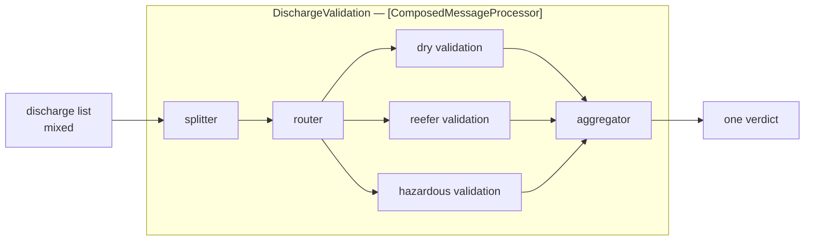

# Composed Message Processor

🌍 🇬🇧 English (this file) · 🇫🇷 [Français](ComposedMessageProcessor-fr.md)

## Intent

Composed Message Processor splits a message, routes each element to the processing it needs, and reassembles the
results, so that a message of mixed elements is handled without a step that understands all of them.

## Problem

A discharge list mixes dry boxes, reefers and hazardous cargo, and each needs different validation.

No single step should understand all three. Hazardous validation is a body of rules about dangerous goods codes;
reefer validation is about temperature ranges and power availability; dry validation is neither. A step that
knows all three is a step that three different teams need to change.

The alternative — three steps, each reading the whole list and ignoring what is not theirs — is three passes over
four hundred containers and three places where the definition of *hazardous* is written down.

## Solution

The pattern assembles three patterns already in this chapter into one addressable step.

A [splitter](Splitter-en.md) takes the list apart; a [router](ContentBasedRouter-en.md) sends each element to the
validation it needs; an [aggregator](Aggregator-en.md) collects the verdicts into one. Each specialist step sees
only its own kind, and the caller sees one step.

Naming it is what stops the three being reinvented at every call site, and what lets the whole thing be addressed
as one step from outside — which is the pattern's whole contribution, since the mechanism is entirely borrowed.

## Structure



The box around the middle is the pattern. Everything inside it exists already; what is new is that it has a name
and one address.

## The roles

| Role | Annotation | Applies to | What it carries |
|---|---|---|---|
| ComposedMessageProcessor | `[ComposedMessageProcessor]` | interface, class | The participant that assembles a splitter, a router and an aggregator into one addressable step. |

**One role, not one per part.** That is a decision the catalogue makes deliberately: a composite gets a role
naming the assembled whole, and the parts inside wear `Splitter`, `MessageRouter` and `Aggregator` themselves.
Giving the composite a role per constituent would count the same participant twice — once under its own pattern,
once under the composite — and a codebase with three of these could no longer say how many aggregators it has.

## The example

From [`ComposedMessageProcessorUsage.cs`](../../../../DesignPatternCatalog.Usage/EnterpriseIntegration/ComposedMessageProcessorUsage.cs).

```csharp
[ComposedMessageProcessor]
public sealed class DischargeValidation {

    public string Process(IReadOnlyList<(string Container, string Kind)> list) {
        // ... split by container, route on Kind, aggregate the verdicts
        return $"{list.Count} validated";
    }

}
```

One method, one parameter, one return — a list in and a verdict out. That signature is the pattern's claim: from
outside, three steps and a fan-out look like a function call.

The comment names the three constituents in order, and that ordering is not decoration. Split, then route, then
aggregate is the only arrangement that works; routing before splitting has nothing to route on, and aggregating
before routing has nothing to collect.

`(string Container, string Kind)` carries the discriminator alongside the element, which is what the router
inside will read. An element that did not carry its own kind would force the router to inspect the payload, and
the composite would acquire knowledge of three formats it is trying to avoid.

The body is elided, and that is the sample being honest about where the substance is: this pattern has no
mechanism of its own to show. What it has is a name and a boundary.

The sample states the contribution precisely: *naming it is what stops the three being reinvented at every call
site, and what lets the whole thing be addressed as one step from outside.*

## Applicability

**Use a composed message processor where a message's elements need different processing.** The book's case, and
the reason it exists as a named pattern rather than as advice.

**Use it to give the assembly one address.** A caller that has to orchestrate a splitter, a router and an
aggregator itself is a caller doing integration work.

**Use it where the specialist steps should stay ignorant of each other.** Hazardous validation should not know
that reefers exist.

**Let the elements carry their own kind.** A discriminator on the element keeps the router inside independent of
three payload formats.

## When not to use it

**Do not use it where the elements all need the same processing.** Then it is a splitter and an aggregator with a
router that has one branch, and the composite adds a name for nothing.

**Do not use it where the whole message is what should be distributed.** Sending the whole thing to several
parties and collecting their answers is [Scatter-Gather](ScatterGather-en.md); the difference is what is
distributed — the parts of one message here, the whole message to several parties there.

**Do not let it become a fourth mechanism.** If the composite starts doing work of its own beyond assembling the
three, it has become an undocumented step and the constituent annotations stop describing it.

**Do not inherit the aggregator's problems without noticing them.** Everything the
[aggregator](Aggregator-en.md) page says about state, correlation and a completeness condition that never holds
applies here in full, hidden behind a method that looks synchronous.

**Do not use it where one element failing should fail the message.** The composite emits one result, so a
convention is needed for what a partial failure produces — and the pattern does not supply one.

## Advantages

* Each specialist step sees only its own kind, and knows nothing of the others.
* The assembly has one address, so callers do not orchestrate it.
* It is built from patterns already understood, so there is no new mechanism to learn.
* A new kind of element is a new specialist step and a routing rule, not a change to the others.
* Naming it stops the same three being reassembled at every call site.

## Drawbacks

* It hides an aggregator, and therefore hides state, a correlation and a completeness condition.
* From outside it looks like a function call, which conceals that it can hold messages indefinitely.
* Partial failure has no obvious meaning: one element rejected out of four hundred, and one result to emit.
* It is three participants' worth of latency behind one name.
* The pattern contributes a boundary and not a mechanism, so most of the work is still in the constituents.

## Relations with other patterns

**`Splitter`**, **`MessageRouter`** and **`Aggregator`** are what it is made of, and they carry their own
annotations inside it.

**`ScatterGather`** is the sibling composite, and the distinction is what gets distributed: the parts of one
message here, the whole message to several parties there.

**`Normalizer`** is the catalogue's other composite — a router and a translator per format — and it gets one role
for the same reason this does.

**`ProcessManager`** is what to reach for when the steps are a process with branches rather than a fan-out and a
join.

**`PipesAndFilters`** is the arrangement this sits inside, as one filter that happens to contain a pipeline.

## Source

*Enterprise Integration Patterns*, Gregor Hohpe and Bobby Woolf, Addison-Wesley, 2003 — the message-routing
chapter.

* [Index entry](../../../generated/catalog-index.md#composedmessageprocessor-enterprise-integration-patterns)
* [Generated attribute](../../../../DesignPatternCatalog.EnterpriseIntegration/ComposedMessageProcessor.cs)
* [Example](../../../../DesignPatternCatalog.Usage/EnterpriseIntegration/ComposedMessageProcessorUsage.cs)
