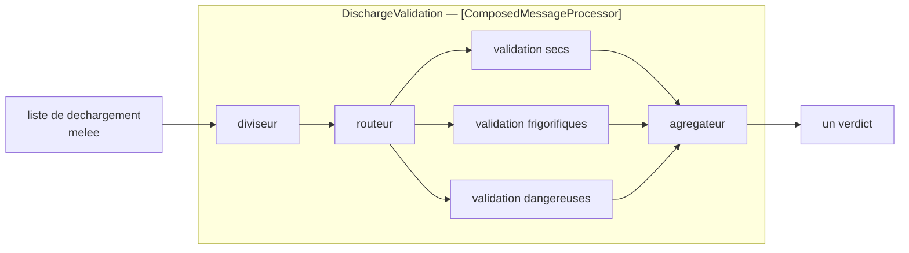

# Composed Message Processor

🌍 🇫🇷 Français (ce fichier) · 🇬🇧 [English](ComposedMessageProcessor-en.md)

## Intention

Composed Message Processor divise un message, route chaque élément vers le traitement dont il a besoin, et
réassemble les résultats, de sorte qu'un message d'éléments mêlés soit traité sans qu'aucune étape ne les comprenne
tous.

## Problème

Une liste de déchargement mêle conteneurs secs, frigorifiques et marchandises dangereuses, et chacun demande une
validation différente.

Aucune étape unique ne devrait comprendre les trois. La validation des dangereuses est un corps de règles sur les
codes de marchandises dangereuses ; celle des frigorifiques porte sur des plages de température et la disponibilité
du courant ; celle des secs n'est ni l'une ni l'autre. Une étape qui connaît les trois est une étape que trois
équipes différentes doivent modifier.

L'alternative — trois étapes, chacune lisant la liste entière et ignorant ce qui n'est pas à elle — fait trois
passes sur quatre cents conteneurs et trois endroits où la définition de *dangereux* est écrite.

## Solution

Le patron assemble trois patrons déjà présents dans ce chapitre en une étape adressable.

Un [diviseur](Splitter-fr.md) défait la liste ; un [routeur](ContentBasedRouter-fr.md) envoie chaque élément vers la
validation dont il a besoin ; un [agrégateur](Aggregator-fr.md) rassemble les verdicts en un seul. Chaque étape
spécialiste ne voit que sa propre sorte, et l'appelant voit une étape.

Le nommer est ce qui empêche les trois d'être réinventés à chaque point d'appel, et ce qui permet d'adresser le tout
comme une seule étape depuis l'extérieur — ce qui est toute la contribution du patron, puisque le mécanisme est
entièrement emprunté.

## Structure



La boîte autour du milieu est le patron. Tout ce qui est dedans existe déjà ; ce qui est nouveau, c'est qu'il a un
nom et une adresse.

## Les rôles

| Rôle | Annotation | S'applique à | Ce qu'il porte |
|---|---|---|---|
| ComposedMessageProcessor | `[ComposedMessageProcessor]` | interface, classe | Le participant qui assemble un diviseur, un routeur et un agrégateur en une étape adressable. |

**Un rôle, non un par partie.** C'est une décision que le catalogue prend délibérément : un composite reçoit un rôle
qui nomme le tout assemblé, et les parties à l'intérieur portent elles-mêmes `Splitter`, `MessageRouter` et
`Aggregator`. Donner au composite un rôle par constituant compterait deux fois le même participant — une fois sous
son propre patron, une fois sous le composite — et un code qui en aurait trois ne pourrait plus dire combien
d'agrégateurs il possède.

## L'exemple

Extrait de [`ComposedMessageProcessorUsage.cs`](../../../../DesignPatternCatalog.Usage/EnterpriseIntegration/ComposedMessageProcessorUsage.cs).

```csharp
[ComposedMessageProcessor]
public sealed class DischargeValidation {

    public string Process(IReadOnlyList<(string Container, string Kind)> list) {
        // ... split by container, route on Kind, aggregate the verdicts
        return $"{list.Count} validated";
    }

}
```

Une méthode, un paramètre, un retour — une liste en entrée, un verdict en sortie. Cette signature est la
revendication du patron : vues du dehors, trois étapes et un éventail ressemblent à un appel de fonction.

Le commentaire nomme les trois constituants dans l'ordre, et cet ordre n'est pas un ornement. Diviser, puis router,
puis agréger est le seul agencement qui fonctionne ; router avant de diviser n'a rien sur quoi router, et agréger
avant de router n'a rien à rassembler.

`(string Container, string Kind)` porte le discriminant à côté de l'élément, et c'est ce que le routeur intérieur
lira. Un élément qui ne porterait pas sa propre sorte forcerait le routeur à inspecter la charge utile, et le
composite acquerrait la connaissance de trois formats qu'il cherche à éviter.

Le corps est élidé, et c'est l'exemple qui reste honnête sur l'endroit où est la substance : ce patron n'a aucun
mécanisme propre à montrer. Ce qu'il a, c'est un nom et une frontière.

L'exemple énonce la contribution avec précision : *le nommer est ce qui empêche les trois d'être réinventés à chaque
point d'appel, et ce qui permet d'adresser le tout comme une seule étape depuis l'extérieur.*

## Possibilités d'application

**Employez un processeur composé là où les éléments d'un message demandent des traitements différents.** Le cas du
livre, et la raison pour laquelle il existe comme patron nommé plutôt que comme conseil.

**Employez-le pour donner à l'assemblage une seule adresse.** Un appelant qui doit orchestrer lui-même un diviseur,
un routeur et un agrégateur est un appelant qui fait du travail d'intégration.

**Employez-le là où les étapes spécialistes doivent s'ignorer.** La validation des dangereuses ne devrait pas savoir
que les frigorifiques existent.

**Laissez les éléments porter leur propre sorte.** Un discriminant sur l'élément garde le routeur intérieur
indépendant de trois formats de charge utile.

## Quand ne pas l'utiliser

**Ne l'employez pas là où tous les éléments demandent le même traitement.** C'est alors un diviseur et un agrégateur
avec un routeur à une branche, et le composite ajoute un nom pour rien.

**Ne l'employez pas là où c'est le message entier qui doit être distribué.** Envoyer le tout à plusieurs parties et
rassembler leurs réponses est [Scatter-Gather](ScatterGather-fr.md) ; la différence est ce qui est distribué — les
parties d'un message ici, le message entier à plusieurs parties là-bas.

**Ne le laissez pas devenir un quatrième mécanisme.** Si le composite se met à faire un travail propre au-delà de
l'assemblage des trois, il est devenu une étape non documentée et les annotations des constituants cessent de le
décrire.

**N'héritez pas des problèmes de l'agrégateur sans les voir.** Tout ce que la page de l'[agrégateur](Aggregator-fr.md)
dit de l'état, de la corrélation et d'une condition de complétude qui ne tient jamais vaut ici entièrement, caché
derrière une méthode qui a l'air synchrone.

**Ne l'employez pas là où l'échec d'un élément devrait faire échouer le message.** Le composite émet un résultat : il
faut une convention pour ce que produit un échec partiel — et le patron n'en fournit aucune.

## Avantages

* Chaque étape spécialiste ne voit que sa propre sorte, et ne connaît rien des autres.
* L'assemblage a une seule adresse : les appelants ne l'orchestrent pas.
* Il est bâti à partir de patrons déjà compris : il n'y a aucun mécanisme nouveau à apprendre.
* Une nouvelle sorte d'élément est une nouvelle étape spécialiste et une règle de routage, non un changement des
  autres.
* Le nommer empêche les mêmes trois d'être réassemblés à chaque point d'appel.

## Inconvénients

* Il cache un agrégateur, et donc un état, une corrélation et une condition de complétude.
* Vu du dehors il ressemble à un appel de fonction, ce qui dissimule qu'il peut retenir des messages indéfiniment.
* L'échec partiel n'a pas de sens évident : un élément rejeté sur quatre cents, et un résultat à émettre.
* C'est la latence de trois participants derrière un seul nom.
* Le patron apporte une frontière et non un mécanisme : l'essentiel du travail reste dans les constituants.

## Liens avec les autres patrons

**`Splitter`**, **`MessageRouter`** et **`Aggregator`** sont ce dont il est fait, et ils portent leurs propres
annotations à l'intérieur de lui.

**`ScatterGather`** est le composite frère, et la distinction est ce qui est distribué : les parties d'un message
ici, le message entier à plusieurs parties là-bas.

**`Normalizer`** est l'autre composite du catalogue — un routeur et un traducteur par format — et il reçoit un rôle
unique pour la même raison que celui-ci.

**`ProcessManager`** est ce vers quoi se tourner quand les étapes sont un processus avec des branches plutôt qu'un
éventail et une jonction.

**`PipesAndFilters`** est l'agencement dans lequel celui-ci siège, comme un filtre qui contient un pipeline.

## Source

*Enterprise Integration Patterns*, Gregor Hohpe et Bobby Woolf, Addison-Wesley, 2003 — le chapitre sur le routage
des messages.

* [Entrée d'index](../../../generated/catalog-index.md#composedmessageprocessor-enterprise-integration-patterns)
* [Attribut généré](../../../../DesignPatternCatalog.EnterpriseIntegration/ComposedMessageProcessor.cs)
* [Exemple](../../../../DesignPatternCatalog.Usage/EnterpriseIntegration/ComposedMessageProcessorUsage.cs)
