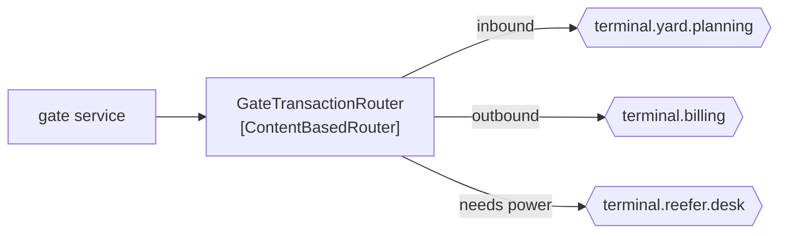

# Content-Based Router

🌍 🇬🇧 English (this file) · 🇫🇷 [Français](ContentBasedRouter-fr.md)

## Intent

Content-Based Router sends a message to one destination chosen by examining the message itself, so that the
sender needs to know neither the destinations nor the rule.

## Problem

A gate transaction goes to yard planning if the box is coming in, to billing if it is going out, and to the
reefer desk if it needs power.

Written as a condition inside the gate service, the gate knows all three:

```csharp
if (transaction.NeedsPower) { _reeferDesk.Send(transaction); }
else if (transaction.Inbound) { _yardPlanner.Send(transaction); }
else { _billing.Send(transaction); }
```

Every new destination is a change to the gate — a service whose subject is weighbridges and barriers, and which
now holds a map of the terminal's other systems. The fourth destination is a deployment of the gate, and the
fourth destination is somebody else's project.

## Solution

The pattern moves that knowledge into one participant.

A content-based router inspects the message and forwards it, **unchanged**, to exactly one destination. The gate
sends one message and knows nothing about who wants it; a new destination is a change to the router and to
nothing else.

The trade is stated rather than hidden: one participant knows them all so that no sender knows any. That
centralisation is the pattern's cost and its purpose at once, and it is the thing to weigh before reaching for
it.

## Structure



One arrow in, three possible arrows out, exactly one taken per message.

## The roles

| Role | Annotation | Applies to | What it carries |
|---|---|---|---|
| ContentBasedRouter | `[ContentBasedRouter]` | interface, class | The participant that inspects a message and forwards it, unchanged, to exactly one destination. |

One role, and it narrows [Message Router](MessageRouter-en.md) along the axis of *what the decision is based
on*: here, the content. The root's `unchanged` claim is inherited whole — a content-based router that also
modifies is a [translator](MessageTranslator-en.md) that has taken a second job.

## The example

From [`ContentBasedRouterUsage.cs`](../../../../DesignPatternCatalog.Usage/EnterpriseIntegration/ContentBasedRouterUsage.cs).

```csharp
[ContentBasedRouter]
public sealed class GateTransactionRouter {

    public string Route(GateTransaction transaction) {
        if (transaction.NeedsPower) { return "terminal.reefer.desk"; }

        return transaction.Inbound ? "terminal.yard.planning" : "terminal.billing";
    }

}
```

`Route` returns a **channel name**, not a message and not a `void` that publishes. That signature is what makes
the `unchanged` claim structural rather than aspirational: the method has nowhere to put a modified payload, so
it cannot modify one even by accident.

It takes a `GateTransaction` rather than a `string`, which is this router reading content — the difference from
the root pattern, whose sample routes on a bare direction. Reading content is also what couples it: a change to
`GateTransaction`'s shape is a change here, which the root pattern's header-based routing would have avoided.

The order of the two conditions is a decision the code makes silently. A reefer arriving inbound matches both
rules and goes to the reefer desk, because that branch is first. Rules that overlap are the ordinary case in
content-based routing, and the resolution lives in the order rather than in anything declared.

The sample states the trade in one line: *it centralises knowledge of the destinations, which is the trade: one
participant knows them all so that no sender knows any.*

## Applicability

**Use a content-based router where the destination depends on what the message says.** The book's plainest
routing case, and the one the others specialise.

**Use it where destinations change more often than senders.** Adding the fourth system is a change to the router
alone, which is the whole return on the indirection.

**Use it where exactly one destination is right.** One output is the pattern; several is a
[recipient list](RecipientList-en.md), none is a [filter](MessageFilter-en.md).

**Forward unchanged.** Inherited from [Message Router](MessageRouter-en.md), and the sample's signature is what
makes it checkable.

## When not to use it

**Do not use it where a header would do.** Routing on content couples the router to every payload format that
passes through it; routing on a header keeps it independent of what it carries, which is the root pattern's own
advice.

**Do not let the rules grow past reading.** A router with fourteen overlapping conditions has become the thing
nobody dares change, and the answer is either a [dynamic router](DynamicRouter-en.md) or splitting the decision.

**Do not use it where the decision is a business rule.** *Which desk handles a reefer* may be routing; *whether a
reefer is billable at the higher rate* is not, and putting the second here hides a domain decision in
infrastructure.

**Do not centralise all routing in one.** A single participant that knows every destination in the terminal is
[Message Broker](MessageBroker-en.md) arrived at by accretion — worth choosing, not worth drifting into.

**Do not leave the unmatched case undefined.** A message matching no branch has to go somewhere a human can look,
which is [Invalid Message Channel](InvalidMessageChannel-en.md).

## Advantages

* The sender publishes once and knows no destination.
* A new destination is a change to one participant.
* The rule is in one readable place instead of spread across senders.
* Because the message is unchanged, the router can be inserted or removed without any other step noticing.
* The decision is testable on its own: content in, channel name out.

## Drawbacks

* One participant accumulates knowledge of every destination, which is the coupling moved rather than removed.
* Reading content couples the router to every payload format that crosses it.
* Overlapping rules resolve by order, and the order is not declared anywhere.
* It is a hop, with the latency and the failure mode of one.
* Every new destination still needs a deployment — of the router, which is the cost a
  [dynamic router](DynamicRouter-en.md) removes.

## Relations with other patterns

**`MessageRouter`** is the root this narrows, and the `unchanged` claim comes from there.

**`MessageFilter`** is the same shape with one output and the option of none.

**`RecipientList`** is the same shape with several outputs at once, chosen per message.

**`DynamicRouter`** is this pattern with its table learned rather than compiled, and it is where to go when the
deployment-per-destination becomes the cost.

**`MessageBroker`** is what a content-based router becomes when it knows the whole topology.

**`MessageTranslator`** is the counterpart it must not become: one changes where, the other changes what.

## Source

*Enterprise Integration Patterns*, Gregor Hohpe and Bobby Woolf, Addison-Wesley, 2003 — the message-routing
chapter.

* [Index entry](../../../generated/catalog-index.md#contentbasedrouter-enterprise-integration-patterns)
* [Generated attribute](../../../../DesignPatternCatalog.EnterpriseIntegration/ContentBasedRouter.cs)
* [Example](../../../../DesignPatternCatalog.Usage/EnterpriseIntegration/ContentBasedRouterUsage.cs)
