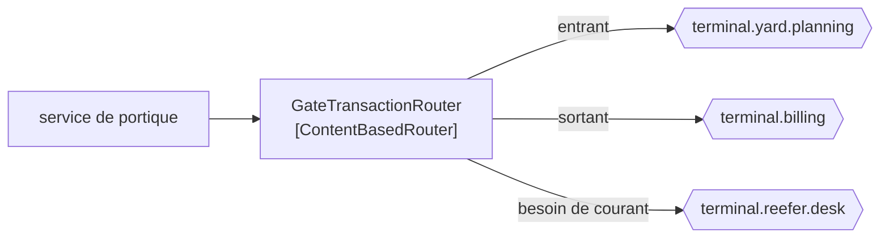

# Content-Based Router

🌍 🇫🇷 Français (ce fichier) · 🇬🇧 [English](ContentBasedRouter-en.md)

## Intention

Content-Based Router envoie un message vers une destination choisie en examinant le message lui-même, de sorte que
l'émetteur n'ait à connaître ni les destinations ni la règle.

## Problème

Un passage au portique va à la planification de parc si le conteneur entre, à la facturation s'il sort, et au
bureau des frigorifiques s'il a besoin de courant.

Écrit en condition dans le service du portique, le portique connaît les trois :

```csharp
if (transaction.NeedsPower) { _reeferDesk.Send(transaction); }
else if (transaction.Inbound) { _yardPlanner.Send(transaction); }
else { _billing.Send(transaction); }
```

Chaque nouvelle destination est un changement du portique — un service dont le sujet est les pont-bascules et les
barrières, et qui détient désormais une carte des autres systèmes du terminal. La quatrième destination est un
déploiement du portique, et la quatrième destination est le projet de quelqu'un d'autre.

## Solution

Le patron déplace cette connaissance dans un seul participant.

Un routeur fondé sur le contenu inspecte le message et le transmet, **inchangé**, vers exactement une destination.
Le portique envoie un message et ne sait rien de qui le veut ; une nouvelle destination est un changement du
routeur et de rien d'autre.

L'échange est énoncé plutôt que caché : un participant les connaît toutes pour qu'aucun émetteur n'en connaisse
aucune. Cette centralisation est à la fois le coût et le propos du patron, et c'est ce qu'il faut peser avant d'y
recourir.

## Structure



Une flèche entrante, trois flèches sortantes possibles, exactement une prise par message.

## Les rôles

| Rôle | Annotation | S'applique à | Ce qu'il porte |
|---|---|---|---|
| ContentBasedRouter | `[ContentBasedRouter]` | interface, classe | Le participant qui inspecte un message et le transmet, inchangé, vers exactement une destination. |

Un seul rôle, et il restreint [Message Router](MessageRouter-fr.md) selon l'axe de *ce sur quoi porte la décision* :
ici, le contenu. La revendication d'*inchangé* de la racine est héritée entière — un routeur fondé sur le contenu
qui modifie aussi est un [traducteur](MessageTranslator-fr.md) qui a pris un second métier.

## L'exemple

Extrait de [`ContentBasedRouterUsage.cs`](../../../../DesignPatternCatalog.Usage/EnterpriseIntegration/ContentBasedRouterUsage.cs).

```csharp
[ContentBasedRouter]
public sealed class GateTransactionRouter {

    public string Route(GateTransaction transaction) {
        if (transaction.NeedsPower) { return "terminal.reefer.desk"; }

        return transaction.Inbound ? "terminal.yard.planning" : "terminal.billing";
    }

}
```

`Route` rend un **nom de canal**, non un message et non un `void` qui publie. Cette signature est ce qui rend la
revendication d'*inchangé* structurelle plutôt qu'ambitieuse : la méthode n'a nulle part où mettre une charge utile
modifiée, elle ne peut donc pas en modifier une, même par accident.

Elle prend une `GateTransaction` plutôt qu'un `string`, et c'est ce routeur qui lit le contenu — la différence
d'avec le patron racine, dont l'exemple route sur une simple direction. Lire le contenu est aussi ce qui le couple :
un changement de la forme de `GateTransaction` est un changement ici, ce que le routage sur en-tête du patron racine
aurait évité.

L'ordre des deux conditions est une décision que le code prend en silence. Un frigorifique entrant satisfait les
deux règles et va au bureau des frigorifiques, parce que cette branche est première. Des règles qui se recouvrent
sont le cas ordinaire du routage sur contenu, et la résolution vit dans l'ordre plutôt que dans quoi que ce soit de
déclaré.

L'exemple énonce l'échange en une ligne : *il centralise la connaissance des destinations, ce qui est l'échange : un
participant les connaît toutes pour qu'aucun émetteur n'en connaisse aucune.*

## Possibilités d'application

**Employez un routeur fondé sur le contenu là où la destination dépend de ce que dit le message.** Le cas de routage
le plus simple du livre, et celui que les autres spécialisent.

**Employez-le là où les destinations changent plus souvent que les émetteurs.** Ajouter le quatrième système est un
changement du seul routeur, ce qui est tout le retour sur l'indirection.

**Employez-le là où exactement une destination est la bonne.** Une sortie est le patron ; plusieurs est une
[liste de destinataires](RecipientList-fr.md), aucune est un [filtre](MessageFilter-fr.md).

**Transmettez sans modifier.** Hérité de [Message Router](MessageRouter-fr.md), et la signature de l'exemple est ce
qui le rend contrôlable.

## Quand ne pas l'utiliser

**Ne l'employez pas là où un en-tête suffirait.** Router sur le contenu couple le routeur à chaque format de charge
utile qui le traverse ; router sur un en-tête le garde indépendant de ce qu'il porte, ce qui est le conseil propre du
patron racine.

**Ne laissez pas les règles dépasser la lecture.** Un routeur à quatorze conditions qui se recouvrent est devenu ce
que personne n'ose changer, et la réponse est soit un [routeur dynamique](DynamicRouter-fr.md), soit la scission de
la décision.

**Ne l'employez pas là où la décision est une règle métier.** *Quel bureau traite un frigorifique* peut être du
routage ; *si un frigorifique est facturable au tarif supérieur* ne l'est pas, et mettre le second ici cache une
décision de domaine dans l'infrastructure.

**Ne centralisez pas tout le routage dans un seul.** Un participant unique qui connaît toutes les destinations du
terminal est [Message Broker](MessageBroker-fr.md) atteint par accrétion — bon à choisir, mauvais à subir.

**Ne laissez pas le cas non apparié indéfini.** Un message qui ne satisfait aucune branche doit aller quelque part où
un humain peut regarder, c'est-à-dire [Invalid Message Channel](InvalidMessageChannel-fr.md).

## Avantages

* L'émetteur publie une fois et ne connaît aucune destination.
* Une nouvelle destination est un changement d'un seul participant.
* La règle est à un endroit lisible au lieu d'être dispersée chez les émetteurs.
* Le message étant inchangé, le routeur peut être inséré ou retiré sans qu'aucune autre étape le remarque.
* La décision se teste seule : du contenu en entrée, un nom de canal en sortie.

## Inconvénients

* Un participant accumule la connaissance de toutes les destinations : le couplage est déplacé plutôt que retiré.
* Lire le contenu couple le routeur à chaque format de charge utile qui le traverse.
* Les règles qui se recouvrent se résolvent par l'ordre, et l'ordre n'est déclaré nulle part.
* C'est un saut, avec la latence et le mode de défaillance d'un saut.
* Chaque nouvelle destination demande tout de même un déploiement — du routeur, ce qui est le coût qu'un
  [routeur dynamique](DynamicRouter-fr.md) retire.

## Liens avec les autres patrons

**`MessageRouter`** est la racine que celui-ci restreint, et la revendication d'*inchangé* vient de là.

**`MessageFilter`** est la même forme avec une sortie et la possibilité d'aucune.

**`RecipientList`** est la même forme avec plusieurs sorties à la fois, choisies message par message.

**`DynamicRouter`** est ce patron avec sa table apprise plutôt que compilée, et c'est là qu'il faut aller quand le
déploiement par destination devient le coût.

**`MessageBroker`** est ce que devient un routeur fondé sur le contenu quand il connaît toute la topologie.

**`MessageTranslator`** est le pendant qu'il ne doit pas devenir : l'un change où, l'autre change quoi.

## Source

*Enterprise Integration Patterns*, Gregor Hohpe et Bobby Woolf, Addison-Wesley, 2003 — le chapitre sur le routage
des messages.

* [Entrée d'index](../../../generated/catalog-index.md#contentbasedrouter-enterprise-integration-patterns)
* [Attribut généré](../../../../DesignPatternCatalog.EnterpriseIntegration/ContentBasedRouter.cs)
* [Exemple](../../../../DesignPatternCatalog.Usage/EnterpriseIntegration/ContentBasedRouterUsage.cs)
