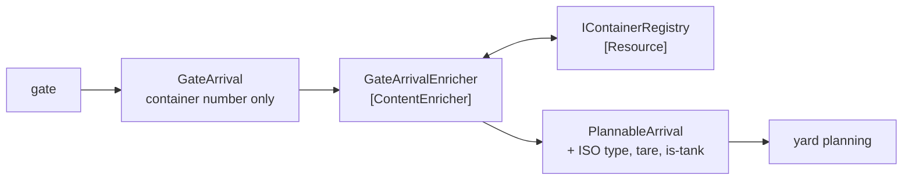

# Content Enricher

🌍 🇬🇧 English (this file) · 🇫🇷 [Français](ContentEnricher-fr.md)

## Intent

Content Enricher reaches an external source to add to a message what its sender could not supply, so that a
receiver needing more than the sender holds can still be served.

## Problem

A gate transaction carries a container number and nothing else.

The gate reads the number off the box and has no reason to know more — it is a barrier and a camera. Yard
planning needs the ISO type, the tare weight and whether the box is a tank, because those decide which stack it
can go on.

Neither participant can close the gap. The gate cannot supply what it does not have, and asking it to look the
container up makes a barrier into a client of the container registry. Letting the planner look it up works, and
buries a dependency on the registry inside a component whose subject is stacks — so *why is yard planning down*
has an answer nobody expects.

## Solution

The pattern fetches the rest.

An enricher uses what the message already carries — a key field, an identifier — to reach an external source and
add what was missing. The gate stays ignorant, and the dependency on the registry is **stated rather than buried
in the planner**.

The destination does not change, only the content, which is what makes it a transformer and not a router.

## Structure



The arrow to the registry is the one that distinguishes this from every other transformer: it leaves the message
path entirely.

## The roles

| Role | Annotation | Applies to | What it carries |
|---|---|---|---|
| ContentEnricher | `[ContentEnricher.ContentEnricher]` | interface, class | The participant that augments a message with data the sender did not have. |
| Resource | `[ContentEnricher.Resource]` | interface, class | The external source the enrichment is drawn from. |

Two roles, and the second exists for one reason: **it is the difference from a plain
[message translator](MessageTranslator-en.md)**. An enricher has a dependency outside the message, so it can be
slow, be down, or answer differently tomorrow — and that is worth seeing in the code rather than discovering in
an incident.

## The example

From [`ContentEnricherUsage.cs`](../../../../DesignPatternCatalog.Usage/EnterpriseIntegration/ContentEnricherUsage.cs).

The two message types, before and after:

```csharp
public sealed record GateArrival(string ContainerNumber);
```

```csharp
public sealed record PlannableArrival(string ContainerNumber, string IsoType, int TareKilos, bool IsTank);
```

Two types rather than one mutable one. The enrichment produces a new message, so *before* and *after* are
distinguishable in the type system, and a component that receives a `GateArrival` cannot accidentally be handed
an unenriched one where a `PlannableArrival` was required.

The resource, named:

```csharp
[ContentEnricher.Resource]
public interface IContainerRegistry {

    (string IsoType, int TareKilos, bool IsTank) Describe(string containerNumber);

}
```

It returns exactly the three fields the enrichment adds. A registry interface with fourteen methods would be the
enricher depending on a service; three values in one call is the enricher depending on one question.

The enrichment itself:

```csharp
public PlannableArrival Enrich(GateArrival arrival) {
    (string isoType, int tareKilos, bool isTank) = _registry.Describe(arrival.ContainerNumber);

    return new PlannableArrival(arrival.ContainerNumber, isoType, tareKilos, isTank);
}
```

`arrival.ContainerNumber` is the key the message already carried, and it is passed through unchanged into the
result. That is the pattern's shape: the message supplies the question, the resource supplies the answer, and
nothing the sender said is altered.

The sample states what the resource role is for: *named because it is the difference from a plain message
translator: the enricher has a dependency outside the message, so it can be slow, be down, or answer differently
tomorrow.*

## Applicability

**Use a content enricher where a receiver needs more than the sender holds.** The book's case, and it is common
wherever a sender is a device or a legacy system.

**Use it to keep the dependency out of both endpoints.** The gate should not query the registry, and the planner
should not either; an enricher is where that dependency belongs.

**Use it where the message already carries a key.** Enrichment needs something to look up by, and a message with
no identifier cannot be enriched.

**Name the resource.** It is the pattern's cost and the thing that will be down at three in the morning.

## When not to use it

**Do not use it where the sender could carry the data.** If the gate could read the ISO type off the box, adding a
participant and an external call to supply it is worse than sending it.

**Do not use it where no external source is needed.** Reshaping what a message already contains is a
[message translator](MessageTranslator-en.md), and calling it an enricher misstates where the dependencies are.

**Do not let it route.** The destination does not change — an enricher that also chooses a channel is a
[router](MessageRouter-en.md) as well, and neither contract holds afterwards.

**Do not ignore that it can be down.** The resource is a live dependency in the middle of a message path, so its
availability becomes the pipeline's and its latency becomes the pipeline's.

**Do not enrich with data that will be stale by the time it is used.** An enricher writes a value into a message
that may sit in a queue for an hour; if the value can change in that time, the receiver is acting on a snapshot
whose age nothing states.

**Do not use it to hide a business decision.** Adding *is this container billable at the higher rate* is not
enrichment but a domain rule computed in infrastructure, where nobody will look for it.

## Advantages

* The sender stays ignorant of what receivers need.
* The receiver stays ignorant of where the extra data comes from.
* The dependency lives in one named participant, so an outage has an obvious cause.
* Before and after are different types, so an unenriched message cannot be mistaken for an enriched one.
* A new required field is a change to the enricher and the resource, not to the sender.

## Drawbacks

* It introduces a live external dependency into the message path, with its latency and its availability.
* The enriched value is a snapshot, and nothing on the message says when it was taken.
* A resource that answers differently tomorrow makes the same message mean different things on different days.
* It is a hop, and one that can fail for reasons unrelated to the message.
* It is an easy place to hide a domain rule, because it is already computing things.

## Relations with other patterns

**`ContentFilter`** is the opposite operation: this adds what the sender did not have, that removes what the
receiver does not want.

**`MessageTranslator`** is what this becomes without the resource — the same shape, without a dependency outside
the message.

**`ClaimCheck`** is the enricher's mirror in the other direction: a claim check removes bulk and leaves a key, and
what puts the bulk back is an enricher presenting that key.

**`MessageRouter`** is what an enricher must not become; one changes content, the other changes destination.

**`CanonicalDataModel`** is often what an enriched message is expressed in, since the enrichment is where the
sender's vocabulary meets everybody else's.

## Source

*Enterprise Integration Patterns*, Gregor Hohpe and Bobby Woolf, Addison-Wesley, 2003 — the message-transformation
chapter.

* [Index entry](../../../generated/catalog-index.md#contentenricher-enterprise-integration-patterns)
* [Generated attribute](../../../../DesignPatternCatalog.EnterpriseIntegration/ContentEnricher.cs)
* [Example](../../../../DesignPatternCatalog.Usage/EnterpriseIntegration/ContentEnricherUsage.cs)
