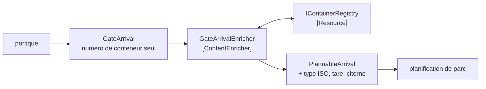

# Content Enricher

🌍 🇫🇷 Français (ce fichier) · 🇬🇧 [English](ContentEnricher-en.md)

## Intention

Content Enricher atteint une source externe pour ajouter à un message ce que son émetteur n'a pas pu fournir, de
sorte qu'un receveur qui a besoin de plus que ce que l'émetteur détient puisse tout de même être servi.

## Problème

Un passage au portique porte un numéro de conteneur et rien d'autre.

Le portique lit le numéro sur la boîte et n'a aucune raison d'en savoir plus — c'est une barrière et une caméra. La
planification de parc a besoin du type ISO, de la tare et de savoir si la boîte est une citerne, parce que cela
décide sur quelle pile elle peut aller.

Aucun des deux participants ne peut combler l'écart. Le portique ne peut pas fournir ce qu'il n'a pas, et lui
demander de chercher le conteneur fait d'une barrière une cliente du registre des conteneurs. Laisser le
planificateur chercher fonctionne, et enterre une dépendance au registre dans un composant dont le sujet est les
piles — si bien que *pourquoi la planification de parc est-elle arrêtée* a une réponse que personne n'attend.

## Solution

Le patron va chercher le reste.

Un enrichisseur emploie ce que le message porte déjà — un champ clé, un identifiant — pour atteindre une source
externe et ajouter ce qui manquait. Le portique reste ignorant, et la dépendance au registre est **énoncée plutôt
qu'enterrée dans le planificateur**.

La destination ne change pas, seul le contenu change, ce qui en fait un transformateur et non un routeur.

## Structure



La flèche vers le registre est celle qui distingue celui-ci de tout autre transformateur : elle quitte entièrement
le chemin du message.

## Les rôles

| Rôle | Annotation | S'applique à | Ce qu'il porte |
|---|---|---|---|
| ContentEnricher | `[ContentEnricher.ContentEnricher]` | interface, classe | Le participant qui augmente un message de données que l'émetteur n'avait pas. |
| Resource | `[ContentEnricher.Resource]` | interface, classe | La source externe d'où l'enrichissement est tiré. |

Deux rôles, et le second existe pour une raison : **c'est la différence d'avec un simple
[traducteur](MessageTranslator-fr.md)**. Un enrichisseur a une dépendance hors du message : il peut être lent, être
arrêté, ou répondre autrement demain — et cela vaut d'être vu dans le code plutôt que découvert pendant un
incident.

## L'exemple

Extrait de [`ContentEnricherUsage.cs`](../../../../DesignPatternCatalog.Usage/EnterpriseIntegration/ContentEnricherUsage.cs).

Les deux types de messages, avant et après :

```csharp
public sealed record GateArrival(string ContainerNumber);
```

```csharp
public sealed record PlannableArrival(string ContainerNumber, string IsoType, int TareKilos, bool IsTank);
```

Deux types plutôt qu'un seul mutable. L'enrichissement produit un nouveau message : *avant* et *après* sont
distinguables dans le système de types, et un composant qui reçoit un `GateArrival` ne peut pas se voir tendre par
accident un message non enrichi là où un `PlannableArrival` était exigé.

La ressource, nommée :

```csharp
[ContentEnricher.Resource]
public interface IContainerRegistry {

    (string IsoType, int TareKilos, bool IsTank) Describe(string containerNumber);

}
```

Elle rend exactement les trois champs que l'enrichissement ajoute. Une interface de registre à quatorze méthodes
serait l'enrichisseur dépendant d'un service ; trois valeurs en un appel est l'enrichisseur dépendant d'une
question.

L'enrichissement lui-même :

```csharp
public PlannableArrival Enrich(GateArrival arrival) {
    (string isoType, int tareKilos, bool isTank) = _registry.Describe(arrival.ContainerNumber);

    return new PlannableArrival(arrival.ContainerNumber, isoType, tareKilos, isTank);
}
```

`arrival.ContainerNumber` est la clé que le message portait déjà, et elle est reportée inchangée dans le résultat.
C'est la forme du patron : le message fournit la question, la ressource fournit la réponse, et rien de ce que
l'émetteur a dit n'est altéré.

L'exemple énonce à quoi sert le rôle de ressource : *nommée parce que c'est la différence d'avec un simple
traducteur : l'enrichisseur a une dépendance hors du message, il peut donc être lent, être arrêté, ou répondre
autrement demain.*

## Possibilités d'application

**Employez un enrichisseur là où un receveur a besoin de plus que ce que l'émetteur détient.** Le cas du livre, et
il est courant partout où un émetteur est un appareil ou un système d'un autre âge.

**Employez-le pour garder la dépendance hors des deux extrémités.** Le portique ne devrait pas interroger le
registre, et le planificateur non plus ; un enrichisseur est là où cette dépendance appartient.

**Employez-le là où le message porte déjà une clé.** L'enrichissement a besoin de quelque chose sur quoi chercher,
et un message sans identifiant ne peut pas être enrichi.

**Nommez la ressource.** C'est le coût du patron et la chose qui sera arrêtée à trois heures du matin.

## Quand ne pas l'utiliser

**Ne l'employez pas là où l'émetteur pourrait porter la donnée.** Si le portique pouvait lire le type ISO sur la
boîte, ajouter un participant et un appel externe pour le fournir est pire que de l'envoyer.

**Ne l'employez pas là où aucune source externe n'est nécessaire.** Remodeler ce qu'un message contient déjà est un
[traducteur](MessageTranslator-fr.md), et l'appeler enrichisseur dit faux sur l'emplacement des dépendances.

**Ne le laissez pas router.** La destination ne change pas — un enrichisseur qui choisit aussi un canal est
également un [routeur](MessageRouter-fr.md), et aucun des deux contrats ne tient ensuite.

**N'ignorez pas qu'il peut être arrêté.** La ressource est une dépendance vivante au milieu d'un chemin de messages :
sa disponibilité devient celle du pipeline et sa latence devient celle du pipeline.

**N'enrichissez pas avec une donnée qui sera périmée au moment de son usage.** Un enrichisseur écrit dans un message
une valeur qui peut rester une heure en file ; si la valeur peut changer dans ce temps, le receveur agit sur un
instantané dont rien n'énonce l'âge.

**Ne l'employez pas pour cacher une décision métier.** Ajouter *ce conteneur est-il facturable au tarif supérieur*
n'est pas de l'enrichissement mais une règle de domaine calculée dans l'infrastructure, là où personne ne la
cherchera.

## Avantages

* L'émetteur reste ignorant de ce dont les receveurs ont besoin.
* Le receveur reste ignorant de l'origine de la donnée supplémentaire.
* La dépendance vit dans un participant nommé : une panne a une cause évidente.
* Avant et après sont des types différents : un message non enrichi ne peut pas passer pour un message enrichi.
* Un nouveau champ requis est un changement de l'enrichisseur et de la ressource, non de l'émetteur.

## Inconvénients

* Il introduit une dépendance externe vivante dans le chemin des messages, avec sa latence et sa disponibilité.
* La valeur enrichie est un instantané, et rien sur le message ne dit quand il a été pris.
* Une ressource qui répond autrement demain fait qu'un même message veut dire des choses différentes selon les jours.
* C'est un saut, et un saut qui peut échouer pour des raisons étrangères au message.
* C'est un endroit facile où cacher une règle de domaine, parce qu'il calcule déjà des choses.

## Liens avec les autres patrons

**`ContentFilter`** est l'opération inverse : celui-ci ajoute ce que l'émetteur n'avait pas, celui-là retire ce que
le receveur ne veut pas.

**`MessageTranslator`** est ce que celui-ci devient sans la ressource — la même forme, sans dépendance hors du
message.

**`ClaimCheck`** est le miroir de l'enrichisseur dans l'autre sens : une consigne retire le volume et laisse une
clé, et ce qui remet le volume est un enrichisseur qui présente cette clé.

**`MessageRouter`** est ce qu'un enrichisseur ne doit pas devenir ; l'un change le contenu, l'autre la destination.

**`CanonicalDataModel`** est souvent ce dans quoi un message enrichi est exprimé, puisque l'enrichissement est là où
le vocabulaire de l'émetteur rencontre celui de tous les autres.

## Source

*Enterprise Integration Patterns*, Gregor Hohpe et Bobby Woolf, Addison-Wesley, 2003 — le chapitre sur la
transformation des messages.

* [Entrée d'index](../../../generated/catalog-index.md#contentenricher-enterprise-integration-patterns)
* [Attribut généré](../../../../DesignPatternCatalog.EnterpriseIntegration/ContentEnricher.cs)
* [Exemple](../../../../DesignPatternCatalog.Usage/EnterpriseIntegration/ContentEnricherUsage.cs)
