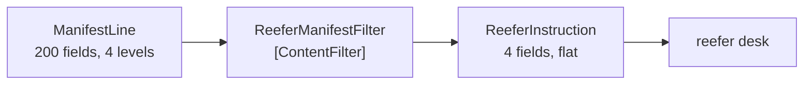

# Content Filter

🌍 🇬🇧 English (this file) · 🇫🇷 [Français](ContentFilter-fr.md)

## Intent

Content Filter removes from a message the items a receiver has no use for, so that a large or deeply nested
message becomes one that is simple to handle.

## Problem

A vessel manifest arrives with two hundred fields per container, nested four levels deep because it is modelled
on the carrier's database.

The reefer desk needs four of them: the box, the set point, the plug and whether it is running.

Handed the manifest whole, the desk has to navigate the carrier's schema to reach them — which makes a component
about temperature control into a component that knows the carrier's data model, and breaks when the carrier
reorganises a level of nesting that the desk never used. Two hundred fields also travel, and are logged, and are
stored, and are visible to anybody who reads the desk's queue, including the shipper's commercial values.

## Solution

The pattern cuts the message down.

A content filter strips a message to the items that matter, and **often flattens its structure while doing so** —
both are the pattern rather than one being an incidental extra. What reaches the desk is four fields at one
level.

It is the opposite of a [content enricher](ContentEnricher-en.md), and it is **not** a
[message filter](MessageFilter-en.md): nothing here decides whether a message travels. That distinction is the
one thing to be sure of, because the two names differ by one word and do entirely different jobs.

## Structure



One message in, one message out — always. A diagram with a discarded branch would be a message filter.

## The roles

| Role | Annotation | Applies to | What it carries |
|---|---|---|---|
| ContentFilter | `[ContentFilter]` | interface, class | The participant that strips a message down to the items that matter, and often flattens its structure. |

One role, and what it claims is a **reduction**. That is worth annotating because a reduction is invisible
downstream: the reefer desk sees a small tidy message and has no way to know whether that is what arrived or what
a filter left.

## The example

From [`ContentFilterUsage.cs`](../../../../DesignPatternCatalog.Usage/EnterpriseIntegration/ContentFilterUsage.cs).

The manifest's shape, in three types:

```csharp
public sealed record ManifestLine(string ContainerNumber, ManifestCargo Cargo, ManifestReefer? Reefer);
```

```csharp
public sealed record ManifestCargo(string Description, string HsCode, decimal ValueUsd, string Shipper);
```

`ManifestCargo` is worth pausing on: it carries the shipper's name and the cargo's declared value in dollars, and
the reefer desk has no business with either. The filter is removing commercially sensitive data as well as
irrelevant data, which is a second reason to have one that the pattern's name does not advertise.

What the desk actually reads:

```csharp
public sealed record ReeferInstruction(string ContainerNumber, decimal SetPointCelsius, string PlugType, bool Running);
```

Four fields, **flat**. `SetPointCelsius` was two levels down in `ManifestReefer`, and here it is at the top —
flattening is half of what the pattern does, and the type says so.

The filter:

```csharp
public IEnumerable<ReeferInstruction> Filter(IEnumerable<ManifestLine> manifest) {
    foreach (ManifestLine line in manifest) {
        if (line.Reefer is null) { continue; }

        yield return new ReeferInstruction(line.ContainerNumber,
                                           line.Reefer.SetPointCelsius,
                                           line.Reefer.PlugType,
                                           line.Reefer.RunningOnArrival);
    }
}
```

The `continue` on a null `Reefer` is the one place this sample does something a strict reading might call
filtering — a dry box produces no instruction. It is defensible because a `ReeferInstruction` for a container with
no reefer data would be a record of nothing, but it is worth seeing: **a content filter that starts dropping
elements is edging toward a [splitter](Splitter-en.md) with a filter after it**, and the arithmetic stops holding.

The sample states both halves of the pattern and the trap: *it removes items and flattens the nesting at the same
time — both are the pattern. The opposite of a content enricher, and not a message filter: nothing here decides
whether a message travels.*

## Applicability

**Use a content filter where a receiver needs a fraction of a large message.** The book's case, and it is the
usual condition of anything derived from a partner's database schema.

**Use it to flatten as well as to cut.** Nesting that exists because of the sender's model is nesting the receiver
should not navigate.

**Use it to keep data where it belongs.** Commercial values and shipper names not reaching the reefer desk is a
benefit worth having on purpose.

**Use it before a queue, not after.** What is removed is not stored, not logged and not visible in the desk's
channel, which is most of the value.

## When not to use it

**Do not confuse it with a message filter.** A [message filter](MessageFilter-en.md) drops whole messages and
leaves the ones it keeps untouched; this changes every message and drops none. Same word, opposite job.

**Do not use it where a receiver may later need what was removed.** The data is gone from the message, and getting
it back means an [enricher](ContentEnricher-en.md) and a source that still has it.

**Do not use it where the message is small already.** Four fields out of six is a translator with delusions.

**Do not let it become a business rule.** Removing a field because *the desk should not act on it* is a policy
decision, and infrastructure is where it will not be found.

**Do not lose the correlation.** Filtering away an identifier because the receiver does not read it makes the
message untraceable and unmatched later — headers are not payload, and this pattern is about payload.

**Do not use it where a [claim check](ClaimCheck-en.md) is the real answer.** If the bulk is needed later by
somebody, storing it and passing a key keeps it available; filtering it discards it.

## Advantages

* The receiver handles a small flat message instead of navigating somebody else's schema.
* The receiver stops depending on parts of the sender's model it never used.
* Data the receiver has no business with does not travel, is not logged and is not stored.
* Less bandwidth and less storage, proportional to what was cut.
* The reduction is in one named place rather than in every receiver's parsing code.

## Drawbacks

* What it removes is gone, and getting it back needs a source that still has it.
* The reduction is invisible downstream: a small message and a filtered one look identical.
* A filter that removes one field too many fails at the receiver, far from the cause.
* It is easy to slide into dropping elements, at which point it is doing a second job.
* One filter per receiver means several, and each is a place the sender's schema is known.

## Relations with other patterns

**`ContentEnricher`** is the opposite operation, and the pair is the chapter's cleanest symmetry: one adds what the
sender lacked, the other removes what the receiver does not want.

**`MessageFilter`** is the near-homonym in the routing chapter, and the distinction is total: that one decides
whether a message travels, this one changes what it contains.

**`MessageTranslator`** is the broader pattern this narrows — a content filter is a translator whose transformation
is a projection.

**`ClaimCheck`** is the alternative when the bulk must survive somewhere: store it rather than discard it.

**`Splitter`** is what a content filter turns into if it starts emitting one message per element rather than
reshaping each one.

## Source

*Enterprise Integration Patterns*, Gregor Hohpe and Bobby Woolf, Addison-Wesley, 2003 — the message-transformation
chapter.

* [Index entry](../../../generated/catalog-index.md#contentfilter-enterprise-integration-patterns)
* [Generated attribute](../../../../DesignPatternCatalog.EnterpriseIntegration/ContentFilter.cs)
* [Example](../../../../DesignPatternCatalog.Usage/EnterpriseIntegration/ContentFilterUsage.cs)
