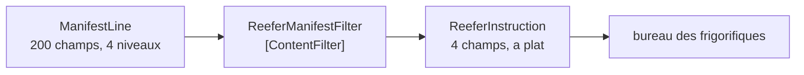

# Content Filter

🌍 🇫🇷 Français (ce fichier) · 🇬🇧 [English](ContentFilter-en.md)

## Intention

Content Filter retire d'un message les éléments dont un receveur n'a pas l'usage, de sorte qu'un message grand ou
profondément imbriqué devienne simple à traiter.

## Problème

Un manifeste de navire arrive avec deux cents champs par conteneur, imbriqués sur quatre niveaux parce qu'il est
calqué sur la base de données du transporteur.

Le bureau des frigorifiques en a besoin de quatre : la boîte, la consigne, la prise et si elle tourne.

Recevant le manifeste entier, le bureau doit naviguer le schéma du transporteur pour les atteindre — ce qui fait
d'un composant traitant de régulation thermique un composant qui connaît le modèle de données du transporteur, et
qui casse quand celui-ci réorganise un niveau d'imbrication que le bureau n'employait pas. Deux cents champs
voyagent aussi, sont journalisés, sont stockés, et sont visibles de quiconque lit la file du bureau — y compris les
valeurs commerciales du chargeur.

## Solution

Le patron réduit le message.

Un filtre de contenu réduit un message aux éléments qui comptent, et **aplatit souvent sa structure au passage** —
les deux sont le patron plutôt que l'un accessoire de l'autre. Ce qui atteint le bureau, ce sont quatre champs sur
un seul niveau.

Il est l'inverse d'un [enrichisseur](ContentEnricher-fr.md), et il n'est **pas** un
[filtre de messages](MessageFilter-fr.md) : rien ici ne décide si un message voyage. Cette distinction est la seule
chose dont il faut être sûr, parce que les deux noms diffèrent d'un mot et font des métiers entièrement différents.

## Structure



Un message en entrée, un message en sortie — toujours. Un diagramme avec une branche jetée serait un filtre de
messages.

## Les rôles

| Rôle | Annotation | S'applique à | Ce qu'il porte |
|---|---|---|---|
| ContentFilter | `[ContentFilter]` | interface, classe | Le participant qui réduit un message aux éléments qui comptent, et aplatit souvent sa structure. |

Un seul rôle, et ce qu'il revendique est une **réduction**. Cela vaut d'être annoté parce qu'une réduction est
invisible en aval : le bureau des frigorifiques voit un petit message bien rangé et n'a aucun moyen de savoir si
c'est ce qui est arrivé ou ce qu'un filtre a laissé.

## L'exemple

Extrait de [`ContentFilterUsage.cs`](../../../../DesignPatternCatalog.Usage/EnterpriseIntegration/ContentFilterUsage.cs).

La forme du manifeste, en trois types :

```csharp
public sealed record ManifestLine(string ContainerNumber, ManifestCargo Cargo, ManifestReefer? Reefer);
```

```csharp
public sealed record ManifestCargo(string Description, string HsCode, decimal ValueUsd, string Shipper);
```

`ManifestCargo` mérite qu'on s'y arrête : il porte le nom du chargeur et la valeur déclarée de la marchandise en
dollars, et le bureau des frigorifiques n'a rien à faire ni de l'un ni de l'autre. Le filtre retire de la donnée
commercialement sensible autant que de la donnée non pertinente, ce qui est une seconde raison d'en avoir un que le
nom du patron n'annonce pas.

Ce que le bureau lit réellement :

```csharp
public sealed record ReeferInstruction(string ContainerNumber, decimal SetPointCelsius, string PlugType, bool Running);
```

Quatre champs, **à plat**. `SetPointCelsius` était deux niveaux plus bas dans `ManifestReefer`, et le voici au
sommet — aplatir est la moitié de ce que fait le patron, et le type le dit.

Le filtre :

```csharp
public IEnumerable<ReeferInstruction> Filter(IEnumerable<ManifestLine> manifest) {
    foreach (ManifestLine line in manifest) {
        if (line.Reefer is null) { continue; }

        yield return new ReeferInstruction(line.ContainerNumber,
                                           line.Reefer.SetPointCelsius,
                                           line.Reefer.PlugType,
                                           line.Reefer.RunningOnArrival);
    }
}
```

Le `continue` sur un `Reefer` nul est le seul endroit où cet exemple fait quelque chose qu'une lecture stricte
appellerait du filtrage — une boîte sèche ne produit aucune instruction. C'est défendable, parce qu'une
`ReeferInstruction` pour un conteneur sans données frigorifiques serait un enregistrement de rien, mais cela vaut
d'être vu : **un filtre de contenu qui se met à jeter des éléments glisse vers un [diviseur](Splitter-fr.md) suivi
d'un filtre**, et l'arithmétique cesse de tenir.

L'exemple énonce les deux moitiés du patron et le piège : *il retire des éléments et aplatit l'imbrication en même
temps — les deux sont le patron. L'inverse d'un enrichisseur, et pas un filtre de messages : rien ici ne décide si
un message voyage.*

## Possibilités d'application

**Employez un filtre de contenu là où un receveur a besoin d'une fraction d'un grand message.** Le cas du livre, et
la condition habituelle de tout ce qui dérive du schéma de base de données d'un partenaire.

**Employez-le pour aplatir autant que pour couper.** Une imbrication qui existe à cause du modèle de l'émetteur est
une imbrication que le receveur ne devrait pas naviguer.

**Employez-le pour garder la donnée là où elle appartient.** Que les valeurs commerciales et les noms de chargeurs
n'atteignent pas le bureau des frigorifiques est un bénéfice qui vaut d'être obtenu exprès.

**Employez-le avant une file, non après.** Ce qui est retiré n'est pas stocké, pas journalisé et pas visible dans le
canal du bureau, ce qui est l'essentiel de la valeur.

## Quand ne pas l'utiliser

**Ne le confondez pas avec un filtre de messages.** Un [filtre de messages](MessageFilter-fr.md) jette des messages
entiers et laisse intacts ceux qu'il garde ; celui-ci change chaque message et n'en jette aucun. Même mot, métier
inverse.

**Ne l'employez pas là où un receveur pourrait plus tard avoir besoin de ce qui a été retiré.** La donnée a disparu
du message, et la récupérer demande un [enrichisseur](ContentEnricher-fr.md) et une source qui l'a encore.

**Ne l'employez pas là où le message est déjà petit.** Quatre champs sur six, c'est un traducteur qui se prend pour
autre chose.

**Ne le laissez pas devenir une règle métier.** Retirer un champ parce que *le bureau ne devrait pas agir dessus*
est une décision de politique, et l'infrastructure est là où elle ne sera pas trouvée.

**Ne perdez pas la corrélation.** Filtrer un identifiant parce que le receveur ne le lit pas rend le message
introuvable et non appariable plus tard — les en-têtes ne sont pas la charge utile, et ce patron porte sur la
charge utile.

**Ne l'employez pas là où une [consigne](ClaimCheck-fr.md) est la vraie réponse.** Si le volume est nécessaire plus
tard à quelqu'un, le stocker et passer une clé le garde disponible ; le filtrer le jette.

## Avantages

* Le receveur traite un petit message plat au lieu de naviguer le schéma d'autrui.
* Le receveur cesse de dépendre de parties du modèle de l'émetteur qu'il n'employait pas.
* La donnée qui ne le regarde pas ne voyage pas, n'est pas journalisée et n'est pas stockée.
* Moins de bande passante et moins de stockage, à proportion de ce qui a été coupé.
* La réduction est à un endroit nommé plutôt que dans le code d'analyse de chaque receveur.

## Inconvénients

* Ce qu'il retire a disparu, et le récupérer demande une source qui l'a encore.
* La réduction est invisible en aval : un petit message et un message filtré se ressemblent.
* Un filtre qui retire un champ de trop échoue chez le receveur, loin de la cause.
* Il est facile de glisser vers le rejet d'éléments, et il fait alors un second métier.
* Un filtre par receveur en fait plusieurs, et chacun est un endroit où le schéma de l'émetteur est connu.

## Liens avec les autres patrons

**`ContentEnricher`** est l'opération inverse, et la paire est la symétrie la plus nette du chapitre : l'un ajoute ce
qui manquait à l'émetteur, l'autre retire ce que le receveur ne veut pas.

**`MessageFilter`** est le quasi-homonyme du chapitre du routage, et la distinction est totale : celui-là décide si
un message voyage, celui-ci change ce qu'il contient.

**`MessageTranslator`** est le patron plus large que celui-ci restreint — un filtre de contenu est un traducteur dont
la transformation est une projection.

**`ClaimCheck`** est l'alternative quand le volume doit survivre quelque part : le stocker plutôt que le jeter.

**`Splitter`** est ce qu'un filtre de contenu devient s'il se met à émettre un message par élément plutôt qu'à
remodeler chacun.

## Source

*Enterprise Integration Patterns*, Gregor Hohpe et Bobby Woolf, Addison-Wesley, 2003 — le chapitre sur la
transformation des messages.

* [Entrée d'index](../../../generated/catalog-index.md#contentfilter-enterprise-integration-patterns)
* [Attribut généré](../../../../DesignPatternCatalog.EnterpriseIntegration/ContentFilter.cs)
* [Exemple](../../../../DesignPatternCatalog.Usage/EnterpriseIntegration/ContentFilterUsage.cs)
