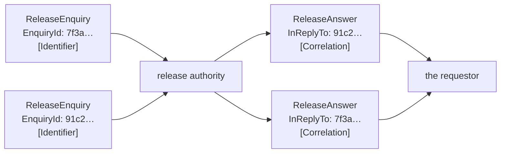

# Correlation Identifier

🌍 🇬🇧 English (this file) · 🇫🇷 [Français](CorrelationIdentifier-fr.md)

## Intent

Correlation Identifier makes a reply name the request it answers, so that a requestor sending many can tell which
answer is which.

## Problem

The terminal has forty release enquiries open at once.

Forty answers come back on one channel, and nothing in an answer says which question it belongs to:

```csharp
void OnAnswer(bool released) { /* released — which container? */ }
```

Matching by arrival order fails the first time two repliers answer at different speeds, which is immediately.
Matching by container number fails as soon as the same container is asked about twice, which is a Tuesday.
Neither is a mechanism; both are guesses that work until they do not, and the failure is a container released
because a different container's answer arrived.

## Solution

The pattern is a pair of properties.

The request carries an identifier. The reply **quotes** it. That quotation is the whole pattern — not a
convention about ordering, not a lookup by content, but the answer naming its own question.

The two halves are two roles, because the pattern is only satisfied when both are present: an identifier nobody
quotes proves nothing, and a quotation of nothing matches nothing.

## Structure



The answers come back in the other order, which is the ordinary case rather than the awkward one, and the
requestor still matches them.

## The roles

| Role | Annotation | Applies to | What it carries |
|---|---|---|---|
| Identifier | `[CorrelationIdentifier.Identifier]` | property, field | The property identifying a request uniquely. |
| Correlation | `[CorrelationIdentifier.Correlation]` | property, field | The property on the reply that quotes the request's identifier. |

Two roles on two different messages, and the second names the first through its `Identifier` argument. That link
is what makes the pair checkable: a reply whose correlation points at a request type that carries no identifier is
a conversation that cannot be matched, and neither message alone shows it.

## The example

From [`CorrelationIdentifierUsage.cs`](../../../../DesignPatternCatalog.Usage/EnterpriseIntegration/CorrelationIdentifierUsage.cs).

The request declares the identifier:

```csharp
[CorrelationIdentifier.Identifier]
public Guid EnquiryId { get; }
```

A `Guid` rather than a sequence number, because two requestors generating numbers independently collide, and the
requestor is not the only one asking this authority anything.

The remark on it is a constraint that is easy to get wrong: *it must stay unique for as long as an answer might
arrive, which is longer than the request takes.* An identifier recycled after an hour is fine until a reply
arrives at ninety minutes and is matched to the wrong question — which is worse than not matching it at all.

The reply quotes it, and names what it is quoting:

```csharp
[CorrelationIdentifier.Correlation(Identifier = typeof(ReleaseEnquiry))]
public Guid InReplyTo { get; }
```

`InReplyTo` — the name says the relation rather than the value. A reply property called `EnquiryId` would read
like the reply having an identifier of its own, which is the confusion the pattern exists to prevent.

The sample states plainly what is being asserted: *an answer without it cannot be matched to anything, and a
requestor holding forty open enquiries has no way to guess.*

## Applicability

**Use a correlation identifier wherever replies arrive on a shared channel.** Which is wherever
[Request-Reply](RequestReply-en.md) is used at all, and the two patterns are always seen together for that
reason.

**Use it where more than one request can be open at a time.** One at a time needs nothing; two at a time needs
this.

**Make the identifier unique for longer than the request takes.** A late answer is the case the pattern is for,
so uniqueness has to outlive the impatience.

**Name the reply's property for the relation.** *In reply to* rather than *id*, so that a reader cannot mistake it
for the reply's own identity.

## When not to use it

**Do not use it where nothing replies.** An [event message](EventMessage-en.md) answers nothing, and an
identifier on one is a correlation nobody will ever quote.

**Do not correlate by content.** Matching an answer to a question by container number works until the same
container is asked about twice, and then it matches the wrong one silently.

**Do not correlate by order.** Two repliers answering at different speeds is the normal case, and order-based
matching fails on the first slow reply rather than on an unusual one.

**Do not reuse an identifier while an answer might still arrive.** A recycled identifier does not fail to match;
it matches something wrong, which is the more expensive failure.

**Do not use it as a business key.** An enquiry identifier is for matching a conversation, and a system that
starts looking up containers by it has given an infrastructure value a domain meaning that nothing maintains.

**Do not confuse it with a sequence identifier.** This says *which conversation*;
[Message Sequence](MessageSequence-en.md)'s says *which set*, and a set has an order and an extent that a
conversation does not.

## Advantages

* An answer can be matched to its question with certainty rather than by inference.
* Replies may arrive in any order, at any speed, from any number of repliers.
* The two annotations state a relation between two message types that a rule can check.
* It costs one property on each side and no coordination between them beyond the value.
* It makes a late answer usable rather than dangerous.

## Drawbacks

* Two message types must agree, and nothing but the annotation records that they do.
* Uniqueness has to be maintained for longer than intuition suggests, and the failure from getting it wrong is a
  wrong match rather than a missing one.
* The requestor must keep state per open request, and something has to clear it.
* An identifier that leaks into logs and stores carries a conversation's shape with it.
* It says which question, not where the answer goes, so it is never enough on its own.

## Relations with other patterns

**`RequestReply`** is the conversation this makes tractable, and the sample there says outright that this is why
the two patterns are always seen together.

**`ReturnAddress`** is the other half: that says where the answer goes, this says what it answers.

**`MessageSequence`**'s sequence identifier is the same idea for a set rather than a conversation, with a position
and an extent as well.

**`Aggregator`** correlates too — it is the routing pattern that collects several messages belonging together,
and it works from an identifier like this one.

**`MessageExpiration`** is what bounds how long an identifier must remain unique, by bounding how late an answer
may arrive.

## Source

*Enterprise Integration Patterns*, Gregor Hohpe and Bobby Woolf, Addison-Wesley, 2003 — the message-construction
chapter.

* [Index entry](../../../generated/catalog-index.md#correlationidentifier-enterprise-integration-patterns)
* [Generated attribute](../../../../DesignPatternCatalog.EnterpriseIntegration/CorrelationIdentifier.cs)
* [Example](../../../../DesignPatternCatalog.Usage/EnterpriseIntegration/CorrelationIdentifierUsage.cs)
