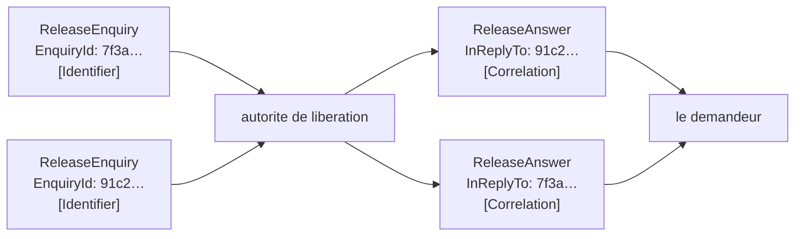

# Correlation Identifier

🌍 🇫🇷 Français (ce fichier) · 🇬🇧 [English](CorrelationIdentifier-en.md)

## Intention

Correlation Identifier fait qu'une réponse nomme la requête à laquelle elle répond, de sorte qu'un demandeur qui en
envoie plusieurs puisse dire quelle réponse est laquelle.

## Problème

Le terminal a quarante demandes de libération ouvertes en même temps.

Quarante réponses reviennent sur un seul canal, et rien dans une réponse ne dit à quelle question elle appartient :

```csharp
void OnAnswer(bool released) { /* libéré — quel conteneur ? */ }
```

Apparier par ordre d'arrivée échoue dès que deux répondeurs répondent à des vitesses différentes, c'est-à-dire tout
de suite. Apparier par numéro de conteneur échoue dès que le même conteneur fait l'objet de deux questions,
c'est-à-dire un mardi. Ni l'un ni l'autre n'est un mécanisme ; les deux sont des devinettes qui marchent jusqu'à ce
qu'elles cessent, et la panne est un conteneur libéré parce que la réponse d'un autre conteneur est arrivée.

## Solution

Le patron est une paire de propriétés.

La requête porte un identifiant. La réponse le **cite**. Cette citation est tout le patron — non une convention sur
l'ordre, non une recherche par le contenu, mais la réponse qui nomme sa propre question.

Les deux moitiés sont deux rôles, parce que le patron n'est satisfait que lorsque les deux sont présents : un
identifiant que personne ne cite ne prouve rien, et la citation de rien n'apparie rien.

## Structure



Les réponses reviennent dans l'autre ordre, ce qui est le cas ordinaire plutôt que le cas gênant, et le demandeur
les apparie tout de même.

## Les rôles

| Rôle | Annotation | S'applique à | Ce qu'il porte |
|---|---|---|---|
| Identifier | `[CorrelationIdentifier.Identifier]` | propriété, champ | La propriété qui identifie une requête de façon unique. |
| Correlation | `[CorrelationIdentifier.Correlation]` | propriété, champ | La propriété de la réponse qui cite l'identifiant de la requête. |

Deux rôles sur deux messages différents, et le second nomme le premier par son argument `Identifier`. Ce lien est ce
qui rend la paire contrôlable : une réponse dont la corrélation désigne un type de requête qui ne porte aucun
identifiant est une conversation qu'on ne peut pas apparier, et aucun des deux messages ne le montre à lui seul.

## L'exemple

Extrait de [`CorrelationIdentifierUsage.cs`](../../../../DesignPatternCatalog.Usage/EnterpriseIntegration/CorrelationIdentifierUsage.cs).

La requête déclare l'identifiant :

```csharp
[CorrelationIdentifier.Identifier]
public Guid EnquiryId { get; }
```

Un `Guid` plutôt qu'un numéro de séquence, parce que deux demandeurs qui génèrent des numéros indépendamment
entrent en collision, et le demandeur n'est pas le seul à poser des questions à cette autorité.

La remarque qui l'accompagne est une contrainte facile à manquer : *il doit rester unique aussi longtemps qu'une
réponse pourrait arriver, ce qui est plus long que la durée de la requête.* Un identifiant recyclé au bout d'une
heure convient jusqu'à ce qu'une réponse arrive à quatre-vingt-dix minutes et soit appariée à la mauvaise question
— ce qui est pire que de ne pas l'apparier du tout.

La réponse le cite, et nomme ce qu'elle cite :

```csharp
[CorrelationIdentifier.Correlation(Identifier = typeof(ReleaseEnquiry))]
public Guid InReplyTo { get; }
```

`InReplyTo` — le nom énonce la relation plutôt que la valeur. Une propriété de réponse appelée `EnquiryId` se
lirait comme la réponse ayant un identifiant à elle, ce qui est la confusion que le patron existe pour empêcher.

L'exemple énonce sans détour ce qui est affirmé : *une réponse qui ne le porte pas ne peut être appariée à rien, et
un demandeur qui tient quarante demandes ouvertes n'a aucun moyen de deviner.*

## Possibilités d'application

**Employez un identifiant de corrélation partout où des réponses arrivent sur un canal partagé.** C'est-à-dire
partout où [Request-Reply](RequestReply-fr.md) est employé, et c'est pour cette raison que les deux patrons se
voient toujours ensemble.

**Employez-le là où plus d'une requête peut être ouverte à la fois.** Une à la fois n'a besoin de rien ; deux à la
fois ont besoin de ceci.

**Rendez l'identifiant unique plus longtemps que ne dure la requête.** Une réponse tardive est le cas pour lequel
le patron existe : l'unicité doit donc survivre à l'impatience.

**Nommez la propriété de la réponse d'après la relation.** *En réponse à* plutôt qu'*identifiant*, pour qu'un
lecteur ne puisse pas la prendre pour l'identité propre de la réponse.

## Quand ne pas l'utiliser

**Ne l'employez pas là où rien ne répond.** Un [message d'événement](EventMessage-fr.md) ne répond à rien, et un
identifiant sur lui est une corrélation que personne ne citera jamais.

**Ne corrélez pas par le contenu.** Apparier une réponse à une question par numéro de conteneur marche jusqu'à ce
que le même conteneur fasse l'objet de deux questions, et alors cela apparie la mauvaise, en silence.

**Ne corrélez pas par l'ordre.** Deux répondeurs qui répondent à des vitesses différentes sont le cas normal, et
l'appariement par l'ordre échoue à la première réponse lente plutôt qu'à une réponse inhabituelle.

**Ne réemployez pas un identifiant tant qu'une réponse pourrait encore arriver.** Un identifiant recyclé n'échoue
pas à apparier ; il apparie quelque chose de faux, ce qui est la panne la plus coûteuse.

**N'en faites pas une clé métier.** Un identifiant de demande sert à apparier une conversation, et un système qui
se met à chercher des conteneurs par lui a donné à une valeur d'infrastructure un sens de domaine que rien ne
maintient.

**Ne le confondez pas avec un identifiant de séquence.** Celui-ci dit *quelle conversation* ; celui de
[Message Sequence](MessageSequence-fr.md) dit *quel ensemble*, et un ensemble a un ordre et une étendue qu'une
conversation n'a pas.

## Avantages

* Une réponse s'apparie à sa question avec certitude plutôt que par inférence.
* Les réponses peuvent arriver dans n'importe quel ordre, à n'importe quelle vitesse, de n'importe quel nombre de
  répondeurs.
* Les deux annotations énoncent entre deux types de messages une relation qu'une règle peut vérifier.
* Cela coûte une propriété de chaque côté et aucune coordination entre elles au-delà de la valeur.
* Cela rend une réponse tardive utilisable plutôt que dangereuse.

## Inconvénients

* Deux types de messages doivent s'accorder, et rien d'autre que l'annotation ne consigne qu'ils s'accordent.
* L'unicité doit être maintenue plus longtemps que l'intuition ne le suggère, et la panne qui suit une erreur est
  un mauvais appariement plutôt qu'un appariement manquant.
* Le demandeur doit garder un état par requête ouverte, et quelque chose doit le purger.
* Un identifiant qui fuit vers les journaux et les stockages emporte avec lui la forme d'une conversation.
* Il dit quelle question, non où va la réponse : il n'est jamais suffisant à lui seul.

## Liens avec les autres patrons

**`RequestReply`** est la conversation que celui-ci rend praticable, et l'exemple là-bas dit sans détour que c'est
pourquoi les deux patrons se voient toujours ensemble.

**`ReturnAddress`** est l'autre moitié : celle-là dit où va la réponse, celui-ci dit à quoi elle répond.

**L'identifiant de séquence de `MessageSequence`** est la même idée pour un ensemble plutôt que pour une
conversation, avec en plus une position et une étendue.

**`Aggregator`** corrèle lui aussi — c'est le patron de routage qui rassemble plusieurs messages allant ensemble,
et il travaille à partir d'un identifiant comme celui-ci.

**`MessageExpiration`** est ce qui borne la durée pendant laquelle un identifiant doit rester unique, en bornant le
retard avec lequel une réponse peut arriver.

## Source

*Enterprise Integration Patterns*, Gregor Hohpe et Bobby Woolf, Addison-Wesley, 2003 — le chapitre sur la
construction des messages.

* [Entrée d'index](../../../generated/catalog-index.md#correlationidentifier-enterprise-integration-patterns)
* [Attribut généré](../../../../DesignPatternCatalog.EnterpriseIntegration/CorrelationIdentifier.cs)
* [Exemple](../../../../DesignPatternCatalog.Usage/EnterpriseIntegration/CorrelationIdentifierUsage.cs)
