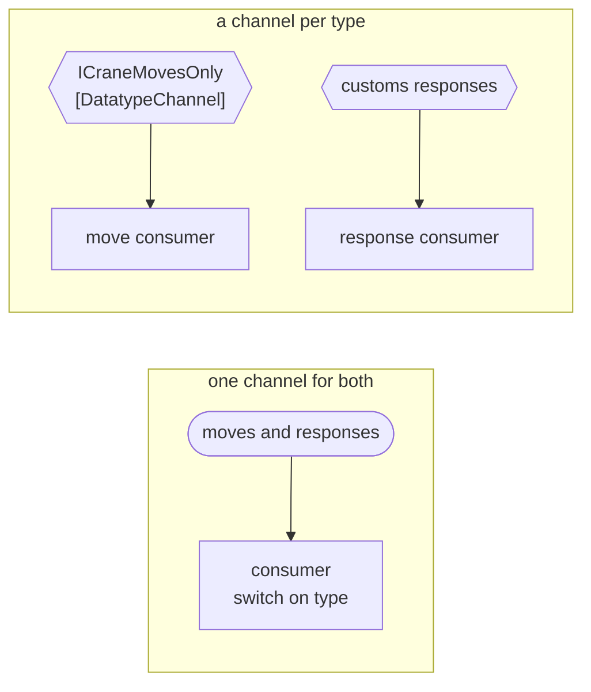

# Datatype Channel

🌍 🇬🇧 English (this file) · 🇫🇷 [Français](DatatypeChannel-fr.md)

## Intent

Datatype Channel carries messages of one type only, so that a receiver knows what it is reading without
inspecting it.

## Problem

Crane moves and customs responses travelled one channel for a year.

Every consumer therefore began the same way:

```csharp
switch (Discriminator(message)) {
    case "MOVE":     HandleMove(message);   break;
    case "RESPONSE": HandleResponse(message); break;
}
```

Two of them got it wrong. Not dramatically — one treated an unknown discriminator as a move, the other fell
through and did nothing — and both were found long after the fact, because a consumer that mishandles a message
it should have ignored looks like a consumer with a bug rather than a channel with two jobs.

The switch is also duplicated per consumer, so the number of places that must agree about what the channel
carries is the number of readers.

## Solution

The pattern gives each type its own channel.

A datatype channel carries one kind of message. A receiver reading it knows what it has, because the only thing
the channel can hand it is that. The switch disappears — not moved somewhere better, but not needed.

The trade is stated plainly by the book and by the sample: more channels to manage, and no receiver that has to
ask what it just got.

## Structure



The lower arrangement has one more channel and one less decision in every consumer.

## The roles

| Role | Annotation | Applies to | What it carries |
|---|---|---|---|
| DatatypeChannel | `[DatatypeChannel]` | interface, class | The channel restricted to one kind of message. |

One role, and it carries a restriction: what makes this channel a datatype channel is what it refuses to carry.
That is not visible in a signature — a channel of `string` can be either — so the annotation is the only place
the restriction is stated.

## The example

From [`DatatypeChannelUsage.cs`](../../../../DesignPatternCatalog.Usage/EnterpriseIntegration/DatatypeChannelUsage.cs).

```csharp
[DatatypeChannel]
public interface ICraneMovesOnly {

    void Send(string craneMove);

}
```

The name carries the pattern twice. `ICraneMovesOnly` says what it is for and, in the *Only*, says what it
refuses — and the parameter is named `craneMove` rather than `message`, so a caller passing a customs response
is writing something that reads wrong before it runs wrong.

The parameter is still a `string`, which is the honest part of the sample. This channel does not get its
guarantee from the type system; a codebase that models each message kind as its own C# type gets some of it from
the compiler, and one that sends serialised text gets none. The annotation is what carries the claim either way.

The sample states the trade rather than only the benefit: *more channels to manage, and no receiver that has to
ask what it just got.*

## Applicability

**Use a datatype channel where consumers were inspecting the message to find out what it is.** The switch on a
discriminator is the symptom the pattern removes.

**Use it where the kinds are handled by different consumers anyway.** If moves go to the yard planner and customs
responses to the declaration service, one channel was only ever a shared pipe with a fork at the end.

**Use it where getting the kind wrong is expensive.** A misread crane move puts a container in the wrong slot,
and the cost of that is what pays for the extra channel.

**Use it to make a receiver's contract true.** A consumer of this channel can state that it handles crane moves,
without the qualification *and ignores everything else*.

## When not to use it

**Do not use it where the kinds are many and thin.** Forty message types means forty channels to name, configure,
monitor and permission, and at that count the book's own answer is a
[Selective Consumer](../../../generated/catalog-index.md#selectiveconsumer-enterprise-integration-patterns) or a
[Content-Based Router](../../../generated/catalog-index.md#contentbasedrouter-enterprise-integration-patterns)
rather than a channel each.

**Do not use it where every consumer wants every kind.** If all four readers handle both moves and responses,
splitting the channel doubles the plumbing and removes no decision.

**Do not split by anything other than type.** One channel per type is the pattern; one channel per customer, per
priority or per shift is routing, and doing it with channels means the routing decision is made by the sender.

**Do not treat it as validation.** A datatype channel says what the channel is *for*, not that everything on it
conforms. A malformed crane move on a crane-moves channel is still malformed, and where it goes is
[Invalid Message Channel](InvalidMessageChannel-en.md)'s subject.

**Do not expect it to survive a format change quietly.** Adding a field to the crane move changes what this
channel carries, and because consumers no longer check, nothing on the reading side will notice — the
[Format Indicator](../../../generated/catalog-index.md#formatindicator-enterprise-integration-patterns) exists
for that.

## Advantages

* A receiver knows what it is reading, and its contract can say so without qualification.
* The type switch disappears from every consumer rather than being written once per consumer.
* Fewer ways to mishandle a message, since a message of the wrong kind cannot arrive.
* Monitoring and permissions become per-type, because the channel is per-type.

## Drawbacks

* More channels to name, configure and watch, and the count grows with the message vocabulary.
* Adding a message type means adding infrastructure rather than a case in a switch.
* The restriction is a claim rather than a check, unless the codebase happens to model each kind as its own type.
* A consumer genuinely interested in several kinds now reads several channels, and reassembling an order across
  them is work the single channel did for free.

## Relations with other patterns

**`MessageChannel`** is the root this narrows, and it narrows it along a different axis from the
point-to-point/publish-subscribe pair: those say *how many receivers*, this says *what may travel*.

**`CommandMessage`**, **`DocumentMessage`** and **`EventMessage`** are the three kinds the book distinguishes, and
they are the most common reason to want a channel each.

**`SelectiveConsumer`** is the alternative when the channel cannot be split: the consumer states what it will
take rather than the channel stating what it carries.

**`ContentBasedRouter`** is the other alternative — one channel in, a channel per type out, with the decision
made once instead of by every reader.

**`InvalidMessageChannel`** is where a message that claims to be of this channel's type and is not ends up.

**`FormatIndicator`** is what makes a change to the one type survivable, since consumers on this channel have
stopped looking.

## Source

*Enterprise Integration Patterns*, Gregor Hohpe and Bobby Woolf, Addison-Wesley, 2003 — the messaging-channels
chapter.

* [Index entry](../../../generated/catalog-index.md#datatypechannel-enterprise-integration-patterns)
* [Generated attribute](../../../../DesignPatternCatalog.EnterpriseIntegration/DatatypeChannel.cs)
* [Example](../../../../DesignPatternCatalog.Usage/EnterpriseIntegration/DatatypeChannelUsage.cs)
