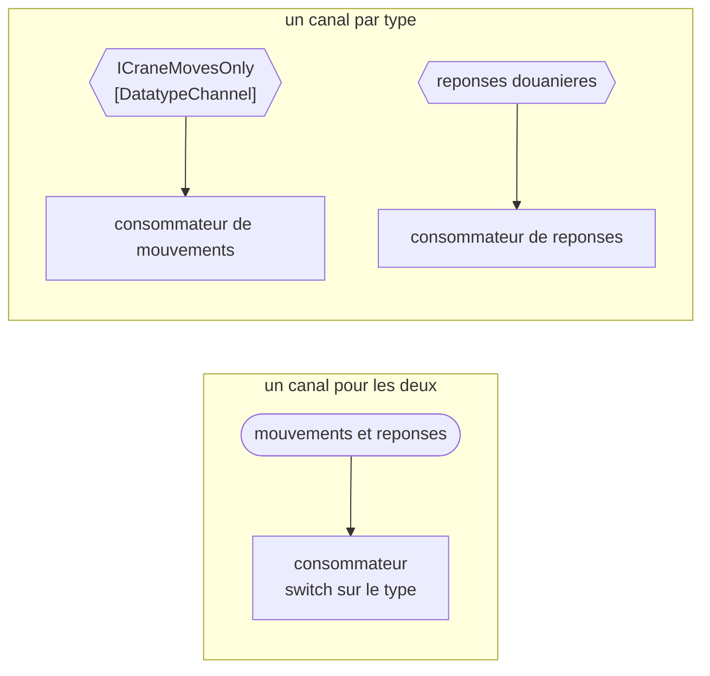

# Datatype Channel

🌍 🇫🇷 Français (ce fichier) · 🇬🇧 [English](DatatypeChannel-en.md)

## Intention

Datatype Channel ne porte que des messages d'un seul type, de sorte qu'un receveur sache ce qu'il lit sans
l'inspecter.

## Problème

Les mouvements de portique et les réponses douanières ont voyagé sur un même canal pendant un an.

Chaque consommateur commençait donc de la même façon :

```csharp
switch (Discriminator(message)) {
    case "MOVE":     HandleMove(message);   break;
    case "RESPONSE": HandleResponse(message); break;
}
```

Deux d'entre eux se sont trompés. Pas spectaculairement — l'un traitait un discriminant inconnu comme un
mouvement, l'autre passait à travers sans rien faire — et les deux ont été trouvés longtemps après, parce qu'un
consommateur qui traite mal un message qu'il aurait dû ignorer ressemble à un consommateur qui a un bogue plutôt
qu'à un canal qui a deux métiers.

Le `switch` est aussi dupliqué par consommateur, si bien que le nombre d'endroits qui doivent s'accorder sur ce
que porte le canal est le nombre de lecteurs.

## Solution

Le patron donne à chaque type son propre canal.

Un canal de type ne porte qu'une sorte de message. Un receveur qui le lit sait ce qu'il a, parce que la seule
chose que le canal puisse lui tendre est cela. Le `switch` disparaît — non pas déplacé quelque part de mieux, mais
inutile.

L'échange est énoncé sans détour par le livre et par l'exemple : plus de canaux à gérer, et aucun receveur qui
doive demander ce qu'il vient de recevoir.

## Structure



L'agencement du bas a un canal de plus et une décision de moins dans chaque consommateur.

## Les rôles

| Rôle | Annotation | S'applique à | Ce qu'il porte |
|---|---|---|---|
| DatatypeChannel | `[DatatypeChannel]` | interface, classe | Le canal restreint à une seule sorte de message. |

Un seul rôle, et il porte une restriction : ce qui fait de ce canal un canal de type, c'est ce qu'il refuse de
porter. Cela n'est pas visible dans une signature — un canal de `string` peut être l'un ou l'autre — donc
l'annotation est le seul endroit où la restriction est énoncée.

## L'exemple

Extrait de [`DatatypeChannelUsage.cs`](../../../../DesignPatternCatalog.Usage/EnterpriseIntegration/DatatypeChannelUsage.cs).

```csharp
[DatatypeChannel]
public interface ICraneMovesOnly {

    void Send(string craneMove);

}
```

Le nom porte le patron deux fois. `ICraneMovesOnly` dit à quoi il sert et, par le *Only*, dit ce qu'il refuse — et
le paramètre s'appelle `craneMove` plutôt que `message`, si bien qu'un appelant qui passe une réponse douanière
écrit quelque chose qui se lit mal avant de mal s'exécuter.

Le paramètre reste un `string`, et c'est la part honnête de l'exemple. Ce canal ne tire pas sa garantie du système
de types ; un code qui modélise chaque sorte de message comme son propre type C# en tire une partie du
compilateur, et un code qui envoie du texte sérialisé n'en tire rien. L'annotation est ce qui porte la
revendication dans les deux cas.

L'exemple énonce l'échange plutôt que le seul bénéfice : *plus de canaux à gérer, et aucun receveur qui doive
demander ce qu'il vient de recevoir.*

## Possibilités d'application

**Employez un canal de type là où les consommateurs inspectaient le message pour savoir ce qu'il est.** Le
`switch` sur un discriminant est le symptôme que le patron retire.

**Employez-le là où les sortes sont de toute façon traitées par des consommateurs différents.** Si les mouvements
vont au planificateur de parc et les réponses douanières au service des déclarations, un canal unique n'a jamais
été qu'un tuyau partagé avec une fourche au bout.

**Employez-le là où se tromper de sorte coûte cher.** Un mouvement de portique mal lu met un conteneur dans le
mauvais emplacement, et le coût de cela est ce qui paie le canal supplémentaire.

**Employez-le pour rendre vrai le contrat d'un receveur.** Un consommateur de ce canal peut énoncer qu'il traite
les mouvements de portique, sans la réserve *et ignore tout le reste*.

## Quand ne pas l'utiliser

**Ne l'employez pas là où les sortes sont nombreuses et minces.** Quarante types de messages font quarante canaux
à nommer, configurer, surveiller et autoriser, et à ce compte la réponse propre du livre est un
[Selective Consumer](../../../generated/catalog-index.md#selectiveconsumer-enterprise-integration-patterns) ou un
[Content-Based Router](../../../generated/catalog-index.md#contentbasedrouter-enterprise-integration-patterns)
plutôt qu'un canal chacun.

**Ne l'employez pas là où chaque consommateur veut chaque sorte.** Si les quatre lecteurs traitent à la fois les
mouvements et les réponses, scinder le canal double la plomberie et ne retire aucune décision.

**Ne scindez pas selon autre chose que le type.** Un canal par type est le patron ; un canal par client, par
priorité ou par vacation est du routage, et le faire avec des canaux signifie que la décision de routage est prise
par l'émetteur.

**N'y voyez pas une validation.** Un canal de type dit à quoi le canal *sert*, non que tout ce qui s'y trouve est
conforme. Un mouvement de portique mal formé sur un canal de mouvements reste mal formé, et où il va est le sujet
d'[Invalid Message Channel](InvalidMessageChannel-fr.md).

**N'attendez pas qu'il survive discrètement à un changement de format.** Ajouter un champ au mouvement de portique
change ce que ce canal porte, et comme les consommateurs ne vérifient plus, rien du côté lecture ne le remarquera
— le [Format Indicator](../../../generated/catalog-index.md#formatindicator-enterprise-integration-patterns)
existe pour cela.

## Avantages

* Un receveur sait ce qu'il lit, et son contrat peut le dire sans réserve.
* Le `switch` sur le type disparaît de chaque consommateur au lieu d'être écrit une fois par consommateur.
* Moins de façons de mal traiter un message, puisqu'un message de la mauvaise sorte ne peut pas arriver.
* Surveillance et autorisations deviennent par type, parce que le canal est par type.

## Inconvénients

* Plus de canaux à nommer, configurer et surveiller, et le compte croît avec le vocabulaire des messages.
* Ajouter un type de message demande d'ajouter de l'infrastructure plutôt qu'un cas dans un `switch`.
* La restriction est une revendication plutôt qu'un contrôle, à moins que le code ne modélise justement chaque
  sorte comme son propre type.
* Un consommateur réellement intéressé par plusieurs sortes lit désormais plusieurs canaux, et y rétablir un ordre
  est un travail que le canal unique faisait gratuitement.

## Liens avec les autres patrons

**`MessageChannel`** est la racine que celui-ci restreint, et il la restreint selon un axe différent de celui de
la paire point-à-point / publication-abonnement : celles-là disent *combien de receveurs*, celui-ci dit *ce qui
peut voyager*.

**`CommandMessage`**, **`DocumentMessage`** et **`EventMessage`** sont les trois sortes que le livre distingue, et
elles sont la raison la plus courante de vouloir un canal chacune.

**`SelectiveConsumer`** est l'alternative quand le canal ne peut pas être scindé : le consommateur énonce ce qu'il
prendra plutôt que le canal ce qu'il porte.

**`ContentBasedRouter`** est l'autre alternative — un canal en entrée, un canal par type en sortie, la décision
étant prise une fois plutôt que par chaque lecteur.

**`InvalidMessageChannel`** est là où finit un message qui se dit du type de ce canal et ne l'est pas.

**`FormatIndicator`** est ce qui rend un changement de l'unique type survivable, puisque les consommateurs de ce
canal ont cessé de regarder.

## Source

*Enterprise Integration Patterns*, Gregor Hohpe et Bobby Woolf, Addison-Wesley, 2003 — le chapitre sur les canaux
de messagerie.

* [Entrée d'index](../../../generated/catalog-index.md#datatypechannel-enterprise-integration-patterns)
* [Attribut généré](../../../../DesignPatternCatalog.EnterpriseIntegration/DatatypeChannel.cs)
* [Exemple](../../../../DesignPatternCatalog.Usage/EnterpriseIntegration/DatatypeChannelUsage.cs)
