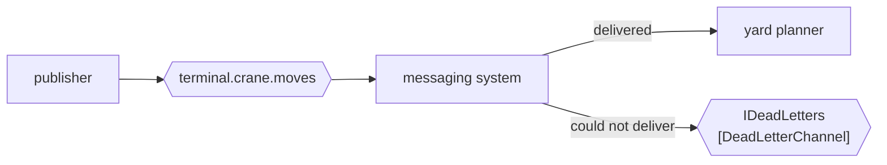

# Dead Letter Channel

🌍 🇬🇧 English (this file) · 🇫🇷 [Français](DeadLetterChannel-fr.md)

## Intent

Dead Letter Channel gives the messaging system somewhere to put a message it cannot deliver, so that a failure to
deliver is visible rather than silent.

## Problem

A channel is renamed during a deployment. Eleven crane moves are already in flight, addressed to a channel that
no longer exists.

Nobody wrote a bug. The publisher published successfully, the moves were accepted, and the deployment was
correct — and the eleven have nowhere to go. If the broker drops them, the yard is wrong by eleven containers and
nothing anywhere records why. The yard planner cannot report it, because from its side nothing arrived; the
publisher cannot report it, because from its side everything was sent.

That is the shape of the problem: a failure with no participant in a position to notice it.

## Solution

The pattern gives the messaging system a channel of its own for these.

When delivery fails — the channel is gone, the message expired, the receiver rejected it at the transport level,
the retry count ran out — the messaging system parks the message on a dead letter channel instead of discarding
it. The failure becomes an object somebody can count, alert on and inspect.

What distinguishes this from [Invalid Message Channel](InvalidMessageChannel-en.md) is **who decides**. There, a
receiver read the message and refused it. Here, no receiver ever saw it: the decision belongs to the messaging
system, and the message may be perfectly valid.

## Structure



The rejecting arrow starts at the messaging system, and the receiver is not on that path at all. Compare the
diagram on the invalid message channel's page: same shape, different origin.

## The roles

| Role | Annotation | Applies to | What it carries |
|---|---|---|---|
| DeadLetterChannel | `[DeadLetterChannel]` | interface, class | The channel the messaging system moves an undeliverable message to. |

One role. Most brokers provide this channel as configuration rather than as code, and where they do there is
nothing to annotate — which is the ordinary condition of every role here rather than a gap. The annotation earns
its place where a codebase gives the dead letter channel a type, usually because something has to consume it.

## The example

From [`DeadLetterChannelUsage.cs`](../../../../DesignPatternCatalog.Usage/EnterpriseIntegration/DeadLetterChannelUsage.cs).

```csharp
[DeadLetterChannel]
public interface IDeadLetters {

    void Park(string message, string reason);

}
```

`Park` rather than `Reject` or `Send`. The message is not refused and not forwarded; it is set aside, still
intact, in the expectation that somebody will come back to it. The verb is the difference between this and its
counterpart, where the receiver had read the message and declined it.

The second parameter is the same idea as the invalid message channel's `why` and a different fact: `reason` here
is a delivery failure — *channel not found*, *expired*, *retry limit reached* — rather than a judgement about
content. A dead letter with no reason is nearly useless, because the message itself looks fine.

The name is `IDeadLetters`, plural, and that is a small honesty: this channel is a collection somebody works
through, not an event somebody handles.

The sample states what is worth checking: *the assertion worth checking is that nothing is lost quietly: a
channel with no dead letter channel behind it drops messages and says nothing.*

## Applicability

**Use a dead letter channel behind every channel that matters.** The book's framing is that undeliverable
messages should be visible; a channel without one loses messages and reports nothing.

**Use it to make deployments and renames survivable.** Messages in flight during a change are the ordinary case,
not the exceptional one.

**Use it as the destination for expiry.** A message with a
[Message Expiration](../../../generated/catalog-index.md#messageexpiration-enterprise-integration-patterns) that
passes its deadline is undeliverable by decision rather than by accident, and this is where the book puts it.

**Monitor it, and alert on it being non-empty.** A dead letter channel's value is entirely in somebody finding
out; the messages are already lost in every sense except recoverability.

## When not to use it

**Do not use it for a message a receiver read and rejected.** That is
[Invalid Message Channel](InvalidMessageChannel-en.md), and mixing the two produces one channel where *the
partner sent nonsense* and *we renamed a queue* are indistinguishable — two different problems for two different
people.

**Do not treat it as a retry queue.** Replaying a dead letter channel blindly re-sends messages whose deadline
has passed and whose destination may still not exist. Reprocessing is a decision per message, and the book's
retry-shaped answers are elsewhere.

**Do not let it substitute for guaranteed delivery.** A dead letter channel records that a message was not
delivered; it does not survive the broker's host restarting. That is
[Guaranteed Delivery](GuaranteedDelivery-en.md)'s job, and a dead letter channel held in memory is a record of
losses that can itself be lost.

**Do not leave it unread.** The same warning as its counterpart, and it applies harder here: nothing in the
application will ever mention this channel, so if no alert watches it, no human will learn of it.

**Do not expect it to preserve order.** Whatever is parked and later replayed arrives after everything sent in
the meantime.

## Advantages

* A failure to deliver becomes visible instead of silent.
* The message survives, so a recovery is possible at all.
* Deployments, renames and expiries stop being silent losses.
* It is a channel, so it can be counted, alerted on and consumed like any other.
* It costs nothing in the application: no publisher or receiver writes a line for it.

## Drawbacks

* It records the loss rather than preventing it, and a reader can mistake having one for being safe.
* Nothing in the application refers to it, which makes it the easiest channel in a system to forget to monitor.
* The reason comes from the messaging system, so its usefulness is limited by what that system chooses to say.
* Replaying it is a judgement per message, and the pattern does not describe how.
* Held in memory it can be lost with the broker, which is the failure it exists to report.

## Relations with other patterns

**`InvalidMessageChannel`** is the counterpart, and the pair divides by who decided: the messaging system here,
the receiver there.

**`GuaranteedDelivery`** is the complement rather than the alternative — that one keeps the message through a
crash, this one reports that it never arrived.

**`MessageExpiration`** produces dead letters by design: a message that outlives its usefulness is undeliverable
on purpose, and this is where it lands.

**`MessageChannel`** is the root both this and the invalid message channel narrow.

**`ControlBus`** is how a dead letter channel usually gets watched, since monitoring it is an operations concern
rather than an application one.

## Source

*Enterprise Integration Patterns*, Gregor Hohpe and Bobby Woolf, Addison-Wesley, 2003 — the messaging-channels
chapter.

* [Index entry](../../../generated/catalog-index.md#deadletterchannel-enterprise-integration-patterns)
* [Generated attribute](../../../../DesignPatternCatalog.EnterpriseIntegration/DeadLetterChannel.cs)
* [Example](../../../../DesignPatternCatalog.Usage/EnterpriseIntegration/DeadLetterChannelUsage.cs)
