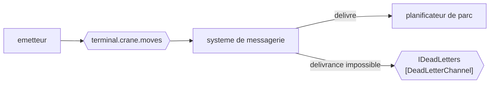

# Dead Letter Channel

🌍 🇫🇷 Français (ce fichier) · 🇬🇧 [English](DeadLetterChannel-en.md)

## Intention

Dead Letter Channel donne au système de messagerie un endroit où mettre un message qu'il ne peut pas délivrer, de
sorte qu'un échec de délivrance soit visible plutôt que silencieux.

## Problème

Un canal est renommé pendant un déploiement. Onze mouvements de portique sont déjà en vol, adressés à un canal qui
n'existe plus.

Personne n'a écrit de bogue. L'émetteur a publié avec succès, les mouvements ont été acceptés, et le déploiement
était correct — et les onze n'ont nulle part où aller. Si le courtier les jette, le parc est faux de onze conteneurs
et rien nulle part n'en consigne la raison. Le planificateur de parc ne peut pas le signaler, parce que de son côté
rien n'est arrivé ; l'émetteur ne peut pas le signaler, parce que de son côté tout a été envoyé.

Voilà la forme du problème : une panne dont aucun participant n'est en position de s'apercevoir.

## Solution

Le patron donne au système de messagerie un canal à lui pour ceux-là.

Quand la délivrance échoue — le canal a disparu, le message a expiré, le receveur l'a refusé au niveau du
transport, le compte de réessais est épuisé — le système de messagerie gare le message sur un canal de lettres
mortes au lieu de le jeter. La panne devient un objet que quelqu'un peut compter, alerter et inspecter.

Ce qui le distingue d'[Invalid Message Channel](InvalidMessageChannel-fr.md), c'est **qui décide**. Là, un receveur
a lu le message et l'a refusé. Ici, aucun receveur ne l'a jamais vu : la décision appartient au système de
messagerie, et le message peut être parfaitement valide.

## Structure



La flèche du refus part du système de messagerie, et le receveur n'est pas du tout sur ce chemin. À comparer au
diagramme de la page du canal de messages invalides : même forme, autre origine.

## Les rôles

| Rôle | Annotation | S'applique à | Ce qu'il porte |
|---|---|---|---|
| DeadLetterChannel | `[DeadLetterChannel]` | interface, classe | Le canal vers lequel le système de messagerie déplace un message indélivrable. |

Un seul rôle. La plupart des courtiers fournissent ce canal en configuration plutôt qu'en code, et là où c'est le
cas il n'y a rien à annoter — ce qui est la condition ordinaire de tout rôle ici plutôt qu'un manque. L'annotation
gagne sa place là où un code donne un type au canal de lettres mortes, d'ordinaire parce que quelque chose doit le
consommer.

## L'exemple

Extrait de [`DeadLetterChannelUsage.cs`](../../../../DesignPatternCatalog.Usage/EnterpriseIntegration/DeadLetterChannelUsage.cs).

```csharp
[DeadLetterChannel]
public interface IDeadLetters {

    void Park(string message, string reason);

}
```

`Park` plutôt que `Reject` ou `Send`. Le message n'est pas refusé et n'est pas transmis ; il est mis de côté, encore
intact, dans l'attente que quelqu'un y revienne. Le verbe est la différence entre celui-ci et son pendant, où le
receveur avait lu le message et l'avait décliné.

Le second paramètre est la même idée que le `why` du canal de messages invalides et un fait différent : `reason`
est ici un échec de délivrance — *canal introuvable*, *expiré*, *limite de réessais atteinte* — plutôt qu'un
jugement sur le contenu. Une lettre morte sans raison est presque inutile, parce que le message lui-même a l'air
bon.

Le nom est `IDeadLetters`, au pluriel, et c'est une petite honnêteté : ce canal est une collection que quelqu'un
dépile, non un événement que quelqu'un traite.

L'exemple énonce ce qui vaut d'être vérifié : *l'affirmation qui vaut d'être vérifiée est que rien n'est perdu
discrètement : un canal sans canal de lettres mortes derrière lui jette des messages et ne dit rien.*

## Possibilités d'application

**Employez un canal de lettres mortes derrière tout canal qui compte.** Le cadrage du livre est que les messages
indélivrables devraient être visibles ; un canal qui n'en a pas perd des messages et ne signale rien.

**Employez-le pour rendre déploiements et renommages survivables.** Des messages en vol pendant un changement sont
le cas ordinaire, non le cas exceptionnel.

**Employez-le comme destination de l'expiration.** Un message doté d'un
[Message Expiration](../../../generated/catalog-index.md#messageexpiration-enterprise-integration-patterns) qui
passe son échéance est indélivrable par décision plutôt que par accident, et c'est ici que le livre le met.

**Surveillez-le, et alertez sur le fait qu'il n'est pas vide.** La valeur d'un canal de lettres mortes est
entièrement dans le fait que quelqu'un l'apprenne ; les messages sont déjà perdus en tous sens sauf celui de la
récupérabilité.

## Quand ne pas l'utiliser

**Ne l'employez pas pour un message qu'un receveur a lu et rejeté.** C'est
[Invalid Message Channel](InvalidMessageChannel-fr.md), et mêler les deux produit un canal où *le partenaire a
envoyé n'importe quoi* et *nous avons renommé une file* sont indiscernables — deux problèmes différents pour deux
personnes différentes.

**N'y voyez pas une file de réessai.** Rejouer un canal de lettres mortes en aveugle renvoie des messages dont
l'échéance est passée et dont la destination peut toujours ne pas exister. Le retraitement est une décision par
message, et les réponses en forme de réessai du livre sont ailleurs.

**Ne le laissez pas se substituer à la délivrance garantie.** Un canal de lettres mortes consigne qu'un message n'a
pas été délivré ; il ne survit pas au redémarrage de l'hôte du courtier. C'est l'affaire de
[Guaranteed Delivery](GuaranteedDelivery-fr.md), et un canal de lettres mortes tenu en mémoire est un relevé de
pertes qui peut lui-même être perdu.

**Ne le laissez pas non lu.** Le même avertissement que pour son pendant, et il vaut plus fort ici : rien dans
l'application ne mentionnera jamais ce canal, donc si aucune alerte ne le surveille, aucun humain ne l'apprendra.

**N'attendez pas qu'il préserve l'ordre.** Ce qui est garé puis rejoué arrive après tout ce qui a été envoyé
entre-temps.

## Avantages

* Un échec de délivrance devient visible au lieu d'être silencieux.
* Le message survit, ce qui rend une récupération possible tout court.
* Déploiements, renommages et expirations cessent d'être des pertes silencieuses.
* C'est un canal : il peut être compté, alerté et consommé comme n'importe quel autre.
* Il ne coûte rien dans l'application : aucun émetteur ni receveur n'écrit une ligne pour lui.

## Inconvénients

* Il consigne la perte plutôt qu'il ne l'empêche, et un lecteur peut prendre le fait d'en avoir un pour une
  sécurité.
* Rien dans l'application ne s'y réfère, ce qui en fait le canal le plus facile d'un système à oublier de
  surveiller.
* La raison vient du système de messagerie : son utilité est bornée par ce que ce système choisit de dire.
* Le rejouer est un jugement par message, et le patron ne décrit pas comment.
* Tenu en mémoire, il peut être perdu avec le courtier, ce qui est la panne qu'il existe pour signaler.

## Liens avec les autres patrons

**`InvalidMessageChannel`** est le pendant, et la paire se divise selon qui a décidé : le système de messagerie ici,
le receveur là.

**`GuaranteedDelivery`** est le complément plutôt que l'alternative — celui-là garde le message à travers une panne,
celui-ci signale qu'il n'est jamais arrivé.

**`MessageExpiration`** produit des lettres mortes par conception : un message qui survit à son utilité est
indélivrable exprès, et c'est ici qu'il atterrit.

**`MessageChannel`** est la racine que celui-ci et le canal de messages invalides restreignent tous deux.

**`ControlBus`** est la façon dont un canal de lettres mortes est d'ordinaire surveillé, puisque le surveiller est
une préoccupation d'exploitation plutôt que d'application.

## Source

*Enterprise Integration Patterns*, Gregor Hohpe et Bobby Woolf, Addison-Wesley, 2003 — le chapitre sur les canaux
de messagerie.

* [Entrée d'index](../../../generated/catalog-index.md#deadletterchannel-enterprise-integration-patterns)
* [Attribut généré](../../../../DesignPatternCatalog.EnterpriseIntegration/DeadLetterChannel.cs)
* [Exemple](../../../../DesignPatternCatalog.Usage/EnterpriseIntegration/DeadLetterChannelUsage.cs)
