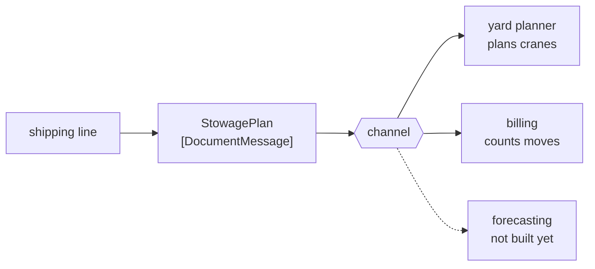

# Document Message

🌍 🇬🇧 English (this file) · 🇫🇷 [Français](DocumentMessage-fr.md)

## Intent

Document Message carries data with no instruction attached, so that the receiver decides what to do with what it
has been given.

## Problem

The shipping line sends the stowage plan for a vessel.

It is not an order. The terminal will use it to plan cranes, the billing system will use it to count moves, and
next quarter something else will use it to forecast yard occupancy. The line does not care which, and has no
standing to say.

Sent as a command — `PlanCranesFrom(stowagePlan)` — the message asserts an authority the line does not have, and
binds the plan to one use. Sent as an event, it claims something happened when what really happened is that a
document was produced. Neither name fits, and the mismatch shows up as a receiver doing what it was told rather
than what it needs.

## Solution

The pattern is a message that transfers a **thing** rather than an order.

A document message hands data over and stops. The sender is indifferent to what happens next, and that
indifference is the point rather than an omission: it is what lets a document be used by a receiver the sender
never imagined.

It is the middle of the book's three kinds. A [command](CommandMessage-en.md) says *do this*, an
[event](EventMessage-en.md) says *this happened*, and a document says *here it is*.

## Structure



Three receivers doing three different things with one document, and the dotted one is the receiver the sender
never imagined.

## The roles

| Role | Annotation | Applies to | What it carries |
|---|---|---|---|
| DocumentMessage | `[DocumentMessage]` | class, struct | The message that transfers a thing rather than an order. |

One role, on the message type. Like the other two kinds it carries a recorded relation — `DocumentMessage`
**narrows** `Message` — and the three are among the few narrowings the catalogue states, because the book states
them outright
([ADR-0030](../../for-maintainers/adr/0030-relate-only-the-narrowings-a-work-states-outright.md)).

## The example

From [`DocumentMessageUsage.cs`](../../../../DesignPatternCatalog.Usage/EnterpriseIntegration/DocumentMessageUsage.cs).

```csharp
[DocumentMessage]
public sealed record StowagePlan(string VesselCall, IReadOnlyList<string> Slots);
```

The name is a **noun**. `StowagePlan` — not `PlanStowage`, which would be a command, and not `StowagePlanned`,
which would be an event. Across the three kinds the naming is most of what a reader has, and this one names a
document the way the paper version is named.

`IReadOnlyList<string>` is the sample being careful. A document that a receiver can modify is a document whose
readers disagree about what it said, and read-only is the cheapest way to keep one plan one plan.

There is no verb anywhere in the type, and no addressee. Nothing in it says who should read it or what they
should conclude — which is exactly the property that lets billing and the yard planner both be right.

The sample states what the indifference is worth: *the sender is indifferent to what happens next, which is what
lets a document be used by a receiver the sender never imagined.*

## Applicability

**Use a document message to transfer data between applications.** The book's plainest case: the sender has
something, the receiver needs it, and no instruction is implied.

**Use it where the receiver knows better than the sender what to do.** A terminal knows how to plan its own
cranes; a shipping line does not, and should not be issuing instructions about them.

**Use it where several receivers will use the same data differently.** One document, several conclusions, and no
change to the sender when a fourth appears.

**Name it as a noun.** The kind is carried largely by the name, and a document named with a verb will be read as
a command.

## When not to use it

**Do not use it where something really must happen.** If the hold must be applied and not applying it is a
defect, the message is a [command](CommandMessage-en.md), and a document leaves every receiver free to do
nothing.

**Do not use it to announce a fact.** *The container moved* is an [event](EventMessage-en.md); a document
carrying it invites receivers to treat news as reference data.

**Do not send it and then depend on what a receiver does with it.** The moment the sender relies on a particular
receiver's conclusion, the indifference is gone and the message was a command that avoided saying so.

**Do not use it as a workaround for not knowing who should act.** A document sent because the sender could not
decide whether it was a command leaves the decision to whoever happens to consume it, which is the same decision
made worse.

**Do not let it grow into a shared model everybody must agree on.** A document read by six applications becomes a
contract with six signatories, and the pattern that describes reconciling that is
[Canonical Data Model](../../../generated/catalog-index.md#canonicaldatamodel-enterprise-integration-patterns) —
with [Bounded Context](../domain-driven-design/BoundedContext-en.md) as the argument for not trying.

## Advantages

* The receiver decides, which is usually where the knowledge is.
* A new consumer costs the sender nothing, and needs no permission.
* It carries no authority, so it cannot assert one the sender does not have.
* It is the kind that ages best: data outlives the reason it was first sent.
* Read-only data cannot be argued about after the fact.

## Drawbacks

* Nothing must happen, so a document that everybody ignores fails silently.
* The distinction from the other two kinds rests on naming, which nothing enforces.
* Several receivers interpreting one document is several interpretations, and they can drift apart.
* A widely-read document becomes a shared contract, and changing it needs everybody's agreement.
* Because no reply is implied, the sender learns nothing — not even that the document was unreadable.

## Relations with other patterns

**`Message`** is what this narrows, and the relation is recorded rather than inferred.

**`CommandMessage`** and **`EventMessage`** are the other two kinds; the trio divides on who decides what happens
next, and this is the kind that leaves the decision with the receiver.

**`MessageSequence`** is what a document needs when it does not fit one message — a four-hundred-container
discharge list is a document in twenty parts.

**`FormatIndicator`** matters most here, because a document is read by consumers the sender does not know about
and therefore cannot redeploy.

**`MessageTranslator`** is what stands between a document and a receiver whose format differs, since neither side
will change.

**`CanonicalDataModel`** is where a widely-shared document ends up when the number of formats makes pairwise
translation untenable.

## Source

*Enterprise Integration Patterns*, Gregor Hohpe and Bobby Woolf, Addison-Wesley, 2003 — the message-construction
chapter.

* [Index entry](../../../generated/catalog-index.md#documentmessage-enterprise-integration-patterns)
* [Generated attribute](../../../../DesignPatternCatalog.EnterpriseIntegration/DocumentMessage.cs)
* [Example](../../../../DesignPatternCatalog.Usage/EnterpriseIntegration/DocumentMessageUsage.cs)
