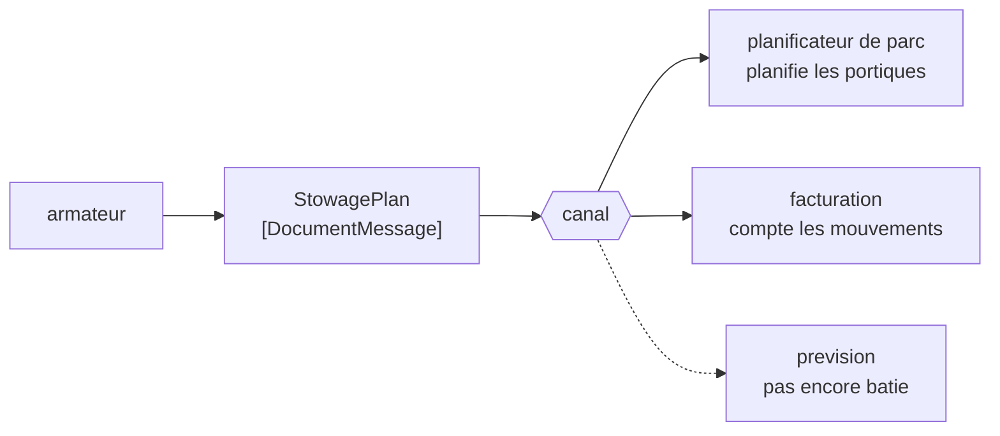

# Document Message

🌍 🇫🇷 Français (ce fichier) · 🇬🇧 [English](DocumentMessage-en.md)

## Intention

Document Message porte des données sans instruction attachée, de sorte que le receveur décide quoi faire de ce
qu'on lui a remis.

## Problème

L'armateur envoie le plan d'arrimage d'un navire.

Ce n'est pas un ordre. Le terminal s'en servira pour planifier les portiques, la facturation pour compter les
mouvements, et le trimestre prochain autre chose s'en servira pour prévoir l'occupation du parc. L'armateur ne se
soucie pas duquel, et n'a pas qualité pour le dire.

Envoyé comme commande — `PlanCranesFrom(stowagePlan)` — le message affirme une autorité que l'armateur n'a pas, et
lie le plan à un seul usage. Envoyé comme événement, il prétend que quelque chose a eu lieu alors que ce qui a eu
lieu, c'est qu'un document a été produit. Aucun des deux noms ne convient, et le désaccord se voit à un receveur
qui fait ce qu'on lui a dit plutôt que ce dont il a besoin.

## Solution

Le patron est un message qui transfère une **chose** plutôt qu'un ordre.

Un message de document remet des données et s'arrête. L'émetteur est indifférent à ce qui arrive ensuite, et cette
indifférence est le propos plutôt qu'un oubli : c'est elle qui permet à un document d'être employé par un receveur
que l'émetteur n'a jamais imaginé.

C'est le milieu des trois sortes du livre. Une [commande](CommandMessage-fr.md) dit *fais ceci*, un
[événement](EventMessage-fr.md) dit *ceci a eu lieu*, et un document dit *le voici*.

## Structure



Trois receveurs qui font trois choses différentes d'un même document, et celui en pointillés est le receveur que
l'émetteur n'a jamais imaginé.

## Les rôles

| Rôle | Annotation | S'applique à | Ce qu'il porte |
|---|---|---|---|
| DocumentMessage | `[DocumentMessage]` | classe, structure | Le message qui transfère une chose plutôt qu'un ordre. |

Un seul rôle, sur le type du message. Comme les deux autres sortes il porte une relation enregistrée —
`DocumentMessage` **restreint** `Message` — et les trois font partie des rares restrictions que le catalogue
énonce, parce que le livre les énonce sans détour
([ADR-0030](../../for-maintainers/adr/0030-relate-only-the-narrowings-a-work-states-outright.md)).

## L'exemple

Extrait de [`DocumentMessageUsage.cs`](../../../../DesignPatternCatalog.Usage/EnterpriseIntegration/DocumentMessageUsage.cs).

```csharp
[DocumentMessage]
public sealed record StowagePlan(string VesselCall, IReadOnlyList<string> Slots);
```

Le nom est un **nom commun**. `StowagePlan` — non `PlanStowage`, qui serait une commande, et non `StowagePlanned`,
qui serait un événement. À travers les trois sortes, la dénomination est l'essentiel de ce dont dispose un lecteur,
et celle-ci nomme un document comme se nomme sa version papier.

`IReadOnlyList<string>` est l'exemple qui reste prudent. Un document qu'un receveur peut modifier est un document
dont les lecteurs ne s'accordent pas sur ce qu'il disait, et la lecture seule est la façon la moins chère de garder
un plan pour un plan.

Il n'y a aucun verbe dans le type, et aucun destinataire. Rien en lui ne dit qui devrait le lire ni ce qu'il devrait
en conclure — ce qui est exactement la propriété qui permet à la facturation et au planificateur de parc d'avoir
tous deux raison.

L'exemple énonce ce que vaut l'indifférence : *l'émetteur est indifférent à ce qui arrive ensuite, ce qui est ce qui
permet à un document d'être employé par un receveur que l'émetteur n'a jamais imaginé.*

## Possibilités d'application

**Employez un message de document pour transférer des données entre applications.** Le cas le plus simple du livre :
l'émetteur a quelque chose, le receveur en a besoin, et aucune instruction n'est sous-entendue.

**Employez-le là où le receveur sait mieux que l'émetteur ce qu'il faut faire.** Un terminal sait planifier ses
propres portiques ; un armateur non, et il ne devrait pas donner d'instructions à leur sujet.

**Employez-le là où plusieurs receveurs emploieront les mêmes données différemment.** Un document, plusieurs
conclusions, et aucun changement de l'émetteur quand un quatrième apparaît.

**Nommez-le comme un nom commun.** La sorte est portée pour l'essentiel par le nom, et un document nommé avec un
verbe sera lu comme une commande.

## Quand ne pas l'utiliser

**Ne l'employez pas là où quelque chose doit réellement se produire.** Si la retenue doit être posée et que ne pas la
poser est un défaut, le message est une [commande](CommandMessage-fr.md), et un document laisse chaque receveur libre
de ne rien faire.

**Ne l'employez pas pour annoncer un fait.** *Le conteneur a bougé* est un [événement](EventMessage-fr.md) ; un
document qui le porte invite les receveurs à traiter une nouvelle comme une donnée de référence.

**Ne l'envoyez pas pour ensuite dépendre de ce qu'un receveur en fait.** Dès l'instant où l'émetteur compte sur la
conclusion d'un receveur particulier, l'indifférence a disparu et le message était une commande qui évitait de le
dire.

**N'en faites pas un contournement du fait de ne pas savoir qui doit agir.** Un document envoyé parce que l'émetteur
n'a pas su décider s'il s'agissait d'une commande laisse la décision à qui le consomme, ce qui est la même décision
en pire.

**Ne le laissez pas devenir un modèle partagé sur lequel tout le monde doit s'accorder.** Un document lu par six
applications devient un contrat à six signataires, et le patron qui décrit comment réconcilier cela est
[Canonical Data Model](../../../generated/catalog-index.md#canonicaldatamodel-enterprise-integration-patterns) — avec
[Bounded Context](../domain-driven-design/BoundedContext-fr.md) comme argument pour ne pas essayer.

## Avantages

* Le receveur décide, ce qui est d'ordinaire là où se trouve la connaissance.
* Un nouveau consommateur ne coûte rien à l'émetteur, et n'a besoin d'aucune permission.
* Il ne porte aucune autorité : il ne peut donc pas en affirmer une que l'émetteur n'a pas.
* C'est la sorte qui vieillit le mieux : les données survivent à la raison de leur premier envoi.
* Des données en lecture seule ne se discutent pas après coup.

## Inconvénients

* Rien ne doit se produire : un document que tout le monde ignore échoue en silence.
* La distinction d'avec les deux autres sortes repose sur la dénomination, que rien n'impose.
* Plusieurs receveurs qui interprètent un document, ce sont plusieurs interprétations, et elles peuvent diverger.
* Un document largement lu devient un contrat partagé, et le changer demande l'accord de tous.
* Comme aucune réponse n'est sous-entendue, l'émetteur n'apprend rien — pas même que le document était illisible.

## Liens avec les autres patrons

**`Message`** est ce que celui-ci restreint, et la relation est enregistrée plutôt qu'inférée.

**`CommandMessage`** et **`EventMessage`** sont les deux autres sortes ; le trio se divise sur qui décide de ce qui
arrive ensuite, et celle-ci est la sorte qui laisse la décision au receveur.

**`MessageSequence`** est ce dont un document a besoin quand il ne tient pas dans un message — une liste de
déchargement de quatre cents conteneurs est un document en vingt parties.

**`FormatIndicator`** compte le plus ici, parce qu'un document est lu par des consommateurs que l'émetteur ne connaît
pas et ne peut donc pas redéployer.

**`MessageTranslator`** est ce qui se tient entre un document et un receveur dont le format diffère, puisque aucun des
deux côtés ne changera.

**`CanonicalDataModel`** est là où finit un document largement partagé quand le nombre de formats rend la traduction
deux à deux intenable.

## Source

*Enterprise Integration Patterns*, Gregor Hohpe et Bobby Woolf, Addison-Wesley, 2003 — le chapitre sur la
construction des messages.

* [Entrée d'index](../../../generated/catalog-index.md#documentmessage-enterprise-integration-patterns)
* [Attribut généré](../../../../DesignPatternCatalog.EnterpriseIntegration/DocumentMessage.cs)
* [Exemple](../../../../DesignPatternCatalog.Usage/EnterpriseIntegration/DocumentMessageUsage.cs)
