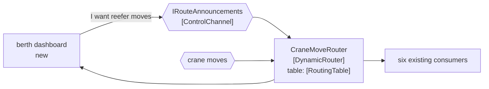

# Dynamic Router

🌍 🇬🇧 English (this file) · 🇫🇷 [Français](DynamicRouter-fr.md)

## Intent

Dynamic Router lets the destinations tell the router how to reach them, so that adding one is a message rather
than a change to the router.

## Problem

Six systems consume crane moves, and next month a seventh — a berth productivity dashboard nobody has written
yet.

A [content-based router](ContentBasedRouter-en.md) with the six compiled in solved the sender's problem: the
crane knows nobody. But the seventh destination is now a change to the router, a code review, a build and a
deployment — for a system the router's owners have no interest in and did not ask for.

The coupling was moved rather than removed. It is smaller and it is in a better place, and it is still a
deployment per destination.

## Solution

The pattern lets the seventh announce itself.

What the router knows becomes **data it maintains** rather than code it contains. A destination sends a message
on a control channel saying what it is interested in and where to reach it; the router records that and routes
accordingly. A new destination costs the router no edit.

It keeps the single hop of a content-based router — one message, one destination, no broadcast — while losing
the need to know every destination in advance.

## Structure



The control channel is a second inbound arrow, and it is the whole difference from the static router: the
knowledge arrives as a message.

## The roles

| Role | Annotation | Applies to | What it carries |
|---|---|---|---|
| DynamicRouter | `[DynamicRouter.DynamicRouter]` | interface, class | The router whose rule is data it maintains rather than code it contains. |
| ControlChannel | `[DynamicRouter.ControlChannel]` | interface, class | The channel a destination announces itself on. |
| RoutingTable | `[DynamicRouter.RoutingTable]` | property, field | What the router learned from the control channel. |

Three roles, and the second and third are what make the first dynamic. Annotating the table separately is worth
the trouble because it is the part that has to survive — or be rebuilt after — a restart, and a reader looking at
the router alone would not see that.

## The example

From [`DynamicRouterUsage.cs`](../../../../DesignPatternCatalog.Usage/EnterpriseIntegration/DynamicRouterUsage.cs).

The control channel first:

```csharp
[DynamicRouter.ControlChannel]
public interface IRouteAnnouncements {

    void Announce(string subscriberChannel, string interestedIn);

}
```

Two parameters: where to reach me, and what I want. That is the minimum a destination has to say, and it is
notable that the router is not told *who* — a channel and an interest, with no identity, which keeps the router
from acquiring a list of systems as well as a list of routes.

Then the table, annotated on the property rather than the field:

```csharp
[DynamicRouter.RoutingTable]
public IReadOnlyDictionary<string, List<string>> RoutingTable => _table;
```

`IReadOnlyDictionary` exposed over a mutable field: the table is answerable from outside and changeable only from
within. That is what makes it inspectable at run time — *which routes does this router currently believe in* is a
question somebody will ask during an incident, and a dynamic router that cannot answer it is worse than a static
one that never needed to.

The remark names the cost in the same breath as the benefit: *state rather than configuration, which is what
makes it answerable at run time — and what has to be rebuilt after a restart.*

The router's own annotation points at the table:

```csharp
[DynamicRouter.DynamicRouter(RoutingTable = typeof(CraneMoveRouter))]
```

And the sample states what the pattern preserves: *it keeps the single hop of a content-based router while losing
the need to know every destination in advance.*

## Applicability

**Use a dynamic router where destinations are added by people who do not own the router.** The book's case, and
the one where the deployment-per-destination is a real organisational cost.

**Use it where the set of destinations changes often.** If it changes twice a year, a content-based router and
two deployments is less machinery.

**Expose the routing table.** A rule that lives in data is a rule nobody can read in the source, so being able to
ask the running system is not a luxury.

**Decide how the table is rebuilt.** A router that forgets its routes on restart routes nothing until every
destination announces itself again.

## When not to use it

**Do not use it where the destinations are stable.** The table, the control channel and the restart problem are
all cost, and a [content-based router](ContentBasedRouter-en.md) has none of them.

**Do not use it where a publish-subscribe channel would do.** If every interested party should get every message,
[Publish-Subscribe Channel](PublishSubscribeChannel-en.md) achieves the same decoupling with no router at all —
the dynamic router earns its place only when exactly one destination is right.

**Do not let the control channel be unauthenticated.** Anything that can send an announcement can redirect
traffic, which makes the control channel a security boundary rather than plumbing.

**Do not lose the table silently on restart.** A router that comes back empty routes nothing, and nothing
downstream reports it — the messages simply stop, which looks like a quiet terminal.

**Do not put the rule beyond reading.** The trade of code for data means the routing is no longer in the
repository; if the table is also not inspectable and not logged, nobody can say why a message went where it
went.

## Advantages

* A new destination costs the router no edit and no deployment.
* The routing knowledge is owned by the parties that have it — each destination declares its own interest.
* It keeps the single hop: one message, one destination, no broadcast.
* The table can be inspected at run time, which a compiled rule cannot.
* The router's owners stop being a dependency in other teams' projects.

## Drawbacks

* The rule is no longer in the source, so *why did this message go there* needs a running system to answer.
* The table is state, and state has to be rebuilt after a restart or persisted.
* The control channel is an attack surface: whoever can announce can redirect.
* An announcement that is wrong misroutes silently, and nothing rejects it.
* It is more machinery than a static router, for a benefit that only appears when destinations change often.

## Relations with other patterns

**`ContentBasedRouter`** is the static form, and the trade between them is deployment cost against run-time
state.

**`MessageRouter`** is the root both narrow.

**`PublishSubscribeChannel`** is the alternative when every interested party should get a copy — it decouples the
same way without a routing table.

**`RecipientList`** is the multi-destination sibling, and a dynamic router with a table of several subscribers
per interest is close to one built from announcements.

**`ControlBus`** is the system-management pattern the control channel resembles, and where a router's table is
usually inspected from.

**`MessageBroker`** is what this becomes when one dynamic router learns the whole estate's topology.

## Source

*Enterprise Integration Patterns*, Gregor Hohpe and Bobby Woolf, Addison-Wesley, 2003 — the message-routing
chapter.

* [Index entry](../../../generated/catalog-index.md#dynamicrouter-enterprise-integration-patterns)
* [Generated attribute](../../../../DesignPatternCatalog.EnterpriseIntegration/DynamicRouter.cs)
* [Example](../../../../DesignPatternCatalog.Usage/EnterpriseIntegration/DynamicRouterUsage.cs)
