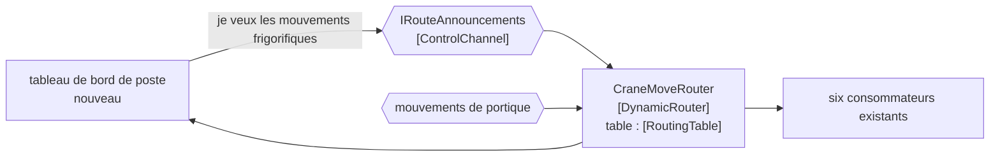

# Dynamic Router

🌍 🇫🇷 Français (ce fichier) · 🇬🇧 [English](DynamicRouter-en.md)

## Intention

Dynamic Router laisse les destinations dire au routeur comment les atteindre, de sorte qu'en ajouter une soit un
message plutôt qu'un changement du routeur.

## Problème

Six systèmes consomment les mouvements de portique, et le mois prochain un septième — un tableau de bord de
productivité de poste que personne n'a encore écrit.

Un [routeur fondé sur le contenu](ContentBasedRouter-fr.md) avec les six compilés dedans a résolu le problème de
l'émetteur : le portique ne connaît personne. Mais la septième destination est désormais un changement du routeur,
une relecture, une compilation et un déploiement — pour un système dont les propriétaires du routeur n'ont cure et
qu'ils n'ont pas demandé.

Le couplage a été déplacé plutôt que retiré. Il est plus petit et il est mieux placé, et c'est toujours un
déploiement par destination.

## Solution

Le patron laisse le septième s'annoncer.

Ce que le routeur connaît devient **une donnée qu'il maintient** plutôt qu'un code qu'il contient. Une destination
envoie un message sur un canal de contrôle disant ce qui l'intéresse et où l'atteindre ; le routeur le consigne et
route en conséquence. Une nouvelle destination ne coûte au routeur aucune modification.

Il garde le saut unique d'un routeur fondé sur le contenu — un message, une destination, aucune diffusion — tout en
perdant le besoin de connaître toutes les destinations à l'avance.

## Structure



Le canal de contrôle est une seconde flèche entrante, et c'est toute la différence d'avec le routeur statique : la
connaissance arrive sous forme de message.

## Les rôles

| Rôle | Annotation | S'applique à | Ce qu'il porte |
|---|---|---|---|
| DynamicRouter | `[DynamicRouter.DynamicRouter]` | interface, classe | Le routeur dont la règle est une donnée qu'il maintient plutôt qu'un code qu'il contient. |
| ControlChannel | `[DynamicRouter.ControlChannel]` | interface, classe | Le canal sur lequel une destination s'annonce. |
| RoutingTable | `[DynamicRouter.RoutingTable]` | propriété, champ | Ce que le routeur a appris du canal de contrôle. |

Trois rôles, et les deuxième et troisième sont ce qui rend le premier dynamique. Annoter la table séparément vaut la
peine parce que c'est la part qui doit survivre à un redémarrage — ou être rebâtie après — et qu'un lecteur regardant
le seul routeur ne le verrait pas.

## L'exemple

Extrait de [`DynamicRouterUsage.cs`](../../../../DesignPatternCatalog.Usage/EnterpriseIntegration/DynamicRouterUsage.cs).

Le canal de contrôle d'abord :

```csharp
[DynamicRouter.ControlChannel]
public interface IRouteAnnouncements {

    void Announce(string subscriberChannel, string interestedIn);

}
```

Deux paramètres : où m'atteindre, et ce que je veux. C'est le minimum qu'une destination doive dire, et il est
notable que le routeur n'apprenne pas *qui* — un canal et un intérêt, sans identité, ce qui empêche le routeur
d'acquérir une liste de systèmes en plus d'une liste de routes.

Puis la table, annotée sur la propriété plutôt que sur le champ :

```csharp
[DynamicRouter.RoutingTable]
public IReadOnlyDictionary<string, List<string>> RoutingTable => _table;
```

Un `IReadOnlyDictionary` exposé au-dessus d'un champ mutable : la table est interrogeable du dehors et modifiable
seulement du dedans. C'est ce qui la rend inspectable à l'exécution — *quelles routes ce routeur croit-il
actuellement* est une question que quelqu'un posera pendant un incident, et un routeur dynamique qui ne sait pas y
répondre est pire qu'un routeur statique qui n'en a jamais eu besoin.

La remarque nomme le coût dans le même souffle que le bénéfice : *un état plutôt qu'une configuration, ce qui la rend
interrogeable à l'exécution — et ce qu'il faut rebâtir après un redémarrage.*

L'annotation du routeur désigne la table :

```csharp
[DynamicRouter.DynamicRouter(RoutingTable = typeof(CraneMoveRouter))]
```

Et l'exemple énonce ce que le patron préserve : *il garde le saut unique d'un routeur fondé sur le contenu tout en
perdant le besoin de connaître toutes les destinations à l'avance.*

## Possibilités d'application

**Employez un routeur dynamique là où les destinations sont ajoutées par des gens qui ne possèdent pas le routeur.**
Le cas du livre, et celui où le déploiement par destination est un coût organisationnel réel.

**Employez-le là où l'ensemble des destinations change souvent.** S'il change deux fois l'an, un routeur fondé sur le
contenu et deux déploiements font moins de machinerie.

**Exposez la table de routage.** Une règle qui vit dans une donnée est une règle que personne ne peut lire dans les
sources : pouvoir interroger le système en marche n'est pas un luxe.

**Décidez comment la table est rebâtie.** Un routeur qui oublie ses routes au redémarrage ne route plus rien jusqu'à
ce que chaque destination se soit annoncée de nouveau.

## Quand ne pas l'utiliser

**Ne l'employez pas là où les destinations sont stables.** La table, le canal de contrôle et le problème du
redémarrage sont tous du coût, et un [routeur fondé sur le contenu](ContentBasedRouter-fr.md) n'en a aucun.

**Ne l'employez pas là où un canal de publication-abonnement suffirait.** Si chaque intéressé doit recevoir chaque
message, [Publish-Subscribe Channel](PublishSubscribeChannel-fr.md) obtient le même découplage sans aucun routeur —
le routeur dynamique ne gagne sa place que lorsque exactement une destination est la bonne.

**Ne laissez pas le canal de contrôle sans authentification.** Tout ce qui peut envoyer une annonce peut détourner du
trafic, ce qui fait du canal de contrôle une frontière de sécurité plutôt que de la plomberie.

**Ne perdez pas la table en silence au redémarrage.** Un routeur qui revient vide ne route plus rien, et rien en aval
ne le signale — les messages s'arrêtent simplement, ce qui ressemble à un terminal tranquille.

**Ne mettez pas la règle hors de portée de la lecture.** Échanger du code contre de la donnée signifie que le routage
n'est plus dans le dépôt ; si la table n'est en outre ni inspectable ni journalisée, personne ne peut dire pourquoi un
message est allé là où il est allé.

## Avantages

* Une nouvelle destination ne coûte au routeur aucune modification ni aucun déploiement.
* La connaissance du routage appartient aux parties qui l'ont — chaque destination déclare son propre intérêt.
* Il garde le saut unique : un message, une destination, aucune diffusion.
* La table peut être inspectée à l'exécution, ce qu'une règle compilée ne permet pas.
* Les propriétaires du routeur cessent d'être une dépendance dans les projets des autres équipes.

## Inconvénients

* La règle n'est plus dans les sources : *pourquoi ce message est-il allé là* demande un système en marche pour
  répondre.
* La table est un état, et un état doit être rebâti après un redémarrage ou persisté.
* Le canal de contrôle est une surface d'attaque : qui peut s'annoncer peut détourner.
* Une annonce fausse achemine mal en silence, et rien ne la rejette.
* C'est plus de machinerie qu'un routeur statique, pour un bénéfice qui n'apparaît que si les destinations changent
  souvent.

## Liens avec les autres patrons

**`ContentBasedRouter`** est la forme statique, et l'échange entre les deux est le coût de déploiement contre l'état
à l'exécution.

**`MessageRouter`** est la racine que les deux restreignent.

**`PublishSubscribeChannel`** est l'alternative quand chaque intéressé doit recevoir une copie — il découple de la
même façon sans table de routage.

**`RecipientList`** est le frère multi-destinations, et un routeur dynamique dont la table porte plusieurs abonnés par
intérêt en est proche, bâti à partir d'annonces.

**`ControlBus`** est le patron d'exploitation auquel ressemble le canal de contrôle, et l'endroit depuis lequel la
table d'un routeur est d'ordinaire inspectée.

**`MessageBroker`** est ce que celui-ci devient quand un routeur dynamique apprend la topologie de tout le parc.

## Source

*Enterprise Integration Patterns*, Gregor Hohpe et Bobby Woolf, Addison-Wesley, 2003 — le chapitre sur le routage
des messages.

* [Entrée d'index](../../../generated/catalog-index.md#dynamicrouter-enterprise-integration-patterns)
* [Attribut généré](../../../../DesignPatternCatalog.EnterpriseIntegration/DynamicRouter.cs)
* [Exemple](../../../../DesignPatternCatalog.Usage/EnterpriseIntegration/DynamicRouterUsage.cs)
