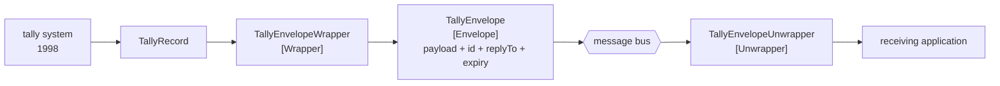

# Envelope Wrapper

🌍 🇬🇧 English (this file) · 🇫🇷 [Français](EnvelopeWrapper-fr.md)

## Intent

Envelope Wrapper wraps application data in an envelope the messaging infrastructure understands and unwraps it at
the destination, so that an application that knows nothing of headers can still take part.

## Problem

The terminal's tally system was written in 1998 and emits a flat record: container number, move type, timestamp.

The message bus wants a [correlation identifier](CorrelationIdentifier-en.md), a
[return address](ReturnAddress-en.md) and an [expiry](MessageExpiration-en.md) on every message, and rejects
anything without them.

Neither side can be changed. Teaching the tally system about headers means modifying a system nobody maintains
into a system that knows about a bus that did not exist when it was written; relaxing the bus means every
application on it loses the guarantees the headers were introduced for.

## Solution

The pattern puts the tally record inside something the bus accepts, and takes it back out at the far end.

The envelope carries the application's data plus whatever the infrastructure requires around it. The tally system
never learns what a header is, and the bus never sees a message without one.

Naming the envelope keeps the two apart: everything inside belongs to the application, everything around it
belongs to the transport, and **a field that drifts from one side to the other is visible**.

## Structure



The wrapper and the unwrapper are at opposite ends and belong to different applications — which is why they are
two roles rather than one participant with two methods.

## The roles

| Role | Annotation | Applies to | What it carries |
|---|---|---|---|
| Envelope | `[EnvelopeWrapper.Envelope]` | interface, class, struct | The type carrying the application data plus whatever the infrastructure requires around it. |
| Wrapper | `[EnvelopeWrapper.Wrapper]` | interface, class | The participant that puts application data into the envelope. |
| Unwrapper | `[EnvelopeWrapper.Unwrapper]` | interface, class | The participant that takes application data back out at the destination. |

Three roles, and the split between wrapper and unwrapper is the one worth explaining. They are **named separately
because they live in different applications and are written by different people** — an envelope opened by nobody
is a message the receiver will reject as malformed, and that failure is invisible from either end alone.

## The example

From [`EnvelopeWrapperUsage.cs`](../../../../DesignPatternCatalog.Usage/EnterpriseIntegration/EnvelopeWrapperUsage.cs).

What the tally system produces, and all it knows how to produce:

```csharp
public sealed record TallyRecord(string ContainerNumber, string MoveType, DateTimeOffset At);
```

No annotation on it. The payload is not a role in this pattern — it is the application's own type, and the
pattern's whole purpose is that it stays that way.

The envelope:

```csharp
[EnvelopeWrapper.Envelope]
public sealed class TallyEnvelope {

    public TallyRecord     Payload   { get; }
    public Guid           MessageId { get; }
    public string         ReplyTo   { get; }
    public DateTimeOffset ExpiresAt { get; }

}
```

**One property named `Payload` and three named after transport concerns.** That division is the annotation's
value: a reader can see at a glance which side of the boundary each field is on, and a fifth field called
`ContainerNumber` appearing beside `MessageId` would be the drift the sample warns about.

The wrapper, which is where the header values are invented:

```csharp
public TallyEnvelope Wrap(TallyRecord record) {
    return new TallyEnvelope(record, Guid.NewGuid(), "terminal.tally.replies", record.At.AddMinutes(30));
}
```

Three headers from three different places. The identifier is generated, the reply channel is a constant this
wrapper owns, and the expiry is derived from the payload's own timestamp — which is the one line where the
wrapper reads the application's data, and it does so to compute a transport concern rather than to change the
payload.

The unwrapper, at the far end:

```csharp
public TallyRecord Unwrap(TallyEnvelope envelope) {
    return envelope.Payload;
}
```

One line, and the headers are discarded. That is the honest shape: a receiver that needs the correlation
identifier reads it from the envelope before unwrapping, and one that does not gets back exactly the record the
tally system sent.

The sample states what the arrangement is for: *it exists so that the tally system never learns the header
fields — which is what lets a system written in 1998 take part in a messaging exchange designed long after it.*

## Applicability

**Use an envelope wrapper where an application cannot produce what the infrastructure requires.** The book's
case, and the ordinary condition of any estate with a system older than its bus.

**Use it to keep transport concerns out of application types.** Even where the application could carry headers,
mixing them into its own records means the application's model now contains a reply channel.

**Name the envelope.** It is what makes the boundary between payload and transport reviewable.

**Expect the unwrapper to be somebody else's.** The two ends are written by different people, and an envelope
with no unwrapper is a message the receiver rejects.

## When not to use it

**Do not use it where the application can simply carry the headers.** A new application on a modern bus can be
written to produce a correlation identifier, and an envelope adds a type and two participants for nothing.

**Do not let the payload leak into the envelope's own fields.** A container number promoted beside `MessageId`
because it was convenient for routing has made the transport depend on the application, which is what the
annotation exists to make visible.

**Do not let the wrapper modify the payload.** Wrapping is not translating: an envelope wrapper that reformats
what it wraps is also a [message translator](MessageTranslator-en.md), and the two failures hide each other.

**Do not nest envelopes without noticing.** A message that crosses two infrastructures can end up wrapped twice,
and a receiver unwrapping once gets an envelope rather than a payload.

**Do not assume the far end unwraps.** This is the pattern's characteristic failure and the reason the unwrapper
is a named role: an envelope that arrives somewhere with no unwrapper looks like a malformed message rather than
a missing step.

## Advantages

* An application that knows nothing of messaging can take part unmodified.
* Transport concerns stay out of application types.
* The boundary between payload and headers is visible in one type.
* The wrapper is the only place header values are invented, so their rules live together.
* Either side can change its own concerns without the other being touched.

## Drawbacks

* Two participants and a type, for data that is unchanged by all three.
* The unwrapper is in a different application, so half the pattern is somebody else's to get right.
* An unopened envelope reads as a malformed message, which is a misleading symptom.
* Envelopes can nest without anybody deciding they should.
* Fields drift from payload to envelope for convenience, and nothing but the annotation records that they have.

## Relations with other patterns

**`Message`** is what an envelope is: `Payload` is the body and the rest is the header, and `Message`'s own
annotations make that division checkable in a codebase that models it directly.

**`MessageTranslator`** changes the payload's format; this changes its packaging, and the two are worth keeping
apart.

**`CorrelationIdentifier`**, **`ReturnAddress`** and **`MessageExpiration`** are what the envelope usually
carries — the sample's three headers are exactly those three patterns.

**`ChannelAdapter`** is the neighbouring answer when the application cannot be modified at all: an adapter reaches
into it from outside, where a wrapper packages what it already emits.

**`ClaimCheck`** is the opposite operation on size: this adds around the payload, that removes the payload and
leaves a key.

## Source

*Enterprise Integration Patterns*, Gregor Hohpe and Bobby Woolf, Addison-Wesley, 2003 — the message-transformation
chapter.

* [Index entry](../../../generated/catalog-index.md#envelopewrapper-enterprise-integration-patterns)
* [Generated attribute](../../../../DesignPatternCatalog.EnterpriseIntegration/EnvelopeWrapper.cs)
* [Example](../../../../DesignPatternCatalog.Usage/EnterpriseIntegration/EnvelopeWrapperUsage.cs)
