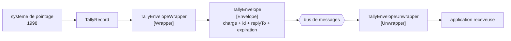

# Envelope Wrapper

🌍 🇫🇷 Français (ce fichier) · 🇬🇧 [English](EnvelopeWrapper-en.md)

## Intention

Envelope Wrapper enveloppe les données d'une application dans une enveloppe que l'infrastructure de messagerie
comprend et l'ouvre à destination, de sorte qu'une application qui ne connaît rien aux en-têtes puisse tout de même
prendre part.

## Problème

Le système de pointage du terminal a été écrit en 1998 et émet un enregistrement plat : numéro de conteneur, type
de mouvement, horodatage.

Le bus de messages veut un [identifiant de corrélation](CorrelationIdentifier-fr.md), une
[adresse de retour](ReturnAddress-fr.md) et une [expiration](MessageExpiration-fr.md) sur chaque message, et
rejette tout ce qui en manque.

Aucun des deux côtés ne peut changer. Apprendre les en-têtes au système de pointage revient à transformer un
système que personne ne maintient en un système qui connaît un bus qui n'existait pas quand il a été écrit ;
assouplir le bus fait que chaque application dessus perd les garanties pour lesquelles les en-têtes ont été
introduits.

## Solution

Le patron met l'enregistrement de pointage dans quelque chose que le bus accepte, et l'en ressort à l'autre bout.

L'enveloppe porte les données de l'application plus tout ce que l'infrastructure exige autour. Le système de
pointage n'apprend jamais ce qu'est un en-tête, et le bus ne voit jamais un message qui en manque.

Nommer l'enveloppe garde les deux à part : tout ce qui est dedans appartient à l'application, tout ce qui est
autour appartient au transport, et **un champ qui glisse d'un côté à l'autre se voit**.

## Structure



L'emballeur et le désemballeur sont aux extrémités opposées et appartiennent à des applications différentes — ce
qui est pourquoi ce sont deux rôles plutôt qu'un participant à deux méthodes.

## Les rôles

| Rôle | Annotation | S'applique à | Ce qu'il porte |
|---|---|---|---|
| Envelope | `[EnvelopeWrapper.Envelope]` | interface, classe, structure | Le type qui porte les données de l'application plus ce que l'infrastructure exige autour. |
| Wrapper | `[EnvelopeWrapper.Wrapper]` | interface, classe | Le participant qui met les données de l'application dans l'enveloppe. |
| Unwrapper | `[EnvelopeWrapper.Unwrapper]` | interface, classe | Le participant qui ressort les données de l'application à destination. |

Trois rôles, et la division entre emballeur et désemballeur est celle qui mérite explication. Ils sont **nommés
séparément parce qu'ils vivent dans des applications différentes et sont écrits par des personnes différentes** —
une enveloppe que personne n'ouvre est un message que le receveur rejettera comme mal formé, et cette panne est
invisible depuis chacune des deux extrémités prise seule.

## L'exemple

Extrait de [`EnvelopeWrapperUsage.cs`](../../../../DesignPatternCatalog.Usage/EnterpriseIntegration/EnvelopeWrapperUsage.cs).

Ce que le système de pointage produit, et tout ce qu'il sait produire :

```csharp
public sealed record TallyRecord(string ContainerNumber, string MoveType, DateTimeOffset At);
```

Aucune annotation dessus. La charge utile n'est pas un rôle de ce patron — c'est le type propre de l'application, et
tout le propos du patron est qu'elle le reste.

L'enveloppe :

```csharp
[EnvelopeWrapper.Envelope]
public sealed class TallyEnvelope {

    public TallyRecord     Payload   { get; }
    public Guid           MessageId { get; }
    public string         ReplyTo   { get; }
    public DateTimeOffset ExpiresAt { get; }

}
```

**Une propriété nommée `Payload` et trois nommées d'après des préoccupations de transport.** Cette division est la
valeur de l'annotation : un lecteur voit d'un coup d'œil de quel côté de la frontière est chaque champ, et un
cinquième champ appelé `ContainerNumber` apparaissant à côté de `MessageId` serait le glissement dont l'exemple
avertit.

L'emballeur, qui est là où les valeurs d'en-tête sont inventées :

```csharp
public TallyEnvelope Wrap(TallyRecord record) {
    return new TallyEnvelope(record, Guid.NewGuid(), "terminal.tally.replies", record.At.AddMinutes(30));
}
```

Trois en-têtes venus de trois endroits différents. L'identifiant est engendré, le canal de réponse est une constante
que cet emballeur possède, et l'expiration est dérivée de l'horodatage propre de la charge utile — c'est l'unique
ligne où l'emballeur lit les données de l'application, et il le fait pour calculer une préoccupation de transport
plutôt que pour changer la charge.

Le désemballeur, à l'autre bout :

```csharp
public TallyRecord Unwrap(TallyEnvelope envelope) {
    return envelope.Payload;
}
```

Une ligne, et les en-têtes sont écartés. C'est la forme honnête : un receveur qui a besoin de l'identifiant de
corrélation le lit sur l'enveloppe avant d'ouvrir, et celui qui n'en a pas besoin récupère exactement
l'enregistrement que le système de pointage a envoyé.

L'exemple énonce à quoi sert l'agencement : *il existe pour que le système de pointage n'apprenne jamais les champs
d'en-tête — ce qui permet à un système écrit en 1998 de prendre part à un échange de messagerie conçu bien après
lui.*

## Possibilités d'application

**Employez un emballage en enveloppe là où une application ne peut pas produire ce que l'infrastructure exige.** Le
cas du livre, et la condition ordinaire de tout parc qui a un système plus ancien que son bus.

**Employez-le pour garder les préoccupations de transport hors des types applicatifs.** Même là où l'application
pourrait porter des en-têtes, les mêler à ses propres enregistrements fait que son modèle contient désormais un
canal de réponse.

**Nommez l'enveloppe.** C'est ce qui rend relisible la frontière entre charge utile et transport.

**Attendez-vous à ce que le désemballeur soit celui de quelqu'un d'autre.** Les deux bouts sont écrits par des
personnes différentes, et une enveloppe sans désemballeur est un message que le receveur rejette.

## Quand ne pas l'utiliser

**Ne l'employez pas là où l'application peut simplement porter les en-têtes.** Une nouvelle application sur un bus
moderne peut être écrite pour produire un identifiant de corrélation, et une enveloppe ajoute un type et deux
participants pour rien.

**Ne laissez pas la charge utile fuir dans les champs propres de l'enveloppe.** Un numéro de conteneur promu à côté
de `MessageId` parce que c'était commode pour le routage a rendu le transport dépendant de l'application, ce que
l'annotation existe pour rendre visible.

**Ne laissez pas l'emballeur modifier la charge utile.** Emballer n'est pas traduire : un emballeur qui reformate ce
qu'il emballe est aussi un [traducteur](MessageTranslator-fr.md), et les deux pannes se masquent l'une l'autre.

**N'imbriquez pas des enveloppes sans le remarquer.** Un message qui traverse deux infrastructures peut finir
emballé deux fois, et un receveur qui ouvre une fois obtient une enveloppe plutôt qu'une charge utile.

**Ne supposez pas que l'autre bout ouvre.** C'est la panne caractéristique du patron et la raison pour laquelle le
désemballeur est un rôle nommé : une enveloppe qui arrive quelque part sans désemballeur ressemble à un message mal
formé plutôt qu'à une étape manquante.

## Avantages

* Une application qui ne connaît rien à la messagerie peut prendre part sans être modifiée.
* Les préoccupations de transport restent hors des types applicatifs.
* La frontière entre charge utile et en-têtes est visible dans un seul type.
* L'emballeur est le seul endroit où les valeurs d'en-tête sont inventées : leurs règles vivent ensemble.
* Chaque côté peut changer ses propres préoccupations sans que l'autre soit touché.

## Inconvénients

* Deux participants et un type, pour une donnée qu'aucun des trois ne change.
* Le désemballeur est dans une autre application : la moitié du patron revient à quelqu'un d'autre.
* Une enveloppe non ouverte se lit comme un message mal formé, ce qui est un symptôme trompeur.
* Les enveloppes peuvent s'imbriquer sans que personne l'ait décidé.
* Des champs glissent de la charge utile vers l'enveloppe par commodité, et rien d'autre que l'annotation ne consigne
  qu'ils l'ont fait.

## Liens avec les autres patrons

**`Message`** est ce qu'est une enveloppe : `Payload` est le corps et le reste est l'en-tête, et les annotations
propres de `Message` rendent cette division contrôlable dans un code qui la modélise directement.

**`MessageTranslator`** change le format de la charge utile ; celui-ci change son emballage, et les deux valent
d'être tenus à part.

**`CorrelationIdentifier`**, **`ReturnAddress`** et **`MessageExpiration`** sont ce que l'enveloppe porte
d'ordinaire — les trois en-têtes de l'exemple sont exactement ces trois patrons.

**`ChannelAdapter`** est la réponse voisine quand l'application ne peut pas être modifiée du tout : un adaptateur y
tend le bras depuis l'extérieur, là où un emballeur conditionne ce qu'elle émet déjà.

**`ClaimCheck`** est l'opération inverse sur la taille : celui-ci ajoute autour de la charge utile, celui-là retire
la charge utile et laisse une clé.

## Source

*Enterprise Integration Patterns*, Gregor Hohpe et Bobby Woolf, Addison-Wesley, 2003 — le chapitre sur la
transformation des messages.

* [Entrée d'index](../../../generated/catalog-index.md#envelopewrapper-enterprise-integration-patterns)
* [Attribut généré](../../../../DesignPatternCatalog.EnterpriseIntegration/EnvelopeWrapper.cs)
* [Exemple](../../../../DesignPatternCatalog.Usage/EnterpriseIntegration/EnvelopeWrapperUsage.cs)
