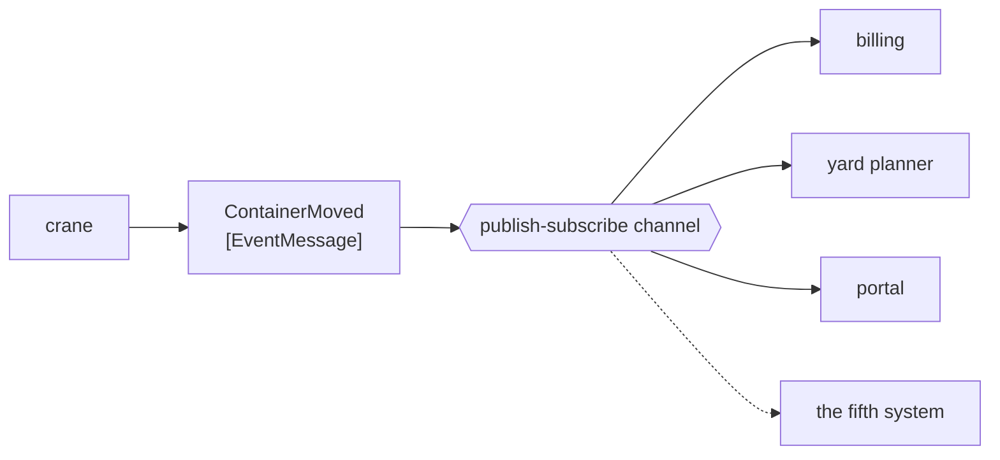

# Event Message

🌍 🇬🇧 English (this file) · 🇫🇷 [Français](EventMessage-fr.md)

## Intent

Event Message announces that something has happened, so that the sender is relieved of knowing who cares.

## Problem

A crane finishes a lift.

Billing cares, because the lift is chargeable. The yard planner cares, because a slot changed. The customer
portal cares, and the performance dashboard cares. Next quarter a fifth system will care, and it does not exist
yet.

The crane must learn about none of them. Written as commands the lift becomes four instructions the crane has to
issue and maintain; written as documents it becomes reference data about something that is really news. What
happened is a **fact**, and the message that fits a fact is one that asserts nothing about who should act on it.

## Solution

The pattern is a message naming a fact in the past tense.

An event message carries no instruction and expects no reply. It says *this happened*, and stops. Because it
demands nothing, a subscriber added tomorrow costs the publisher nothing — which is what makes it the message of
a [publish-subscribe channel](PublishSubscribeChannel-en.md) rather than of a queue.

It is the third of the book's kinds, and the trio is one distinction: a [command](CommandMessage-en.md) says *do
this*, a [document](DocumentMessage-en.md) says *here it is*, an event says *this happened*.

## Structure



No arrow returns to the crane. That absence is the pattern: nothing an event message does creates an obligation
back at the publisher.

## The roles

| Role | Annotation | Applies to | What it carries |
|---|---|---|---|
| EventMessage | `[EventMessage]` | class, struct | The message naming a fact in the past tense. |

One role, on the message type, and the third of the catalogue's recorded narrowings: `EventMessage` **narrows**
`Message`, as the other two kinds do. The catalogue records only what the book states outright
([ADR-0030](../../for-maintainers/adr/0030-relate-only-the-narrowings-a-work-states-outright.md)), and the three
kinds are the clearest case of that in this work.

## The example

From [`EventMessageUsage.cs`](../../../../DesignPatternCatalog.Usage/EnterpriseIntegration/EventMessageUsage.cs).

```csharp
[EventMessage]
public sealed record ContainerMoved(string ContainerNumber, string FromSlot, string ToSlot, DateTimeOffset At);
```

`ContainerMoved` — **past tense, on purpose**. The tense is not decoration: `MoveContainer` would be a command
and would oblige somebody, `ContainerMove` would be a document and would oblige nobody in a different way. Only
the past tense says *this is already true*, which is what makes arguing with it pointless and acting on it
optional.

`At` is the fact's own timestamp, and it is not the same thing as when the message arrived. An event that has
been queued through an outage is still true; a receiver that treats arrival time as event time will report the
lift in the wrong hour, and only the message can tell it otherwise.

`FromSlot` and `ToSlot` are both carried, which lets a subscriber draw its conclusion without asking anybody. An
event thin enough to require a follow-up query has given its subscribers a dependency on the publisher that the
pattern exists to remove.

The sample states the consequence: *carries no instruction and expects no reply — which is what makes a new
subscriber cost the publisher nothing.*

## Applicability

**Use an event message to report something that has happened.** The book's own case, and the one that keeps a
publisher from accumulating a list of everyone who cares.

**Use it where the number of interested parties changes.** This is where the payoff is: the fifth subscriber
costs the crane nothing.

**Put it on a publish-subscribe channel.** The kind and the channel go together — an event on a queue reaches one
of four systems, chosen arbitrarily.

**Name it in the past tense, and carry the fact's own time.** Both are what let a subscriber reason about the
event rather than about its delivery.

## When not to use it

**Do not use it where something must happen.** An event obliges nobody, so *the hold must be applied* published
as a fact is a hold that may never be applied. That is a [command](CommandMessage-en.md).

**Do not use it where the sender needs an answer.** No reply is expected, and grafting one on means deciding
which of four subscribers' replies is the answer. If an answer is needed, the exchange is
[Request-Reply](RequestReply-en.md).

**Do not make it so thin that subscribers must call back.** An event carrying only an identifier sends four
systems to query the publisher, which restores the coupling and the availability dependency the event removed.

**Do not use it to move bulk data.** An event announces; a four-hundred-container discharge list is a
[document](DocumentMessage-en.md), and splitting it needs [Message Sequence](MessageSequence-en.md).

**Do not assume it arrived.** The publisher learns nothing, so *no subscriber was listening* is indistinguishable
from *everything is fine* — the standing cost of the channel this kind belongs on.

**Do not phrase a command in the past tense to avoid responsibility.** `HoldRequested` published to nobody in
particular is a command that has hidden its own obligation, and the container sails.

## Advantages

* The publisher does not know who cares, and does not change when that set changes.
* A fact is true regardless of who reads it, so it can be consumed by systems built years later.
* No reply is expected, so there is no conversation to correlate and no requestor to keep alive.
* Past tense makes the message unarguable: nothing about it invites a receiver to decline.
* Carrying the fact's own time makes a late delivery harmless.

## Drawbacks

* Nobody is obliged, so an event everybody ignores fails silently and looks fine.
* The publisher learns nothing — not who received it, not whether anybody did.
* The distinction from the other two kinds rests on the tense of a name, which nothing enforces.
* A thin event pushes its subscribers back to the publisher, undoing the decoupling.
* Once published, nobody owns it, and tracing where a fact went takes
  [Message History](../../../generated/catalog-index.md#messagehistory-enterprise-integration-patterns) or
  something like it.

## Relations with other patterns

**`Message`** is what this narrows, and the relation is recorded rather than inferred.

**`CommandMessage`** and **`DocumentMessage`** are the other two kinds, and the trio divides on who decides what
happens next — here, nobody is told to decide anything.

**`PublishSubscribeChannel`** is where an event belongs, and the pairing is why that channel's page and this one
argue the same point from two sides.

**`DurableSubscriber`** is what a subscriber becomes when missing an event while it was down is not acceptable.

**[`DomainEvent`](../domain-driven-design/DomainEvent-en.md)**, in the Domain-Driven Design catalogue, is the
same idea inside one model rather than between applications: a fact the domain names, rather than a message a
channel carries.

**`MessageHistory`** and **`WireTap`** are how a published fact is traced once nobody owns it.

## Source

*Enterprise Integration Patterns*, Gregor Hohpe and Bobby Woolf, Addison-Wesley, 2003 — the message-construction
chapter.

* [Index entry](../../../generated/catalog-index.md#eventmessage-enterprise-integration-patterns)
* [Generated attribute](../../../../DesignPatternCatalog.EnterpriseIntegration/EventMessage.cs)
* [Example](../../../../DesignPatternCatalog.Usage/EnterpriseIntegration/EventMessageUsage.cs)
