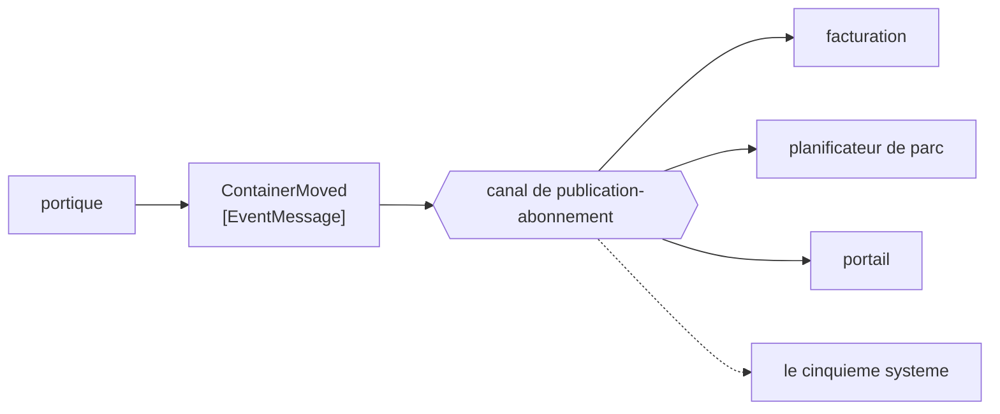

# Event Message

🌍 🇫🇷 Français (ce fichier) · 🇬🇧 [English](EventMessage-en.md)

## Intention

Event Message annonce que quelque chose a eu lieu, de sorte que l'émetteur soit dispensé de savoir qui s'y
intéresse.

## Problème

Un portique termine une levée.

La facturation s'y intéresse, parce que la levée est facturable. Le planificateur de parc s'y intéresse, parce
qu'un emplacement a changé. Le portail client s'y intéresse, et le tableau de bord de performance aussi. Le
trimestre prochain un cinquième système s'y intéressera, et il n'existe pas encore.

Le portique ne doit apprendre l'existence d'aucun d'eux. Écrite en commandes, la levée devient quatre instructions
que le portique doit émettre et maintenir ; écrite en documents, elle devient une donnée de référence portant sur
ce qui est en réalité une nouvelle. Ce qui a eu lieu est un **fait**, et le message qui convient à un fait est
celui qui n'affirme rien sur qui devrait agir dessus.

## Solution

Le patron est un message qui nomme un fait au passé.

Un message d'événement ne porte aucune instruction et n'attend aucune réponse. Il dit *ceci a eu lieu*, et
s'arrête. Parce qu'il n'exige rien, un abonné ajouté demain ne coûte rien à l'émetteur — ce qui en fait le message
d'un [canal de publication-abonnement](PublishSubscribeChannel-fr.md) plutôt que d'une file.

C'est la troisième des sortes du livre, et le trio est une seule distinction : une
[commande](CommandMessage-fr.md) dit *fais ceci*, un [document](DocumentMessage-fr.md) dit *le voici*, un
événement dit *ceci a eu lieu*.

## Structure



Aucune flèche ne revient vers le portique. Cette absence est le patron : rien de ce que fait un message
d'événement ne crée d'obligation en retour chez l'émetteur.

## Les rôles

| Rôle | Annotation | S'applique à | Ce qu'il porte |
|---|---|---|---|
| EventMessage | `[EventMessage]` | classe, structure | Le message qui nomme un fait au passé. |

Un seul rôle, sur le type du message, et la troisième des restrictions enregistrées du catalogue : `EventMessage`
**restreint** `Message`, comme les deux autres sortes. Le catalogue n'enregistre que ce que le livre énonce sans
détour ([ADR-0030](../../for-maintainers/adr/0030-relate-only-the-narrowings-a-work-states-outright.md)), et les
trois sortes en sont le cas le plus net dans cette œuvre.

## L'exemple

Extrait de [`EventMessageUsage.cs`](../../../../DesignPatternCatalog.Usage/EnterpriseIntegration/EventMessageUsage.cs).

```csharp
[EventMessage]
public sealed record ContainerMoved(string ContainerNumber, string FromSlot, string ToSlot, DateTimeOffset At);
```

`ContainerMoved` — **au passé, exprès**. Le temps n'est pas un ornement : `MoveContainer` serait une commande et
obligerait quelqu'un, `ContainerMove` serait un document et n'obligerait personne d'une autre façon. Seul le passé
dit *ceci est déjà vrai*, ce qui rend inutile de le discuter et facultatif d'agir dessus.

`At` est l'heure propre du fait, et ce n'est pas la même chose que l'heure d'arrivée du message. Un événement resté
en file pendant une panne reste vrai ; un receveur qui prend l'heure d'arrivée pour l'heure de l'événement
rapportera la levée dans la mauvaise heure, et seul le message peut lui dire le contraire.

`FromSlot` et `ToSlot` sont tous deux portés, ce qui permet à un abonné de tirer sa conclusion sans demander à
personne. Un événement assez maigre pour exiger une requête de suivi a donné à ses abonnés une dépendance envers
l'émetteur que le patron existe pour retirer.

L'exemple énonce la conséquence : *ne porte aucune instruction et n'attend aucune réponse — ce qui fait qu'un
nouvel abonné ne coûte rien à l'émetteur.*

## Possibilités d'application

**Employez un message d'événement pour rapporter quelque chose qui a eu lieu.** Le cas propre du livre, et celui
qui empêche un émetteur d'accumuler la liste de tous ceux que cela intéresse.

**Employez-le là où le nombre d'intéressés change.** C'est là qu'est le gain : le cinquième abonné ne coûte rien au
portique.

**Mettez-le sur un canal de publication-abonnement.** La sorte et le canal vont ensemble — un événement sur une
file atteint un des quatre systèmes, choisi arbitrairement.

**Nommez-le au passé, et portez l'heure propre du fait.** Les deux sont ce qui permet à un abonné de raisonner sur
l'événement plutôt que sur sa délivrance.

## Quand ne pas l'utiliser

**Ne l'employez pas là où quelque chose doit se produire.** Un événement n'oblige personne : *la retenue doit être
posée* publié comme un fait est une retenue qui peut ne jamais être posée. Cela, c'est une
[commande](CommandMessage-fr.md).

**Ne l'employez pas là où l'émetteur a besoin d'une réponse.** Aucune réponse n'est attendue, et en greffer une
oblige à décider laquelle des réponses de quatre abonnés est la réponse. Si une réponse est nécessaire, l'échange
est [Request-Reply](RequestReply-fr.md).

**Ne le faites pas si maigre que les abonnés doivent rappeler.** Un événement qui ne porte qu'un identifiant envoie
quatre systèmes interroger l'émetteur, ce qui rétablit le couplage et la dépendance de disponibilité que
l'événement avait retirés.

**Ne l'employez pas pour déplacer des données en masse.** Un événement annonce ; une liste de déchargement de
quatre cents conteneurs est un [document](DocumentMessage-fr.md), et la scinder demande
[Message Sequence](MessageSequence-fr.md).

**Ne supposez pas qu'il est arrivé.** L'émetteur n'apprend rien : *aucun abonné n'écoutait* est indiscernable de
*tout va bien* — le coût permanent du canal auquel cette sorte appartient.

**Ne formulez pas une commande au passé pour esquiver la responsabilité.** `HoldRequested` publié à personne en
particulier est une commande qui a caché sa propre obligation, et le conteneur part.

## Avantages

* L'émetteur ne sait pas qui s'y intéresse, et ne change pas quand cet ensemble change.
* Un fait est vrai quel que soit son lecteur : il peut être consommé par des systèmes bâtis des années plus tard.
* Aucune réponse n'est attendue : il n'y a pas de conversation à corréler ni de demandeur à garder en vie.
* Le passé rend le message indiscutable : rien en lui n'invite un receveur à décliner.
* Porter l'heure propre du fait rend une délivrance tardive inoffensive.

## Inconvénients

* Personne n'est obligé : un événement que tout le monde ignore échoue en silence et a l'air correct.
* L'émetteur n'apprend rien — ni qui l'a reçu, ni si quelqu'un l'a reçu.
* La distinction d'avec les deux autres sortes repose sur le temps d'un nom, que rien n'impose.
* Un événement maigre renvoie ses abonnés vers l'émetteur, défaisant le découplage.
* Une fois publié, personne ne le possède, et retracer où un fait est allé demande
  [Message History](../../../generated/catalog-index.md#messagehistory-enterprise-integration-patterns) ou quelque
  chose du genre.

## Liens avec les autres patrons

**`Message`** est ce que celui-ci restreint, et la relation est enregistrée plutôt qu'inférée.

**`CommandMessage`** et **`DocumentMessage`** sont les deux autres sortes, et le trio se divise sur qui décide de ce
qui arrive ensuite — ici, on ne dit à personne de décider quoi que ce soit.

**`PublishSubscribeChannel`** est là où appartient un événement, et l'appariement est pourquoi la page de ce canal et
celle-ci défendent le même point par deux côtés.

**`DurableSubscriber`** est ce que devient un abonné quand manquer un événement pendant son arrêt n'est pas
acceptable.

**[`DomainEvent`](../domain-driven-design/DomainEvent-fr.md)**, dans le catalogue Domain-Driven Design, est la même
idée à l'intérieur d'un modèle plutôt qu'entre applications : un fait que le domaine nomme, plutôt qu'un message
qu'un canal porte.

**`MessageHistory`** et **`WireTap`** sont la façon dont un fait publié se retrace une fois que personne ne le
possède.

## Source

*Enterprise Integration Patterns*, Gregor Hohpe et Bobby Woolf, Addison-Wesley, 2003 — le chapitre sur la
construction des messages.

* [Entrée d'index](../../../generated/catalog-index.md#eventmessage-enterprise-integration-patterns)
* [Attribut généré](../../../../DesignPatternCatalog.EnterpriseIntegration/EventMessage.cs)
* [Exemple](../../../../DesignPatternCatalog.Usage/EnterpriseIntegration/EventMessageUsage.cs)
