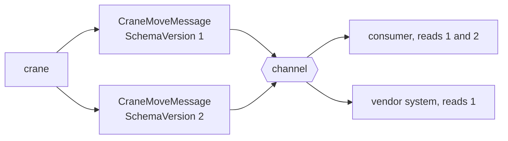

# Format Indicator

🌍 🇬🇧 English (this file) · 🇫🇷 [Français](FormatIndicator-fr.md)

## Intent

Format Indicator says which version or format a message is in, so that a receiver can accept more than one and a
sender can change to a third.

## Problem

The terminal's crane message gained a field.

Six consumers read the old shape, and they will not all be redeployed on the same afternoon — one is a vendor
system, one belongs to the customs broker, and one is only released quarterly. Meanwhile both shapes are on the
channel.

A receiver holding a message can tell what shape it is in only by looking for the field and inferring, which is
guessing dressed as parsing. And a sender that wants to move to a third shape has no way to know when the last
consumer of the first has gone, because nothing anywhere records which shape anybody is reading.

## Solution

The pattern is a property that names the message's format.

A receiver reads the indicator and knows which shape it has, so it can accept two. A sender can move to a third,
because the ones that understand it will say so and the ones that do not can be told apart.

The sample is blunt about the economics rather than the mechanism, and that is the honest framing: this is *the
cheapest thing to add before the first version ships and the most expensive afterwards.* Adding it later means
inventing a rule for what an absent indicator means, and every consumer must agree on that rule.

## Structure



Both shapes on one channel at once, which is what a staggered redeployment actually looks like.

## The roles

| Role | Annotation | Applies to | What it carries |
|---|---|---|---|
| FormatIndicator | `[FormatIndicator]` | property, field | The property naming the message's format. |

One role, on a property. What it marks is the property a receiver reads **before** the rest — the only field whose
meaning cannot itself depend on the version, which is why it is worth pointing at.

## The example

From [`FormatIndicatorUsage.cs`](../../../../DesignPatternCatalog.Usage/EnterpriseIntegration/FormatIndicatorUsage.cs).

```csharp
[FormatIndicator]
public string SchemaVersion { get; }

public string ContainerNumber { get; }
```

The indicator is declared **first**, before the payload. That ordering is not required by anything and it is the
right way round: the version is what a reader consults in order to understand the rest, and putting it at the top
says so.

It is a `string` rather than an `int`. A version that has to be a number cannot be `2.1` or `codeco-d95b`, and the
book's pattern is about format as well as version — a `string` covers both, at the cost of nobody being able to
compare two of them for ordering.

The remark states both directions the pattern works in: *it lets a receiver accept more than one shape and a
sender move to a third, without either guessing.* Both halves matter — a format indicator that only the receiver
uses is half the pattern, since the sender still cannot tell when it is safe to stop sending the old shape.

## Applicability

**Add a format indicator before the first version ships.** The sample's own economics, and the strongest thing
this page can say: it costs nothing now and it costs a migration later.

**Use it wherever consumers are redeployed on different schedules.** Which is wherever a message crosses an
organisational boundary, and most places inside one.

**Use it on messages whose consumers you do not control.** A [document](DocumentMessage-en.md) read by systems the
sender does not know about cannot be coordinated any other way.

**Name a format, not only a number.** Version *and* format is what the book's pattern covers, and a string carries
both.

## When not to use it

**Do not add it to a message that will never change.** In practice this set is smaller than it looks, which is why
the default runs the other way.

**Do not use it where a datatype channel already answers the question.** A
[datatype channel](DatatypeChannel-en.md) says which *kind* of message this is; a format indicator says which
*shape* of one kind. They answer different questions, and one is not a substitute for the other.

**Do not let it become a switch in every consumer.** Six consumers each branching on three versions is eighteen
paths; past two live versions the answer is a
[Message Translator](MessageTranslator-en.md) at the boundary, translating old to new once.

**Do not use it to avoid ever retiring a version.** An indicator makes coexistence possible, not free, and a
sender that never drops a shape pays for all of them for ever.

**Do not treat an absent indicator as a known version.** Messages that predate the indicator are messages of
unknown shape, and a receiver that assumes version 1 will one day assume it of a version 3 message from a system
that forgot the field.

## Advantages

* A receiver knows the shape rather than inferring it.
* Consumers can be redeployed on their own schedules, which is the only way it happens across organisations.
* A sender can introduce a third shape without coordinating a cutover.
* It costs one property, and nothing at all if it is there from the first version.
* It makes *which version is still in use* an answerable question rather than a guess.

## Drawbacks

* Every consumer must read it, and one that ignores it gets no benefit from anybody else carrying it.
* It enables version sprawl: coexistence is possible, so retirement gets postponed.
* A string cannot be ordered, so *newer than* is not a comparison the receiver can make.
* Branching on it multiplies paths in every consumer, and the paths are rarely all tested.
* Adding it late means deciding what its absence means, and every consumer has to agree.

## Relations with other patterns

**`MessageTranslator`** is what to reach for past two live versions: translate old to new at the boundary rather
than branching in every consumer.

**`DatatypeChannel`** answers the neighbouring question — which kind, rather than which shape of a kind — and its
page notes that consumers on such a channel have stopped checking, which is exactly why the indicator is still
needed.

**`DocumentMessage`** is the kind that needs one most, because its consumers are the ones the sender does not know
about.

**`CanonicalDataModel`** is the larger answer when formats multiply beyond versions of one message.

**`Message`** is what carries it, and a format indicator belongs in the header rather than the body — the division
`Message`'s own annotations make checkable.

## Source

*Enterprise Integration Patterns*, Gregor Hohpe and Bobby Woolf, Addison-Wesley, 2003 — the message-construction
chapter.

* [Index entry](../../../generated/catalog-index.md#formatindicator-enterprise-integration-patterns)
* [Generated attribute](../../../../DesignPatternCatalog.EnterpriseIntegration/FormatIndicator.cs)
* [Example](../../../../DesignPatternCatalog.Usage/EnterpriseIntegration/FormatIndicatorUsage.cs)
